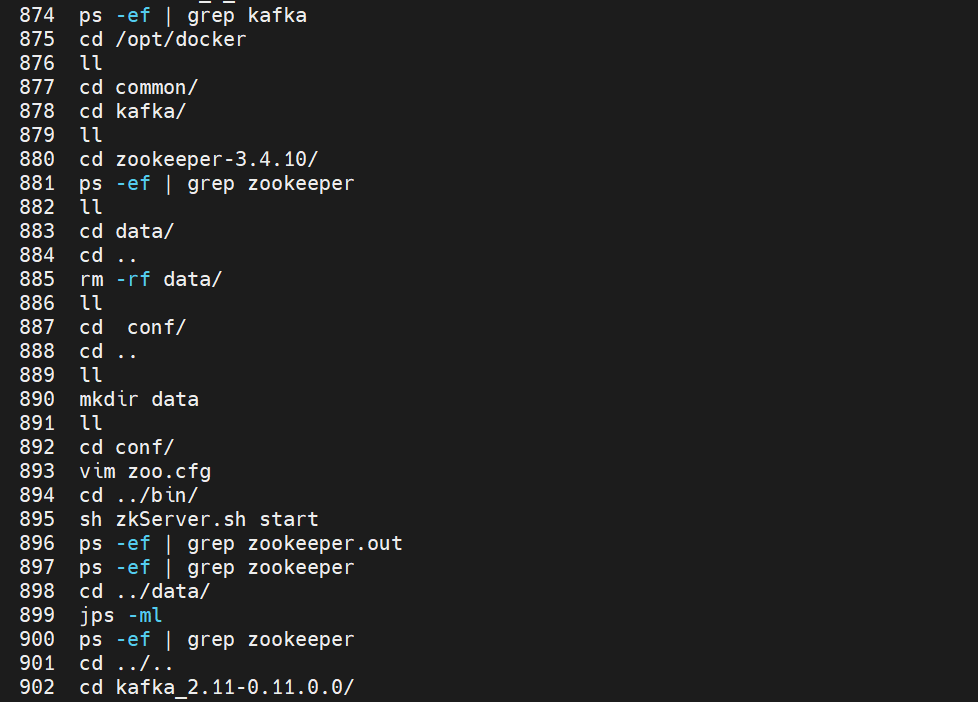
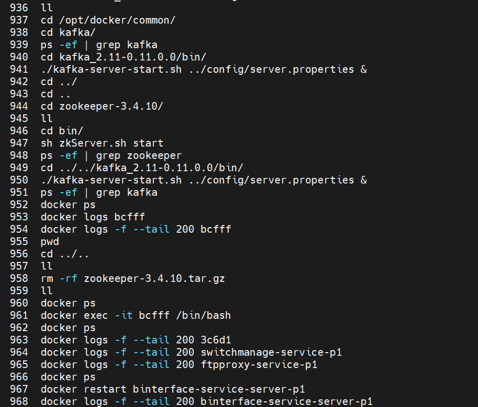
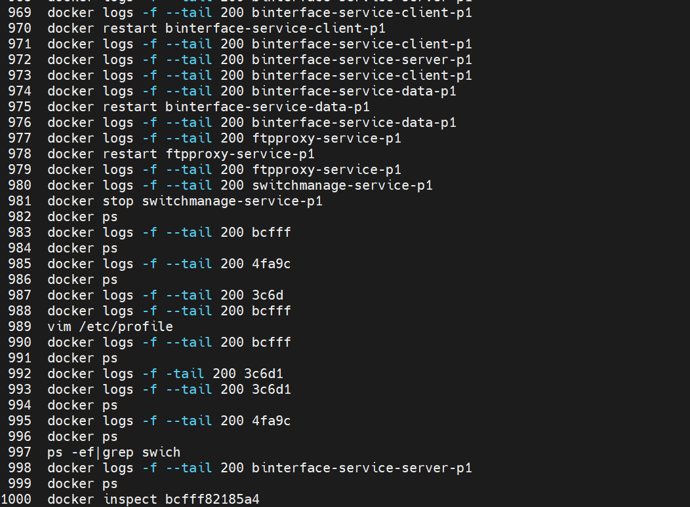
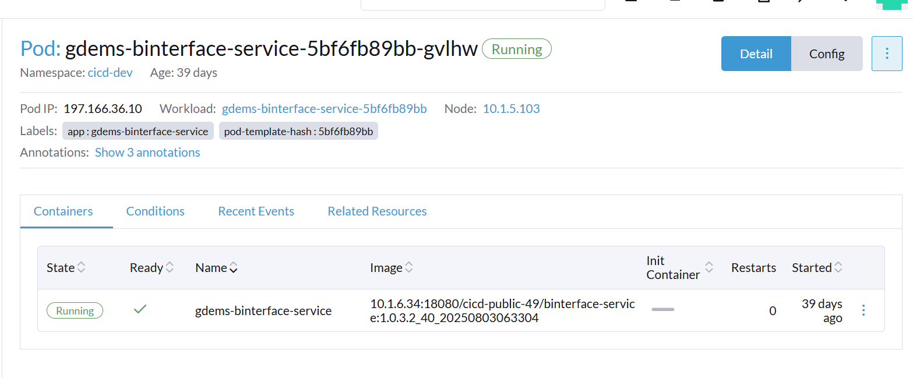
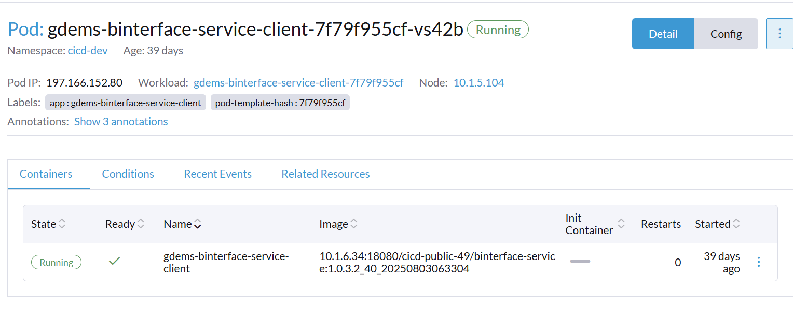
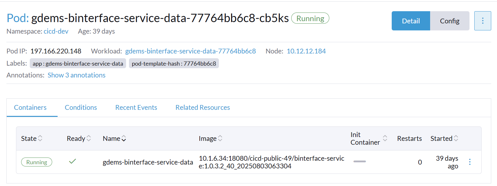
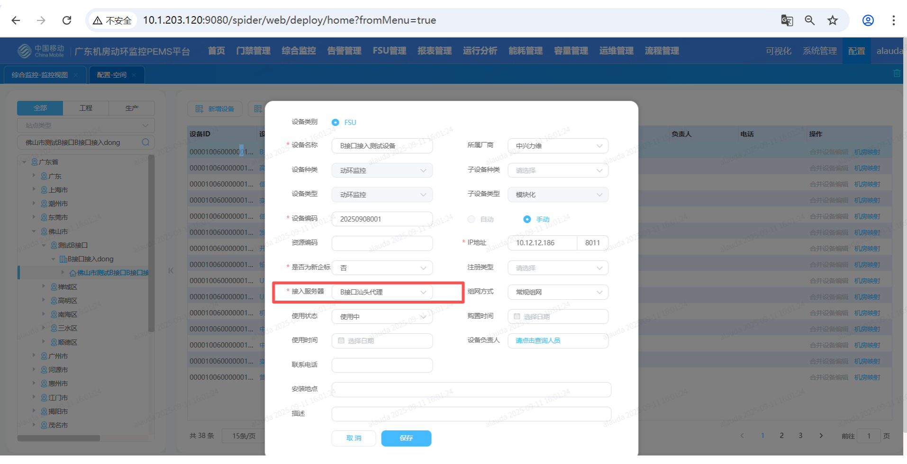
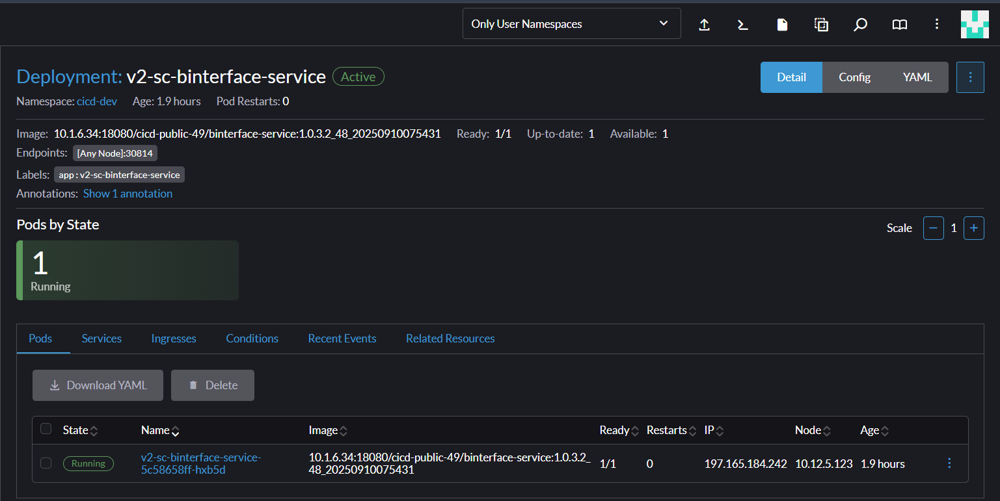
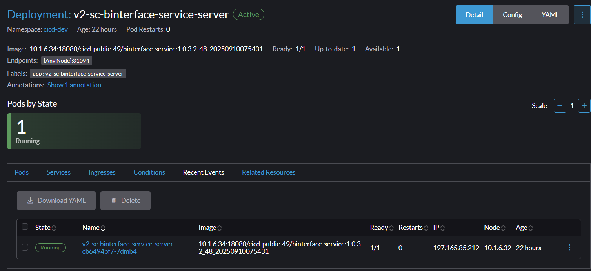
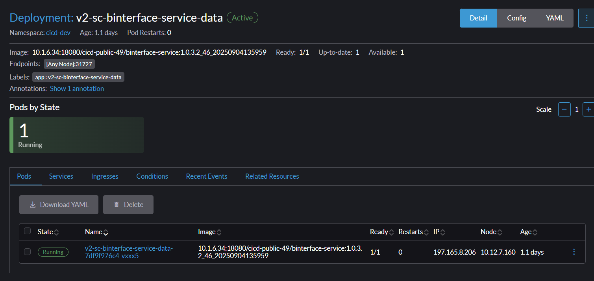

# B接口

kafka和zookeeper是进程来着不单独用镜像

每个对应环境的nacos里面都有记录对应kafka等的部署ip

到对应ip下面ps查看对应进程即可（不是镜像的）

```
docker run --name switchmanage-service-p1 --net host --log-driver=json-file --log-opt max-size=30m --log-opt max-file=3 --env ENV_NACOS=10.1.203.120:8848 --env ENV_TYPE=gdems-dev --env ENV_APP_NAME=switchmanage --env ENV_NACOS_PASSWORD='D&V2HR43TutFjf%aKqk' -v /tmp/logs/switchmanage-service:/opt/data/logs/ -d  10.1.6.34:8080/cicd-public-72/switchmanage-service:1.0.3.2_4_20250710070446


docker run --name ftpproxy-service-p1 --net host --log-driver=json-file --log-opt max-size=30m --log-opt max-file=3 --env ENV_NACOS=10.1.203.120:8848 --env ENV_TYPE=gdems-dev --env ENV_APP_NAME=ftpproxy --env ENV_NACOS_PASSWORD='D&V2HR43TutFjf%aKqk' -v /tmp/logs/ftpproxy-service:/opt/data/logs/ -d  10.1.6.34:8080/cicd-public-60/ftpproxy-service:1.0.3.2_5_20250710070932


netstat -ntlp


telnet 10.1.203.120 8848
```



















广东连的



上海连的



重启练的应该是




