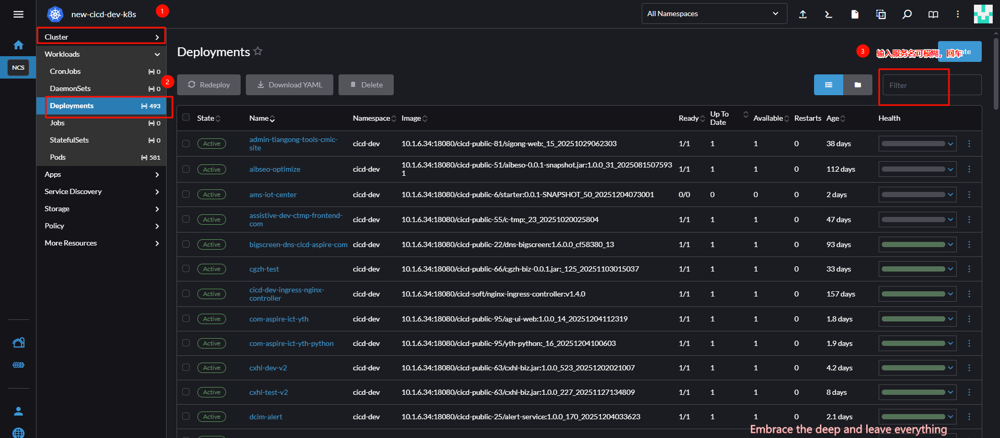
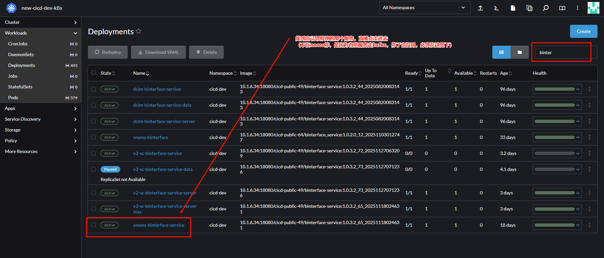
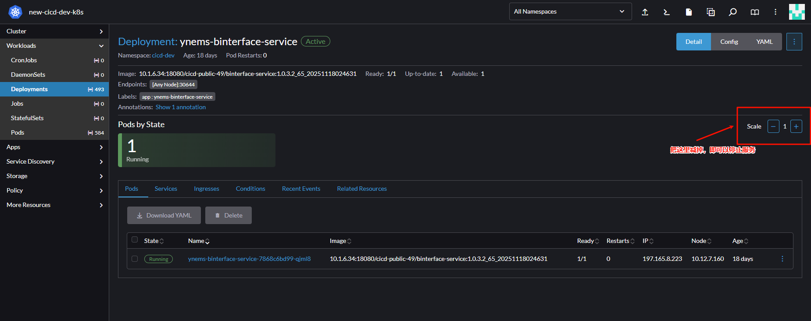
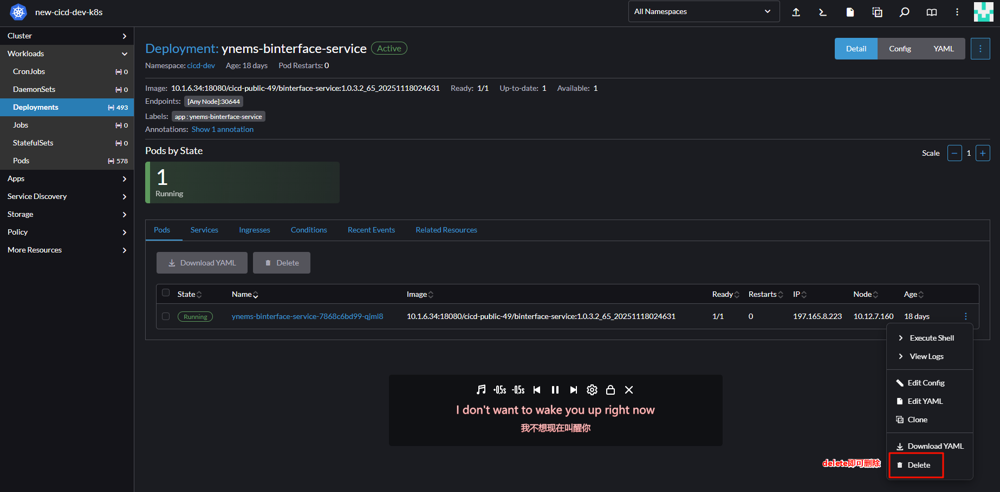

# node与pod【前提重点】

```
# 1. 看节点（物理机/虚拟机）
kubectl get node -o wide
NAME         STATUS   INTERNAL-IP      EXTERNAL-IP   OS-IMAGE           KERNEL
k8s-node01   Ready    192.168.10.21    <none>        Ubuntu 22.04.4 LTS   5.15.0-105
k8s-node02   Ready    192.168.10.22    <none>        Ubuntu 22.04.4 LTS   5.15.0-105
k8s-node03   Ready    192.168.10.23    <none>        Ubuntu 22.04.4 LTS   5.15.0-105

# 2. 看订单服务 Pod（容器组）
kubectl -n order-proj get pod -o wide
NAME                            READY   STATUS   RESTARTS   AGE   IP            NODE
order-service-7d9c8f6b59-qp2wm   1/1     Running   0        3h    10.244.2.87   k8s-node02
order-service-7d9c8f6b59-hnzp4   1/1     Running   0        3h    10.244.1.42   k8s-node01
order-service-7d9c8f6b59-krlx7   1/1     Running   0        3h    10.244.3.15   k8s-node03

# 3. 看 Service（集群内部 VIP）
kubectl -n order-proj get svc order-service
NAME           TYPE        CLUSTER-IP     EXTERNAL-IP   PORT(S)   AGE
order-service  ClusterIP   10.43.22.195   <none>        80/TCP    3h
```

| 对象        | 到底是什么                                | 作用                           | 生命周期                |
| ----------- | ----------------------------------------- | ------------------------------ | ----------------------- |
| **Node**    | 物理机或虚拟机（k8s-node01/02/03）        | 提供 CPU+内存+磁盘，跑 kubelet | 重装系统才换            |
| **Pod**     | 一组容器（订单服务进程 + 可能的 sidecar） | 真正运行业务代码               | 随时删、随时建，IP 会变 |
| **Service** | 虚拟 IP（10.43.22.195）+ 负载均衡         | 把一群 Pod 聚合成一个固定入口  | 手动删才会消失          |

重点：其实虚拟机就是部署在物理机里面的vm，可以有多个vm

| 维度             | 物理机 (Bare-metal)                                  | 虚拟机 (VM)               |
| ---------------- | ---------------------------------------------------- | ------------------------- |
| 谁来提供计算     | 真实主板+CPU+磁盘                                    | 超线程+vCPU+虚拟盘        |
| 开机速度         | 分钟级（BMC 带外重启）                               | 秒级（快照/热迁移）       |
| 资源弹性         | 买新机、上架、接网线                                 | 模板克隆、在线打热补丁    |
| 性能损耗         | 0 %                                                  | 2 %～10 %（看虚拟化层）   |
| 硬件直通         | 可以 GPU/FPGA 整卡                                   | 需要 VT-d、SR-IOV 透传    |
| 故障粒度         | 整台机器崩                                           | 只影响一台 VM             |
| 对 K8s 可见性    | 一样：/proc/cpuinfo、/sys/class/dmi/id/product\_uuid | 一样：拿到的也是虚拟 UUID |
| kubelet 启动命令 | 完全相同：/usr/bin/kubelet --node-ip=xx              | 完全相同                  |

```
注意：
	容器在node里面的 

为什么 IP 段完全不一样
    Node IP：192.168.10.0/24 —— 公司内网，交换机/路由器认得，能 SSH。
    Pod IP：10.244.0.0/16 —— 仅集群内部可见，由 CNI（Calico/Flannel）分配，交换机不认。
    Service IP：10.43.0.0/16 —— 完全虚拟，只在每台节点的 iptables/ipvs 规则里，连路由表都没有。


    Node IP 是“物理网卡”；
    Pod IP 是“veth 虚拟网卡对”；
    Service IP 是“iptables 目标地址”，外面 ping 不到。
```

ip选用

| 场景                              | 你该用的地址                                                 |
| --------------------------------- | ------------------------------------------------------------ |
| **集群内部调用**（前端→订单服务） | `order-service.order-proj.svc.cluster.local:80` **或** `10.43.22.195:80` |
| \*\* debug 日志里看来源\*\*       | 记录 **Pod IP**（10.244.x.x），因为每次重启会变，方便定位到具体实例 |
| **节点级排障**（磁盘、CPU）       | SSH 到 **Node IP** `192.168.10.x`                            |
| **防火墙白名单**                  | 开 **Node IP** 段（Pod/Service 段在外层防火墙不可达）        |
| **Prometheus 监控标签**           | 用 **Pod 名称** + **Pod IP** 做时间线，别用 Node             |

说明点

```
Node IP = 机器门牌号，固定，给运维 SSH。
Pod IP = 进程临时工牌，随时换，给 K8s 内部寻址。
Service 域名/CLUSTER-IP = 业务大厅总机，永不换，给代码配置


写代码、配调用：永远以 Service 名字（或 Cluster-IP）为主；
查日志、抓包：临时看 Pod IP；
修机器：才用 Node IP。
```


# CICD

## CI持续集成

- 开发git push 代码到gitlab仓库【正常会自动检测yml文件，然后执行yml命令在服务器执行打包等构建镜像操作】
- 目前是git push后，【需要手动到CI/CD平台手动打包构建镜像--部署到环境上 -- 没有修改的时候不能碰】
  - 构建阶段：执行编译/打包命令
  - 容器化阶段：
    - 构建阶段：执行编译/打包命令
    - 构建阶段：执行编译/打包命令
- 部署阶段【在指定环境里面可以重新部署--即重启新部署已有的配置】：
  - kubectl apply / helm upgrade
  - 使用新镜像更新 K8s Deployment
- Kubernetes 控制器执行滚动更新

## CD持续交付

- 持续交付
  - 代码通过自动化测试后，**自动构建并部署到类生产环境**（如预发布环境）
  - **人工决策**是否发布到生产环境（例如点击按钮确认）
- 持续部署
  - 代码通过测试后，**自动构建、测试并直接部署到生产环境**
  - 全流程自动化，**无需人工审批**

## 流水线

- 存放内容
  - 主要存放开发提交的后端代码  -- 都会在总流水先中
  - 测试人员主要就是对这些进行一键构建

## 日志查看

- 查询方式
  - 选择环境，进入测试环境中【即进入到服务器中】

## 重新部署

```
重启后pod ip和node好像都会变

因此如果涉及到需要开通端口或是nacos需要对应ip信息的
	那么都需要重新替换
```


# rancher

## 基础说明

```
说明：
	用一套账号、一套视图、一条流水线”去管理任意位置、任意发行版的 K8s 集群
		不管是本地裸金属、VMware、还是 EKS/AKS/GKE/ACK/TKE 等托管集群
	主要存放pod，即服务实例
	
	
重点理解：
    Rancher = K8s 的“万能遥控器”
    它帮你一键装集群、统一发应用、集中做监控，但 Pod 最终落到哪台机器，还是 K8s 自己说了算
```


```
实例（工作负载）是怎么“自动化”跑起来的


先有集群
    a. 创建式：
    	Rancher 调用 RKE/K3s 在指定节点自动安装 K8s（Docker+kubelet+etcd+网络插件一次装完）
    b. 导入式：
    	把已存在的 K8s（EKS/AKS/自建）导入，Rancher 只在 cattle-system 里装一个轻量 Agent

再建项目/命名空间
	Rancher 用“Project”把多个 Namespace 打包，方便统一授权、配额、流水线

选应用模板或上传 Helm 包
	应用商店里有官方 Helm Chart（MySQL、Redis、SpringBoot…）
	也可对接私有 Harbor/ChartMuseum

一键“启动” 
	后台流程：
        UI → Rancher API → 下游 K8s APIServer（6443 端口）→ 
        生成 	Deployment/Service/Ingress/ConfigMap/Secret → 
        kubelet 拉镜像 → Pod 被调度到具体 Node
		整个过程中用户不需要写 YAML，Rancher 自动把表单参数渲染成最终 Manifest。


后续自动化
    滚动升级：改镜像 tag → Rancher 调用 K8s RollingUpdate
    弹性伸缩：在 UI 里改副本数或开 HPA
    灰度发布：对接 Istio，一键做金丝雀/蓝绿分流
    持续交付：Fleet 扫描 Git Repo，有更新就自动同步到对应集群
```


```
实例最终落到“哪台服务器”由谁决定

完全由下游 Kubernetes 自身的调度器决定，Rancher 不插手调度逻辑。流程如下：
用户点击“创建 Deployment” → Rancher 把请求转给 K8s API。
K8s Scheduler 根据
资源请求（CPU/Memory）
节点亲和/反亲和、污点容忍
存储、GPU、拓扑分布约束
打分后选出最优 Node。
kubelet 收到绑定信息，启动容器，回写状态。
Rancher 只负责把 Node 标签、污点、存储类等信息可视化，让你更方便地给调度器提供条件，但不会代替调度器。
```


## 流程说明

```
一、前提
    下游已经有一套 K8s 集群（3 台 node：k8s-node01/02/03）
    Rancher 里把这套集群导入，名字叫 order-k8s
    镜像已经编译好并推到公司 Harbor：harbor.company.com/order/order-service:20250920v1
```

```
二、在 Rancher UI 里点点点

左上角选集群 
	order-k8s → 项目 order-proj → 工作负载 → 部署服务
	
表单里填：
    名称：order-service
    容器镜像：harbor.company.com/order/order-service:20250920v1
    端口：5000　TCP
    副本数量：3
    环境变量：
    SPRING_DATASOURCE_URL=jdbc:mysql://mysql:3306/orderdb
    配置文件（ConfigMap）→ 新建：
    key=application.yml value=…省略…
    密钥（Secret）→ 新建：
    key=db-password value=P@ssw0rd 
    
点“启动”
```

```
Rancher 替你生成的 5 张 YAML（只留核心字段，方便你看）

	Deployment（告诉 K8s 要起 3 个一模一样的 Pod）
        apiVersion: apps/v1
        kind: Deployment
        metadata:
          name: order-service
          namespace: order-proj
        spec:
          replicas: 3
          selector:
            matchLabels:
              app: order-service
          template:
            metadata:
              labels:
                app: order-service
            spec:
              containers:
              - name: order-service
                image: harbor.company.com/order/order-service:20250920v1
                ports:
                - containerPort: 5000
                env:
                - name: SPRING_DATASOURCE_URL
                  value: "jdbc:mysql://mysql:3306/orderdb"
                - name: DB_PASSWORD
                  valueFrom:
                    secretKeyRef:
                      name: order-service-secret
                      key: db-password
                volumeMounts:
                - name: config
                  mountPath: /app/config/application.yml
                  subPath: application.yml
              volumes:
              - name: config
                configMap:
                  name: order-service-config
                  
	
	Service（给这 3 个 Pod 一个稳定的“虚拟 IP+端口”）
        apiVersion: v1
        kind: Service
        metadata:
          name: order-service
          namespace: order-proj
        spec:
          selector:
            app: order-service        # 只要带这个标签的 Pod 都归我管
          ports:
          - port: 80
            targetPort: 5000
            protocol: TCP
          type: ClusterIP
          

	Ingress（把订单服务暴露到 80/443，给前端/顾客调用）
        apiVersion: networking.k8s.io/v1
        kind: Ingress
        metadata:
          name: order-service
          namespace: order-proj
          annotations:
            nginx.ingress.kubernetes.io/rewrite-target: /
        spec:
          rules:
          - host: order.company.com
            http:
              paths:
              - path: /
                pathType: Prefix
                backend:
                  service:
                    name: order-service
                    port:
                      number: 80
                      


    ConfigMap（放公共配置，镜像里直接读）
        apiVersion: v1
        kind: ConfigMap
        metadata:
          name: order-service-config
          namespace: order-proj
        data:
          application.yml: |
            server:
              port: 5000
            spring:
              datasource:
                driver-class-name: com.mysql.cj.jdbc.Driver
                
                

    Secret（放密码）
        apiVersion: v1
        kind: Secret
        metadata:
          name: order-service-secret
          namespace: order-proj
        type: Opaque
        data:
          db-password: UEBzc3cwcmQ=   # base64
```

```
这些 YAML 怎么跑到节点上


点完“启动” → Rancher 把上面 5 份 YAML POST 到 order-k8s 集群的 kube-apiserver（6443 端口）

apiserver 先把它们写进 etcd（集群大脑）。

三大控制器开始干活：
    	Deployment-controller：发现新 Deployment，算出要 3 个副本 → 生成 3 个 Pod 模板。
    	Scheduler：给每个 Pod 打分，挑节点。假设结果：
            order-service-7d9c8f6b59-qp2wm → node02
            order-service-7d9c8f6b59-hnzp4 → node01
            order-service-7d9c8f6b59-krlx7 → node03
    	kubelet（每个节点的“小队长”）通过监听 apiserver 发现自己节点被分配了新 Pod → 执行：
            a. 拉镜像：docker pull harbor.company.com/order/order-service:20250920v1
            b. 创容器、挂卷（把 ConfigMap/Secret 挂到 /app/config）
            c. 起进程，暴露 5000 端口
    全部 Ready 后，集群 DNS 自动生成一条 A 记录：
    	order-service.order-proj.svc.cluster.local → 10.43.22.195（Service 的 ClusterIP）
    	前端只要访问 http://order-service/order/api/xxx 就能调到后端的 3 个 Pod。
    外部用户走 order.company.com 
    	→ 公司 Ingress-Nginx → 根据 Host 头转发到 ClusterIP → 最终落到某一个 Pod。
```

```
其中一个 Pod 挂了
    node02 突然断电 → Pod qp2wm 消失
    Deployment-controller 发现实际副本=2，期望=3 → 立即新建一个 Pod
    Scheduler 再挑一个健康节点（比如 node01 还有资源）→ kubelet 重新拉镜像、起容器
    全程 <30 s，前端无感知，因为 Service 会瞬间把挂掉的 endpoint 摘掉。
```


## 功能方式【重点】

```

- 在CICD中，可直接使用rancher进行日志查看
- 就是进入到容器里面，在容器【即所属服务器里面】，进行curl等操作
  - 日志更清晰，且可一键清除
  - 同时可以进入容器服务器进行操作
  - 两者结合起来可以更好查看用户操作后，日志的定位
```


```
使用点1 - 日志查看：
	通过rancher - 找到对应pod实例 - 查看对应日志
	需要注意：每次重启完，都会需要选对cicd的的容器，不然就看错了【因为有时候刚重部署完，会有两个，要注意选对了】
	
	
	
使用点2 - 容器使用：
	通过rancher - 找到对应pod实例 - 进入pod实例里面操作【类似虚拟机里面】
    注意：
    	进去后一般就是默认到项目的位置
    	需要自己切换到根节点
```


```
使用点3 - 下掉服务
	通过rancher - 搜索服务名 - 
    注意：
    	进去后一般就是默认到项目的位置
    	需要自己切换到根节点
```







```
使用点4 - 重启服务服务
	通过rancher - 搜索服务名 - 
    注意：
    	进去后一般就是默认到项目的位置
    	需要自己切换到根节点
```




# Nacos

## 配置列表

```
存放所有环境对应服务启动时需要的配置信息

生产和测试都是
```

## 服务列表

```
存放所有环节启动成功后注册到nacos的服务
	里面有则启动成功，没有就是没有启动成功
	服务器服务可以在这里下掉（除了有些走kafka的，必须到rancher里面停）
```


# 微服务【重点】

## 服务启动

```
1、服务启动说明：
	首先先到cicd找到对应服务的镜像地址
	方式1：
		到服务器里面,通过docker run命令去拉取镜像生成容器并启动
		里面需要注意：挂在的位置、nacos配置的读取等信息
	方式2：
		通过cicd页面,进行部署【配置根据原有的照搬即可】
		选择好镜像直接重新部署即可
```

## 服务重启

```
1、服务重启说明：
	方式1：
		到服务所在服务器里面
		docker restart 容器id即可
	方式2：
		cicd直接点击重新部署即可
```

## 服务迁移

```
1、服务迁移说明：
	方式1：
		即到服务器里面，使用docker run 重新拉镜像生成容器并启动
	方式2：
		即cicd重新页面布置一个即可
```

