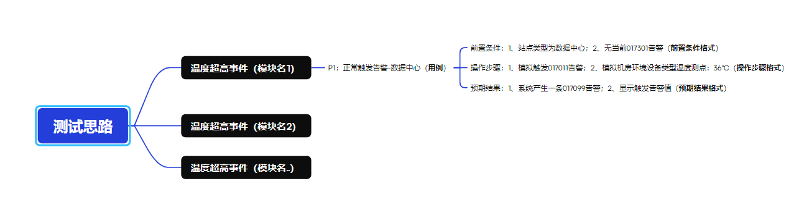

注意：
    xmind库会显示爆红，但是只要安装了就是能用的

功能介绍
    1、将xmind转化为excel -- 分多版本
    2、使用库 -- pandas、xmindparser
    3、使用转换原理：
        通过xmindparser将xmind文件解析为字典，然后通过pandas将字典转换为excel
        这里自己添加了json文件写入，更好的查看目录结构
    4、遍历用例的详细信息注意点
        用例步骤等情况中的：要注意是中文还是英文，会影响到提取
    5、新版本语法：
        变量赋值时：if判断

项目目录解析
    ExcelDoc：xmind转换后的excel文件
    JsonDoc：xmind转换过程中，提取出来的json
    XmindDoc：需要转换的xmind文件【根据模板来选择对应的运行方法】
    explainImage：readme文件相关图片解析
    explainXmind：xmind模板类型【根据类型来写，这样才有对应方法解析】
    

版本1：
层级【四个级别】：
    主题
        模块
            案例
                前置、步骤、预期

