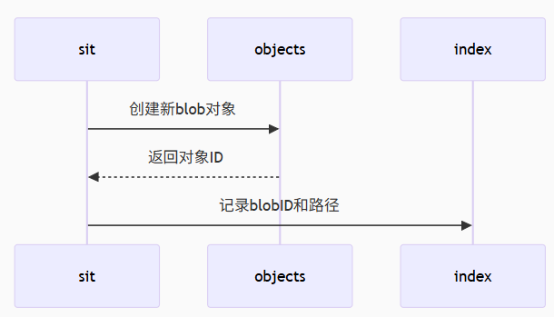
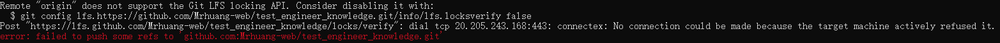
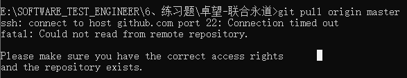
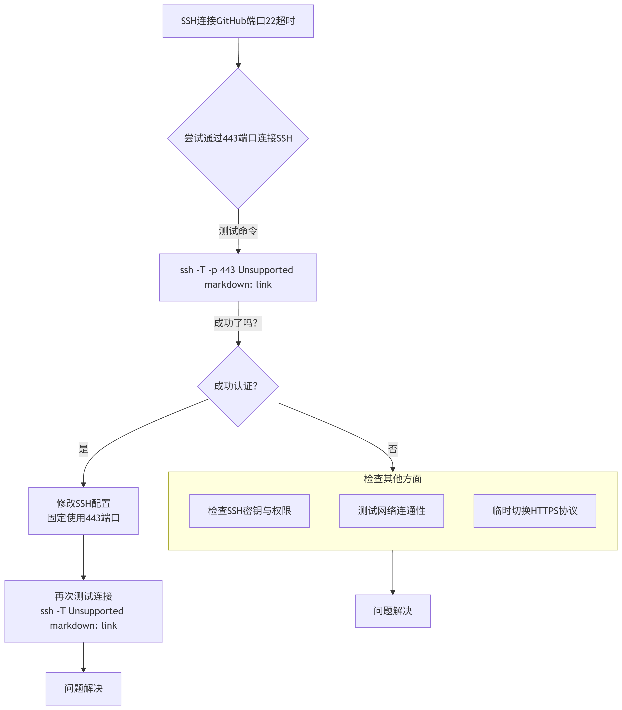
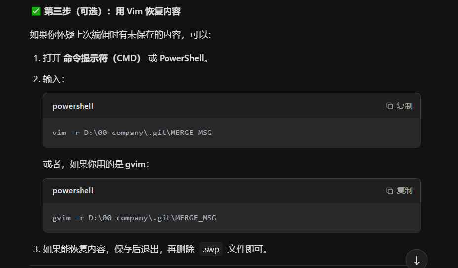
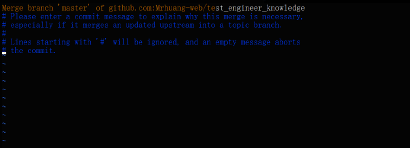
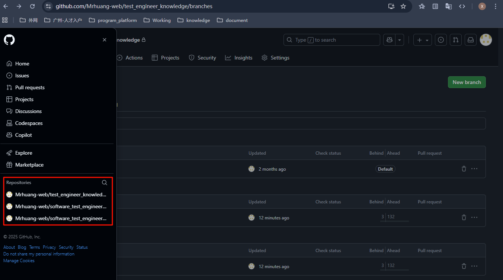
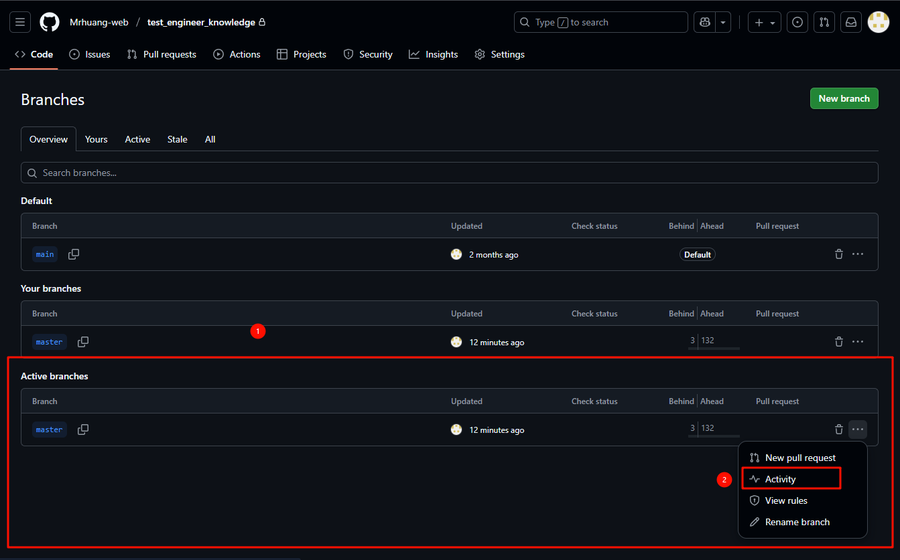
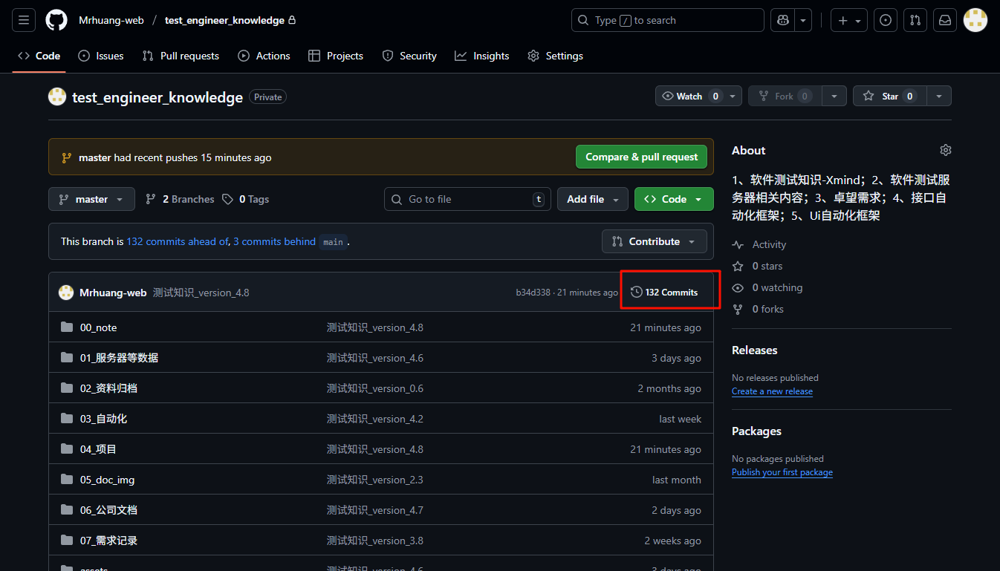

# Git

| 操作 | 共有仓库                  | 私有仓库              |
| ---- | ------------------------- | --------------------- |
| 拉取 | 无需登录 (HTTPS/SSH 均可) | 需登录(HTTPS/SSH/CLI) |
| 推送 | 需写入权限+身份验证       | 需写入权限+身份验证   |

- 注意：

  - ssh密码生成一次后，可以用于所有repository（即后续建立的项目使用ssh都可以直接连接，因为本地已经配置了ssh - 不同机器是如何管理的？忘记了，补充下）

- **注释：**

  - 文件超限制

    - ```
      - 下载 Git Lfs
      - git lfs version  #查看版本
      - git lfs install       # 初始化 LFS
      
      - 补充在add之前
      - git lfs track "*.zip" # 指定大文件类型（如所有 .zip 文件，给大文件打标记）
      此命令生成 .gitattributes 文件，记录需用 LFS 管理的文件规则
      
      - git add .gitattributes
      - git commit -m "添加 LFS 追踪配置"
      - git push origin main    # 先推送配置，否则后续可能失败:cite[1]:cite[8]
      
      - git add large_file.zip  # 添加大文件 或者直接添加整个目录 git add .
      - git commit -m "添加大文件"
      - git push origin main    # 正常推送，LFS 会自动处理大文件
      ```

  - 需要先确保仓库权限都开了

    - repository - 进入仓库 - settings - advanced security - 把权限都开了

  - 权限2

    - epository - 进入仓库 - settings - general - pull requests等内容

  - PAT是Personal Access Token

    - 生成方式：github-头像-setting-developer Settings - Personal access tokens - Tokens - generate即可

  - SSH是连接使用ssh形式

    - 生成方式：

    - ```
      # 生成 Ed25519 算法密钥（推荐）
      ssh-keygen -t ed25519 -C "your_email@example.com"
      
      # 或生成 RSA 算法密钥（兼容旧系统）
      ssh-keygen -t rsa -b 4096 -C "your_email@example.com"
      
      出现提示时：
      按回车使用默认保存路径 (~/.ssh/id_ed25519 或 ~/.ssh/id_rsa)
      设置密钥密码（可选但推荐）
      复制公钥内容：.ssh/id_rsa.pub
      登录 GitHub → Settings → SSH and GPG Keys → New SSH Key
      粘贴公钥内容（以 ssh-ed25519 AAA... 或 ssh-rsa AAA... 开头）
      ```

## **公共点**

- ```
  - 区分当前分支
  - git branch 或 git remote show origin 查看来判断是main还是master 或到github上看
  
  - 上下的SSH/HTTP一定要一致
  - git init
  - git remote add origin SSH/HTTP
  - git add.
  - git status
  - git commit -m ""
  - git push -u origin master  [根据下面条件查看]
  
  - git clone SSH/HTTP
  - git pull origin master   [每次推送前先拉取]
  
  
  案例
  cd my-project
  git init
  git remote add origin git@github.com:your-username/private-repo.git
  git add .
  git commit -m "First commit"
  git push -u origin main
  ```

## 基本命令

```
- git status


# 查看远程状态（确认推送是否部分成功）
git fetch origin
git log --oneline --graph --all  # 比较本地和远程提交历史

# 查看历史版本
git reflog
```


## **公有仓库/私有仓库**

- 注意：

  - 只要建立了.git文件夹，则拉取或上传直接push或pull就行，不用再建立联系，第二次push不用加u
  - 删除.git文件夹，即可再次初始化

- **私有仓库**

  - SSH方式

    - ```
      在仓库 `Settings > Deploy Keys` 添加 SSH 公钥
      git push origin main  # 自动使用 SSH 密钥验证
      
      - git init
      - git remote add origin SSH链接
      - git add.
      - git status
      - git commit -m ""
      - git push -u origin master  [根据下面条件查看]
      
      - git clone SSH链接
      - git pull SSH链接
      ```

  - HTTPS方式

    - ```
      - git init
      - git remote add origin HTTP链接
      - git add.
      - git status
      - git commit -m ""
      
      将 PAT 或 `GITHUB_TOKEN`（GitHub Actions 环境）嵌入 URL：
      git push https://<TOKEN>@github.com/用户名/仓库名.git master
      
      - git clone https://<TOKEN>@github.com/用户名/仓库名.git
      - git pull https://<TOKEN>@github.com/用户名/仓库名.git
      ```

- **公有仓库**

  - https方式 

    - ```
      - git init
      - git remote add origin HTTP链接
      - git add.
      - git status
      - git commit -m ""
      - git push -u origin master  [根据下面条件查看]
      
      - git clone HTTP链接
      - git pull HTTP链接
      ```

  - ssh方式

    - ```
      配置ssh公钥到github中
      直接使用：git clone SSH的链接push推送失败
      ```


## PUSH推送失败

- 方法 1：标准流程

  - ```
    # 1. 拉取远程更新并合并（会产生合并提交）
    git pull origin master
    
    # 2. 解决可能出现的冲突（如果有）
    # 查看冲突文件：git status
    # 编辑标记为 <<<<<<< 的文件，解决冲突后保存
    
    # 3. 提交合并结果
    git add .
    git commit -m "Merge remote changes"
    
    # 4. 重新推送
    git push origin master
    ```

- 方法 2：变基操作

  - ```
    # 1. 拉取远程更新并变基
    git pull --rebase origin master
    
    # 2. 如果出现冲突：
    # 解决冲突后执行
    git add .
    git rebase --continue
    
    # 3. 推送更新
    git push origin master
    ```

- 方式3：强制推送

  - ```
    # 警告：这会覆盖远程历史记录
    git push -f origin master
    ```

- 方式4：避免和故障排查

  - ```
    推送前先拉取：养成 git pull 后再 git push 的习惯
    
    定期同步：每天开始工作前执行 git fetch 查看远程变更
    
    分支保护：重要分支设置保护规则（GitHub 仓库设置中）
    ```

  - ```
    # 查看远程分支状态
    git fetch origin
    git status
    
    # 比较差异
    git diff master origin/master   
    
    # 查看操作日志
    git log --all --graph --oneline
    ```

## 撤销commit

```
比较安全


# 2. 查看远程状态（确认推送是否部分成功）
git fetch origin
git log --oneline --graph --all  # 比较本地和远程提交历史
	退出ctrl + c  输入w

# 3. 如果远程未更新（理想情况）
# 重置本地到推送前的状态（保留所有修改）
git reset --soft origin/你的分支名                     一定不能使用--hard，会删除所有未提交的本地内容
```


## 恢复工作区

```
【很重要--需要越早恢复】  -- 注意在恢复的时候就不要写东西，不然撤销后再恢复，刚刚写的都会又没了


# 1. 查看操作记录，找到重置前的提交ID
git reflog

# 2. 在输出中寻找类似这样的记录：
#    a1b2c3d HEAD@{0}: reset: moving to origin/master
#    d4e5f6a HEAD@{1}: commit: 我的重要修改   <-- 这就是要找的ID
git reset --hard d4e5f6a   # 用你找到的ID替换
```

## git锁

```
锁会导致无法git add[可以手动去删除这个锁，在.git/目录下的index.lock文件]

git/sit设计
	开始操作-创建index.lock-写入临时文件-重命名临时文件为正式文件-删除index.lock

锁文件只是标记：
	类似于"请勿打扰"的牌子，移除它不会改变房间里的物品
	实际数据存储在，sit/objects目录中，不会被删除
Windows 文件系统特性：
	NTFS 文件系统保证写操作的原子性
	即使强制删除锁文件，已完成的操作已经安全存储


cd /d "E:\SOFTWARE_TEST_ENGINEER\6、练习题\卓望-联合永道"
del .git\index.lock
```

## 仓库对象

```
.git/objects 目录的存储内容
	全部内容存储（不仅仅是本次 add）
		这个目录存储的是整个仓库的完整历史数据，包含：
		所有已提交的文件快照（包括历史版本）
		所有已暂存的文件内容（通过 sit add 添加但未提交的）
		目录结构信息
		提交元数据（作者、时间、提交信息等）

本次 add 的内容存储位置
	当您执行 git add 时：
	被添加的文件内容会作为 blob 对象存储在 .git/objects 中
	但暂存区信息记录在 .git/index 文件中（不是 objects 目录）
	目录结构信息作为 tree 对象也存储在 objects 中


执行 git add 时发生了什么
	准备阶段：
		创建 index.lock 文件（锁）
		扫描工作目录中被修改的文件	
	内容存储：
		下面的图（主要就是git add后创建对象到objects中，返回id给git，index记录blob位置）
	完成操作：
		更新 index 文件（暂存区状态）
		删除 index.lock 文件

index.lock 后，唯一可能的影响是本次 add 操作可能未完全记录到暂存区（index 文件），但实际文件内容已经安全存储在 objects 中
```



## git拉取/上传缓慢处理

```
方法 1: 修改 Hosts 文件

获取最新 IP 地址 访问 GitHub Hosts 项目 或其他 IP 查询工具，获取 GitHub 相关域名的最新 IP 地址。 
示例： 140.82.121.4 github.com 185.199.108.133 avatars.githubusercontent.com

修改 Hosts 文件 Windows: C:\Windows\System32\drivers\etc\hosts 
Mac/Linux: /etc/hosts 
将获取的 IP 地址添加到文件末尾，例如： 140.82.121.4 github.com 185.199.108.133 avatars.githubusercontent.com

刷新 DNS 缓存
Windows: ipconfig /flushdns 
Mac: sudo killall -HUP mDNSResponder 
Linux: sudo systemctl restart nscd


方法 2: 使用在线镜像站点
在线镜像站点可以加速 GitHub 文件的下载。常用站点包括： https://github.moeyy.xyz/ https://ghproxy.com/
```


## 上传空文件

```
方式1：
	在空文件夹中创建一个占位文件【随意文件】
	
	
方式2：
	在空文件夹中创建一个.gitignore文件
	添加一行内容：!.gitignore
	这行内容的作用是告诉Git不要忽略这个文件夹
	
	
方式3：
	在空文件夹中创建一个临时文件（可以是任何文件）
	
	git add temp.txt【随意文件】
	git commit -m "添加临时文件"
	
	git rm temp.txt【删除提交的文件】
	git commit -m "删除临时文件"
```

## git中lfs锁问题



```
解决方式
	前提解释：
		Git LFS是一个 Git 扩展，用于管理大文件，它不会把这些大文件直接存入 Git 仓库，而是只保存一个“指针”文件，真正的大文件存储在另一个服务器（如 GitHub LFS）上
		LFS 锁定 API (Locking API) 是一个防止多人同时修改同一个大文件的功能，要推送一个被 LFS 管理的文件时，Git LFS 客户端会尝试与服务器通信，“锁定”这个文件，以避免其他人同时修改它造成冲突
		
	问题分析
		本地 Git 配置期望服务器（这里是 GitHub）支持这个“锁定”功能
		在推送过程中，与 GitHub LFS 服务器的网络连接意外中断了，导致锁定验证失败，进而使得整个 git push 操作失败
	
	解决方案【针对指定仓库】
		禁用针对这个远程仓库的 LFS 锁定验证
		cmd到对应本地git目录，执行下面命令
			git config lfs.https://github.com/Mrhuang-web/test_engineer_knowledge.git/info/lfs.locksverify false
			
	恢复禁用【针对指定仓库】
		cmd到对应本地git目录，执行下面命令
			git config lfs.https://github.com/Mrhuang-web/test_engineer_knowledge.git/info/lfs.locksverify true
```

## git中pull未同步

```
第一步排查分支是否正确
	git branch

第二步是否存在.gitignore 文件

第三步远程仓库是否正确
	git remote -v
	git remote set-url origin https://github.com/用户名/正确仓库名.git
	
第三步查看文件状态并强制同步【这个强制必须是pull采用，push里面用会大麻烦】 -- 目前用这个解决叻
	git status 看看是否有文件被标记为“deleted”或不是最新
	git log 查看最新的提交历史，确认最新的改动是什么
	git reset --hard HEAD   # 丢弃所有未提交的更改
	git clean -fd           # 删除所有未跟踪的文件和目录
	git pull ...
```

## git中pull连接超时

```
原因分析：
	通常与网络环境或SSH配置有关。
	虽然网页能访问（这通常走HTTPS协议，端口443），但SSH协议使用的22端口可能被阻断或连接不稳定
	
解决方式：
	1、通过命令	ssh -T -p 443 git@ssh.github.com
		如果有Hi <你的用户名>! You've successfully authenticated，并且输入yes后即自动输入密钥
	2、上一步测试成功，为了以后每次都自动使用443端口，你需要修改SSH的配置文件
		windows打开win+r:%USERPROFILE%,打开.ssh文件夹
		进到里面创建config【不需要任何后缀】
			输入下面内容
				Host github.com
  				Hostname ssh.github.com
 				Port 443
              	# 如果你使用了自定义的密钥文件，请添加下面这行，并指定你的私钥路径
              	IdentityFile ~/.ssh/id_rsa			【注意不需要.pub后缀】
    3、配置完成后，再次运行普通的SSH连接测试命令
    	ssh -T git@github.com
    	再次使用git pull即可
```






## git中pull合并提示

```
已存在转换文件
	到目录里面删掉重新pull即可
```




```
合并分支的提示
	回车，# 写下本次合并的原因
	：wq保存退出即可
```




## git时文件路径超长（现在每次都加上 - 重点）

```
问题描述：
error: unable to create file 04_项目/038、【上海】——【B接口改造】——【新任务】——【案例未写】/02_测试用例/05_数据准备及归纳/01_B接口性能测试[currentmonitor-binterclient]/jmeter性能脚本/bak/02/jmeter性能脚本/report/sbadmin2-1.0.7/bower_components/bootstrap/dist/fonts/glyphicons-halflings-regular.woff: Filename too long
```

```
修复方法（临时-因此每次都要加上）：
	不小心pull的时候
        # 删除所有未追踪文件（这些已在步骤1备份）
        git clean -fd

        # 放弃所有本地修改（已备份）
        git reset --hard HEAD
    
	必要：
		# 对当前仓库设置（推荐）
        git config core.longpaths true

        # 全局设置（所有仓库）
        git config --global core.longpaths true

        # 然后重新 pull
        git pull origin master
```


# github

## 查看历史提交记录

```
方式1：
    第一步：
        进到对应repositiories
   	第二步：
   		选择brances分支
    第三步：
        选择对应上次的分支，右侧点击三个点，选择activity
        
        
方式2：
	第一步：
        进到对应repositiories
    第二步
    	点击左上角的时间log即可进入
	
如果是看最近的
	直接选择pull requests，就可以看最近15分钟提交的
```

方式1：






方式2：




## 令牌过期

```
1、先验证是不是 SSH key 过期
	ssh -T git@github.com
	若返回ERROR: Your SSH key has expired.（或Permission denied (publickey)）需要重改

2、本地生成全新密钥对
	旧钥匙备份（可选）：mkdir -p ~/.ssh/backup && mv ~/.ssh/id_* ~/.ssh/backup/
	生成新钥匙：ssh-keygen -t ed25519 -C "your_email@example.com"
		passphrase 可留空，也可设定；若设定则后续需用 ssh-agent 缓存
	启动 ssh-agent 并添加钥匙：eval "$(ssh-agent -s)"        # Linux/macOS/WSL
		ssh-add ~/.ssh/id_ed25519     # 若设了 passphrase，这里输入一次
		
3、把公钥上传到 GitHub
	复制公钥内容：cat ~/.ssh/id_ed25519.pub | clip      # Windows
	登录 GitHub → 右上角头像 → Settings → SSH and GPG keys → New SSH key
		Title 任意，Key type 选 “Authentication Key”，粘贴后 Save。
		2025 年起 GitHub 支持 1 个账户最多 100 把钥匙，不会覆盖旧钥匙，过期钥匙可稍后批量删除。

4、测试连通性
	ssh -T git@github.com
    首次会提示
    The authenticity of host 'github.com …' can't be established.
```

## 内网阻隔（22，443）

（22 端口被封 → 走 443 端口）

```
国内/公司网络若出现
	ssh: connect to host github.com port 22: Connection timed out
	
只需两行配置即可切到 443，无需翻墙：
	nano ~/.ssh/config   # 文件不存在就新建

粘贴：
    Host github.com
    HostName ssh.github.com
    Port 443
    User git
    IdentityFile ~/.ssh/id_ed25519				这里是令牌文件的路径
    IdentitiesOnly yes
保存后再次 ssh -T git@github.com 验证，延迟通常 <300 ms。
```

## 本地仓库重新使用 SSH

```
此前为了应急改成 HTTPS，现在想换回 SSH

git remote -v
git remote set-url origin git@github.com:<user>/<repo>.git
随后 git pull / git push 不再弹用户名密码
```

## 过期钥匙清除

```
GitHub → Settings → SSH keys → 勾选状态为 “Expired” 的钥匙 → Delete。
保留一把当前在用即可，避免“百钥争鸣”
```

