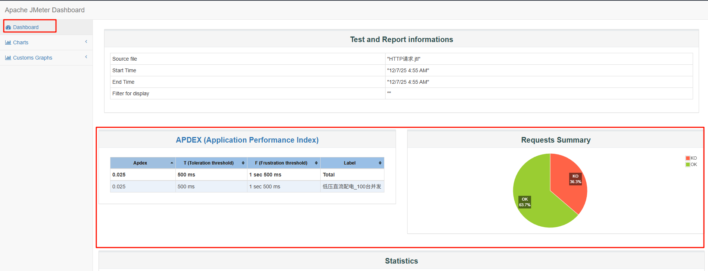
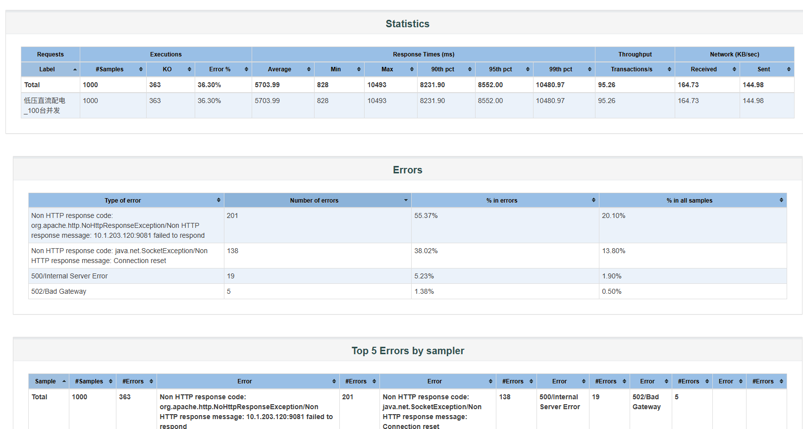
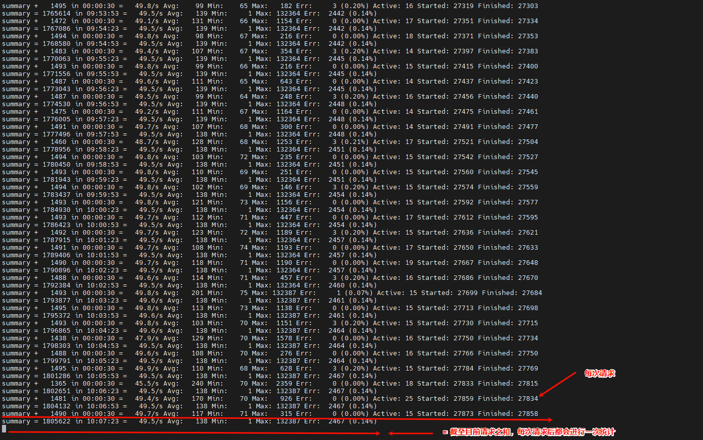
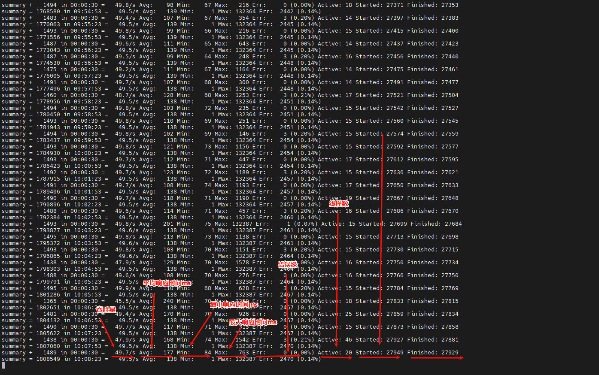

# 01_性能终端命令

注意：是对B接口，所以脚本里面的url一定是B接口的，而不是fsu的

```
语法：
    jmeter -n -t 【jmeter file】 -l 【results file】 -e -o 【path to web 】
    jmeter -n -t 【脚本文件.jmx】 -l 【结果文件.jtl】 -e -o 【HTML报告输出目录】
    jmeter -n -t HTTP请求.jmx -l HTTP请求.jtl -e -o report
        jmeter file 即 jmeter 中编写完脚本保存的脚本  .jxm
        results file 是   .jtl 
        JMeter 会在后台执行脚本，实时写入结果到 result.jtl
        
        
假设你有以下文件和目录结构：
	D:\jmeter_test\
        ├── test_script.jmx
        ├── report\
        └── result.jtl
        
   jmeter -n -t D:\jmeter_test\test_script.jmx -l D:\jmeter_test\result.jtl -e -o D:\jmeter_test\report
```

```
使用场景
	如果是单脚本（.jmx）
		直接使用这条语句即可
			jmeter -n -t 【jmeter file】 -l 【results file】 -e -o 【path to web 】
	
	如果是多脚本（.jmx）
		window或linux，终端模式，都需要使用脚本来执行
		linux为例：
			#!/bin/bash
            JMETER_HOME=/opt/apache-jmeter-5.x
            REPORT_ROOT=/tmp/jmeter_reports
            mkdir -p $REPORT_ROOT

            for jmx in /path/to/scripts/*.jmx; do
                name=$(basename "$jmx" .jmx)
                $JMETER_HOME/bin/jmeter -n -t "$jmx" \
                                        -l "$REPORT_ROOT/${name}.jtl" \
                                        -e -o "$REPORT_ROOT/${name}_report"
            done
```

```
jtl文件生成report
	# 基本用法
    jmeter -g your_result.jtl -o /path/to/output_folder

    # 示例：将result.jtl转换为report目录下的HTML报告
    jmeter -g result.jtl -o report

    # 如果JMeter不在系统PATH中，使用完整路径
    /path/to/jmeter/bin/jmeter -g result.jtl -o report
```


# 02_性能报告解析

```
前提：通过命令行执行后生成报告

dashboard必看
	APDEX (Application Performance Index)
	Requests Summary
	Statistics
	Errors												记录错误主要的原因
	Top 5 Errors by sampler								记录错误主要的具体样本
```




```
关键参数
	平均响应时间	3,847ms	❌ 严重超标
    最小响应时间	2ms	✅ 正常
    最大响应时间	10,493ms	❌ 出现严重延迟
    P90响应时间	~8,200ms	❌ 90%请求超过8秒
    P95响应时间	~9,500ms	❌ 95%请求超过9.5秒
    成功率	65.1%	❌ 严重失败
    失败请求数	349个	占总请求34.9%
    吞吐量	~14.3 TPS	远低于预期
```




# 03_性能测试注意点

```
ai:点击链接查看和 Kimi 的对话 https://www.kimi.com/share/19af7f89-c6a2-8f69-8000-0000e88f7333
```

```
说明1：
    1、确保线程组请求全部发出（看 JMeter 右上角 Active=1000）
    2、确保网络没丢包（本机 ping 10.1.203.120 -t 不丢包即可） -- （在请求时，再开一个窗口 - ping 10.1.203.120 -t，看是否有失败的）
    3、脚本里没自己加“Think Time”/定时器


说明2：
    1、Aggregate Report（聚合报告）
        把 .jtl 拉到 JMeter → Add → Listener → Aggregate Report
        重点盯：
            Error % > 1% 就不合格
            95th pct > 业务 SLA（一般 500 ms~1 s）
    2、Response Time Graph
    	一眼看“斜坡”——如果曲线 30 秒内从 500 ms 飙到 5 s，一定是系统排队。
    3、Hits/s + Active Threads Over Time
    	并发线程 1000 不变，TPS 曲线先上去再掉回来 → 系统已崩溃。

说明3：
```

| 检查点              | 推荐值                                 | 你这脚本的结论                                           |
| ------------------- | -------------------------------------- | -------------------------------------------------------- |
| 线程组 Ramp-Up      | 至少 30 s（1000 线程→30 s 内匀速递增） | 看时间戳，你是 1 s 直接 1000，**可接受**（压力更大而已） |
| 是否加定时器        | 不加                                   | 没加 ✅                                                   |
| 是否开 Keep-Alive   | 默认开                                 | ✅                                                        |
| 断言                | 只判 200 即可                          | ✅                                                        |
| 是否有 CSV 等参数化 | 无                                     | ✅                                                        |
| 本地资源            | 本机 CPU<80%、网卡<500 Mbps            | 自己看一眼任务管理器                                     |


# 04_第三方插件

```
本地打包：
	# 打开 PowerShell，进到父目录（直接用cmd -- 进入路径后，打开cmd）
		D:\software_code\Jmeter-5.1\02storage\

	# 直接打包成 tar.gz（Windows 10 1803+ 支持）
		tar -czf apache-jmeter-5.1.1.tar.gz apache-jmeter-5.1.1

服务器上解压（通用）
    cd /opt/performance
    tar -zxf apache-jmeter-5.1.1.tar.gz
    

启动脚本需要重新赋权
    # 上传后必须执行一次
    cd /opt/performance/apache-jmeter-5.1.1
    chmod +x bin/jmeter
    chmod +x bin/jmeter-server
    chmod +x bin/*.sh
    
    再加上
    	chmod +x /usr/local/apache-jmeter-5.1.1/bin/jmeter
```


```
推荐安装：
	新旧并存，独立运行
	假设你服务器已有 JMeter 在 /usr/local/jmeter（或任何路径），不要动它
```

#### 1. **新 JMeter 装到独立目录**

```bash
# 在服务器上建个新目录（比如 /opt/performance/jmeter-5.1.1）
mkdir -p /opt/performance/jmeter-5.1.1

# 把你上传的包解压到这个新目录
cd /opt/performance/jmeter-5.1.1
tar -zxf ~/apache-jmeter-5.1.1.tar.gz  # 假设包在你的 home 目录
```

#### 2. **这时服务器上有两个 JMeter**

```
/usr/local/jmeter          ← 旧的，别动
/opt/performance/jmeter-5.1.1/apache-jmeter-5.1.1  ← 新的，带插件
```

#### 3. **用的时候指定全路径**（重点）

```bash
# 旧版本（如果还要用）
/usr/local/jmeter/bin/jmeter -n -t old_script.jmx

# 新版本（跑 50 TPS 一周）
/opt/performance/jmeter-5.1.1/apache-jmeter-5.1.1/bin/jmeter -n -t HTTP请求.jmx -l result.jtl -j jmeter.log

/usr/local/apache-jmeter-5.1.1/bin/jmeter -n -t HTTP请求.jmx -l result.jtl -j jmeter.log
```

------

### ⚠️ 如果确定旧版没用了，想彻底替换

#### 1. **先备份旧版**

```bash
mv /usr/local/jmeter /usr/local/jmeter.bak.2025-12-20
```

#### 2. **把新版挪过去**

```bash
# 假设你的新版解压后在 /opt/performance/jmeter-5.1.1/apache-jmeter-5.1.1
mv /opt/performance/jmeter-5.1.1/apache-jmeter-5.1.1 /usr/local/jmeter
```

#### 3. **赋权**

```bash
chmod +x /usr/local/jmeter/bin/jmeter
```

------

### ✅ 懒人一键脚本（直接看这个）

在 **服务器上** 执行：

```bash
# 创建新目录
mkdir -p /opt/performance

# 假设你的上传包在 /root 目录
cd /opt/performance

# 解压
tar -zxf /root/apache-jmeter-5.1.1.tar.gz

# 赋权
chmod +x apache-jmeter-5.1.1/bin/jmeter

# 验证
apache-jmeter-5.1.1/bin/jmeter --version

# 跑测试
apache-jmeter-5.1.1/bin/jmeter -n -t /root/HTTP请求.jmx -l /root/result.jtl -j /root/jmeter.log
```

------

### ✅ 一句话总结

> **新 JMeter 解压到 `/opt/performance/jmeter-5.1.1`，跟旧的完全分开，用全路径调用，**
> **各行其是，互不干扰，安全省心。**


# 05_性能调节

```
1. 找到配置文件
    在 JMeter 安装目录下定位：
    {JMeter安装路径}/bin/jmeter.properties
2. 编辑配置项
    用文本编辑器打开 jmeter.properties，搜索并修改以下参数（如果不存在则添加）：

    # 增加JMeter线程池容量（取消注释并修改）
    jmeter.threadgroup.max_thread_num=1000

    # 缩短统计间隔（取消注释并修改）
    summariser.interval=10
    注意：如果找不到这两项，直接在文件末尾追加即可。
3. 生效配置
    方式一：重启JMeter GUI
    保存文件后，完全关闭JMeter
    重新启动JMeter
```


# 06_性能指标排查

```
非gui方式运行

指标说明：
	最大响应时间 132秒（132364ms）
	错误率 0.15%
	系统稳定性差
		活动线程数从18骤增至62，平均响应时间从110ms飙升至657m
		吞吐量从49.5/s跌至45.3/s，系统出现明显抖动
	响应时间分布
		不均匀，最小1ms但99%的请求应该在200ms以内才算健康
	长时间压测下错误率有缓慢上升趋势
		（从2137增长到2166）
		
		

正常指标：
	合格标准参考：
        最大响应时间：应小于1秒（1000ms）
        错误率：应小于0.01%（万分之一）
        稳定性：长时间压测下各项指标应平稳无剧烈波动
    必要要求：
    	错误率满足的后，也要保证相应必须小于10s
    	
    	
日志查询：
	1、运行时，界面不要关闭，看输出
	2、看jtl，且统计目前超时情况
		awk -F',' '$2 > 100000 {print $0}' result.jtl
	3、看log日志
		看请求状态
```




