# 工具使用

```
Burp Suite
	使用方法：https://blog.csdn.net/leah126/article/details/148744984
	插件相关：https://central.sonatype.com/artifact/org.python/jython-installer/versions
	插件相关：https://repo1.maven.org/maven2/org/python/jython-standalone/2.7.4/
	
	相关问题：点击链接查看和 Kimi 的对话 https://www.kimi.com/share/19aea40b-c2f2-8304-8000-00001c897df8
```


# 操作记录

```
1、先下载Burp Suite
2、下载AutorizePro-master.zip
3、下载jython-standalone-2.7.4.jar
```


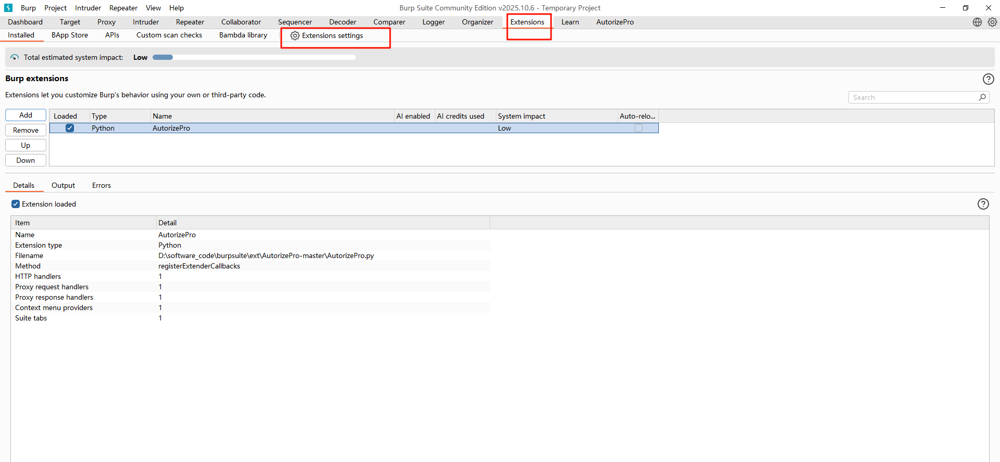

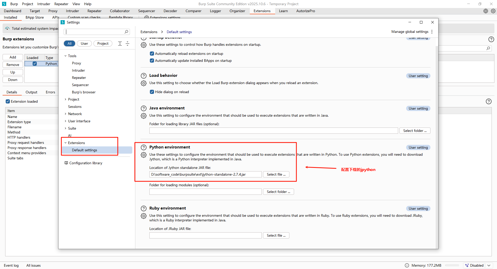


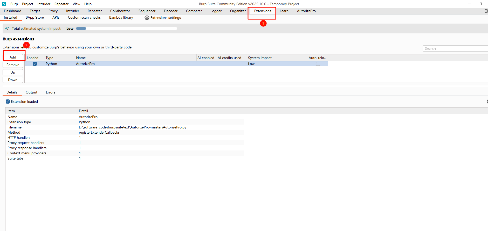

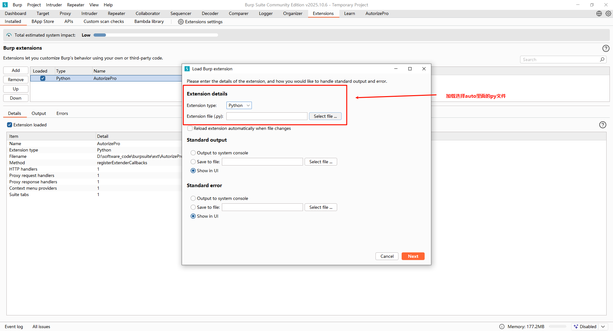


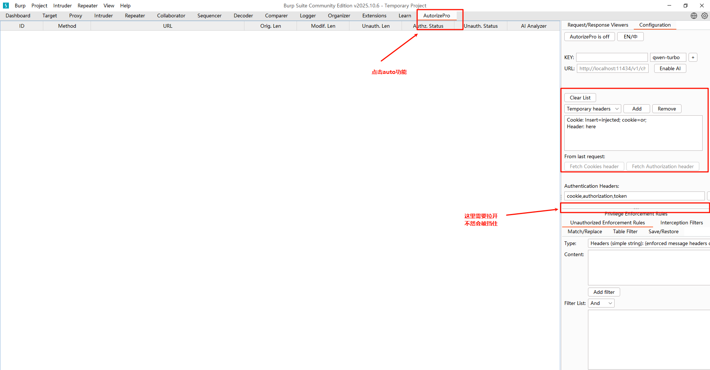


```
紧接操作：
	在创建Burp代理时候先登录上去（因为开启后对应的chrome浏览器就只能操作网址不能再访问别的东西了 -- 然后就会抓页面访问的记录）
	
        低权限账户：用Chrome普通窗口登录（如test@user.com）
        高权限账户：用Chrome无痕模式登录（如admin@corp.com）
	
	务必确认：两个浏览器都要配置Burp代理（127.0.0.1:8080）
```


```
补充监听操作：
	方法一：浏览器代理插件（最推荐）                                   ----------  完成这步即可（这个阶段）
        使用插件可快速开关代理，不影响正常上网。
        Chrome/Edge浏览器（两个窗口都操作）
        安装插件：
        访问Chrome应用商店 → 搜索  Proxy SwitchyOmega
        点击 "添加至Chrome"
        配置代理：
        插件图标 → 选项 → 新建情景模式
        名称填  Burp  → 选择 代理服务器
        HTTP代理：127.0.0.1  端口  ：8080
        勾选 "对所有协议使用相同代理服务器"
        点击 "保存"（应用选项）
        快速切换：
        插件图标 → 点击 Burp 即可启用代理		（选择刚刚创建的那个即可）
        低权限浏览器（普通窗口）：切换到Burp模式
        高权限浏览器（无痕窗口）：也切换到Burp模式
        
        
        方案一：在无痕模式下启用插件（最快）
            Chrome地址栏输入：chrome://extensions
            找到Proxy SwitchyOmega → 点击 "详情"
            下滑找到 "在无痕模式下启用" → 打开开关
            回到无痕窗口：插件图标就出现了 → 切换到 Burp 模式
        
        
   
   
   方法二：系统级代理（备用方案）
        如果您不想装插件，可配置Windows/Mac全局代理。
        Windows系统设置
        开始菜单 → 搜索 "代理设置"
        手动设置代理 → 编辑：
        地址：127.0.0.1
        端口：8080
        点击 保存
        Mac系统设置
        系统设置 → 网络 → Wi-Fi/以太网 → 详细信息
        代理 → 网页代理(HTTP)：
        服务器：127.0.0.1
        端口：8080
        点击 好
        
        
   方法三：Firefox独立配置
        如果其中一个浏览器用Firefox，可避免Cookie串扰：
        Firefox → 设置 → 网络设置 → 设置
        手动配置代理：
        HTTP代理：127.0.0.1 端口：8080
        勾选 "为所有协议使用相同代理"
        点击确定
        
   
   
   验证配置是否成功（必须做）
        步骤1：确认Burp监听
        Burp Suite → Proxy → Options(也就是proxy settings)
        Proxy listeners列表中应有：127.0.0.1:8080 → Running
        步骤2：浏览器访问测试
        在配置好代理的浏览器中访问：http://burp
        应显示 Burp Suite欢迎页面（证明流量已经过Burp）
        步骤3：实际抓包测试
        浏览器访问任意网站（如http://example.com）
        Burp切换到 Proxy → HTTP History
        应能看到刚访问的请求记录
        
  
  为了避免高/低权限Cookie串扰：
        浏览器	窗口类型	代理配置	登录账户
        Chrome 1	普通窗口	SwitchyOmega → Burp	低权限用户
        Chrome 2	无痕窗口	SwitchyOmega → Burp	高权限用户
 
 
 
  关键：两个窗口的代理配置独立生效，无痕模式不会影响普通窗口的设置。
        常见问题排查
        现象	原因	解决
        浏览器显示 "代理服务器拒绝连接"	Burp未启动或监听地址错误	检查Burp的Proxy Options，确保127.0.0.1:8080在运行
        访问HTTPS网站提示 证书错误	未安装Burp证书	访问http://burp → 下载CA证书 → 导入浏览器（见下文）
        配置代理后无法上网	Burp拦截模式开启	Burp中点击 Proxy → Intercept → Interce
        
        
 
  HTTPS网站抓包补充：安装Burp证书
        访问HTTPS网站时必须安装证书，否则会被拦截：
        浏览器访问：http://burp
        点击 "CA Certificate" 下载 cacert.der
        Chrome设置 → 隐私和安全 → 安全 → 管理证书
        导入 → 选择cacert.der → 信任此证书 → 确定
        
        
  简化流程（针对您的场景）
        最快方式：
        两个Chrome窗口都安装 Proxy SwitchyOmega
        都切换到Burp情景模式
        低权限窗口登录test@user.com
        无痕窗口登录admin@corp.com
        立即开始测试，无需重启浏览器
        核心验证：访问http://burp能显示Burp页面 = 配置成功！
```

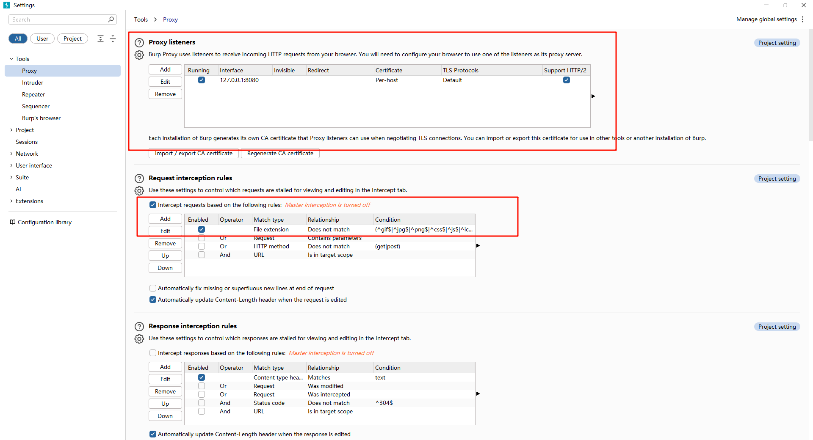


# 开始执行

```
在配置好前面的步骤之后
	直接在页面访问之后

访问之后
	proxy -http history里面就有对应接口记录
	可以右键选择接口，然后选择send to repeater（然后到repeater页面，就会看到已经模拟了接口 -- 只需要直接sent就行，切换不同用户改cookies就行）


切换用户技巧：
	可以先把不同用户的cookies抓下来，放在记事本中，然后直接在inspector里面修改cookies发请求即可
		这样就是实现一个接口两次调用

查看接口技巧：
	可以直接在proxy -- http 选择filter
	在filter by search term里面输入接口信息，apply即可快速找到接口
```

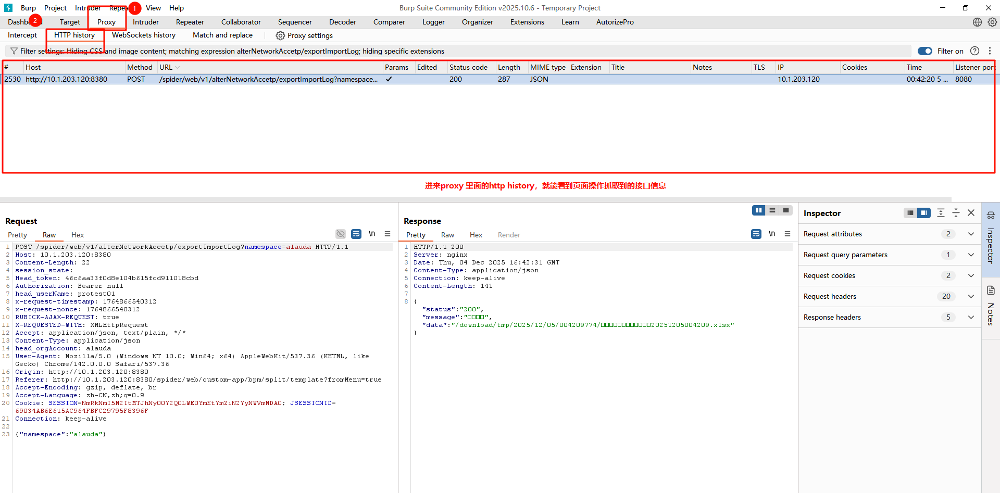

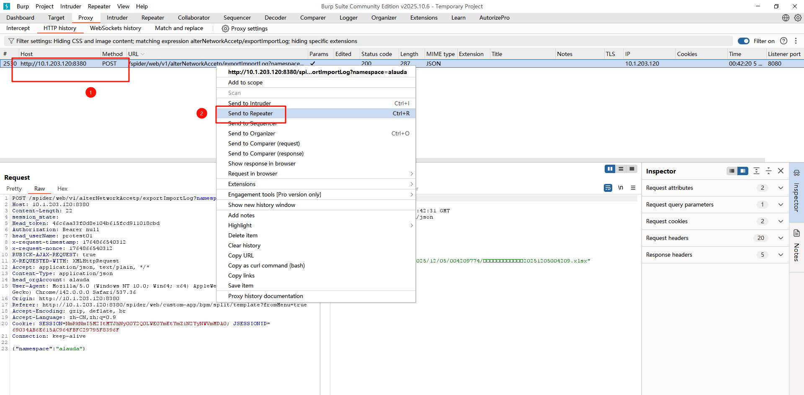

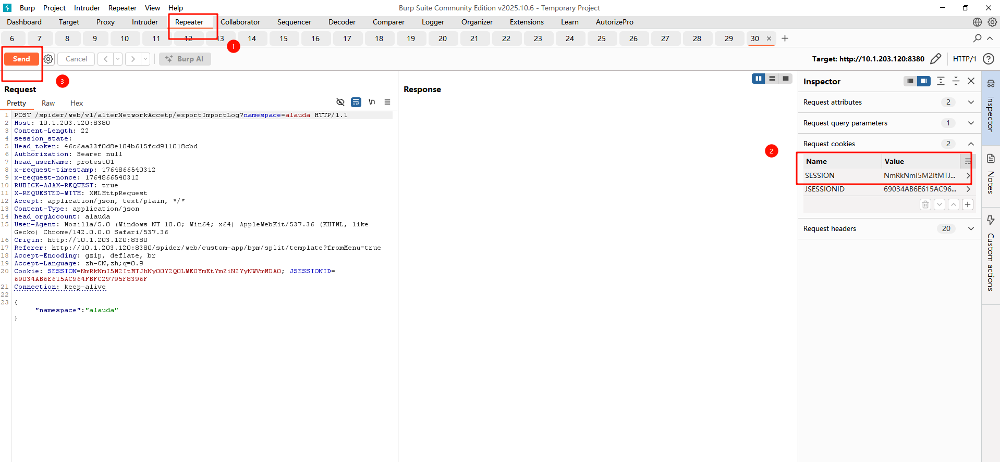

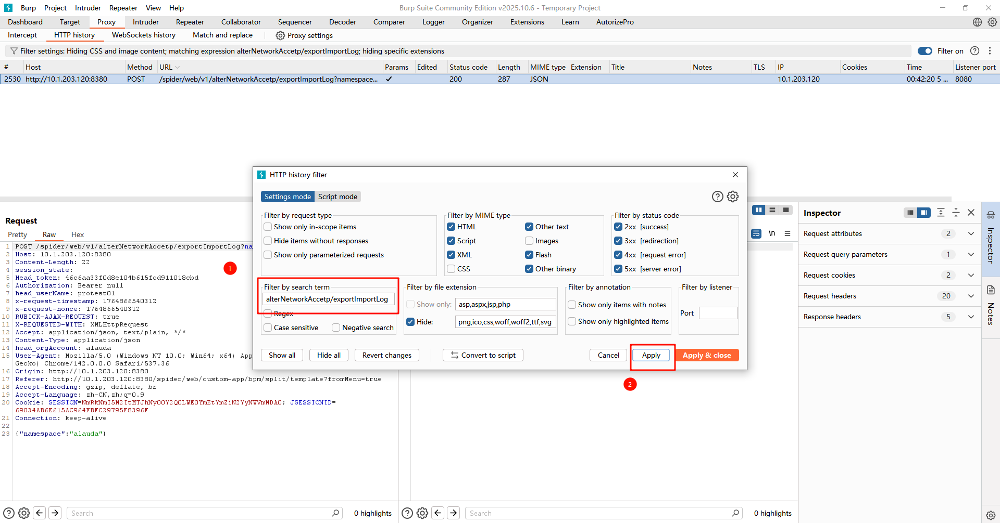


# 补充注解（有空再看整理）


```
根据您的截图，右侧Configuration区域没有"Fetch cookie header"按钮，这是Community Edition的正常情况。请严格按以下手动操作：
具体操作：
在低权限浏览器中：随便点击一个页面（如"个人中心"）
在Burp中：切换到 Proxy → HTTP History
找最新请求：找到刚才那个"个人中心"请求（URL通常是/user/profile之类）
右键该请求 → Copy request（或按Ctrl+R）
粘贴到记事本，找到完整的一行：
Cookie: session=abc123; token=xyz789; userId=1001
必须包含 Cookie: 前缀
回到AutorizePro标签页（您的截图界面）
在右侧"Insert injected headers here"文本框中：完整粘贴刚才复制的Cookie行
检查格式：文本框内应只有一行，开头是Cookie:，不要有多余空格
```


```
三、开启拦截（定位您截图中的按钮）
在您的截图顶部，找到这些元素：
勾选框：在"All Analyzer"上方，找到  ☑ Intercept requests from Repeater/Proxy  （必须打勾）
开关按钮：在左侧表格上方，找到  Autorize is off  （红色）
点击一次，它会变成  Autorize is on  （绿色）
（可选）测试未授权：如果想同时测"未登录访问"，勾选 ☑ Check unauthenticated
```


```
四、执行测试（开始抓包）
操作流程：
切换到高权限浏览器（无痕模式）
执行敏感操作，例如：
访问管理员后台 (/admin/users)
查看其他用户订单 (/order/12345)
删除用户 (/api/user/delete/1002)
观察AutorizePro界面：每操作一次，左侧表格会自动新增一行
```


```
五、结果分析（看懂三列数据）
在您的截图左侧表格中，关注这三列：

列名	含义	您的判断标准
Orig. Len	原始高权限请求响应长度	基准值
Modif. Len	替换低权限Cookie后的响应长度	与Orig. Len相同 → 红色警报
Unauth. Len	无Cookie的响应长度	应更小或为0
颜色含义（左侧Authz. Status列）：
🔴 红色：Modif. Len ≈ Orig. Len → 可能存在越权漏洞
🟢 绿色：Modif. Len明显更小或0 → 访问被正确阻止
⚪ 灰色  ：Modif. Len=0 → 请求失败


实战示例：
假设高权限账户访问/admin/users：
Orig. Len: 5000 (返回用户列表JSON)
Modif. Len: 5000 (也是5000) → 🔴 红色警报！ 低权限也能看到列表
Modif. Len: 120 (返回"无权访问"提示) → 🟢 安全
```


```
六、验证漏洞（双击查看详情）
红色警报必须手动验证（工具可能误报）：
双击红色行：下方会显示三个请求/响应视图
对比Modified Response和Original Response：
如果内容几乎一样（都有用户数据）→ 确认漏洞
如果Modified Response是错误页面 → 误报，忽略
右键红色行 → Send to Repeater
在Repeater中：手动替换Cookie为低权限的，重新发送确认
```


方式1（重点）

```
非常好，你已经用 Chrome（管理员）+ Firefox（普通用户） 都走 127.0.0.1:8080，这是最常见也最清晰的“双身份”测试方案。

注意：先登录，登录完之后再开bur

✅ 接下来：一步一步操作，手动越权测试
✅ 步骤1：分别登录两个用户

    浏览器	登录账号	目标
    Chrome	管理员A	访问后台、敏感接口、管理功能
    Firefox	普通用户B	只能看自己的数据
    登录后，不要退出，保持会话活跃。

✅ 步骤2：在 Burp 中区分两个用户的流量
    打开 Proxy → HTTP history。
    看 Source IP 或 User-Agent 列（Burp 默认不显示，可右键列头打开）。
    更简单的办法：
    Chrome 访问的接口，User-Agent 含 Chrome/xx。
    Firefox 访问的接口，User-Agent 含 Firefox/xx。
    或者看 Referer、接口路径 来区分。
    
    
✅ 步骤3：抓一个“管理员专属”请求

    GET /admin/userlist HTTP/1.1
    Host: example.com
    Cookie: session=ADMIN_COOKIE
    在 HTTP history 里找到这个请求。
    右键 → Send to Repeater（快捷键 Ctrl+R）。


✅ 步骤4：在 Repeater 里替换 Cookie 为普通用户
    打开 Repeater 标签页。
    把请求里的：
    Cookie: session=ADMIN_COOKIE
    换成：
    Cookie: session=USER_COOKIE
    你从 Firefox 的流量里复制普通用户的 Cookie。
    点击 Send。


✅ 步骤5：看返回结果
    返回结果	说明
    返回了用户列表 → 越权漏洞	普通用户不该看到
    返回 403 / 401 → 安全	权限控制正常


✅ 步骤6：批量测试（可选）
	把多个管理员接口都 Send to Repeater，统一换 Cookie 测试。


✅ 小技巧：快速复制 Cookie
    在 Firefox 里登录普通用户。
    在 HTTP history 里找到任意一个 Firefox 的请求。
    右键 → Copy → Copy as curl。
    粘贴到文本编辑器，提取 Cookie: 字段即可。


✅ 下一步你做什么？
    你现在可以：
    手动测几个接口，我帮你判断是否存在越权。
    把你要测的接口发给我（脱敏后），我帮你写 Repeater 模板。
    想自动化？ 我可以给你 Burp 的 Autorize 插件配置方法。
```


```
现在 3 步完成“一键切换 Cookie”

步骤	操作	在哪点
① 录管理员 Cookie	在 Chrome 抓的请求上 右键 → Extensions → AutorizePro → Add as original cookie	HTTP history
② 录用户 Cookie	在 Firefox 抓的请求上 右键 → Extensions → AutorizePro → Add as replacement cookie	HTTP history
③ 一键切换	打开 AutorizePro 面板（左侧图标像盾牌）→ 点 “Enforce Original” / “Enforce Replacement”	AutorizePro 面板


✅ 找不到右键菜单？
直接拖过去也行：
把 Chrome 请求 拖到 AutorizePro 面板的 “Original” 框里。
把 Firefox 请求 拖到 “Replacement” 框里。
✅ 最终效果
在 Repeater 里随便改路径/参数，然后：
点 Enforce Original → 发管理员 Cookie
点 Enforce Replacement → 发用户 Cookie
一秒切换，不用再复制粘贴。
```


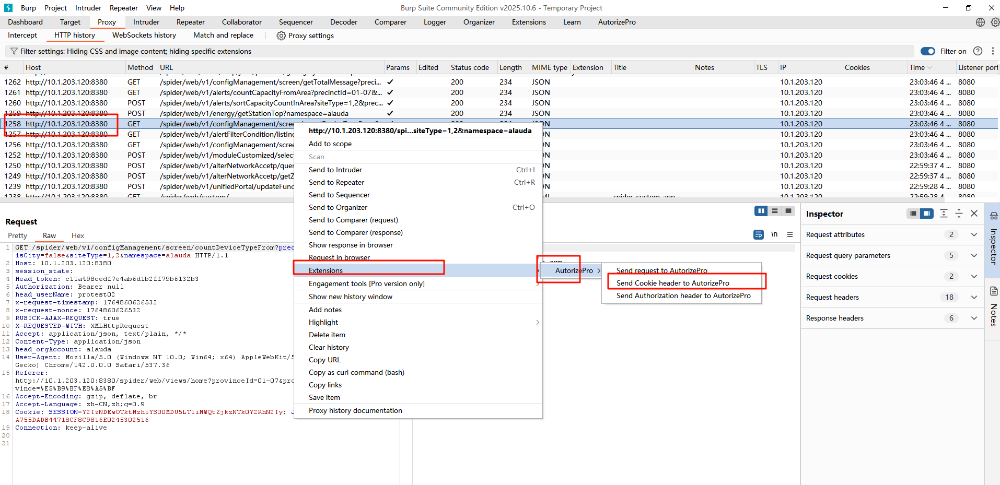

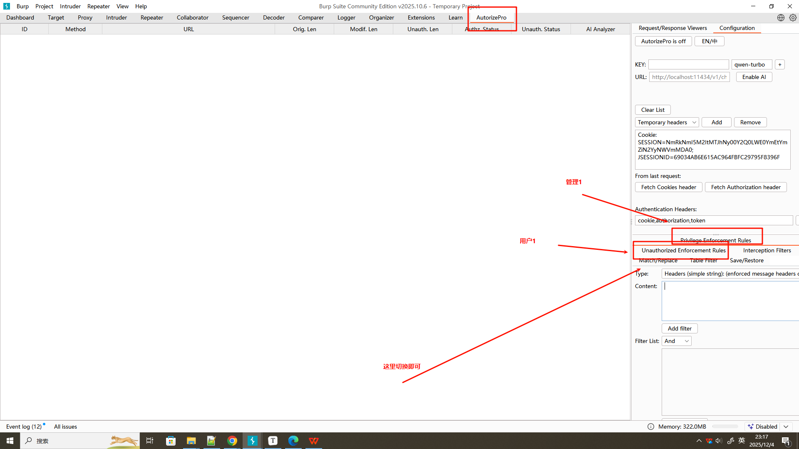content里面填对应用户的cookie


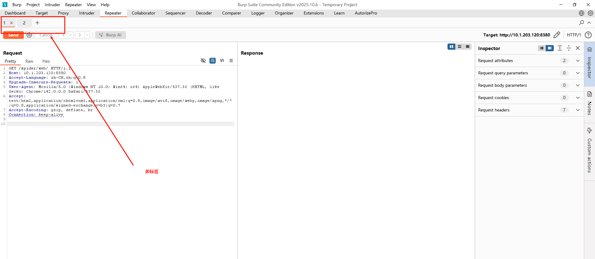


方式2

```
✅ 目标：让两个不同权限的用户同时发起请求，便于对比权限差异
✅ 方法一：用 Burp 自带浏览器 + 隐私窗口（最简单）
✅ 步骤：
第一个用户（高权限）：
    点击 Burp 界面上的 “Open browser” 按钮（会用 Burp 的代理）。
    登录第一个账号（比如管理员）。
    在 Proxy → HTTP history 里找到登录后的请求，右键 → Send to Repeater。
第二个用户（低权限）：
    再点击一次 “Open browser”，会打开一个新的浏览器窗口。
    用隐私模式或不同账号登录（比如普通用户）。
    同样把关键请求发送到 Repeater。
    对比权限：
在 Repeater 里，用低权限用户的 Cookie/Token，去访问高权限接口。
看是否返回了不该看的数据（越权漏洞）。

```


# 拓展功能（一次多请求查看）

```
bp插件使用：																								【未登记】
	https://cn-sec.com/archives/3413327.html
	使用方法
		1、内部先开个地权限的
		2、进入auto pro - config - 获取cookies
		3、单独再外面开个浏览器，登录高权限的
		4、高权限进行操作
		5、直接看请求就有三个同时发出了
			原始：高权限
			unauthor-未授权
			最上面：地权限
```

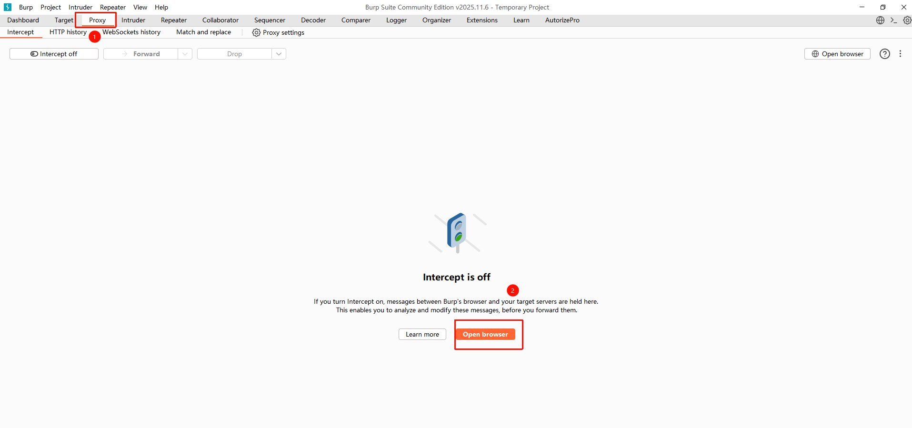

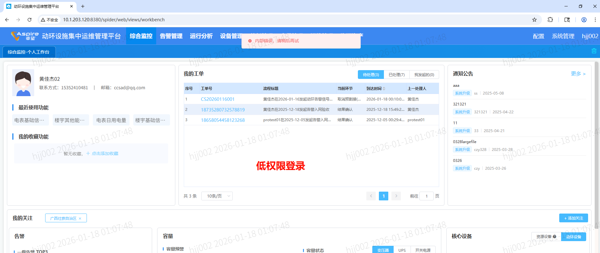

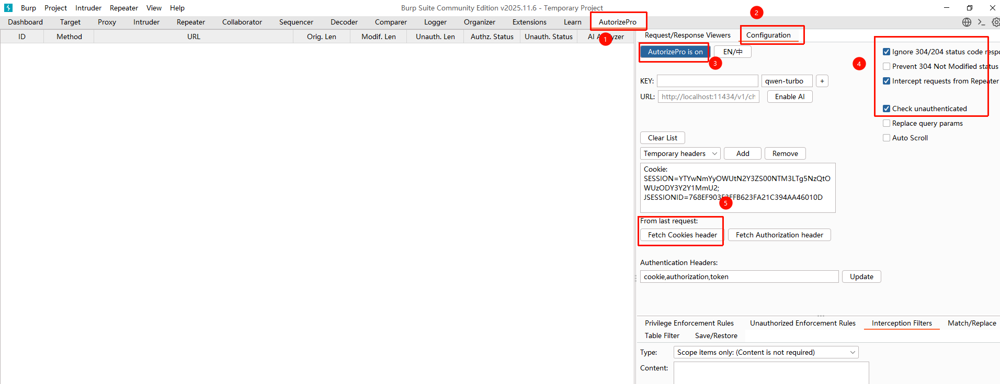

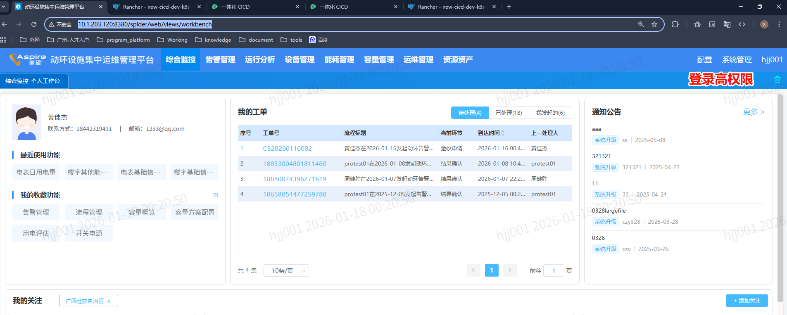

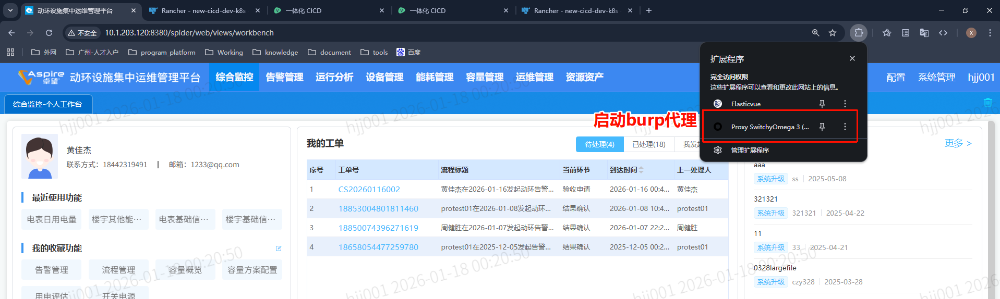

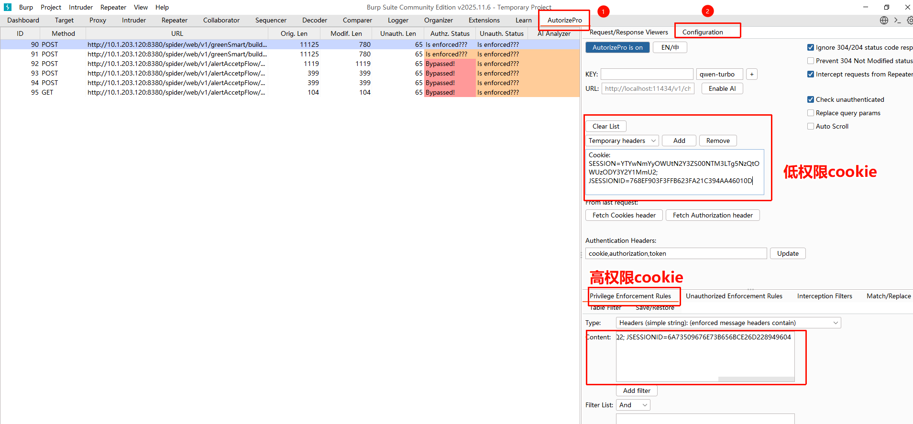

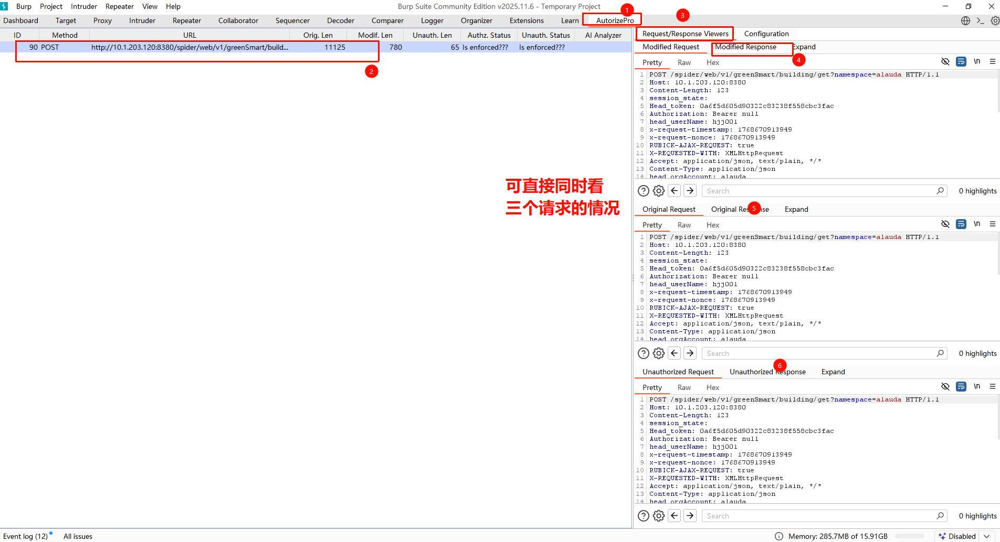

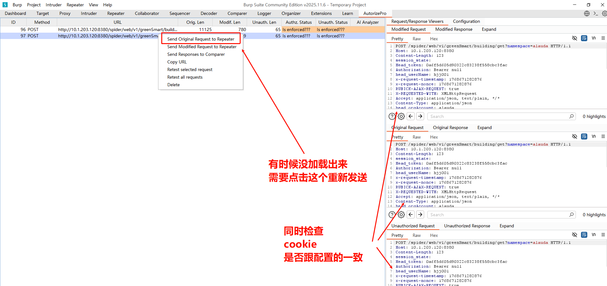


