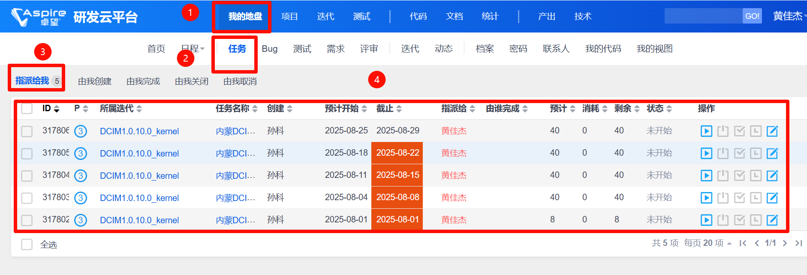
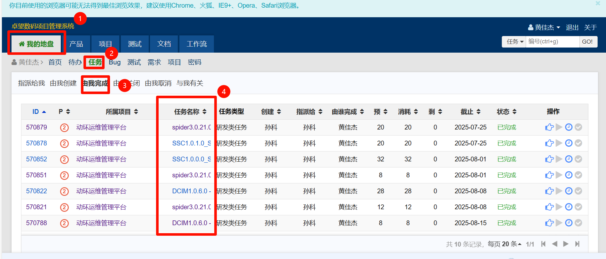
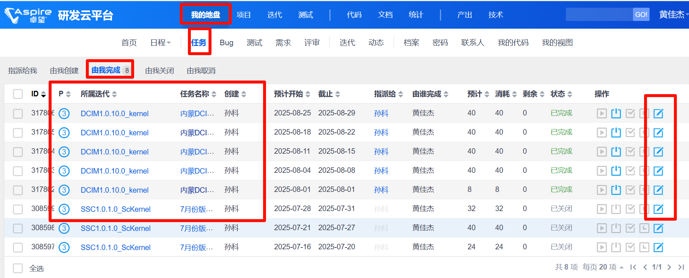

# 01_工作安排

- **日报周报**
  - 每周一下午前写完周任务
  - 每周四下午前写完周进度
- **卓效查看**
  - 每天去查看是否有提测

- **卓效云fpa检测——重点**
  - 提测信息需要检测开发是否已经导入fpa，如果没有导入需要提醒对应开发导入

- **需求文档（开发文档）查看——需求工单对应**
  - 切换到对应省份

  - 在研发云——项目——评审里面，需求名称里面可以查看【部分需求文档是没有工单号的】
  
  - 进到里面即可查看对应需求文档和开发文档
  
- **bug提交**
  - 每次更改，或者选择版本后，都会重新选择指派人，需要注意

- **bug回归**
  - 提测：需要到分支里面改数据
  - 一般切到我的领域里面，看全部未执行的bug
- **发版**
  - 需要申请发版基线
  - 需要对准里面相关链接
  - 开发会提供对应手册
  - 测试需要写对应测试报告
  - 渗透测试需要提前申请，通过才行
  - 绿源上面下载进度报告

- **案例**
- **测试**
  - ai测试需求，每个月最少需要有93条ai的用例

- **项目排期登记**
  - 有对应链接、需要写明测试时间、测试执行时间、测试结束时间这些
  - 以及对应测试人
  - 以上的根据自己负责的项目写

- **登记**
  - 每周1写周工作目标，周四下午前写好本周工作进展
    - 登记有格式：集团 20%，如果区分且有%，中间一定要空格
    - 如果知道上线时间，一定要写上【还要要有完成时间，自己预计】
    - 2、上海-上海SC-定制需求开发：冷通道分析，机柜管理变更，8月1日案例编写完成
      3、集团-Ai助手 PC端测完成，
- **人员**
  - 再次查看
- **研发云工时登记**
  - 填写规则：
    - 点击开始、填开始时间
      - 从预计开始时间为第一天开始填写
      - 截至日期就是一周的最后一天
      - 打开的第一个页面就是记录第一天的工作
      - 因此比如说给了40小时，那么就是8，然后剩余32，然后打开日志、依次添加

  - 
  - 点开始（先填一天工时、如果有问题可以在日志日志里面改）
  - 
  - 不知道任务可以在禅道里面看
  - 

  - 如果时间有问题可以在这里取编辑改一下（已经已经全部填完的时候）

  - 

- **上线代码上传**
  - 到cicd中下载最新的
  - 可以下载代码，检查里面的内容是否添加了

- **版本什么校验啥的**
  - 这是最后的时候弄得
- **旧禅道工时记录【重点-算工钱】**
  - 孙总会在群里发旧禅道工时录入链接
  - 
  - 
  - 从最下面开始【时间是上个月21号开始】
    - 点击开始、填开始时间【统一上个月21开始  -- 周日周六不可选】
      - 特别注意：例如08-08是截至日期
        - 那么天的就是8-4到8-8这一周（由于这里分开了两段，因此就要换下）
    - 点击闹钟图标【根据工时填报，如果工时给的，该任务下某天不够8小时，在下个任务里面就需要作为该任务开始，填不足的时间、周日周六可以添加】
    - 全部填写完成，在项目 -- 工时里面查看是否一致
    - 确认全部没有问题、全都点击完成即可
- **相关文档**
  - 项目排期
    - 

  - 广西现网
    - 1、

  - 上海


# 02_人员架构【重点】

- 产品
  - 最大大佬：郭臻

- 前端
  - 前端TL【最大的】：刘岂宇
  - 内蒙前端：佘坤
- 后端【各省点负责人比较多】
  - 其他省份后端TL【最大的】：黄晓锋
  - 集团后端tl【最大的】：李可槐
  - 内蒙后端tl【最大的】：陈键
  - 内蒙其他后端：江奎念
  - 集团能耗：后端【倪桂明】
  - 稽核，节能作业：后端【谢伟】
  - 容量：后端【陈正文】
  - 省端能耗：后端【宏盛、倪桂明】
  - 广东
  - 上海composite：后端黄晓峰
  - 重庆


# 03_报告编写

- 每周一填写个人周报：
  - 填写内容可以是熟悉xxx不用时间限制
  - 填写完成测试，上线：需要指明完成测试时间，上线时间
  - 填写案例编写完成：也需要有完成时间
- 每周4下午填写周报进度：
  - 即个人周报中填写的内容，需要完成的内容

# 04_提测规范

- **提测内容**
  - ❤**新增的需求内容**
    - 跟需求文档是一致的，需要仔细查阅需求文档【不要搞出乌龙】
  - ❤**涉及修改的模块（标注前后端，后端可以在CICD流水线查看）**【重点-很重要】
    - 可以现在nacos服务管理中 - 根据涉及模块看服务容器时候已经实例化了【需要先选对应环境】
    - 然后可以在看看nacos中配置管理-配置列表下对应模块的配置信息【需要先选对应环境】
    - 注意：也可以直接到cicd中查看对应模块 - 在全部流水线中搜索 - 构建详情 - 跳转到部署的环境中
      - 组件名：web--则是对应前端的，组件名kernel--则是对应后端的
      - 搜索模块名，需要先到模块中去【如果不知道就看最新时间的】
      - 然后点击构建 -- 根据提测中涉及的分支，换成需要的分支结构【如果没有分支就可能还没更新上】
  - ❤**注意点中内容**
    - 有时候新增接口，会触发对应统计之类的，直接在页面验证也可以
    - 有时候会提示某个分支代码受其他代码影响，上线时不可使用某个服务，需要从develop获取
  - ❤**配置文件（必须要有）**
    - 需要在开发提测后跟开发沟通说明
  - ❤**fap导入（用于用例导出）**
    - 导出测试模板
      - 研发云 -- 测试  --  功能测试 --  导出  --  导出模板  --  选择需求【勾选对应需求】
      - 找产品经理拿需求文档【开始编写测试用例】
  - ❤**冒烟和主流程和集成测试完成后，就会通过**
    - 主流程：最重要的内容
    - 冒烟通过

# 05_文档归纳

- 测试编写完成需要归纳到wiki中，涉及内容如下：
  - 需求概要
  - 涉及库表
  - 测试方法
  - 测试数据准备

# 06_集团和V版本

- V版本 指 微版本：就是基础功能版本【很多功能都是集团有的，不然就是从集团迁移过来的】
- 集团版本 指 最全版本：就是拥有全部的功能【这些功能可以迁移到其他v版本中】
- 定制版本 指 客户单独定制某些功能：就是v版本和集团【集团可能会迁移到，也有可能没有】
  - 例如：
    - 上海-SC -- 定制了单机柜分析和机房温湿度、冷通道分析、机柜断电分析
    - 内蒙古-DCIM：定制的能耗那块好像【也有定制，具体哪个不清楚】

# 07_环境空间命名对应表

| gxems-dev     | 广西   |
| ------------- | ------ |
| gzems-dev     | 广州   |
| ynems-dev     | 云南   |
| gdems-dev     | 广东   |
| jt_cicd       | 集团   |
| dcim_dev      | 内蒙古 |
| shanxi-cicd   | 陕西   |
| prod          | 预生产 |
| shems-dev     |        |
| shaoguan-dev  | 韶关   |
| sc-dev        | 上海   |
| emc-dev-sunke |        |

# 08_模块与分支

待补充

# 09_打包发包

```
每次需求开发做完之后，都会把包同步到CICD的流水线中【即镜像】
	1、流水线对应服务【即镜像】、点击构建详情：里面有镜像对应的代码包【需要与本次开发所需的一致：即分支要对】 -- 用于上线提供
	2、在测试的失手，开发每次修改后，都会重新git代码，同步到CICD流水线中、因此需要重新构建【构建的时候需要选对分支、与本次提测中的分支一致】
		然后构建之后，就会部署到新开发环境，这样测试的时候才是正确的
```

# 10_测试时机

```
这一部分很重要

注意：每个需求的测试开始都必须按照一下内容来
	1、开发开设计开会后、进行开发、然后有新增接口之类的、会依次开发每个接口、每个接口都可以先进行测试
	2、后端开发完之后、会和前端进行联调【这个时候功能测试还不能测试】
	3、等待开发联调成功，并且提测【提测时候需要必须导入fpa，没有导入必须跟开发说】
	4、提测了才正式开始测试【正式功能测试，同时要注意，每次测试的是否分支是对的，环境也是对应、若开发切成了别的分支，会导致测的都有问题】
	5、如果中途出现bug，开发修复后，要注意每次修改完，git同步到cicd的是否重新构建、构建后是否重新生效，生效后内容是否真的改了【属于bug回归了】
```

# 11_服务内部相关配置

```
1、NG配置【是否分环境】
	目前不知道，问下陈士东
```

# 12_系统分类

```
1、动环系统
	目前所登录的各环境的页面就是动环系统
	
2、omc --> 故障推送中心
	omc我们有、目前是我们推到故障平台
	故障平台应该是外部系统 -- 目前我们是用模拟器来看
	
3、数据共享平台 -- fpt/sftp
	其实就相当于一个共享文件夹的作用
	里面提供文件
	只是这里是服务器里某个目录，可以直接访问
	相关配置可以在以下位置看【目前只知道一个】
		t_scheduled_task
```

# 13bug提交问题

```
提交bug不通过
	私下跟开发说即可
```

