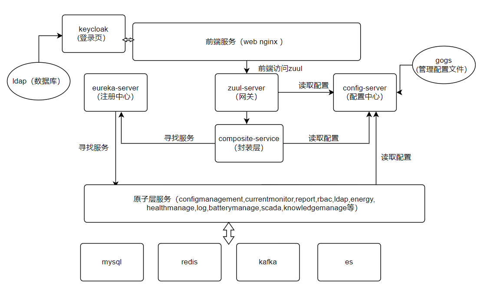
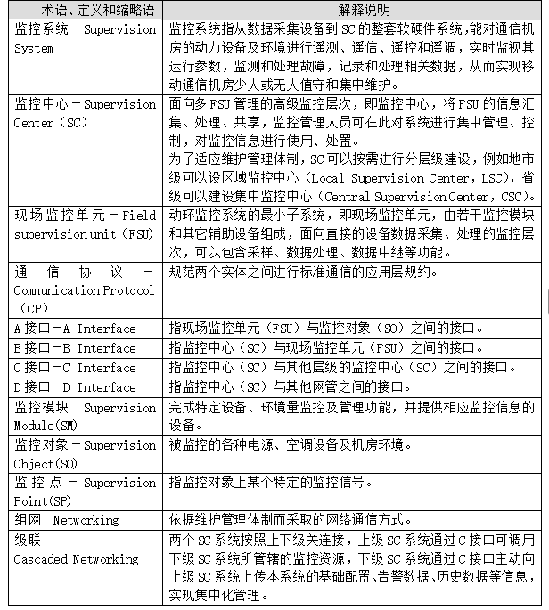
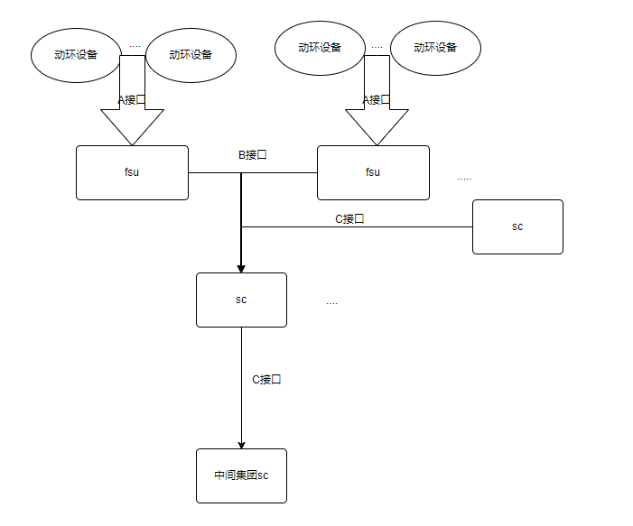
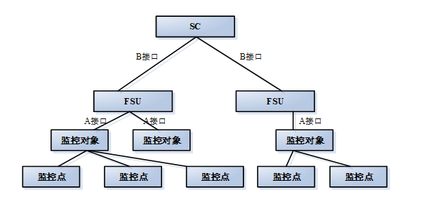

# 系统架构





- **组件划分**
  - **Keycloak**：统一认证（测试单点登录/权限控制）
  - **Composite-Service**：接口聚合层（重点测试接口组合逻辑）
  - **原子服务**：12个独立业务模块（需掌握核心服务如scada[监控]、report[报表]的业务流程）【获取Nacos控制台权限（查看服务列表/配置管理）】
  - **数据层**：
    - MySQL：主业务数据
    - Redis：缓存/会话（测试缓存一致性）
    - Kafka：异步通信（测试消息积压/丢失场景）
    - ES：日志/检索（测试查询性能）

- **数据存储**
  - 数据的存储必须是后端来写入的  -- 所以数据层是由和接入层都是后端负责
  - 即便请求或是数据返回  -- 都是由后端决定
- **分层关系**
  - 设备层【物联网设备、第三方】 -> 省级层【接入层、数据层、服务层】 -> 总部层【接入层、数据层、服务层】
- **数据走向**
  - 数据都由设备层设备 -> 通过B接口/MQTT/CoAP接口传输数据或接收请求再返回
  - 设备层
    - 环境设备（温湿度传感器）、动力设备（空调、UPS）【设备模拟发送 -- 设备数据准确性 -- 设备控制性 -- 设备身份】
  - 省级别【直接对接本省设备--实时监控】
    - 需要先让设备接入服务器【**即接入VIP -- 再进行接口传输**】
    - 设备数据--温度等指标【**接入代理**】：
      - 设备数据通过接口传入到接入代理
      - 数据流进中间库kafka
      - kafka进行分类再流进中间库ES【历史数据--告警数据】/redis【实时数据 -- 内存内断电就没】
      - 最后再到mysql永久存储
      - 省级的数据会提供到给总部【需要校验总部与省级对应的是否一致】
    - 设备状态--开关等【**控制代理**】：
      - 省级或总部下发的命令【即会调用api -- 后端根据设备匹配到相应省份 -- 通过RPC调用控制代理】
      - 控制代理通过VIP【即虚拟ip连接设备】 -- 通过接口协议【 操作设备】
      - 设备执行后会立马返回数据到ES中【页面可实时查看】 -- 【后续会写入mysql中】
  - 总部级别【监控所有省份下设备的情况 -- 可实时操控和监视】
    - 直接通过数据库、中间件获取数据
    - 发送指令也可以根据指令所对应设备 -- 匹配对应省份  -- 通过RPC调用
- **数据模拟**
  - 模拟设备返回数据【使用fsu设备平台】
  - 模拟设备发送一条预警【发送到中间库  -- kafkatool】

# 项目目的【重点】

- **初期痛点**
  - 机房/数据中心里用了**太多不同厂家**的监控设备（FSU：现场监控单元；SC：监控中心）
  - 设备**各自为政**：平台不同、接口不同、标准不同、命名规则不同、告警处理方式不同
  - **无法互联互通**，数据孤岛，管理混乱，集成和维护成本**极高**
- **解决痛点**
  - 互通问题，让不同厂家的设备能接入同一个平台
  - 减少集成难度和建设成本，为以后采购提供统一依据
- **系统目标**
  - **智能运维管理**
    - **起点：** 从**动环监控**（动力环境监控：如市电、UPS、蓄电池、空调、温湿度、漏水、门禁、视频等）入手
    - **扩展范围：** 逐步覆盖**DCIM**（数据中心基础设施管理）、**园区管理**、甚至更广泛的**城市物联网**基础设施
    - **智能化：** 不仅仅是数据采集和告警，还要利用AI进行**推理、判断、决策**（比如预测性维护、能效优化、故障根因分析）
  - **技术支撑：**
    - **物联：** 广泛接入各种传感器和设备（感知层）。
    - **数联：** 统一数据标准、规范、接口（传输和数据处理层）。
    - **智联：** 利用AI算法进行智能分析（应用层）
- **用户群体**
  - **网络运营商**：买单方和主要受益方【移动、联通等】、对系统要求【确保基础设施稳定运行】
  - **系统维护人员**：IT或设备运维工程师【负责系统的**安装、配置、集成、维护、排障**】、对系统要求【**易集成-接口统一**，**易配置**】
  - **最终用户**：运营商**值班室里的维护人员**【**日常监控和初级故障响应**】、对系统要求【**操作简单**、告警**清晰明确**-设备哪里故障】
- **技术亮点：**
  - **物联网 + AI**、不仅要连接设备，还要让数据变得智能，能自动分析和决策（“类脑”）

# 测试要点

- | 功能           | 测试目标                          | 测试工具建议                                        |
  | :------------- | :-------------------------------- | :-------------------------------------------------- |
  | 设备实时监控   | 设备数据是否及时显示到省/总部界面 | Postman模拟设备数据【触发后端模拟设备发起数据传输】 |
  | 告警上报       | 设备告警能否触发总部大屏弹窗      | 脚本模拟大量告警                                    |
  | 远程控制设备   | 总部下发的指令设备是否执行        | 真实设备验证                                        |
  | 省平台数据上报 | 总部能否看到各省汇总数据          | 查总部数据库比对                                    |

  | **设备数据流转**                                             |
  | ------------------------------------------------------------ |
  | 在**省平台**模拟一个设备告警（比如温度超标）→ 检查**总部平台**告警列表是否显示该告警 |
  | 在**总部**下发配置（比如修改设备参数）→ 检查**设备**是否执行成功 |

  | **第三方系统如何接入**                                       |
  | ------------------------------------------------------------ |
  | 省平台需要接入摄像头（视频NVR）或门禁系统                    |
  | 在第三方系统触发一个事件（比如门禁被刷）→ 检查**省平台**是否收到该事件 |
  | 在**省平台**操作开门 → 检查**门禁设备**是否响应              |

# 项目逻辑







**概括点**

- A接口－A Interface
  - 指现场监控单元（FSU）与监控对象（SO）之间的接口。
- B接口－B Interface
  - 指监控中心（SC）与现场监控单元（FSU）之间的接口。
- C接口- C Interface
  - 指监控中心（SC）与监控中心（SC）之间的接口。
- 动环省站SC实现数据采集是通过B接口和C接口
- 动环集团SC实现数据采集是通过C接口


**场景：某市移动公司 “凤凰山基站” 机房**

1. **监控对象 (SO) 与 监控模块 (SM)：**
   - **SO 1：** `精密空调 (型号：艾默生 P1020)` - 负责机房恒温恒湿。
     - **SM 1：** `空调智能接口板 (内置 SM)` - 直接插在空调主板上。
       - **SP 1.1:** `回风温度` (模拟量，单位°C) - *当前值 25.3°C*
       - **SP 1.2:** `回风湿度` (模拟量，单位%) - *当前值 55%*
       - **SP 1.3:** `压缩机运行状态` (数字量) - *当前值：运行 (1)*
       - **SP 1.4:** `告警状态` (数字量) - *当前值：正常 (0)*
       - **SP 1.5:** `远程开关机控制点` (数字量，控制型) - *可下发命令*
   - **SO 2：** `组合式开关电源 (型号：华为 NetPower 48V/300A)` - 给设备供电，包含整流模块和电池组。
     - **SM 2：** `电源监控模块` - 集成在电源柜内。
       - **SP 2.1:** `系统输出电压` (模拟量，单位V) - *当前值 53.5V*
       - **SP 2.2:** `总负载电流` (模拟量，单位A) - *当前值 120A*
       - **SP 2.3:** `电池组总电压` (模拟量，单位V) - *当前值 52.8V*
       - **SP 2.4:** `主要告警状态` (数字量) - *当前值：无告警 (0)*
   - **SO 3：** `温湿度传感器 (型号：XXX TH-101)` - 监测机房环境。
     - **SM 3：** `温湿度传感器本体` (本身就是个智能SM)
       - **SP 3.1:** `温度值` (模拟量，单位°C) - *当前值 26.1°C*
       - **SP 3.2:** `湿度值` (模拟量，单位%) - *当前值 52%*
   - **SO 4：** `门禁控制器 (型号：YYY AC-2000)` - 控制机房门的开关和记录。
     - **SM 4：** `门禁控制器主板`
       - **SP 4.1:** `前门状态` (数字量) - *当前值：关门 (0)*
       - **SP 4.2:** `后门状态` (数字量) - *当前值：关门 (0)*
       - **SP 4.3:** `门禁告警` (数字量) - *当前值：正常 (0)* - *如门长时间未关触发*
       - **SP 4.4:** `刷卡记录` (字符串/事件) - *记录刷卡人、时间*
2. **现场监控单元 (FSU)：**
   - `型号：中兴 ZXMP F100` - 安装在凤凰山基站机房的机柜内。
   - **连接方式 (A 接口)：**
     - `SM 1 (空调)`： 通过 **RS485** 总线连接 (Modbus RTU 协议)。
     - `SM 2 (电源)`： 通过 **RS232** 串口连接 (厂家私有协议)。
     - `SM 3 (温湿度)`： 通过 **干接点/模拟量** 直接接入 FSU 的 AI/DI 端口 (简单信号)。
     - `SM 4 (门禁)`： 通过 **以太网** (TCP/IP) 连接 (SNMP 或厂家协议)。
   - **FSU 的工作：**
     - 每隔 **5 分钟** 轮询一次所有 SM (根据各自的协议)，读取所有 SP 的当前值。
     - 将读取到的 SP 值进行处理（如单位转换、状态映射）。
     - 检查 SP 值是否超过预设的 **告警阈值** (例如：回风温度 > 28°C 产生高温告警)。
     - 将实时数据、状态变化、告警信息通过 **B 接口** (例如：基于 TCP/IP 的 IEC 104 协议) 上报给市公司的 **监控中心 (SC)**。
     - 接收 SC 通过 **B 接口** 下发的命令（如远程关闭空调）。
3. **监控中心 (SC)：**
   - `部署位置`： 某市移动公司网络运维中心 (NOC) 机房。
   - `层级`： 区域监控中心 (Local Supervision Center - LSC)。
   - **SC 的工作 (针对凤凰山基站)：**
     - 通过 **B 接口** 接收凤凰山 FSU 上报的实时数据、告警信息。
     - 在 **监控大屏** 和 **运维人员工作站** 上展示：
       - 凤凰山机房整体状态 (正常/警告/严重)。
       - 空调温度、湿度；电源电压、电流；环境温湿度；门状态等关键 SP 的实时值。
       - 当前活动告警列表 (如：暂无)。
     - 存储所有 SP 的历史数据（如每分钟存一个点）。
     - 如果 FSU 上报告警（比如温度超限），SC 会：
       - 在界面高亮显示告警。
       - 根据预设规则，自动发送 **短信** 和 **邮件** 给值班运维人员张三。
       - 产生一条 **故障工单**。
     - 运维人员李四在 SC 工作站上，可以：
       - 远程查看凤凰山机房空调的实时参数 (SP 1.1, 1.2, 1.3)。
       - **下发控制命令**： 远程将空调温度设定点从 25°C 调整为 24°C (SC -> B接口 -> FSU -> A接口 -> SM1 -> 空调执行)。
     - 通过 **C 接口** 将凤凰山机房的配置、告警、性能数据 **自动上报** 给省公司的集中监控中心 (CSC)。

**突发故障事件：**

1. **下午 2:00：** 凤凰山基站机房，精密空调 (SO1) 的压缩机 (SP 1.3) 意外故障停机。
2. **A 接口层 (FSU <-> SM)：**
   - FSU 通过 RS485 (Modbus) 轮询空调状态。
   - SM1 返回数据：`压缩机状态 (SP 1.3) = 停机 (0)`，`告警状态 (SP 1.4) = 压缩机故障 (2)`。
   - FSU 正确解析数据，识别到状态变化和告警产生。
3. **FSU 处理：**
   - FSU 本地记录告警。
   - 因为这是一个 **状态变化** 且 **达到告警级别** 的事件，FSU **立即** (非等待轮询) 通过 **B 接口** (IEC 104) 向市公司 SC (LSC) 发送一条 **告警上报报文**。报文包含：告警源 (凤凰山FSU, 空调1, 压缩机故障告警)、告警级别 (严重)、发生时间。
4. **B 接口层 (FSU -> SC)：**
   - 报文通过网络传输到市公司 SC。
   - SC 的 B 接口服务程序正确接收并解析 IEC 104 告警报文。
5. **SC (LSC) 处理：**
   - SC 在实时监控界面上，凤凰山机房状态变红闪烁，告警列表弹出新告警：“凤凰山基站 - 空调1 - 压缩机故障 - 严重”。
   - **告警通知系统** 被触发： 自动给值班手机张三发送短信：`[严重告警] 凤凰山基站空调1压缩机故障！时间：2023-10-27 14:00:05`。同时发送告警邮件。
   - **工单系统** 自动创建一条故障工单，指派给空调维护班组。
   - SC 的历史数据库记录此告警事件。
   - SC 通过 **C 接口** (可能是另一个协议，如 CORBA 或 WebService)，**立即** 将此严重告警信息上报给省公司集中监控中心 (CSC)。
6. **C 接口层 (LSC -> CSC)：**
   - 省公司 CSC 正确接收告警信息，在其全省监控大屏上，某市区域可能高亮，告警列表中也显示此告警，并注明来源于“某市LSC-凤凰山基站”。
7. **运维响应：**
   - 张三收到短信，立即登录 SC 系统查看详情，确认告警。
   - 通知空调维护班组携带备件前往凤凰山基站。
   - 维护人员到达现场，维修空调，压缩机恢复运行。
   - 状态恢复正常后，FSU 检测到变化，上报告警清除信息。SC 告警列表状态更新，通知取消（如果配置了），工单闭环。CSC 上的告警也同步清除。

**测试人员在这个案例中要关注什么？**

1. **A 接口 (FSU <-> SM) 测试：**
   - **协议兼容性：** FSU 是否能正确使用 Modbus、私有串口协议、干接点/模拟量采集、SNMP 与不同 SM 通信？(模拟不同型号 SM)
   - **数据采集准确性：** FSU 从 SM 读到的 SP 值 (温度、电压、状态) 是否与 SM 实际输出或仪表测量值一致？(需校准源或模拟器)
   - **状态/告警识别：** SM 上报的异常状态 (如压缩机停机=0，告警状态=2) FSU 能否正确解析并映射为内部告警？(模拟各种故障信号)
   - **控制命令执行：** SC 下发的控制命令 (调温度) 能否经 FSU 正确转发给 SM 并执行成功？执行结果能否正确反馈？(测试各种控制命令)
2. **B 接口 (FSU <-> SC) 测试：**
   - **协议符合性：** FSU 上报的数据报文 (实时数据、告警) 和 SC 下发的命令报文格式是否符合 IEC 104 (或约定协议) 规范？(抓包分析)
   - **告警上报及时性：** 压缩机故障发生后，FSU **多快** 能上报给 SC？ (测试断点续传、立即上报机制)
   - **告警信息完整性：** 上报的告警报文是否包含所有必要信息 (源、类型、级别、时间、描述)？SC 界面展示是否正确？
   - **实时数据上报：** FSU 定时上报的 SP 数据 (如温湿度) 是否准确、连续？SC 界面刷新是否正常？
   - **控制命令下发与响应：** SC 下发调温命令，FSU 是否及时接收、执行、并返回执行结果 (成功/失败)？SC 界面状态是否更新？
   - **连接可靠性：** 模拟网络中断，FSU 能否检测断线？断线期间数据/告警能否缓存？网络恢复后能否自动重连并补传数据？(重传机制)
   - **安全性：** B 接口通信是否需要认证？数据是否加密？(测试未授权访问、篡改报文)
3. **SP/SO 配置与管理测试 (SC & FSU)：**
   - 在 SC 或 FSU 本地界面上添加“凤凰山空调1”这个 SO，配置其下的 SM (类型、地址、协议) 和 SP (名称、地址、类型、单位、阈值 - 如高温告警阈值 28°C) 是否成功？配置后 FSU 是否开始正确采集？
   - 修改 SP 的告警阈值 (如从 28°C 改为 26°C)，当温度达到 27°C 时，是否能正确产生告警？(测试配置生效性)
   - SP 数据在 SC 历史库中是否存储正确？能否按时间、设备、SP 点查询历史曲线？
4. **告警处理流程测试 (SC)：**
   - 模拟 FSU 上报告警 (如压缩机故障)，SC 能否正确接收、解析、在界面显示？
   - 告警通知 (短信、邮件) 是否按预设规则发送给正确的人？通知内容是否准确？
   - 工单是否自动生成？信息是否完整？
   - 告警确认、清除流程是否顺畅？状态同步是否正确？
   - 告警过滤、屏蔽规则是否生效？(如测试夜间屏蔽非紧急告警通知)
5. **C 接口 (LSC -> CSC) 测试：**
   - LSC 产生的告警 (如压缩机故障) 能否 **及时**、**准确** 地上报到 CSC？(测试级联告警上报)
   - CSC 能否通过界面直接查看 LSC 下属的凤凰山 FSU 的实时数据？(测试资源调用)
   - LSC 的基础配置信息变更 (如新增一个 SP) 是否同步到 CSC？(测试配置同步)
   - 权限控制：CSC 用户是否有权操作 LSC 的设备？(通常只读，测试越权)
6. **整体与性能测试：**
   - **端到端数据延迟：** 从压缩机实际停机 (SO) -> SM 检测 -> FSU 处理 -> B 接口上报 -> SC 显示告警 / 短信发出，整个链路耗时多久？是否符合要求 (如 < 30秒)？
   - **SC 性能：** 如果市公司有 100 个类似基站同时上报大量告警或数据，SC 界面是否卡死？告警处理是否堆积？历史存储是否跟得上？
   - **FSU 稳定性：** FSU 能否在机房高温、长期运行条件下稳定工作？

# 概念区分

注意：所有类型名称或是类型id不知道的，都可以在t_cfg_dict字段配置中查看

## 区域

- **区域概念**
  - 物理空间位置的层级结构
- **区域创建**
  - 配置-空间【省sc系统中 - 但是集团的不太清楚】
- **区域分层**
  - 区域：集团 -> 省 -> 市 -> 区【站点：在区下面【有四种类型】 -> 在下面就是楼栋/机楼/楼层/机楼】
    - 核心机楼 - 通信枢纽楼路径【其余三种类型】：集团 -> 省 -> 市 -> 区 -> 机楼 -> 机房
    - 数据中心路径【数据中心类型】：集团 -> 省 -> 市 -> 区 -> 数据中心【有些直接挂在市下面】
      - 数据中心有楼栋概念：数据中心 -> 楼栋 -> 机房
- **区域表记录**
  - 都记录在t_cfg_precinct表中【即：区域、站点、机楼、机房信息】
  - ***<u>数据表通过precinct_id字段记录，接口通过precinctId来区分</u>***
  - 数据表中可以看对应precinct_name
  - *<u>**precinct字段还会用在很多表中 - 用来关联这个站点 - 机房等下设备的情况**</u>*
- **页面识别**
  - 一般会通过接口看发送的请求或是接收的相应中的precinct定位到相应楼栋

## 机楼

- **机楼创建**
  - 配置-空间【省sc系统中 - 但是集团的不太清楚  - 都是在区下面建立】
  
- **机楼表记录**
  
  - 机楼成功创建后，会同步机楼映射表【记录到某表 - 且有特定编码】
    - 主要防止其他报表口径的机楼名称不一致的对应关系
    - 即：同一个物理机楼在不同系统、报表或口径下有不同称呼
    - 同时表中会记录building_mapping：判断是否为数据中心下的
    - 接口时可以通过名称来判断是哪个机楼
  
  - 机楼映射情况也可以在页面 -【配置-机楼映射查看】
  - 机楼创建成功后，还会同步到机楼表中【记录核心机楼和数据中心】
    - 表t_cfg_site【is_belongIDC - 区分是否数据中心；dc_class - 是否跨省数据中心】
    - 只记录核心机房路径和数据中心路径【但是更详细，如经纬度这些，市电配置】

## 设备

- **设备创建**
  - 配置-空间【机房下面进行配置】
- 设备记录表
  - 所有创建的设备都会被记录到t_cfg_device【存放设备id--测点--测点编码--所属楼栋等】
  - **B接口接入的【同步过来的数据，resource_code为空】**
    - 在配置->空间中建立机楼，机房后、在机房节点上新增设备
    - 所新增的设备就是FSU设备【FSU设备上还接着其他设备 - 彼此通过B接口配置信息 同步接口 - web service】再同步到动环系统中
    - 通过B接口新增的fsu设备，除了写t_cfg_device表，还会写t_cfg_monitordevice表，这个表主要完成对方fsu内部id与我方device_id的对应关系
    - 过B接口接入的fsu设备，还会写redis，后续数据同步或者fsu发起告警时，均会在fsu中查找fsu的内外部编码
  - **C接口接入的【同步过来的数据，resource_code为lsc_id + device_id】**
    - C接口同步，是每天早上由定时器触发，把中间件上的变更表中记录的，以及后续的一些变化都同步过来
    - 问题1：有时下级sC会清库，这导致C接口有时同步完了，一个省的数据全没了
    - 问题2：下级sc的各种id经验变化，我们有些业务依赖这些id,id变化后还能保持原有的功能，这个叫“回填”机制，目前正在做各层数据的回填，但回填也是只能回填一部分，
有用了）

## 测点【重点】

- 测点概念
  - 【注意：不同机房，相同设备的测点都是不一样的，通过以下三个字段构成唯一测点】
  - 即每个设备都有测点【一些数据表的构建都会用到这些设备测点来区分】
    - 测点一般由三个字段构成唯一：device_id【设备id】，mete_code【测点编码】，seriano【测点号】
      - 例如机房环境设备
        - 机房环境设备，可能有多个【但是每个都有对应设备id，测点编码，seriano，才能区分是哪个测点值】
    - 为了防止测点表过大
      - 动环系统中存动环系统中在't_cfg_metemodel’和”t_cfg_metemodel_detail'表
      - t_cfg_metemodel：称之为“测点模板表"
      - t_cfg_metemodel_detail：设备测点的详细信息
    - 关于四遥：
      - 前来看，动环库中是分离了4张表的；主要的来源是C接口3.5.1版本中间库，在中间库就完全分开
        - 遥控-m_doc一般是xX开机、空调模式选择，无单位，type=1
        - 遥调-m_aoc一般是用于调整某些值，例如调整空调温度，部分有单位，部分没有单位type=2
        - 遥测-m_aic一般是具体的值，如A相电流值，有单位（如A）type=3
        - 遥信-m_dic一般是xx状态，无单位，type=4
        - 关于告警的测点，是写入中间库的m_aic或者m_dic，目前还不清楚应该写哪些，所以模拟器固定写一张表m_dictype=4
    - 测点放在mysql中
  

## 实时数据

- 实时数据，例如温度测点的当前值
- B接口，是通过webserivce接口，直接由sc向fsu发出请求，fsu再找对应的设备拿到值后返回给sc
  - 相当于B接口就是一个传输站
  - fsu就是提供数据的设备【目前是通过fsu模拟器，里面的py文件生成模拟fsu数据传输】

- C接口，是通过socket接口，由sc向下级sc发起请求，由下级sc再找到对应设备拿到值后返回sc
- 实时数据保存在redis中

## 历史数据

- B接口规范和C接口规范都有同步历史数据的接口，一般是同步前一天的。
- 
动环系统目前把历史数据保存在es中，当前是每个省每天生成一个index，由cinterface-service每日零时左右预先生成好index

- B接口，fsu上的历史数据形成csv文件，sc每天定时从fsu的ftp上获取历史数据（这个历史数据包含了测点历史数据和告警历史数据）
- 
C接口，估计是由cinterface-service每天定期在同步设备后，再把中间库的历史表同步一份过来，但存储在es中

# 机房概念

- 机房创建（目前为什么只有alauda才可以创建）

# 设备概念

- **设备创建**（目前为什么种类和类型是固定的，ip跟接入服务的意义，设备编码的要求）
  - B接口接入的设备
    - 在配置->空间中建立机楼，机房后、在机房节点上新增设备
    - 所新增的设备就是FSU设备【FSU设备上还接着其他设备 - 彼此通过B接口配置信息 同步接口 - web service】再同步到动环系统中
    - 通过B接口新增的fsu设备，除了写t_cfg_device表，还会写t_cfg_monitordevice表，这个表主要完成对方fsu内部id与我方device_id的对应关系
    - 过B接口接入的fsu设备，还会写redis，后续数据同步或者fsu发起告警时，均会在fsu中查找fsu的内外部编码

# 设备系统概念

- 

# 实时监控

- 前提条件：需要有机房，机房下需要有对应设备【否则不会有对应数据】
- 检测区域下对应站点下，机房下设备的数据

# 用电关系

- 前提：
  - 区域下站点需要有对应机房类型
  - 机房类型下有对应的设备
    - 满足上述两个要求才会显示对应设备测点，否则什么都没有
  - 同个区域下可以进行跨站点配置
- 注意点：
  - 配置的时候需要注意所选设备测点【即设备的id是哪个，对应设备下哪个测点】


# es

```
注意：
	每个环节对应的es都是有区别的
	例如：
		集团对应的es是：10.1.203.38
		上海和广东的es是：10.12.12.186

注意：
	如果对应的es选错了，那么里面的索引也不一样，会导致数据看不到，或者造不了数据
	
查看对应环节es：
	可以在nacos里面，配置列表里面，选择对应环节，输入关键字：elas即可查看里面yaml
	里面即记录了对应es配置信息
```

