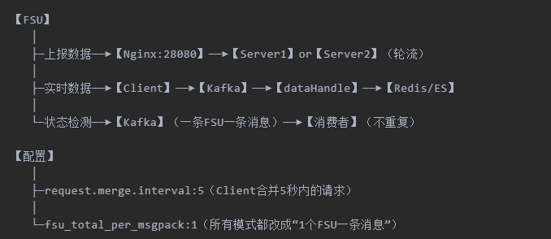
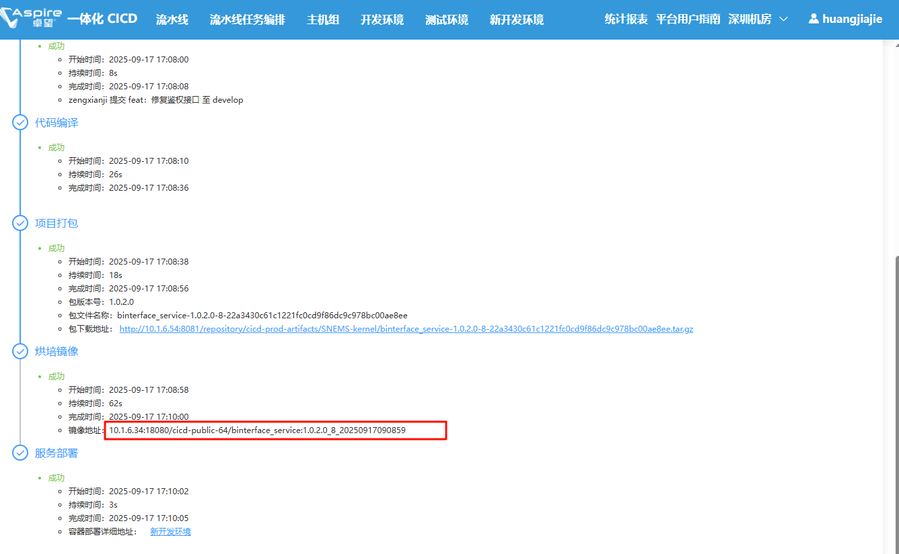
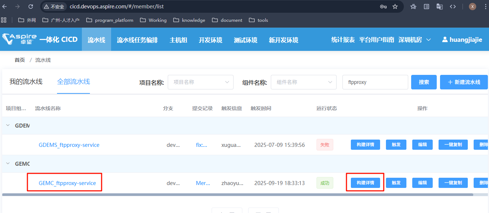
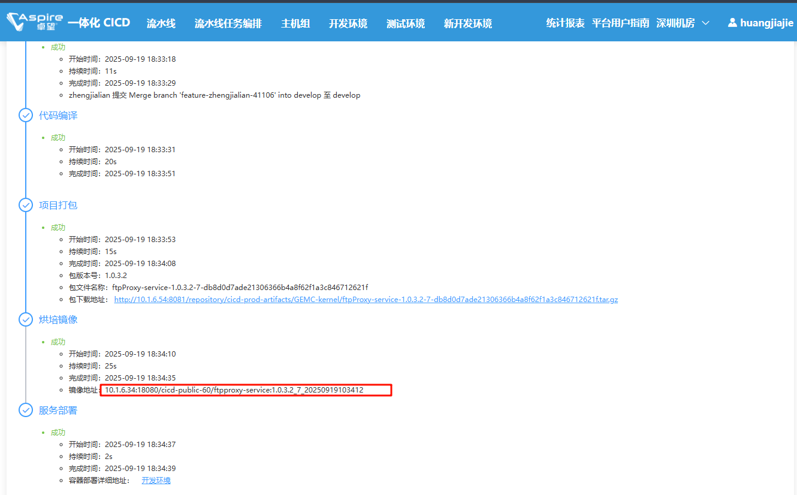
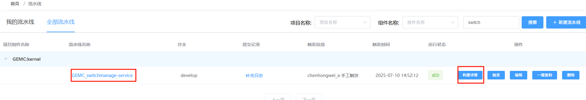
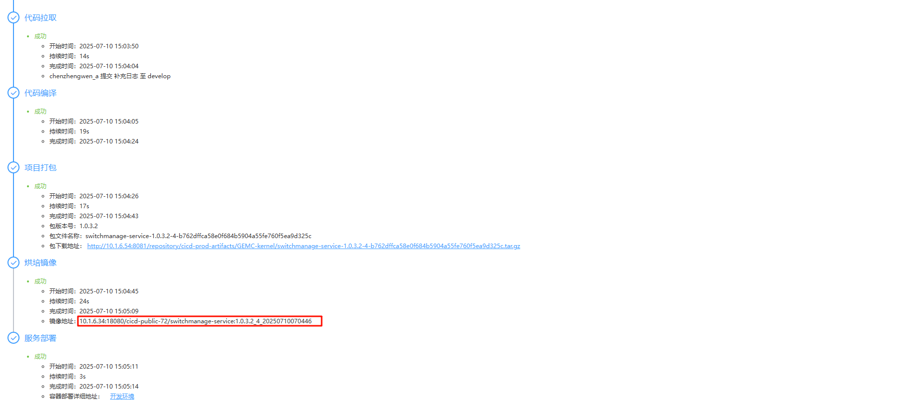
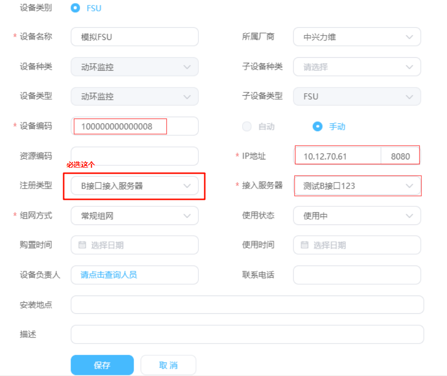

# 前提事项

```
  511  ps -ef | grep kafka
  512  cd /opt/docker
  513  ll
  514  cd common/
  515  cd kafka/
  516  ll
  517  cd zookeeper-3.4.10/
  518  ps -ef | grep zookeeper
  519  ll
  520  cd data/
  521  cd ..
  522  rm -rf data/
  
  492  cd /etc/docker
  493  ll
  494  vi daemon.json
  514  cd common/
  515  cd kafka/
  517  cd zookeeper-3.4.10/
  518  ps -ef | grep zookeeper
  520  cd data/
  521  cd ..
  522  rm -rf data/
  527  mkdir data
  528  ll
  529  cd conf/
  530  vim zoo.cfg
  531  cd ../bin/
  532  sh zkServer.sh start
  
  533  ps -ef | grep zookeeper.out
  534  ps -ef | grep zookeeper
  535  cd ../data/
  536  jps -ml
  537  ps -ef | grep zookeeper
  538  cd ../..
  539  cd kafka_2.11-0.11.0.0/
  540  cd logs/
  541  cd ..
  542  rm -rf logs/
  543  ll
  544  mkdir logs
  545  cd config/
  546  ll
  547  vim server.properties
  548  cd ..
  549  rm -rf kafka-logs/
  550  ll
  551  cat start.sh
  552  cd bin/
  553  ll
  554  ./kafka-server-start.sh ../config/server.properties &
  555  java --version
  556  java -version
  557  cd /usr/local/
  558  mkdir jdk
  559  ll
  560  cd jdk/
  561  mv /home/sudoroot/jdk-8u181-linux-x64.tar.gz  .
  562  ll
  563  tar -zxvf jdk-8u181-linux-x64.tar.gz
  564  ll
  565  rm -rf jdk-8u181-linux-x64.tar.gz
  566  ll
  567  vim /etc/profile
  568  source /etc/profile
  569  java -version
  570  cd /home/sudoroot/
  571  ll
  572  rm -rf kafka_2.11-0.11.0.0.tar.gz
  573  ll
  574  cd /opt/docker/common/
  575  cd kafka/
  576  ps -ef | grep kafka
  577  cd kafka_2.11-0.11.0.0/bin/
  578  ./kafka-server-start.sh ../config/server.properties &
  579  cd ../
  580  cd ..
  581  cd zookeeper-3.4.10/
  582  ll
  583  cd bin/
  584  sh zkServer.sh start
  585  ps -ef | grep zookeeper
  586  cd ../../kafka_2.11-0.11.0.0/bin/
  587  ./kafka-server-start.sh ../config/server.properties &
  588  ps -ef | grep kafka
  589  docker ps
  590  docker logs bcfff
  591  docker logs -f --tail 200 bcfff
  592  pwd
  593  cd ../..
  594  ll
  595  rm -rf zookeeper-3.4.10.tar.gz
  
  
  798  cat /etc/docker/daemon.json
  799  tar -zcvf /home/sudoroot/kafka.tar.gz /opt/docker/common/
  800  scp /home/sudoroot/kafka.tar.gz sudoroot@10.1.4.194:/opt/docker
  801  scp /home/sudoroot/kafka.tar.gz sudoroot@10.1.4.194:/home/sudoroot
```

```
  644  yum -y install gcc pcre-devel zlib-devel openssl openssl-devel
  645  mv /home/sudoroot/nginx-1.21.6.tar.gz /usr/local/
  646  cd /usr/local/
  647  tar -zxvf nginx-1.21.6.tar.gz -C /usr/local/nginx
  648  mkdir nginx
  649  ll
  650  tar -zxvf nginx-1.21.6.tar.gz -C /usr/local/nginx
  651  cd /usr/local/nginx/nginx-1.21.6
  652  ./configure --prefix=/usr/local/nginx
  653  make && make install
  654  cd /usr/local/nginx/sbin
  655  ./nginx -v
  656  ps -ef | grep nginx
  657  ./nginx
  658  vim ../conf/nginx.conf
  659  cd ../conf/
  660  ll
  661  cp nginx.conf /home/sudoroot/
  662  rm -rf /home/sudoroot/nginx.conf
  663  ll
  664  mv /home/sudoroot/nginx.conf .
  665  ll
  666  cd ../sbin/
  667  ./nginx -s reload
```


## 前提了解

```
B接口服务分布
	1、B接口拆分成 client, server, dataHandle 三种启动模式
	
	client端的职责【页面会每10s进行current接口请求 - 下发到B接口，B接口向fsu】：
		接收上层的请求（比如currentmonitor调用的获取实时数据，下发指令），并完成向FSU的请求。
	server端的职责【其实就是接口数据的上传，到B接口进行处理显示到页面啥的】：
		接收FSU上报的数据，比如注册数据，配置数据，告警数据等
	dataHandle端的职责：
		完成数据持久化。
		比如：
			从client端收到FSU报上来的实时数据后，
			client端把数据转发到kafka, 
			再由dataHandle端监听并消费kafka的数据，并完成入库（写redis, ES）
```


```
原来“一堆FSU挤在一起干活”
现在“一个一个排队，谁干完谁再领新任务”，并且“加个中间人（Nginx）分流，避免一个人累死”
```



| 角色           | 原来怎么做                      | 现在怎么做                                                   | 记住关键词       |
| -------------- | ------------------------------- | ------------------------------------------------------------ | ---------------- |
| **Client**     | 每来一个请求就去找FSU，瞬间爆炸 | 5秒内的请求合并成1次，结果扔Kafka<br />（消费者：dataHandle） | **“合并请求”**   |
| **Server**     | 1个节点扛4000个FSU，CPU哭       | Nginx做“门卫”，轮流分给2+节点                                | **“分流”**       |
| **dataHandle** | 定时任务一次塞150个FSU，卡死    | 1个FSU一条消息，干完再领                                     | **“单线程排队”** |

```
client
	client端并不直接处理数据
		1、调用“v1/currentmonitor/getMeasureVal”接口，查看指令合并情况
		2、N秒是可配置项，对应的配置项是：request.merge.interval:5    【nacos的binter配置文件中】
		3、合并就是多交请求共用一次的结果（5秒内请求过，不请求，返回的数据在5秒内，不请求）
		
    
dataHandle（定时任务-fsu状态检测）
	B接口内部的定时任务之一：
		FSU状态检查，即每5分钟向所有的FSU发起一次状态检查
        之前的做法：
            把所有的FSU加载到内存，然后按150个FSU一个包，放到KAFKA里面
            再由消费者完成KAFKA状态检测工作
        修改之后：
            1）改为一个FSU一条消息推到kafka
            2）如果当前有正在处理中的FSU，则不重复推到kafka里面，避免无用的状态检测请求。 
            3）定时任务包的大小配置：fsu_total_per_msgpack:1 （ms-binterface-prod.yml 中配置）
            4）添加判断当前是否有正在检测中的FSU，如果有，则不重复添加。
            5）其它逻辑不变
            定时任务-历史数据同步等任务
                时任务分发改造为1个fsu对应一个 B接口的任务包大小都是同一个配置项
                1）定时任务包的大小配置：fsu_total_per_msgpack:1 
                    （ms-binterface-prod.yml 中进行配置）
     kafka消费实时数据响应结果 新增，消费持久化 
     	1）获取设备实时数据时，CLIENT端和FSU进行交互，FSU把设备测点数据响应给CLIENT端
     	2）CLIENT端对测点数据并不直接操作，而是把接收到的数据推到KAFKA
     	3）data 模式的B接口监听KAFKA主题，然后消费数据，并解析入库（写redis, ES）
     	
        	


server FSU数据上报 
    1）之前只有一个B接口节点接收超过4000个FSU上报的数据，节点性能出现瓶颈，
    2）现使用2个或以上的节点进行接收FSU数据上报
    	3）需要接入Nginx进行代理
    	4）FSU配置上报的地址为 Nginx监听的地址。 
    		1、在ng监听28080端口，FSU把数据上报，先通过NG的 28080端口，
    			然后再由NG路由颁发给两个server 模式启动的B接口
			2、通过上报注册数据 / 配置数据，可看到路由到2个 server模式的B接口


指令下发 
	1）client端的B接口接收指令下发，其它模式的按理不接收上层请求。
```


## 文件准备

```
广东为例
 
文件准备
	B接口镜像选择【目前有GEMC - 即广东的，SNEMS - 即陕西的】
		
	

文件部署注意事项
	需要吧一个binter镜像拆分成三个子节点
	还需要有一个ftp的镜像
	然后kafka，可以重启，或是连已有的【怎么连？ - 配置文件里面吗？】
	然后ng代理配置
		需要找到ng对应位置，参考已有的b接口的ng配置是怎么样的
		ps -ef|grep nginx
		
		


在10.1.4.193启动【测性能时，需要单独在一个服务器里面搞】
	部署前准备内容【除了前面四个是容器，后面两个是直接运行在虚拟机无需建立容器】
		binterface-service-server-p1、
		binterface-service-client-p1、
		binterface-service-data-p1、
		ftpproxy-service-p1、
		switch、
		kafka、
		zookeeper
		
然后模拟器config.py配置
	可以把b接口的ip换成  【cicd对应接口服务的node】
	
当时改了最新包
talnet   【直接在cicd的终端就可以】
```


- **B接口镜像选择【目前有GEMC - 即广东的，SNEMS - 即陕西的】**
  - 通过进入CICD、流水线搜索binter
  - 选择对应环境B接口【通过流水线名称跳转；或构建详情跳转】即可查看对应镜像
  - 同时注意：需要把端口改成8080
  - 
- **ftpproxy镜像选择**
  - 
  - 

- **switch镜像选择**
  - 
  - 

- **kafka**
  - 先查询是否已有kafka【ps -ef | grep kafka】，如果有，用现有的

- **nginx**
  - 先查询是否已有nginx【ps -ef | grep nginx】，如果有，用现有的
- nacos配置文件


## 服务部署

**B接口服务部署**

```
服务启动
    docker save -o /home/sudoroot/new_binterface.tar cd0d7839534d
    scp -r /home/sudoroot/new_binterface.tar sudoroot@10.12.12.184:/home/sudoroot/new_binterface
    docker load -i /home/sudoroot/new_binterface/new_binterface.tar
    docker tag cd0d7839534d binterface-service
```

```
B接口启动脚本 (CLIENT模式）

	docker run --name binterface-service-client-p1 --net host  --log-driver=json-file --log-opt max-size=30m --log-opt max-file=3 --env SERVER_PORT=18181 --env ENV_EUREKA=http://10.12.12.184:8761/eureka/ --env spring.cloud.inetutils.preferred-networks=10.12.12.186 --env ENV_CONFIG_IP=10.12.12.184 --env ENV_CONFIG_PORT =18888 --env ENV_TYPE=prod --env RUN_MODE=client  -v /tmp/logs/binterface-service-new:/opt/data/logs/ -d binterface-service:latest
	
	

  docker run --name binterface-service --net host --log-driver=json-file --log-opt max-size=30m --log-opt max-file=3 --env ENV_NACOS=10.1.203.120:8848 --env ENV_TYPE=gdems-dev  --env ENV_APP_NAME=gdems-binterface  --env ENV_NACOS_PASSWORD='D&V2HR43TutFjf%aKqk'  --env RUN_MODE=client  --env SERVER_PORT=18081 --env APPLICATION_NAME=binterface-service -v /tmp/logs/binterface-service-client:/opt/data/logs/ -d 10.1.6.34:8080/cicd-public-49/binterface-service:1.0.3.2_48_20250910075431

```

```
B接口启动脚本 (SERVER模式 或 DATA）

	docker run --name binterface-service-dataHandle-p1 --net host  --log-driver=json-file --log-opt max-size=30m --log-opt max-file=3 --env SERVER_PORT=18185 --env ENV_EUREKA=http://10.12.12.184:8761/eureka/ --env spring.cloud.inetutils.preferred-networks=10.12.12.186 --env ENV_CONFIG_IP=10.12.12.184 --env ENV_CONFIG_PORT=18888 --env ENV_TYPE=prod --env RUN_MODE=dataHandle --env APPLICATION_NAME=binterface-service-dataHandle  -v /tmp/logs/binterface-service-new:/opt/data/logs/ -d binterface-service:latest
	
	
	
		docker run --name binterface-service-server --net host --log-driver=json-file --log-opt max-size=30m --log-opt max-file=3 --env ENV_NACOS=10.1.203.120:8848 --env ENV_TYPE=gdems-dev  --env ENV_APP_NAME=gdems-binterface --env ENV_NACOS_PASSWORD='D&V2HR43TutFjf%aKqk'  --env RUN_MODE=server --env SERVER_PORT=18083 --env APPLICATION_NAME=binterface-service-server -v /tmp/logs/binterface-service-server:/opt/data/logs/ -d 10.1.6.34:8080/cicd-public-49/binterface-service:1.0.3.2_48_20250910075431
		docker run --name binterface-service-data --net host --log-driver=json-file --log-opt max-size=30m --log-opt max-file=3 --env ENV_NACOS=10.1.203.120:8848 --env ENV_TYPE=gdems-dev  --env ENV_APP_NAME=gdems-binterface  --env ENV_NACOS_PASSWORD='D&V2HR43TutFjf%aKqk'  --env RUN_MODE=dataHandle --env SERVER_PORT=18085 --env APPLICATION_NAME=binterface-service-data -v /tmp/logs/binterface-service-data:/opt/data/logs/ -d 10.1.6.34:8080/cicd-public-49/binterface-service:1.0.3.2_48_20250910075431
```

```
| 启动模式-节点 | 端口 | RUN_MODE |
| —————— | —————— | —————— |
| client-p1 | 18081 | client |
| client-p2 | 18082 |client |
| server-p1 | 18083 | server |
| server-p2 | 18084 | server |
| datahandle-p1 | 18085 | datahandle |
| datahandle-p2 | 18086 |datahandle|
```

**ftpproxy服务部署**

```
	docker run --name ftpproxy-service-p1 --net host --log-driver=json-file --log-opt max-size=30m --log-opt max-file=3 --env ENV_NACOS=10.1.203.120:8848 --env ENV_TYPE=gdems-dev --env ENV_APP_NAME=ftpproxy --env ENV_NACOS_PASSWORD='D&V2HR43TutFjf%aKqk' -v /tmp/logs/ftpproxy-service:/opt/data/logs/ -d  10.1.6.34:8080/cicd-public-60/ftpproxy-service:1.0.3.2_5_20250710070932


```

**switch服务部署**

```
	docker run --name switchmanage-service-p1 --net host --log-driver=json-file --log-opt max-size=30m --log-opt max-file=3 --env ENV_NACOS=10.1.203.120:8848 --env ENV_TYPE=gdems-dev --env ENV_APP_NAME=switchmanage --env ENV_NACOS_PASSWORD='D&V2HR43TutFjf%aKqk' -v /tmp/logs/switchmanage-service:/opt/data/logs/ -d  10.1.6.34:8080/cicd-public-72/switchmanage-service:1.0.3.2_4_20250710070446
```


# 接入步骤

其余的慢慢补充

## 设备创建

```
在空间中新增机楼/机房/设备
	设备名称
	设备编码：fsu id
	ip地址：fsu模拟器
	接入服务器：即【t_cfg_device,t_cfg_nmsdevice --> 创建出来的B接口对应】  -- 还需理清楚
		其实就是让现有的fsu设备 - 有对应的nms的代理服务和端口
		目前的代理接口 - 即nginx方向代理，在10.1.5.109:8086
		【所谓的接入服务器，好像就是在这一步实现的】
	注册类型：B接口接入服务器 【广东是必选的，上海好像也要？】
	组网方式：常规组网
```


