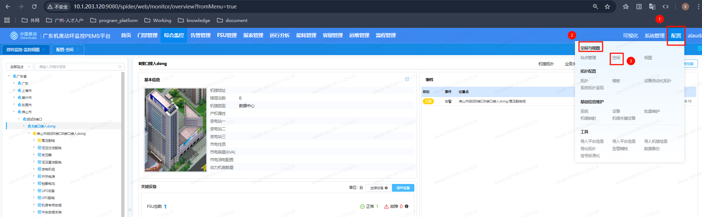
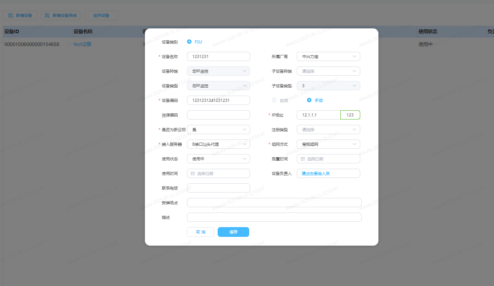

```
前提说明：
	B接口（server，data，client均已部署  -- 即容器部署）
	kafka，zookeeper（均已配置好 --  即服务器内已启动，有对应端口）
	
注意：
	下面的（）步骤可以随意调换顺序
```

# 第一步：页面建立FSU

```
概念理解：
	动环系统有区域、站点、机楼、机房的概念
	区域：省、市、区
	站点：一般在区域下，有数据中心、通信机楼（核心机楼），传输节点、通信基站
	楼栋：一般只有数据中心会有
	机房：下面存放设备


操作步骤：
    1、进入对应动环系统
    2、进到【配置 - 空间与视图 - 空间】 每个环境可能名字有点偏差
    3、创建站点，或在已有站点下建立、或者建立全新的区域，并在机房层级下建立设备
    4、新增设备时候需要注意字段，即新增成功后注意字段
        新增时：
            设备名称：
            	任意取
            设备编码：
            	任意取，fsu_id 或者说是device_code [与之关联表 - t_cfg_device,t_cfg_fsu]
            ip地址：
            	为FSU模拟器所在服务器ip，和所执行的程序端口【端口不能重复不然写入不了】
            	需要创建后，到对应环境spider库里的t_cfg_fsu修改端口号
            是否为新企业：
            	任意
            接入服务器：
                为接入服务的相关配置【这个很重要单独将，以及它是怎么关联的】
                广东的接入时必须选择【B接口汕头代理】
                [会将接入服务器的private_service_addr，http_port作为对应设备fsu表里的代理]
            组网方式：
            	一般常规组网
        新增后：
            设备ID：device_id [与之关联表 - t_cfg_device,t_cfg_fsu]
         
	5、创建成功后会自动生成对应表
		t_cfg_device
			access_device_id 
					为接入服务器的设备id
					[用于映射到接入服务的t_cfg_device和t_cfg_nmsdevice]
		t_cfg_fsu
			[http_proxy_url 为 接入服务器的private_service_addr，http_port]
			
			
近一步描述【待确认】：
	1、创建设备后会生成t_cfg_device,t_cfg_fsu
	2、t_cfg_device会根据access_device_id，关联到接入的服务器信息【可以在这里改动对应服务】
	3、t_cfg_fsu会根据device_id，找到access_device_id，获取到代理ip和端口


下面以广东为例【在已有区域下创建】
```





```
请求参数如下：

{
  "precinctId": "01-01-08-04-14-01",
  "deviceId": "",
  "deviceName": "test设备",
  "manufacturerId": "1617",
  "deviceKind": "13",
  "subDeviceKind": "",
  "deviceType": "76",
  "subDeviceType": "3",
  "deviceCode": "123334123123123",
  "resourceCode": "",
  "address": "12.2.2.1",
  "listenPort": 123,
  "newVersion": 1,
  "proxyFlag": 1,
  "registerServer": "",
  "accessDeviceId": "00001006000001531582",
  "netType": "0",
  "deviceUseState": "1",
  "devicePrincipal": "",
  "leaderPhone": "OLweh6O6d5Ej2RbXEr36iQ==",
  "installSite": "",
  "description": "",
  "namespace": "alauda"
}

关键解析字段：
	accessDeviceId：
		这个设备号就是上面的接入服务器
		通过这个设备id匹配到t_cfg_device和t_cfg_nmsdevice表【fsu里面是没有的】
		
	衔接上文【接入服务器选项的重要性】
		这里决定能否成功接入模拟器
		1、选择对应的服务器【如果是广东接入B接口的话，那么新增fsu的时候需要选B接口汕头代理】
		2、如果页面没有对应的接入服务器选项【或者接入服务器不满足】就需要手动插入
		
```

```
插入下面两个表
解析【重要字段】：
	t_cfg_device表
		lsc_id:为1即可[需要确认与nacos配置是否有关系]
		deviceid：00001006000000153697【或者是满足位数且格式相识应该也行？】
		device_name:任意取名
		precinct_id:所在机房id
		device_type:76【必须是76？】
		sub_device_type:3【】
		device_code:任意【即fsu_id】
		province_id:102【省份id，具体是否跟naco配置有关？】
		其余的跟里面的一致就行了
	t_cfg_nmsdevice表
		device_id:与上面的一致
		service_addr：127.0.0.1【这里不知道是什么，数据库？】
		service_port：3306【这里不知道是什么，数据库端口？】
		private_service_addr：10.1.5.109【nginx部署的IP、用于反向代理请求 -- 广东目前是这个】
		http_port：8086【nginx部署的服务里，程序对应端口、用于反向代理请求】
		nms_type:101【北向类型，好像跟nacos相关的？】
		
		

表1：
INSERT INTO `t_cfg_device` (`lsc_id`, `device_id`, `device_name`, `precinct_id`, `device_index`, `device_cid`, `isdel`, `device_model`, `device_kind`, 
`sub_device_kind`, `device_type`, `sub_device_type`, `belong_device_id`, `device_code`, `manufacturer_id`, `device_use_state`, 
`purchase_time`, `use_time`, `use_years`, `update_time`, `install_site`, `device_principal`, `x`, `y`, `manufacturer_name`, `description`, 
`version`, `locate_ne_status`, `resource_code`, `leader_phone`, `resource_origin`, `resource_name`, `index_seq`, `use_end_time`, `rated_power`, 
`load_power`, `device_mark`, `unit`, `rectifierModuleNumber`, `singleModuleRatedCurrent`, `province_index`, `related_rackpos`, `access_type`, 
`actual_start_time`, `join`) VALUES ('100012340101', '00001006000000153697', '上海定制-fsu', 
'01-01-07-03-05-02', 1, NULL, 000, NULL, 13, NULL, 76, 3, NULL, '265224658376469', 
1617, 1, NULL, NULL, NULL, '2023-01-04 19:54:25', NULL, NULL, NULL, NULL, NULL, NULL, NULL, NULL, NULL, NULL, NULL, NULL, 
7012673, NULL, NULL, NULL, NULL, NULL, 0, 0, 102, NULL, NULL, NULL, NULL);


表2：
INSERT INTO t_cfg_nmsdevice
(device_id, service_addr, service_port, up_server_id, web_page, login_state, sip_port, private_service_addr, subnetmask, gateway, rtsp_port, http_port, icpu_summit, imem_summit, isend_summit, irecv_summit, nms_type)
VALUES('00001006000000154147', '127.0.0.1', 3306, NULL, NULL, NULL, NULL, '10.1.203.121', NULL, NULL, NULL, 8099, NULL, NULL, NULL, NULL, 101);
```


# 第二步：数据写入

```

```


# 第三步：上报注册

```

```


