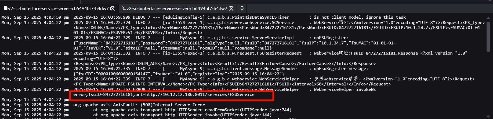
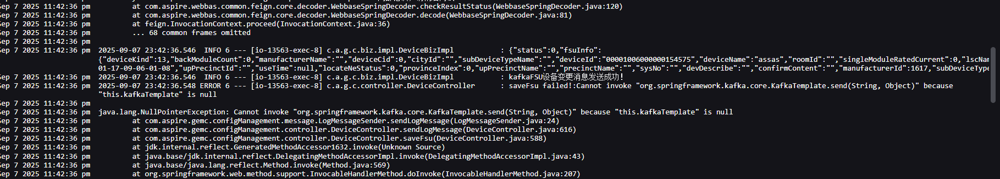

# 01_问题集合

## B接口（fsu）无数据无法推送告警

```
问题分析：
	已经在fsu模拟器里看日志、日志显示数据是有显示、且发送过去
	也检查过binter接口服务、看到出现连接失败情况 -- 连接es失败
		目前发现是kafka出问题、挂了，因此需要重启【kafka】
		首先考虑这两个方向
		
问题排查恢复：
	1、nacos检查对应环境下kafka和redis是否没有启动【即C接口相关的kafka和redis -- 对应环境】
	2、重启kafka和redis服务
```


## B接口（fsu）创建前提页面空白

```
问题分析：
    页面创建时
        普通用户看不到站点信息，需要alauda才看得到
            这个还不知道，目测可能是重启config应该就能好
        在设备创建的时候，代理选项不见了【代理选择，导致发起的请求有问题 -- 在对应B接口服务里面，service服务里面看日志】
            还要看表里面，忘记是那个表了【】
            目前自己排查可能是代理的问题

问题排查：
	1、查看B接口和fsu模拟器的服务器【看日志中有哪些异常】
	2、查看动环表的设备表、fsu、测点表之类的；中间库的fsu、设备等表【fsu等之类的关系是否一致】
	3、查看动环表的相关表的ip和端口配置是否正确
	4、查看fsu的config中的配置是否一致【B接口的端口、数据库的链接是否一致 -- 即与所属环境一致】
	4、待补充
```


## B接口（fsu）500报错

```
问题分析：
	fsu启动不了(500: Internal Server Error的错误)
		可以看日志
			目前看到日志好像是B接口挂了、发不过去
			刷新后可以了
			好像是fsu中连不上b接口好像，请求超时
			
问题排查恢复：
	1、可以重启下fsu服务器
	2、可以等一会，就会自动恢复正常
```


## B接口（fsu）页面接口400错误

```
问题分析：
	目前上海的实时监控为例
		普通用户进去后，接口current返回的是400，无权限问题
		alauda进去却可以看


问题排查恢复：
	目前还没有恢复策略，可能需要开发去看一下
```


## B接口（fsu）服务中断

```
问题分析：
	以上海为例，目前实时监控一直触发的fsu中断信息


问题排查恢复：
	方法1（目前无法恢复）：
		多次上报注册没反应
		因此删除了fsu里面的model，重启服务，再重新上报注册
		SELECT * FROM t_cfg_fsu WHERE fsu_origin_code = '847272716181';
		SELECT * FROM t_cfg_nmsdevice WHERE device_id = '00001006000001531549';
		SELECT * FROM t_cfg_device WHERE device_id = '00001006000000154147';
```


## B接口（fsu）多节点排查

```
问题分析：
	目前（广东还是陕西来着）是拆分成【data、client、server三个子节点】
	目前上海分，data、server、server-server
	

问题排查恢复：
	目前排查看的是server，但是其他两个不知道需不需要看
```


## B接口（fsu）现有系统引用关系

```
问题分析：
	广东目前是需要通过代理进行B接口的连接【在数据库表中设置 t_cfg_nmsdevice】
		fsu模拟器通过代理回应B接口【B接口会看到fsu通过代理请求的url】，进行上报注册


问题排查：
	目前上海和广东的fsu都是用的同一个B接口【那么也就是上海的也需要用对应的代理？】
		
```


## B接口（fsu）系统区别

```
广东的8680，性能测试的时候，说是要在8680里面创建，才有数据 -- 需要用gd的数据库
那为什么还有9080，9081呢
```


## B接口（fsu）代理检测

```
注意：
	广东的B接口是需要涉及到代理【即nginx的反向代理】

    1、检测t_cfg_device中的access_device_id字段
    2、通过access_device_id字段的值，到t_cfg_nmsdevice表里面
            查看 【看private_service_addr，http_port是否正确】  -- 目前是113上面的nginx反向代理
    3、如果不需要代理的情况【目前上海不知道需不需要，广东是要的】
            1、先到创建的设备，对应的t_cfg_device表，把ftp_proxy和http_proxy_url设置为null
            2、通过access_device_id字段的值，到t_cfg_nmsdevice表里面
            3、把对应private_service_addr，http_port清除

如果涉及到代理问题
	代理如果错误，就会出现invokews错误,因为webservice(soap)请求过不去代理那边
```




## B接口（fsu）数据写入位置错误

```
问题：
	如果写入的时候写入错的信息如何排查
	如果已经写了的情况下，还需要再写入吗，还是直接改配置就可以用【针对同个数据库和中间库】
	
	
解答：
	如果写入错的信息，那么就根据fsuid,到中间库几个表里面查看,查看对应fsuid的设备id或测点信息是否一致
	如果对应fsu已经写入,那么久不需要再次写入,只要增加新增的即可
```


## B接口（fsu）重启后校验

```
说明：
	1、需要到B接口服务器里面talnet看能不能连同自己的fsu模拟器,同时确保B接口能telnet通kafka和redis（在对应环境的nacos配置里面即可查看）
	2、检测cicd中或是docker部署的 B接口的镜像是不是最新的【在gemc里面的binter-server拿 - 这块要确认下 -- 广东和上海目前都是】
```


## B接口（fsu）模拟器配置修改影响

```
问题：
	我现在有一个fsu已经接入了某个设备
	然后这个fsu被改了B接口配置
	
	那我现在重新弄一个fsu，只需要改配置就可以直接使用吗
		说明1：
            1、是的,因为动环已经接入了B接口了【即数据库表的对应关系都已经建立了】
            2、然后模拟器只是作为一个被请求和发送者而已【只需要修改动环表中fsu的模拟器ip和端口,即可替换为新的模拟器 - 即新的被请求者】
            3、同时模拟器修改B接口配置【让新的模拟器可以把请求指向B接口,其余的无法再操作】
		
		说明2：
            1、因为动环数据库和数据库没有变化【如果不同的数据,那么就可能涉及到再次注册了】
            2、否则直接改t_cfg_fsu的原本设备对应的fsu模拟器ip和端口;模拟器里面，改新fsu的B接口配置即可
```


## B接口（fsu）B接口IP和端口查看

```
目前广东模拟器里面
	config配置里面的【与nacos不同，需要在rancher里面找】
		B接口ip从	v2-sc-binterface-service-server 的node
		端口的话是从v2-sc-binterface-service
		很奇怪不知道为什么
```


## B接口（fsu）B接口与模拟器端口开放

```
新建模拟器
	端口开放点：
		1、开放到本地是要的
		2、开放到redis,redis也给模拟器开放

B接口
	端口开放点：
		1、开放给fsu模拟器,kafka,redis,ftpproxy
		2、ftpproxy和redis和kafka也需要给B接口开放
		
注意：
	如果端口没有开放,就会出现对应问题
```




## B接口（fsu）注册上报成功数据为nan

```
注册成功，上报也成功
	但是进入页面后显示的设备都是nan
	但是以alauda进去却可以看到身份【重新配置下用户角色，资源这些 -- 有时候可能是权限配置改了，需要注意】
	

目前400错误
	是告警列表的问题,不是B接口的


解决问题：
	1、排查三个服务，即client、service、data这三个服务是否正的启动成功了
	2、查看自己连接的那个B接口是否与redis和kafka和ftpproxy是互通的
```


## B接口（fsu）同步时重复设备测点

```
问题：
	在数据准备写入时,对应fsuid的其余设备存在测点重复情况
	同步时,把对应设备测点也注入到了动环库,导致重复了
	
	
解决：
	1、多的直接删掉 - 在中间库删除和动环库 -- 需要确认好对应的设备[技巧：可以在监控视图找到对应接入的fsu下设备重复测点的设备id]
	2、到动环库删除对应的重复测点
	3、在根据对应fsuid到对应中间库,把重复的删除
	4、重启一下B接口,然后再次上报和注册


如果涉及到告警：
	那么需要先把alert_alerts:记录告警表,里面的东西删除
```


B接口（fsu）告警列表数据库

```
问题：
	fsu模拟器发送告警后,页面无显示告警信息,但是告警是成功发送的

排查：
	接口提示的权限问题
```

