# 01前置梳理

```
基本原理（涉及B的client, server, dataHandle服务）

	B接口拆分成 client, server, dataHandle 三种启动模式
		- server：接收FSU上报的数据，比如注册数据，配置数据，告警数据等
		- client：接收上层的请求（比如currentmonitor调用的获取实时数据，下发指令），并完成向FSU的请求
		- dataHandle端的职责：完成数据持久化。
			从client端收到FSU报上来的实时数据后，client端把数据转发到kafka, 再由dataHandle端监听并消费kafka的数据，并完成入库（写redis, ES）
        
        server FSU数据上报
        	使用2个或以上的节点进行接收FSU数据上报，需要接入Nginx进行代理
        	FSU配置上报的地址为 Nginx监听的地址
        	 	1、在ng监听28080端口，FSU把数据上报，先通过NG的 28080端口，然后再由NG路由颁发给两个server 模式启动的B接口
        	 	2、通过上报注册数据 / 配置数据，可看到路由到2个 server模式的B接口
        
        client 实时数据获取
            请求合并：合并n秒内的下发指令（接口请求和kafka都进行合并）
                kafka方式请求：合并n秒内的下发指令，并将响应结果打入kafka（消费者：dataHandle）
                client端并不直接处理数据。 
                    1、调用“v1/currentmonitor/getMeasureVal”接口，查看指令合并情况
                    2、N秒是可配置项，对应的配置项是：request.merge.interval:5
                    3、合并就是多条请求共用一次的结果（5秒内请求过，不请求，返回的数据在5秒内，不请求）
        
        定时任务-fsu状态检测
            B接口内部的定时任务之一（一个FSU一条消息推到kafka，当前有正在处理中的FSU，则不重复推到kafka里面）
                 1）定时任务包的大小配置：fsu_total_per_msgpack:1 （ms-binterface-prod.yml 中进行配置
                 2）添加判断当前是否有正在检测中的FSU，如果有，则不重复添加
                 3）其它逻辑不变
		
		dataHandle 定时任务-历史数据同步等任务 
			定时任务分发改造为1个fsu对应一个 B接口的任务包大小都是同一个配置项
				1）定时任务包的大小配置：fsu_total_per_msgpack:1 （ms-binterface-prod.yml 中进行配置）
				
		kafka消费实时数据响应结果（消费持久化）
			1）获取设备实时数据时，CLIENT端和FSU进行交互，FSU把设备测点数据响应给CLIENT端
			2）CLIENT端对测点数据并不直接操作，而是把接收到的数据推到KAFKA
			3）data 模式的B接口监听KAFKA主题，然后消费数据，并解析入库（写redis, ES）
				指令下发 1）client端的B接口接收指令下发，其它模式的按理不接收上层请求
				
		
        
        
性能监控采集优化（涉及到B-client和其他服务）
	此次改造功能为解决以下问题：
		（1）当发起大量的性能数据采集时，会对实时数据查询（监控视图）造成影响（大量请求后，实时监控是否正常回显不会受影响）
		（2）采集较慢或无法采集的设备会造成阻塞，导致积压，能够正常采集的设备也无法较快响应（满设备堵塞队列时，实时监控是否受影响）
	服务：
        1、currentMonitor（修改）
        2、datacollection（修改）
        3、distribute-service（新增）
        4、binterface-service-client（修改）
	配置（nacos）：
        1、currentMonitor
        	sendToDistribution: true   # 实时数据请求分发，将 kafka 请求分发到 distribute-service 服务，当为false的时候，走之前的逻辑
        2、datacollection
        	sendToDistribution: true  # 实时数据请求分发，将 kafka 请求分发到 distribute-service 服务，当为false的时候，走之前的逻辑
        	saveToEsViaKafka: true    # 之前datacollection服务采集是阻塞请求，现在改为走kafka异步处理
        	save.to.mysql: true       # 当 sendToDistribution=true的时候，数据会发送到kafka, 上海SC，会将采集的结果写到mysql
		3、distribute-service
			runMode: binterface     # distribute服务适用于B接口与C接口，以上海SC为例，采用的均是B接口，则如此配置，
	脚本：
		【测试环境已执行】https://gitsz1.aspirecn.com/spider/gemc/-/blob/develop_distribution/gemc/bin/dbscript/GEMC1.0.8.0/ddl/定时任务数据设备测点集合_ddl_20251120.sql

	主要逻辑与处理方式：
        1、对采集设备进行打标签处理，给设备打标识：快，慢，差
        2、新增采集调整策略（采集降级）
            当队列里面达到500个设备，不再接收 tag=差 的设备，即这类型设备将丢弃掉
            当队列里面达到700个设备，不再接收 tag=慢 的设备，即这类型设备将丢弃掉
            当队列里面达到1000个设备，不再接收定时采集任务，优先保证实时监控请求的任务
        3、快，慢，差计算标准：
            （1）快：采集快慢的标准是按项目时间需求来计算的（比如5分钟要完成2000个
           		那么快的标准就是： 5*60*1000 / 2000 = 150ms， 即150ms内完成数据采集的设备，就是快的设备）
            （2）慢：快 * (1~3)，介于快与差之间
            （3）差：> 快 * 3，即450ms
        4、重试机制：当出现采集慢的时候，等待采集的队列会被塞满，当队列满了，尝试5次（重试时间间隔：3s,10s,30s,1min,3min）如果都失败，放回原队列
        5、丢弃策略：当队列中等待设备>700，5分钟内采集过的设备，丢弃。
        6、请求合并：新请求的设备，如果此设备在采集队列中（因为前面堵塞，导致还没有下发请求，那应该将此设备进行请求合并）
        7、请求去重：在5秒内，重复请求的设备，去重处理，降低采集频率。


	测试范围：
        1、监控视图——设备实时数据查询（保证原有功能可用）
        2、实时数据报表——设备实时数据查询（保证原有功能可用）
        3、定时任务采集——正常采集，入库es（保证原有功能可用）
        4、采集降级——出现采集慢/不可用设备，就当对此部分设备进行降级处理，即无法采集/采集慢的设备不能影响其他正常采集速度的设备（新增）
        5、“主要逻辑与处理方式”中提及到的优化项
        
   
    测试方式：
    	【脚本在工具类中，副本fsu在note-fsu里面，数据的获取sql也在里面，性能脚本则在B接口性能采集服务中】
    	1、批量创建多个机房、设备，fsu【留一个备份fsu，在页面观察采集情况，其余的进行压力测试】
    	2、批量在服务器上面启动
    	3、构建数据 -> 执行压测脚本


优化3：
	目前kafka已经更新了，换了一个，因此需要重新部署currentmonitor
		kafka涉及topic
			spider_binterface_getPointDataRequest \ 
			spider_binterface_handlePointDataResponse
```


```
公共上游
	fsu上报注册 --> B的server节点
	
B接口走向（下游走向）
	旧：currentmonitor(实时监控下发) --> client --> fsu --> client --> dataHandle
	新：currentmonitor(实时监控下发) --> distribute --> client --> fsu --> client --> dataHandle

```


# 02FSU接入模式

```
注意：
	这种是建立在B接口以及建立好的情况（如果要自己搭建B接口整套服务，看另一个教程 -- 且要确保包的版本）	

	涉及表：
		t_cfg_precinct
		t_cfg_site
		t_cfg_device
		t_cfg_fsu
		t_cfg_nmsdevice
		t_cfg_metemodel
		t_cfg_metemodel_detail		(设备对应的测点有哪些)
		t_cfg_monitordevice     	(记录FSU下挂在的设备有哪些)


新国标接入（sim_fsu_newstandard）
	文件所在位置：SVN目录/spider-doc/public/08系统测试/05测试工具/simfsu_newstandard

接入前业务了解：
	动环系统（概念）：
		1、区域（省市区）、站点（数据中心、通信枢纽楼、传输节点、通信基站）、楼栋、机房、设备（设备id,设备所属测点模板）、测点（mete_id，signal_number）
		2、区域、站点、楼栋、机楼（统一都在t_cfg_precinct表，precinct_id唯一标识，然后precinct_kind用于分类是区域、站点还是楼栋等）
		3、站点还有单独site表(用作映射，site_id与precinct_id关联，用于区分站点类型)
		4、每个设备都有对应的测点模板（在fsu注册时会写入，如果没有测点模板，设备就没有对应测点）
		5、设备都很多种类型（通过t_cfg_dict 	col_name="devicet_type",可以查看）

以下为接入前准备操作步骤：
```

## 新增FSU

```
1、新增FSU（上海为例 -- 可以区域直接建到FSU，也可以直接最小层级机房下建立，这里以站点到FSU）：
	注意：一般页面新增最好用alauda账号
```

```
方式1：页面新增（一般用这种就可以了）
```

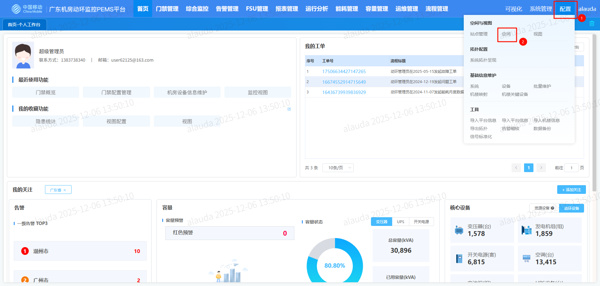

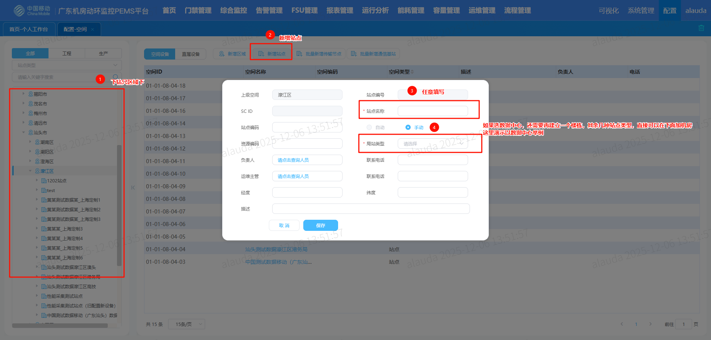

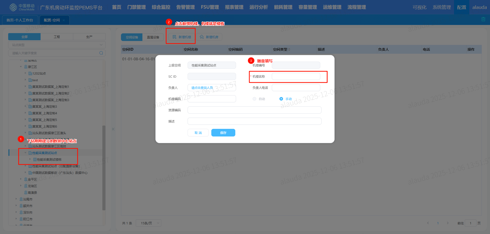

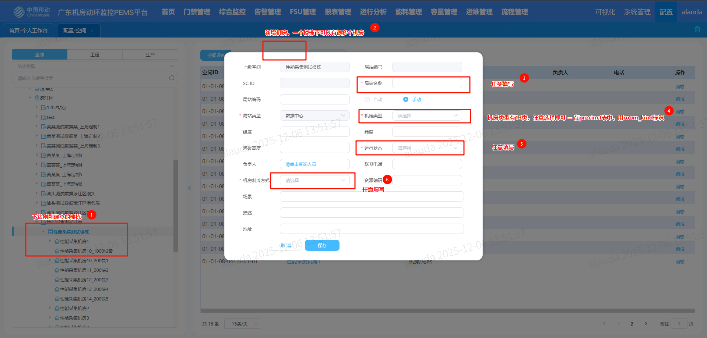

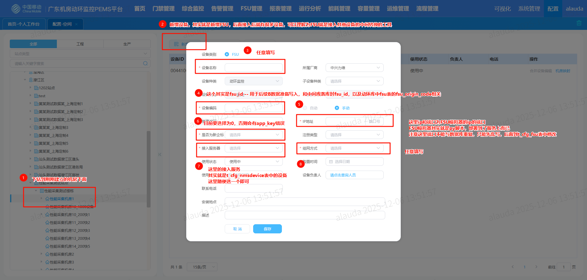

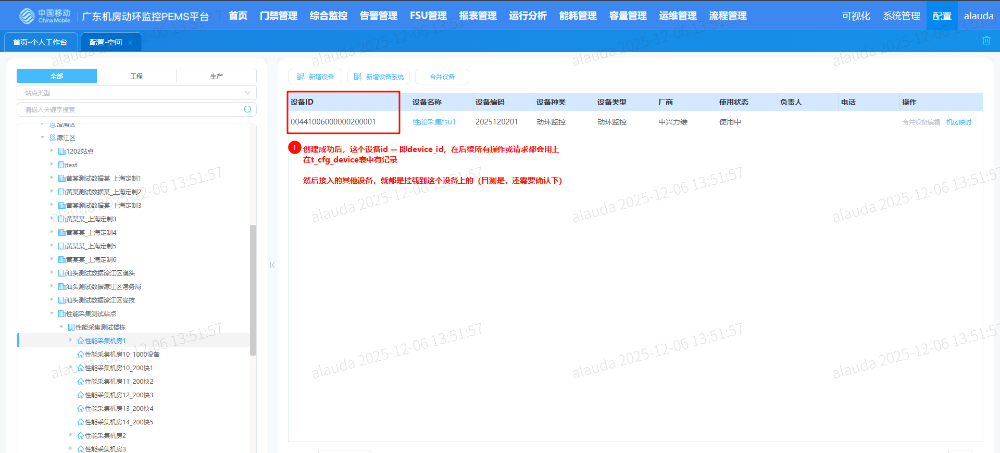

```
方式2：sql新增
```

```
1、如果站点和机房这些也建立不了，那也用数据库插入即可（涉及t_cfg_precinct和t_cfg_site表） -- 后续补充
2、接入的fsu插入（t_cfg_device,t_cfg_fsu,t_cfg_nmsdevice  -- 主要是devcie和fsu这两个  --device_id这些随意更改即可）  -- 后续补充

INSERT INTO `t_cfg_device` (`lsc_id`, `device_id`, `device_name`, `precinct_id`, `device_index`, `device_cid`, `isdel`, `device_model`, `device_kind`, 
`sub_device_kind`, `device_type`, `sub_device_type`, `belong_device_id`, `device_code`, `manufacturer_id`, `device_use_state`, 
`purchase_time`, `use_time`, `use_years`, `update_time`, `install_site`, `device_principal`, `x`, `y`, `manufacturer_name`, `description`, 
`version`, `locate_ne_status`, `resource_code`, `leader_phone`, `resource_origin`, `resource_name`, `index_seq`, `use_end_time`, `rated_power`, 
`load_power`, `device_mark`, `unit`, `rectifierModuleNumber`, `singleModuleRatedCurrent`, `province_index`, `related_rackpos`, `access_type`, 
`actual_start_time`, `join`) VALUES ('100012340101', '00001006000000153697', '上海定制-fsu', 
'01-01-07-03-05-02', 1, NULL, 000, NULL, 13, NULL, 76, 3, NULL, '265224658376469', 
1617, 1, NULL, NULL, NULL, '2023-01-04 19:54:25', NULL, NULL, NULL, NULL, NULL, NULL, NULL, NULL, NULL, NULL, NULL, NULL, 
7012673, NULL, NULL, NULL, NULL, NULL, 0, 0, 102, NULL, NULL, NULL, NULL);
```

## 修改FSU

```
新增成功后需要修改（通过页面的设备id，到t_cfg_fsu里面查找）
	1、FSU的ip和端口，确保与自己的FSU模拟器一致（address，listen_port）
	2、确保net_type模式为0（则不是新企标）
	3、access_device_id(这个好像在哪里涉及到，忘记了，需要补充)
	4、http_proxy_url,必须清空
	5、fsu_origin_code,必须与创建FSU时的设备编码一致
```

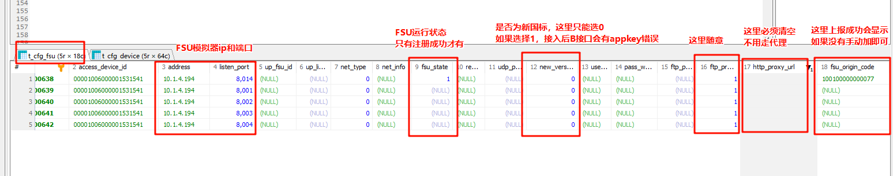

## 准备设备

```
准备文件（fsu_data.xlsx）
	文件所在位置：SVN目录/spider-doc/public/08系统测试/05测试工具/simfsu_newstandard/fsu_data.xlsx
	
	相当于把设备接入到FSU，然后每个设备都有对应的METE，每个mete有用不同的signal_number(即一个设备存在多个同测点，但是通道号是不同的)
	fsu
		devcie
			mete
			
	注意：
		可以新增多个FSU，
		每个FSU下同种类型的设备可以有多个（只要确保设备ID唯一即可，可以自己修改） -- (不同fsu，即使彼此设备相同也不影响，因为上级fsu不同)
		每个设备可以有多个测点（只要确保signal中，每个设备id都有对应测点即可，需要自己添加）
```

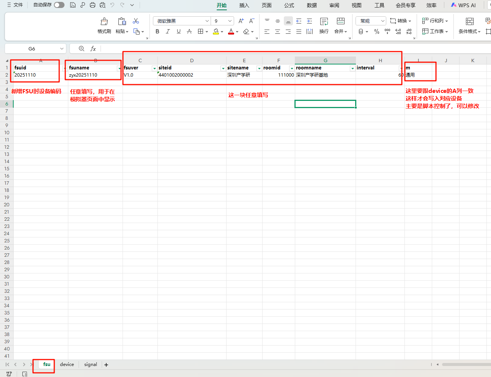

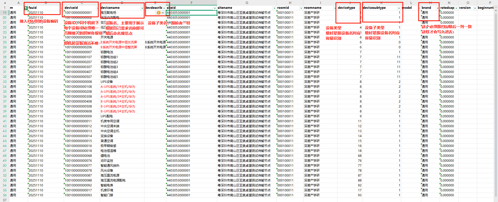

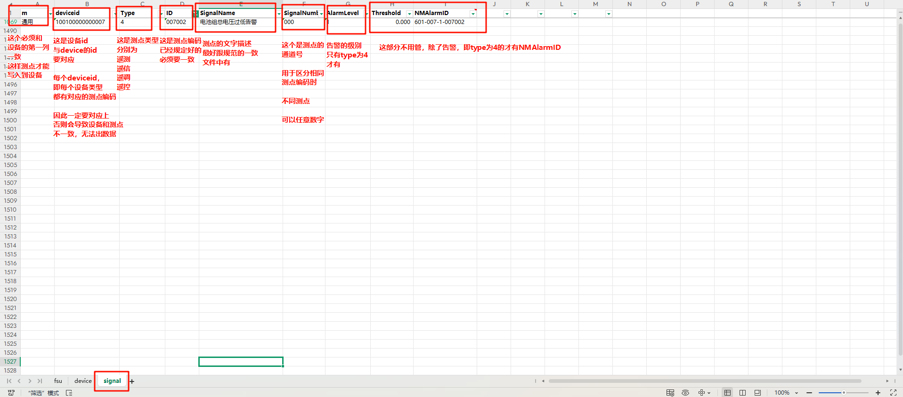

## 写入设备

```
执行脚本（数据准备.py）
	文件所在位置：SVN目录/spider-doc/public/08系统测试/05测试工具/simfsu_newstandard/数据准备.py
	文件所在位置：SVN目录/spider-doc/public/08系统测试/05测试工具/simfsu_newstandard/config.py
	
	执行成功后
		FSU sheet页会写入到  中间库中的 FSU表
		DEVICE sheet页会写入到  中间库中的 device表
		SIGNAL sheet页会写入到  中间库中的 signal表
```

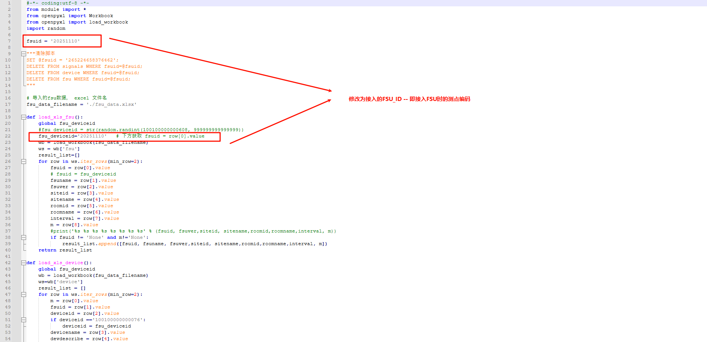


## 检测FSU

```
1、上述操作完之后，需要到服务器中，检测FSU模拟器指向的B接口（B-server-server也叫B-server，即接收注册那个节点）是否是需要的B接口
	以上海来说，目前B-server有两个（server-server和server-server-stax  -- 均启在cicd上）  -- ip和端口则是node_ip
	目前10.1.4.194上的模拟器指向的是server-server
	
	如果是cicd接入的，那么要到cicd中，找到服务，然后看他的node_id(或是进入rancher找 --这里以cicd为例)
	如果是服务器启的，那么直接到服务器上看即可
```

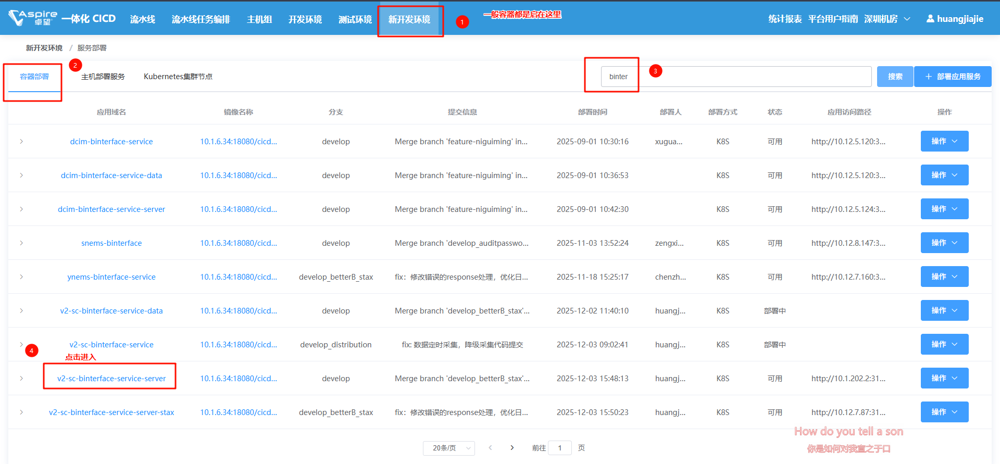

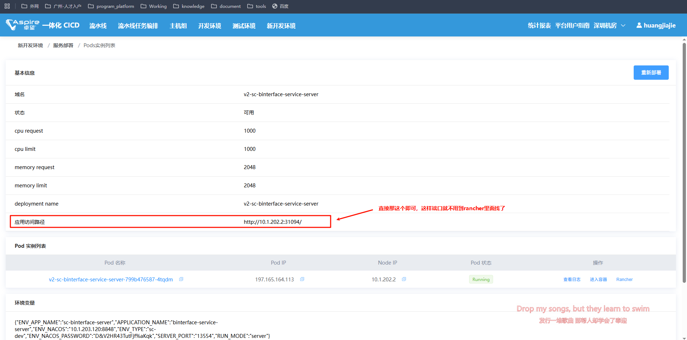

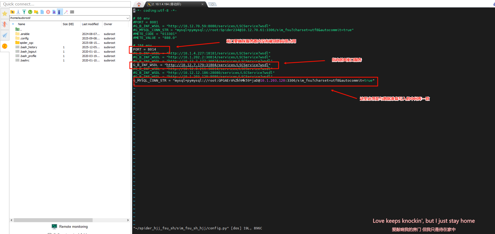

## 注册FSU

```
1、首先要只要部署的FSU在哪个服务上，其次要确保服务器已经给当前电脑开了白名单
	上海FSU目前部署在10.1.4.193和10.1.4.194上，端口为8000 -8014都有（密码在脚本里面有写）
	白名单添加：
		sudo -i进入超管
		vi /etc/sysconfig/iptables [然后根据里面已有的进行修改即可]
		systemctl restart iptables 

2、页面输入IP和端口，访问页面的FSU模拟器
	通过注册时的测点编码或是FSU设备名，搜索到，然后点击上报（这时候会把FSU这个设备，注册到redis里，还会写入到KAFKA中）
	紧接着执行上报配置（这个时候，会把FSU下所有的设备信息和测点正式注册到动环中，动环监控视图中会显示出来）
```

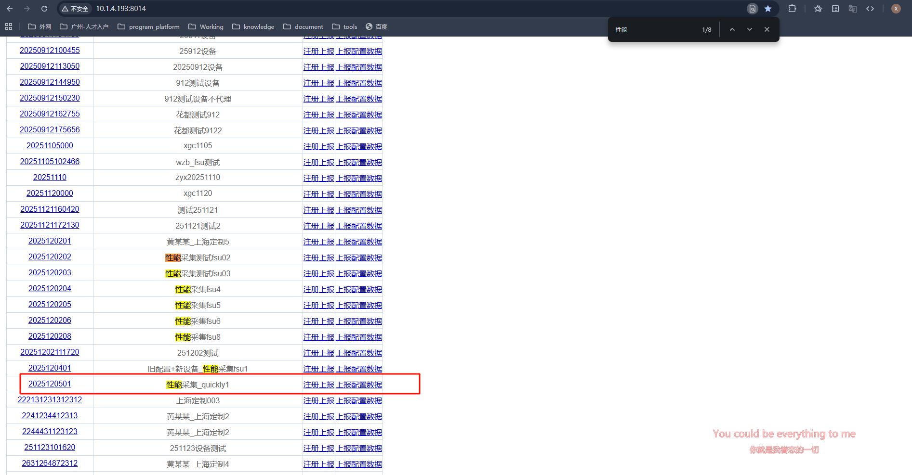

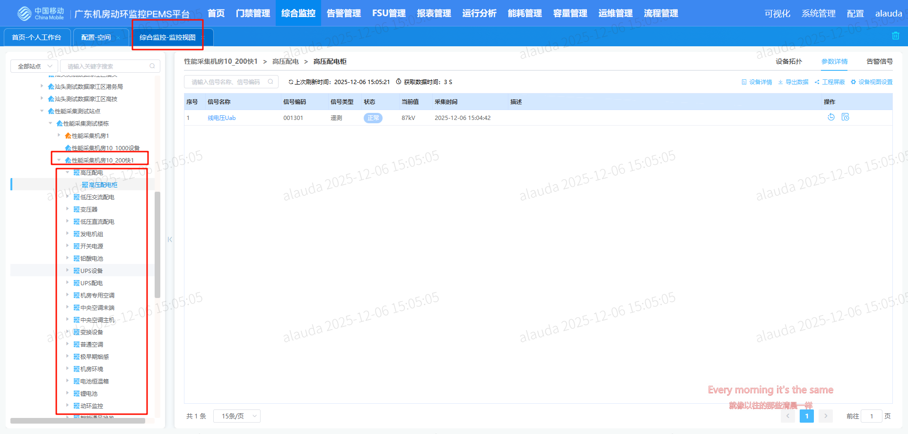

## 注册上报

```
3、当FSU发起注册到server后，server会把请求打到kafka中
	kafka：
		使用工具：offsetexplorer （ip，端口可以在nacos上查看）
		server会把注册情况打到topic里（返回数据-value为16进制，转移以下即可看到请求信息）
			上报注册
				spider_binterface_fsuRegister
			上报配置
				spider_binterface_getDevConfigRequest
				spider_binterface_getDevConfigResponse
		然后由谁消费（这个需要补充）
```

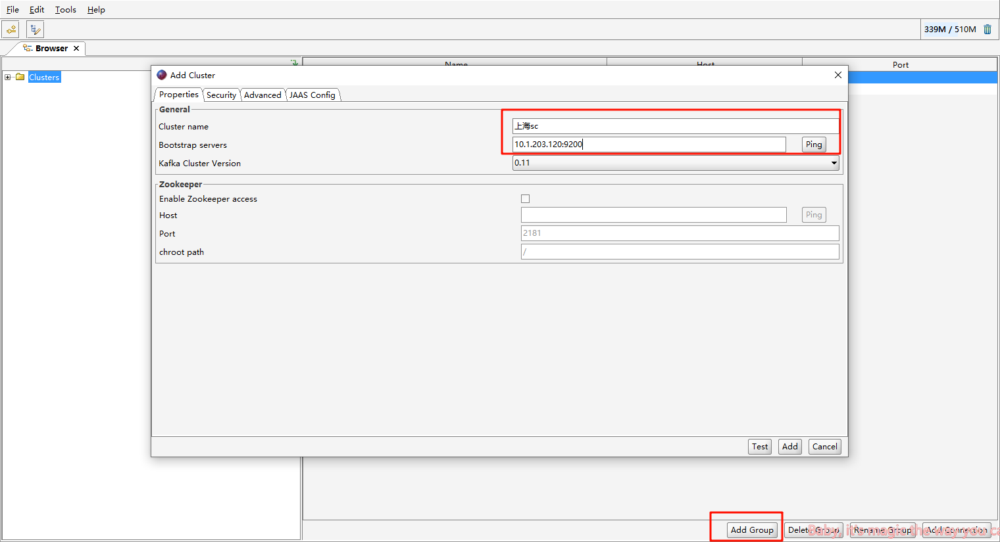

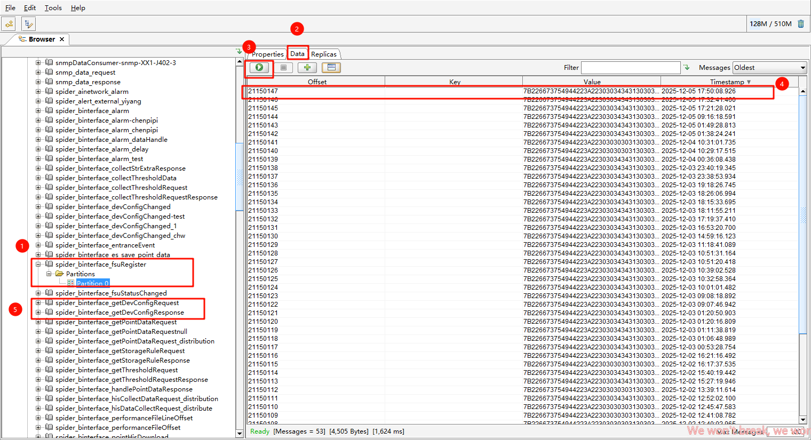

```
2、当在FSU模拟器点击注册后，还需要到redis和fsu表，kafka中确保是否正确注册上来，且时运行状态（重点关注redis状态）
	redis：
		使用工具another redis desktop （ip，端口密码，可以在nacos上查看）
		连接后，进入binterface，点击all加载所有key，找到 binterface:fsu_ipinfo  -- 这里就是记录fsu注册信息
		输入页面接入FSU时显示的deviceid，如果这里代理或是有哪个不符合要求，那么就删除（然后数据库中修改），修改后再到页面上报注册和配置
```

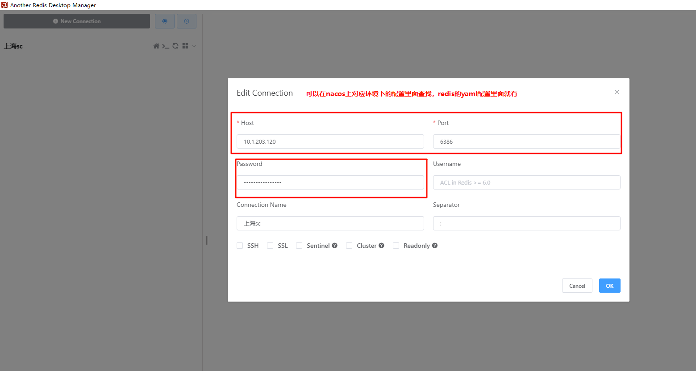

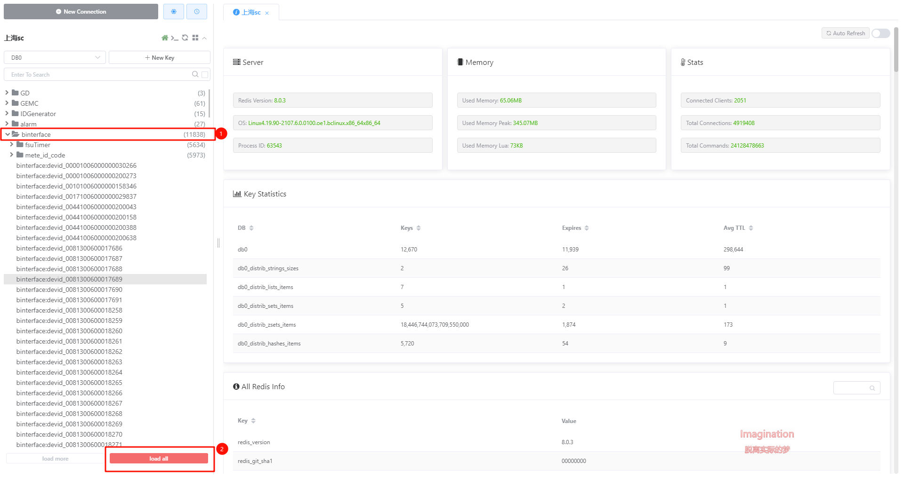

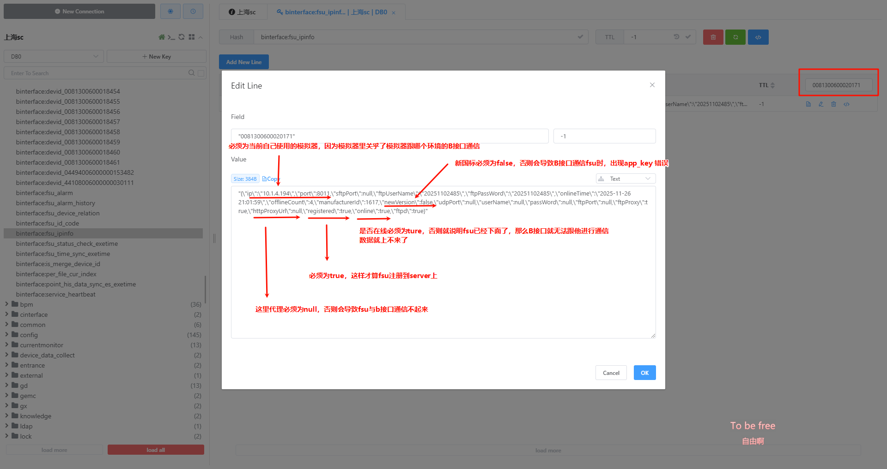

```
3、当FSU注册后，还需要关注t_cfg_fsu表，确保fsu的状态是1
```

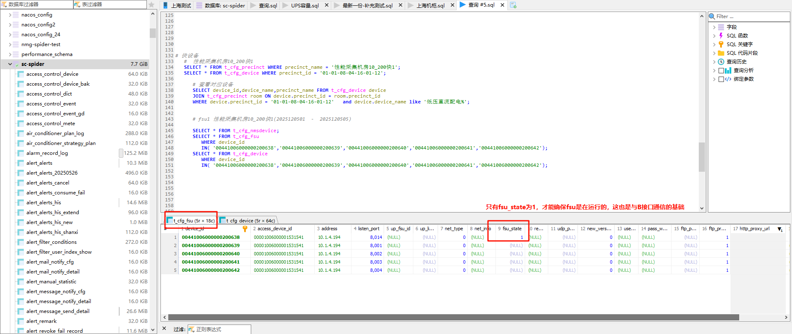

## 数据通信（需要补充）

```
kafka(topic)
	spider_binterface_getPointDataRequest
	spider_binterface_getPointDataRequestnull
	spider_binterface_getPointDataRequest_distribution
```

# 03问题排查

```
问题1：
	kafka更新，currentmonitor没有重新打包导致报错  [这个主要是实时监控，性能采集优化时才影响，其他时候应该不会有这种情况]
	涉及kakfa的topic：
		spider_binterface_getPointDataRequest \ 
		spider_binterface_handlePointDataResponse
```

