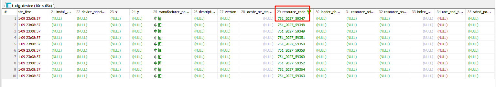

# 前置技巧

```
集团C接口如果没有数据，
	1、先看下模拟器是否挂了（可以把nohup删除）
	2、看C接口服务是否挂了（kafka或es或redsi挂了，在cicd上）
	3、看config服务是否挂了（看10.1.4.113上的）
	如果缺少设备（直接导入中间库？，怎么导入？、）


快速定位动环设备属于哪个中间库站点-机房-设备
	1、device表中的res_code字段
		里面包含lsc、中间库站点id、中间库设备id
```

