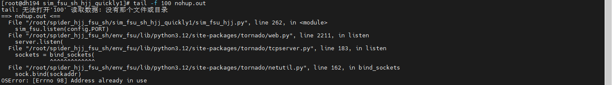
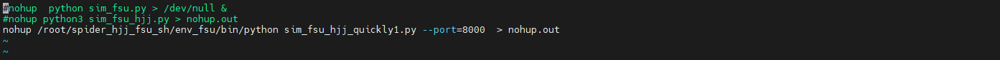
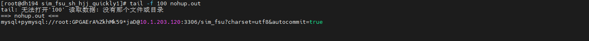

# 01问题记录

```
1、目前存在启动多个FSU出现各种问题，仅有一个启动（如何解决）
	端口占用问题（修改端口即可）
	然后nohup日志清除下，再次启动（如果不清除可能造成一个假象，就是以为端口号又被占用了）
```



```
2、第三方库只装在虚拟环境中（启动时需要指定虚拟环境，不然识别不到库 或者 在执行前先进入虚拟环境--目前这种有点问题）
	最好用指定虚拟环境形式运行（先进入虚拟环境，再指定虚拟环境路径运行最稳定  -- 或者直接写死在sh里面也行）
	
	source /root/spider_hjj_fsu_sh/env_fsu/bin/activate
	写在sh脚本中（直接用这种就行）
    	nohup /root/spider_hjj_fsu_sh/env_fsu/bin/python -u sim_fsu_hjj_quickly1.py > nohup.out
	直接执行
		nohup /root/spider_hjj_fsu_sh/env_fsu/bin/python -u sim_fsu_hjj_quickly1.py > nohup.out
		

注意：
	如果指定了虚拟环境，那么就不需要加上python3标识了
```



```
3、虚拟环境下运行，nohup日志没有打印出来
	rm -f nohup.out
	
	# 检查两个Python的编译选项差异
	# 系统Python3
		python3 -c "import sys; print(sys.flags)"
	# 虚拟环境Python
		/root/spider_hjj_fsu_sh/env_fsu/bin/python -c "import sys; print(sys.flags)"
	# 重点看write_bytecode和no_user_site等标志位是否不同
	
	
	fsu模拟器脚本上方添加代码
		import os
        import sys
        # 方案1：重建无缓冲stdout（推荐）
        sys.stdout = os.fdopen(sys.stdout.fileno(), 'w', 1)  # 行缓冲
        sys.stderr = os.fdopen(sys.stderr.fileno(), 'w', 1)
    
    【直接命令行启动即可】
    nohup /root/spider_hjj_fsu_sh/env_fsu/bin/python -u /root/spider_hjj_fsu_sh/sim_fsu_sh_hjj_quickly1/sim_fsu_hjj_quickly1.py > /root/spider_hjj_fsu_sh/sim_fsu_sh_hjj_quickly1/nohup.out 2>&1 &
```

