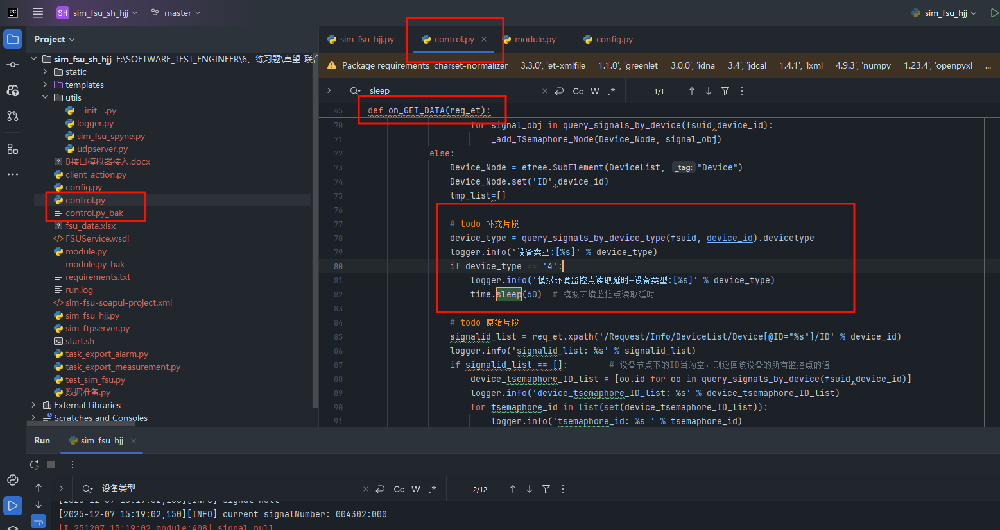
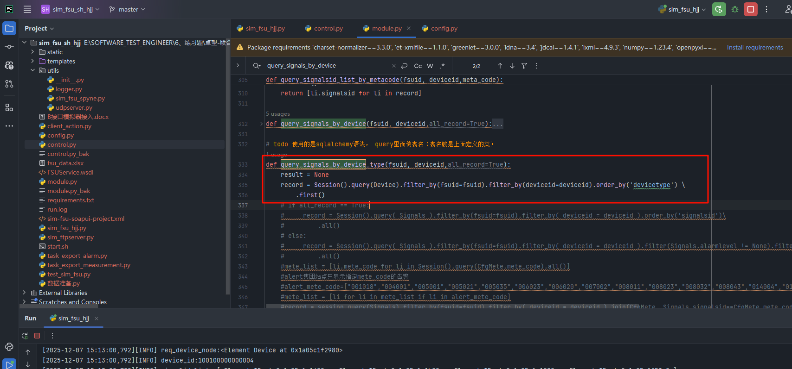

```
补充（AI分析）：
	点击链接查看和 Kimi 的对话 https://www.kimi.com/share/19af7926-9f82-8221-8000-0000582a6de7
```


# 01模块分析

## B接口通信逻辑

```
B服务SOAP请求
    ↓
FSUHandler（协议层：拆SOAP包）
    ↓
control.py invoke_proxy（路由层：分发到具体on_XXX）
    ↓
control.py on_GET_DATA（业务层：查数据库、算数据、拼XML）
    ↓
FSUHandler（协议层：包SOAP信封）
    ↓
返回B服务
```


## sim_fsu_hjj.py

```
sim_fsu_hjj.py ：
    模块整体：
    	FSU模拟器的主服务程序，相当于一个"协议网关+Web管理后台"。
    	它的核心作用是监听HTTP请求，把SOAP包装剥开，调用业务引擎，再把响应包回SOAP返回
    
    模块分类
   
        FSUHandler类中（关键）
            重点：处理B服务的唯一入口
            其次：控制线程池是"保护罩"，防止数据库阻塞拖垮整个服务（类似"网关"：只处理HTTP和SOAP协议，不碰业务数据）
            补充：断开MySQL， 只需在invoke_proxy()之前拦截，直接返回Mock XML，FSUHandler无需任何修
        
        Web管理视图（AlertFsuHandler等）
        	说明：给测试人员用的浏览器操作界面（与B服务无关）
       	
       	主动上报触发（SendAlertHandler等）
       		说明：手动触发FSU主动向B服务发告警/注册（模拟真实行为）
```

```
FSUHandler类拆解

class FSUHandler(BaseHandler):
    executor = ThreadPoolExecutor(20)  # 防阻塞的线程池
    
    @run_on_executor
    def post(self):
        # ① 收SOAP请求
        req_body = self.request.body
        
        # ② 剥开SOAP信封，提取真正的XML
        root_et = etree.fromstring(req_body)
        et = root_et.xpath('//xmlData')[0].text.encode('utf-8')
        
        # ③ 调用业务处理引擎（在control.py里）
        response_data = invoke_proxy(et)
        
        # ④ 把业务响应包回SOAP信封
        response = add_soapenv_header(response_data)
        
        # ⑤ 返回给B服务
        self.write(response)
```

```
调用业务处理引擎（在control.py里）拆解分析：
	
	# ③ 调用业务处理引擎（在control.py里）
    response_data = invoke_proxy(et)
    
    def invoke_proxy(et):
        pk_type = et.xpath('/Request/PK_Type/Name')[0].text  # 拿到"GET_DATA"

        # 这行代码是灵魂！动态拼接函数名并执行
        response = eval("on_%s(et)" % pk_type)  # 等价于 eval("on_GET_DATA(et)")

        return response
```

```
on_GET_DATA：数据分析


<SOAP-ENV:Envelope xmlns:SOAP-ENV="http://schemas.xmlsoap.org/soap/envelope/">
       <SOAP-ENV:Header/>
       <SOAP-ENV:Body SOAP-ENV:encodingStyle="http://schemas.xmlsoap.org/soap/encoding/">
          <ns1:invokeResponse xmlns:ns1="http://FSUService.chinamobile.com">
             <invokeReturn><![CDATA[<?xml version='1.0' encoding='utf-8'?>
    <Response>
      <PK_Type>
        <Name>GET_DATA_ACK</Name>
      </PK_Type>
      <Info>
        <FSUID>20251206</FSUID>
        <Values>
          <DeviceList>
            <Device ID="100100000000014">
              <TSemaphore Type="3" ID="014303" SignalNumber="000" MeasuredVal="67.0" SetupVal="7.0" Status="0" Time="2025-12-07 14:47:58"/>
              <TSemaphore Type="3" ID="014302" SignalNumber="000" MeasuredVal="87.0" SetupVal="99.0" Status="0" Time="2025-12-07 14:47:59"/>
              <TSemaphore Type="3" ID="014301" SignalNumber="000" MeasuredVal="74.0" SetupVal="66.0" Status="0" Time="2025-12-07 14:48:00"/>
              <TSemaphore Type="3" ID="014306" SignalNumber="000" MeasuredVal="39.0" SetupVal="95.0" Status="0" Time="2025-12-07 14:48:01"/>
              <TSemaphore Type="3" ID="014305" SignalNumber="000" MeasuredVal="31.0" SetupVal="31.0" Status="0" Time="2025-12-07 14:48:01"/>
              <TSemaphore Type="3" ID="014304" SignalNumber="000" MeasuredVal="24.0" SetupVal="35.0" Status="0" Time="2025-12-07 14:48:02"/>
            </Device>
          </DeviceList>
        </Values>
        <Result>1</Result>
        <FailureCause/>
      </Info>
    </Response>
    ]]></invokeReturn>
          </ns1:invokeResponse>
       </SOAP-ENV:Body>
    </SOAP-ENV:Envelope>
    
    

解析需要参考：中国移动动力环境集中监控系统规范 - B接口技术规范分册-增加获取字符串监控点.docx
	GET_DATA
	GET_DATA_ACK
	
```

### 补充点位

```
1、补充不同设备类型，需要等待
```





## control.py

```
control.py：
	是"引擎"，所有业务逻辑、SQL查询、XML构造都在这里
```

