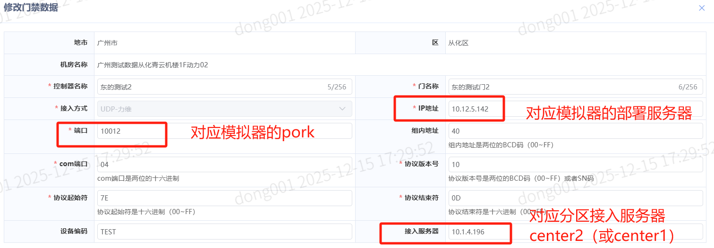

# 01服务流转

## 01_1_服务流转


## 01_2_门禁设备接入

```
1、注意点（确保fsu门禁的ip对应fsu - 对应设备有device_code）：
	绑定的fsu门禁模拟器的ip和端口必须在t_cfg_fsu中，同时对应的device_id在t_cfg_device里必须有device_code
	说明：这里只需要fsu对应设备的device_code有存在即可，跟测点没有什么关系
	SELECT * FROM t_cfg_device 
	WHERE device_id = (SELECT device_id FROM t_cfg_fsu WHERE address = ‘对应门禁配的ip’) 
	and device_code is not null

2、接入方式、com端口、协议版本号、协议起始符、协议结束符（有指定要求）
	依据协议填入：https://docs.qq.com/sheet/DU1hoQnVCalFjV0tI?tab=mnrynb
		对应关系：
				接入方式 --> PEMS协议名称
				com端口 --> 地址()
				协议版本号 -->  版本
				协议起始符 --> 协议起始符
				协议结束符 --> 协议终止符
```



## 01_3_协议上下行（力维为例）

```
特别注意：
	UDP协议都会使用B接口透传协议包裹各设备协议数据包
	TCP直接传递设备协议数据包

udp力维：
	操作会下行两个指令（一个确认权限，一个真正指令）
	授权之类（会下发三个 - 即确认权限、获取用户编码、再授权撤权）
	
	报文是1对1进行的（比如下发确认，那么fsu会回复确认授权包；接着sc再下发真正指令，fsu再回复真正指令结果）
```

### 01_3_1_下行（sc -> fsu）

（su-sm -> 即动环下发到fsu模拟器） -- 外层

```
举例（测试连接）：
	确认权限报文
		Data: ff3132343132333133313234310000000000000000000000000000000001142500ee010020007e3130303138303438323030454630453030303030303030303030464143380d83fe
		
		(16进制)
		开始标识 : FF
		目标 FSUID : 31 32 34 31 32 33 31 33 31 32 34 31 00 00 00 00 00 00 00 00
        源地址     : 00 00 00 00 00 00 00 00
        子设备类型 : 01
        子设备地址 : 14
        命令号     : 01 00
        透传长度   : 20 00
        透传数据   : 7E 31 30 30 31 38 30 34 38 32 30 30 45 46 30 45 30 30 30 30 30 30 30 30 30 30 30 46 41 43 38 0D
        校验       : 83
        结束标识       : FE 
        
        (ascll)
        目标 FSUID : 124123131241
        源地址     : 
        子设备类型 : 1  (1=串口 2=USB 3=IP)
        子设备地址 : 0x14  (串口号=20, 虚拟地址=0)
        命令号     : 0x0001
        透传长度   : 32
        透传数据   :~10018048200EF0E00000000000FAC8
        校验       : 0x83  计算=0x83  ✅ 
   
   
   	测试连接报文：
   Data: ff3132343132333133313234310000000000000000000000000000000001141d00ee010018007e313030313830344141303036463245323030464333420df2fe
   
   
   		开始标识 : FF
        目标 FSUID : 31 32 34 31 32 33 31 33 31 32 34 31 00 00 00 00 00 00 00 00
        源地址     : 00 00 00 00 00 00 00 00
        子设备类型 : 01
        子设备地址 : 14
        命令号     : 01 00
        透传长度   : 18 00
        透传数据   : 7E 31 30 30 31 38 30 34 41 41 30 30 36 46 32 45 32 30 30 46 43 33 42 0D
        校验       : F2
        结束标识       : FE 
        
        

        目标 FSUID : 124123131241
        源地址     : 
        子设备类型 : 1  (1=串口 2=USB 3=IP)
        子设备地址 : 0x14  (串口号=20, 虚拟地址=0)
        命令号     : 0x0001
        透传长度   : 24
        透传数据   :~1001804AA006F2E200FC3B
        校验       : 0xF2  计算=0xF2  ✅ 
```

| 地址        | 协议字段      | 字段长度 | 字段描述                                                     | 默认值           |
| ----------- | ------------- | -------- | ------------------------------------------------------------ | ---------------- |
| 0           | P_header      | 1 byte   | 协议包的开始标识ff                                           | 0xFF             |
| 1-20        | P_dest_addr   | 20bytes  | 目标设备地址                                                 | FSU的ID          |
| 21-28       | P_src_addr    | 8byte    | 源设备地址                                                   | SC的地址取值为00 |
| 29          | P_subDevType  | 1 byte   | 子设备类型：1：串口设备2：USB设备3：IP网络设备               | 1                |
| 30          | P_subDev_addr | 1 byte   | 透传模块：Bit0~4:串口号；Bit5~8： 表示虚拟设备号（即串口总线模式下的地址号）；当子设备类型为USB/IP时，此字段为00。 |                  |
| 31-32       | P_pLen        | 2 byte   | 协议族数据包长度                                             | 5+N              |
| 33          | RtnFlag       | 1byte    | 设置/应答类型                                                | 0xee             |
| 34-35       | CommType      | 2 bytes  | 命令编号                                                     | 0x0001           |
| 36-37       | 透传数据长度  | 2 byte   | 透传数据长度                                                 |                  |
| 38-(38+N-1) | 透传数据      | N byte   | 数据内容                                                     |                  |
| 38+N        | P_verify      | 1 byte   | 协议包的校验字段，采用异或校验，在数据转义之前，对协议数据计算校验值，计算时不包含包头和包尾 |                  |
| 39+N        | P_tailer      | 1 byte   | 协议包的结束标识fe                                           | 0xFE             |

（su-sm -> 即动环下发到fsu模拟器） -- 内层

```
即正真的业务数据
	确认权限报文：
		透传数据   : 7e 31 30 30 31 38 30 34 38 32 30 30 45 46 30 45 30 30 30 30 30 30 30 30 30 30 30 46 41 43 38 0d
					b'~ 10 01 80 48 200E F0E0 0000 000000 FAC8\r'
	测试连接报文：
		透传数据   : 7E 31 30 30 31 38 30 34 41 41 30 30 36 46 32 45 32 30 30 46 43 33 42 0D
					~1001804AA006F2E200FC3B
```

| 序号   | 1      | 2    | 3        | 4            | 5        | 6            | 7     | 8       | 9      |
| ------ | ------ | ---- | -------- | ------------ | -------- | ------------ | ----- | ------- | ------ |
|        | 起始符 | 版本 | 组内地址 | 类码与组地址 | 类别     | 参数长度校验 | 参数  | 桢校验  | 结束符 |
| 字节数 | 1      | 1    | 1        | 1            | 1        | 2            | N字节 | 2       | 1      |
| 符号   | SOI    | VER  | ADR      | CID1         | CID2/RTN | L.TH         | INFO  | CHK-SUM | EOI    |

### 01_3_2上行（fsu -> sc）

（sm-su -> 即fsu上发到sc） -- 外层

```
确认权限回复报文
		Data: ff000000000000000030313230323530393136303130380000000000000128170000010012007e313030313830303030303030464442360d23fe
		
		
确认测试连接回复报文
		Data: ff0000000000000000303232303234303730373033333600000000000001221b0000010016007e31303032383030303330314330303030303030303030323032343035303731363030343335313032463833380d24fe
```

| 地址        | 协议字段      | 字段长度 | 字段描述                                                     | 默认值             |
| ----------- | ------------- | -------- | ------------------------------------------------------------ | ------------------ |
| 0           | P_header      | 1 byte   | 协议包的开始标识ff                                           | 0xFF               |
| 1-8         | P_dest_addr   | 8bytes   | 目标设备地址                                                 | SC的地址取值为0x00 |
| 9-28        | P_src_addr    | 20byte   | 源设备地址                                                   | FSU的ID            |
| 29          | P_subDevType  | 1 byte   | 子设备类型：1：串口设备2：USB设备3：IP网络设备               | 1                  |
| 30          | P_subDev_addr | 1 byte   | 透传模块：Bit0~4:串口号；Bit5~8： 表示虚拟设备号（即串口总线模式下的地址号）；透传模块：Bit0~4:串口号；Bit5~8： 表示虚拟设备号（即串口总线模式下的地址号）；当子设备类型为USB/IP时，此字段为00。 |                    |
| 31-32       | P_pLen        | 2 byte   | 协议族数据包长度                                             | 5+N                |
| 33          | RtnFlag       | 1byte    | 设置/应答类型                                                | 0x00               |
| 34-35       | CommType      | 2 bytes  | 命令编号                                                     | 0x0001             |
| 36-37       | 透传数据长度  | 2 byte   | 透传数据长度                                                 |                    |
| 38-(38+N-1) | 透传数据      | N byte   | 数据内容                                                     |                    |
| 38+N        | P_verify      | 1 byte   | 协议包的校验字段，采用异或校验，在数据转义之前，对协议数据计算校验值，计算时不包含包头和包尾 |                    |
| 39+N        | P_tailer      | 1 byte   | 协议包的结束标识fe                                           | 0xFE               |

（sm-su -> 即fsu上发到sc） -- 内层

```
根据下行数据包中的CID2/RTN和参数  -- 来判断要回复的报文

确认权限报文：
		透传数据   : 7e 31 30 30 31 38 30 34 38 32 30 30 45 46 30 45 30 30 30 30 30 30 30 30 30 30 30 46 41 43 38 0d
					b'~ 10 01 80 48 200E F0E0 0000 000000 FAC8\r'
					这里是CID2为48，对应协议中（访问权限的确认0x48） -> 再根据 F0E0 即command部分确认为（3.1.访问权限确认(0XE0)）
		回报格式   ：7e313030313830303030303030464442360d
					b'~100180000000FDB6\r'
	测试连接报文：
		透传数据   : 7E 31 30 30 31 38 30 34 41 41 30 30 36 46 32 45 32 30 30 46 43 33 42 0D
					~1001804AA006F2E200FC3B
```

| 序号   | 1      | 2    | 3        | 4            | 5        | 6            | 7     | 8       | 9      |
| ------ | ------ | ---- | -------- | ------------ | -------- | ------------ | ----- | ------- | ------ |
|        | 起始符 | 版本 | 组内地址 | 类码与组地址 | 类别     | 参数长度校验 | 参数  | 桢校验  | 结束符 |
| 字节数 | 1      | 1    | 1        | 1            | 1        | 2            | N字节 | 2       | 1      |
| 符号   | SOI    | VER  | ADR      | CID1         | CID2/RTN | L.TH         | INFO  | CHK-SUM | EOI    |

**SM 对SU的设置命令的应答**:

| 序号 | 1    | 2    | 3    | 4    | 5    | 6    | 7    | 8    | 9    |
| ---- | ---- | ---- | ---- | ---- | ---- | ---- | ---- | ---- | ---- |
| 字节 | 1    | 1    | 1    | 1    | 1    | 2    | 无   | 2    | 1    |
| 格式 | SOI  | VER  | ADR  | CID1 | RTN  | 0，0 | 无   | SUM  | EOI  |

**SM对SU读取命令的返回格式:**

| 序号 | 1    | 2    | 3    | 4    | 5    | 6    | 7        | 8    | 9    |
| ---- | ---- | ---- | ---- | ---- | ---- | ---- | -------- | ---- | ---- |
| 字节 | 1    | 1    | 1    | 1    | 1    | 2    | N        | 2    | 1    |
| 格式 | SOI  | VER  | ADR  | CID1 | RTN  | L.TH | DATAINFO | SUM  | EOI  |


## 补充

```
抓包：
	tcpdump -i any -n -w test.pcap "host 10.12.5.142 and udp"
	scp -B test.pcap sudoroot@10.1.203.120:/home/sudoroot/
	md5sum test.pcap
```

