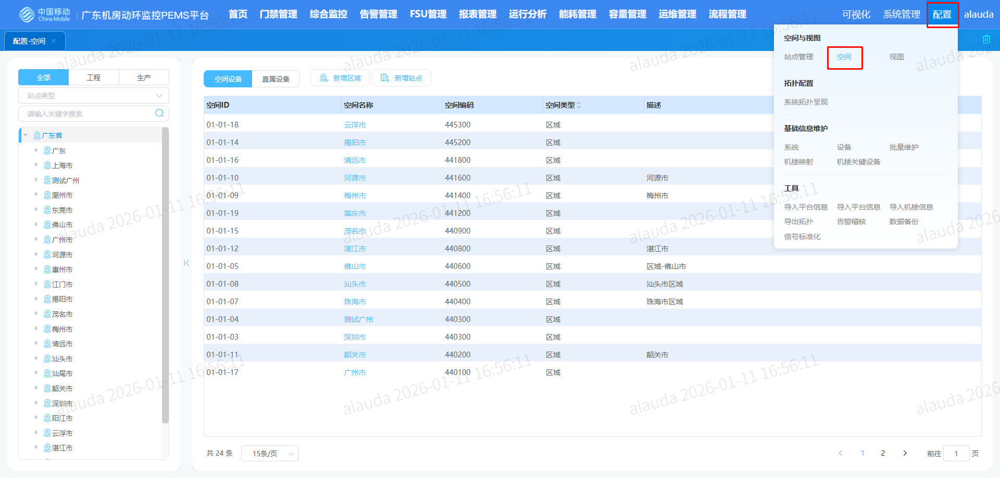
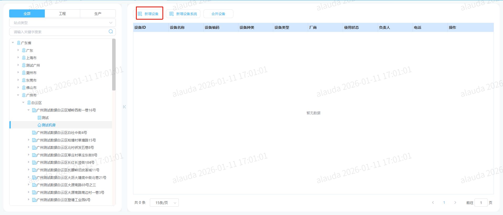
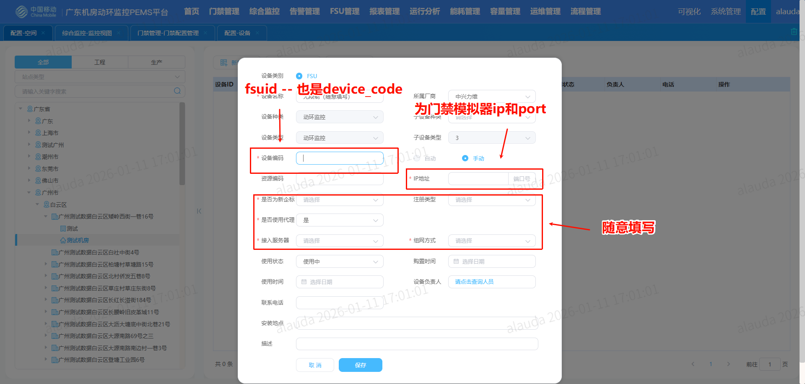
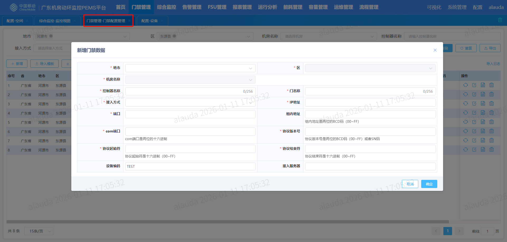
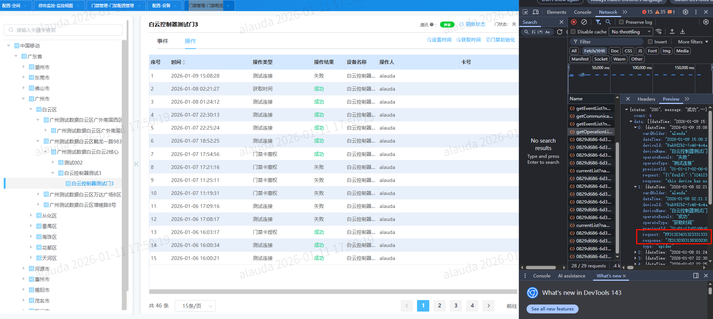
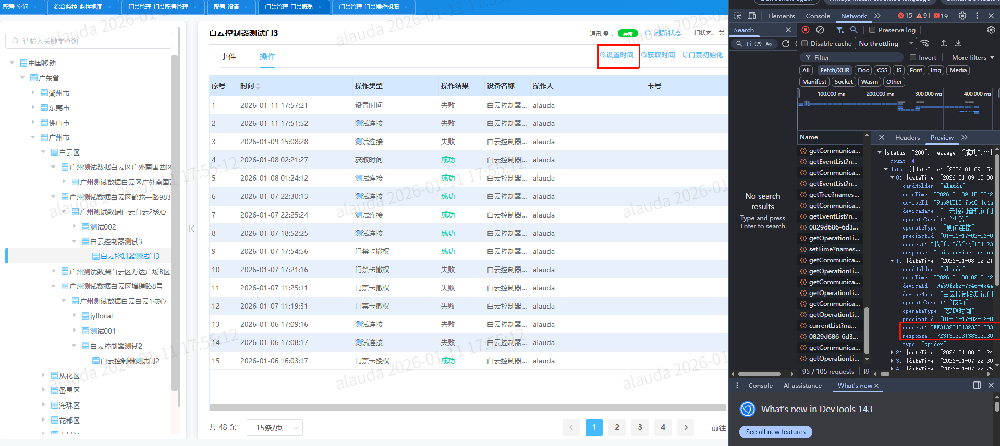
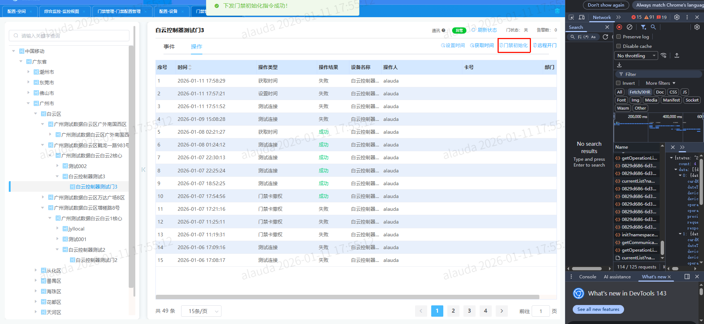
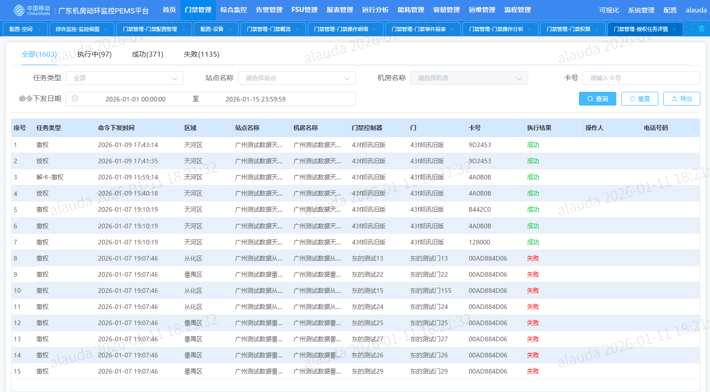

# 00_补充

```
1、调试模拟器时，使用sokit工具充当client，进行报文调试
2、需要使用wireshark进行抓包（分析报文）
```


# 01_门禁设备接入

```
1、配置-空间-具体到机房下（点击新增设备 - 创建设备）

2、新增时需要注意：
	设备编码：对应fsu_id --> 创建成功后会更新到t_cfg_device表的device_code字段
	ip地址和端口（不能输入重复端口-先随便输入一个再到表里修改即可） --> 会同步到t_cfg_fsu表中

3、门禁管理-门禁配置管理（新增门禁数据 - 实现模拟器与平台的通信）
	基础字段
        地市/区/机房：			   选上面设备建立对应的地市/区/机房
        控制器名称、门名称：			任意填写
        ip地址：					步骤2中的ip
        端口：						步骤2中的端口
        组内地址：				  满足提示中要求即可，无限制
        设备编码：				  无限制 - 或是
	
	其余字段（需要根据文档要求来输入：https://docs.qq.com/sheet/DU1hoQnVCalFjV0tI?tab=mnrynb - 门禁设备信息sheet页）
		如果以下几个字段填报错误，会导致设备不同
        接入方式：				  PEMS协议名称
        com端口：				   地址()
        协议号：				   版本
        协议起始符				  协议起始符 
        协议结束符				  协议终止符	
        接入服务器				  center服务对应的ip
   
   涉及表：
   		# 门禁卡授权任务
        SELECT * FROM entrance_card_auth_task;
        # 门禁设备表
        SELECT * FROM access_control_device;
        # 门禁授权表
        SELECT * FROM entrance_card_auth;
        SELECT * FROM access_control_event;
    到此即可完成门禁模拟器接入

4、注意点：
	在门禁管理-门禁配置管理，新增设备选择ip和端口 -> 在t_cfg_fsu表中对应device_id -> 在t_cfg_device表中的device_code必须存在
	设备的唯一标识，以ip和port为唯一标识（com端口只是页面的限制）
```








# 02_刷新状态

```
前置：设备已经接入

步骤：

1、进入门禁管理-门禁概览，找到对应设备
2、左上角点击刷新状态
	（v1/entranceGuard/controller/getOperationList接口会返回对应请求和响应报文）
	或是在门禁管理-门禁操作明细，也可以排查请求和响应报文

结果：
	1、门禁管理-门禁概览（操作）和 门禁管理-门禁操作明细 会同步刚刚操作的记录（模拟器正常且center服务对应的情况下，操作是成功的）

```



# 03_设置时间

```
前置：设备已经接入

步骤：

1、进入门禁管理-门禁概览，找到对应设备
2、左上角点击设置时间
	（v1/entranceGuard/controller/getOperationList接口会返回对应请求和响应报文）
	或是在门禁管理-门禁操作明细，也可以排查请求和响应报文

结果：
    1、门禁管理-门禁概览（操作）和 门禁管理-门禁操作明细 会同步刚刚操作的记录
        模拟器正常且center服务对应的情况下，操作是成功的，且时间回显为所设置的时间
        操作类型为设置时间、操作结果为成功，设备名称为当前所操作的设备，操作人为当前触发的用户

    2、门禁管理-门禁概览（事件）和 门禁管理-门禁事件报表 会记录刚刚操作产生的事件
        前提：entrance下定时日志已开启
```



# 04_门禁初始化

```
前置：设备已经接入

步骤：

1、进入门禁管理-门禁概览，找到对应设备
2、左上角点击门禁初始化
	（v1/entranceGuard/controller/getOperationList接口会返回对应请求和响应报文）
	或是在门禁管理-门禁操作明细，也可以排查请求和响应报文

结果：
    1、门禁管理-门禁概览（操作）和 门禁管理-门禁操作明细 会同步刚刚操作的记录
        模拟器正常且center服务对应的情况下，操作是成功的
        操作类型为门禁初始化、操作结果为成功，设备名称为当前所操作的设备，操作人为当前触发的用户
```



# 05_远程开门

```
前置：设备已经接入

步骤：

1、进入门禁管理-门禁概览，找到对应设备
2、左上角点击远程开门
	（v1/entranceGuard/controller/getOperationList接口会返回对应请求和响应报文）
	或是在门禁管理-门禁操作明细，也可以排查请求和响应报文


结果：
    1、门禁管理-门禁概览（操作）和 门禁管理-门禁操作明细 会同步刚刚操作的记录
        模拟器正常且center服务对应的情况下，操作是成功的
        操作类型为远程开门、操作结果为成功，设备名称为当前所操作的设备，操作人为当前触发的用户
    2、门禁管理-门禁概览（事件）和 门禁管理-门禁事件报表 会记录刚刚操作产生的事件
        前提：entrance下定时日志已开启
```


# 06_卡授权

```
前置：
	1、设备已经接入
	2、门禁管理-人员管理，新增用户所属部门含设备所在区域，且用户已新增卡号
	卡号需要根据协议要求进行配置：https://docs.qq.com/sheet/DU1hoQnVCalFjV0tI?tab=mnrynb - 门禁设备信息sheet页
	注意：
		单卡支持授权多个设备
		单设备支持多个卡

步骤：
	1、门禁管理-门禁权限，切换到对应部门下人员卡号
	2、点击新增授权或批量设置权限（选择有效日期、对应设备后确认即可）
	注意：卡会在有效期到了才会生效，才能刷卡开门

结果：
    1、门禁管理-门禁概览（操作）和 门禁管理-门禁操作明细 会同步刚刚操作的记录
        模拟器正常且center服务对应的情况下，操作是成功的
        操作类型为授权卡、操作结果为成功，设备名称为当前所操作的设备，操作人为当前触发的用户
    2、门禁管理-门禁权限
        对应卡号下面右侧页面，会新增一条记录为刚刚的门设备，且显示有效期、并回显撤销按钮
    3、门禁管理-授权任务详情
        会显示本次授权的状态（执行中-成功/失败） -- 最终结果只能是成功或失败，不能有执行中
        且要保持与门禁管理-门禁概览（操作）的记录一致
```




# 07_卡撤权

```
前置：
	1、设备已经接入
	2、门禁管理-人员管理，新增用户所属部门含设备所在区域，且用户已新增卡号
	3、卡已经授权门设备

步骤：
	1、门禁管理-门禁权限，切换到对应部门下人员卡号
	2、点击撤销授权或批量撤销权限
	或
	1、门禁管理-人员管理，解绑卡
	或
	1、门禁管理-人员管理，删除用户


结果：
    1、门禁管理-门禁概览（操作）和 门禁管理-门禁操作明细 会同步刚刚操作的记录
        模拟器正常且center服务对应的情况下，操作是成功的
        操作类型为撤销卡、操作结果为成功，设备名称为当前所操作的设备，操作人为当前触发的用户
    2、门禁管理-门禁权限
        对应卡号下面右侧页面，已授权的门禁设备记录会消除
    3、门禁管理-授权任务详情
        会显示本次授权的状态（执行中-成功/失败） -- 最终结果只能是成功或失败，不能有执行中
        且要保持与门禁管理-门禁概览（操作）的记录一致
```


# 08_刷卡开门

```
前置：
	1、设备已经接入
	2、门禁管理-人员管理，新增用户所属部门含设备所在区域，且用户已新增卡号
	3、卡已经授权门设备


步骤：
	1、拿卡到真实门禁设备上刷卡

结果：
	1、会有滴咔嚓开门声，隔1~2又咔嚓关门声
	2、门禁管理-门禁概览（事件）和 门禁管理-门禁事件报表会同步刚刚事件的记录
			事件为	刷卡允许通过 并同步到告警视图中
	注意：
		如果为未授权的卡，事件对应位刷卡禁止通过，并同步到告警视图中（刷卡时只有滴一声，门不会开）
```


# 09_事件

```
事件主要根据协议来判断的（所有事件读取，都需要先开启日志，否则页面读取不到日志）
目前常见事件：
	授权卡刷门：刷卡允许通过（对应告警视图 - 门禁状态告警）
	非法卡刷门：刷卡禁止通过（对应告警视图 - 卡非法告警）
	测试连接：设备断开连接时（对应告警视图 - 通信状态告警）

其余需要补充
```

