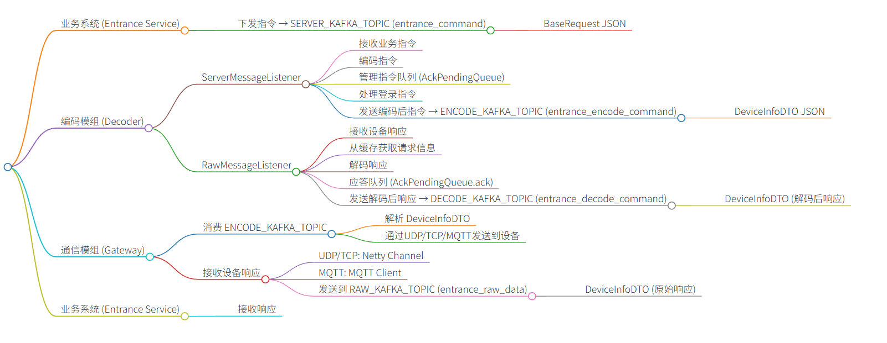

# 优化需求

```
基础文档：https://docs.qq.com/sheet/DU1hoQnVCalFjV0tI?tab=mnrynb
基础抓包：
		在模拟器中抓包（更改ip即可）：
			tcpdump -i any -n -w <fileName>.pcap "host <ip> and udp"
			例：
			tcpdump -i any -n -w lw.pcap “host 129.240.160.4 and udp”
			抓取大约5min后通过ctrl+c中断抓取，可以直接通过tcpdump -r <fileName>.pcap直接预览抓取的包的概览
			正常情况下sc与智能门锁的通信应当是1个请求对应1个响应，额外有fsu透传的udp心跳包
		需要用wireshark工具解析：len=38的是fsu-udp心跳包而已，其他的都有应答


20251227
	门禁绑卡失败重试机制（entrance服务的优化）
		失败：1对1、1对多、多对多（情况1：未开启模拟器直接授权-每个请求会进行3次重试、重试间隔10s） - 最终就是失败
		成功：1对1、1对多、多对多（只能1次成功）
		授权失败或成功均要注意两个概念（任务和操作）：
			授权失败重试完成后 - 
				任务-需要回填（也就是门禁管理-授权任务详情 - 执行结果）
				操作-必须要有记录（也就是门禁管理-门禁概览-操作：这里是记录用户每次操作的记录）
		现网问题：
			门禁管理-门禁概览-操作 - 存在都失败，但是门禁管理-授权任务详情未回填（就是还处于执行中）
		特别说明：
			执行日期为当日会立即执行，执行日期为当前日期之后，则会等到日期才会执行（页面会处于执行中）
			如果设备或卡号不符合协议、或是绑定fsu门禁-无对应device_code那么都会被pending-然后失败
		日志关键字：重试
```


# 门禁管理基础服务

```
服务业务流转
	entance serveice
		(即页面【门禁权限-授权卡和撤销卡】、【门禁管理配置-测试连接】、【门禁概览-设置时间、获取时间、门禁初始化、远程开门、刷新状态（获取状态）】)
		(即页面【门禁概览-读取事件记录】、【门禁概览-获取操作记录】)
		(即页面【门禁操作明细】、【门禁事件报表】、【授权任务详情】--也就是授权卡、撤销卡)
		下发组成：
	decoder
		这里用于组装request，和解包request
		日志：
			下行：
				接收到服务端消息
				接收到下发给设备 - 说明fsuid是肯定有device_code的
				接收到xx的数据  - 说明接收到设备应答的消息
			上行：
				获取通信模组数据
	centor（gateway）
		


定时任务指令
	刷新测试连接设备：2分钟1次、失败后会轮询1分钟
	读取门状态（部分有）：50s周期轮询
	读取事件状态：50s周期轮询
	定时任务
	
	
目前模拟器：
	142上的是力维的模拟器
	120上的是海能的模拟器
```



# 门禁管理基础功能

## 前置说明

```
公共前置说明：
	事件入口有两个：门禁概览-事件、门禁事件报表
	事件衍生：会衍生对应告警 -> 即告警视图中体现
	门禁管理配置中（新增模式为udp类型的）：
		必须在动环系统的监控视图中有对应设备
		即access_control_device的device_type = 2的设备可以根据device_id实时在t_cfg_device表中查询
		原有定时任务不再执行，改为可通过手动触发
		原因：门禁设备下发指令必须要有fsuid（对应中移协议字段-P_src_addr）
		

门禁管理配置前置说明（重点）：
	设备接入的ip和端口（在测试环境中就是模拟器，在真实环境中就是fsu门禁的ip和端口）
		注意点（确保fsu门禁的ip - 对应设备有device_code）：
			绑定的fsu门禁模拟器的ip和端口必须在t_cfg_fsu中，同时对应的device_id在t_cfg_device里必须有device_code
			这里可以直接找已有的fsu和devcie记录插入（然后修改下ip和端口即可）
			说明：这里只需要fsu对应设备的device_code有存在即可，跟测点没有什么关系
			SELECT * FROM t_cfg_device 
			WHERE device_id = (SELECT device_id FROM t_cfg_fsu WHERE address = ‘对应门禁配的ip’) 
			and device_code is not null
	接入服务器为center（其实就是gateway） -- 可以理解成就是建立 动环 与 fsu之间的中转池
		这里决定设备最终流入哪个center服务，必须配对才会流入center - 才会下发到fsu门禁模拟器或是fsu门禁最后一级
```


## 门禁管理-门禁概览

```
功能描述：
	对门禁设备的操作
	
目录结构：
	机房层级
		控制器
			门设备（这里可以下发指令）
				指令：
					门禁初始化 - 把所有的卡权限消除、以及其他几项
				结果：
					操作：必须要有结果返回和记录（即每次操作都要有结果记录、记录授权等操作）
					任务：执行完必须要回填（即操作后，可能还有执行任务，比如重试等，所以需要等待回填）
```

## 门禁管理-门禁权限

```
功能描述：
	对门禁卡的授权（即让卡可以开门等操作）

目录结构：
	部门层级（至少到四级）
		人员
			卡号（这里的卡号在门禁管理-人员管理中进行绑定 - 卡号有特别要求 - 不同设备有不同协议-因此卡号要求也不同）
				卡号要求参考：
					https://docs.qq.com/sheet/DU1hoQnVCalFjV0tI?tab=mnrynb  （门禁设备信息）
					不同卡号的要求不同，根据要求进行设置
```

## 门禁管理-门禁管理配置

```
功能描述：
	门设备的配置（即门设备的新增，会同步到监控视图 - 叫智能门禁设备 - 在对应机房下面）
	access_control_device的device_type = 2的设备可以根据device_id实时在t_cfg_device表中查询
	新增模式为udp类型的，ip对用的fsu对应设备的device_code必须存在（可以不管是否有测点、也无需真实接入fsu，直接复制已有的插入即可）
	
新增说明：
	不同设备对应的配置信息也会不同-参考：https://docs.qq.com/sheet/DU1hoQnVCalFjV0tI?tab=mnrynb
	字段描述：
		协议起始符和协议终止符 - 固定不变，相当于封装请求的包头
		组内地址（对应中移接口字段 P_subDev_addr）:配置固定值即可
		地址（对应平台的com端口 - 也就是门地址）：任意 或 参考现有文档
		端口号：服务器的端口号
```

