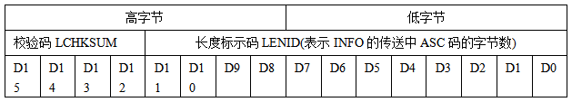

# 力维

## 前置

```
每次操作都会有两个请求？ 
	这是为什么

1byte = 8bit
即1个字符1字节
	1字符（即任意的数字或字母）
	1个字节8bit（由01组成 ->  00000001）


需要之前fsu-sc：透传协议
地址：就是
	据帧/报文里每个字节的偏移量（index）
	从 0 开始计数，可以理解为“第几个字节”
	0 → 第 1 个字节
	1-20 → 第 2~21 个字节（共 20 字节）
	

通信速率：
	数据传输的速度、单位是“波特”（Baud，简写为B/S）
	每秒传输的符号（或信号元素）数量（串行通信中，数据是一位一位地传输的）
        9600B/S：每秒传输9600个符号。
        19200B/S：每秒传输19200个符号。
        2400B/S：每秒传输2400个符号
    作用（确保双方保持同屏率）：
    	通信速率必须在通信双方（例如一个设备和计算机）之间匹配，否则数据传输会出现错误。
    	如果发送方以9600B/S发送数据，而接收方设置为19200B/S，那么接收方可能会收到错误的数据
    	
    	

数据格式：
	数据格式是指数据在传输过程中如何组织，包括起始位、数据位、停止位和校验位（数据包内格式）
	1起始位：在数据传输开始时，发送一个低电平信号（通常是0），表示数据传输的开始。
	8数据位：实际要传输的数据，每次传输8位（即一个字节）。
	1停止位：在数据传输结束后，发送一个高电平信号（通常是1），表示数据传输的结束。
	校验方式位：用于数据校验，确保数据传输的准确性
	
	
	
校验方式：
	用来检测数据传输过程中是否出现错误的一种机制
	无校验（None）：不进行校验，数据直接传输，不附加任何校验位。
	奇校验（Odd）：
		发送方计算数据位中1的个数，如果1的个数为偶数，则添加一个1作为校验位，使总的1的个数为奇数；
		如果1的个数为奇数，则添加一个0作为校验位。接收方收到数据后，检查1的个数是否为奇数，如果不是，则认为数据传输有误。
	偶校验（Even）：与奇校验相反，发送方添加校验位使1的个数为偶数。接收方检查1的个数是否为偶数。
	MARK(1)校验：无论数据位如何，校验位始终为1。
	SPACE(0)校验：无论数据位如何，校验位始终为0
	
	
	
数据帧：
	数据帧是一种在计算机网络中用于传输数据的格式（像一个包裹，里面装着需要传输的数据）用帧作为数据传输的基本单位
	结构组成
		帧头（Header）：
			目的地址（Destination Address）：这是接收方的地址
			源地址（Source Address）：这是发送方的地址
			类型/长度（Type/Length）字段：这个字段有双重作用
		数据部分（Data）：
			这是数据帧的核心内容，包含了需要传输的实际数据
		帧尾（Trailer）：
			帧校验序列（Frame Check Sequence，FCS）：这是一个用于检测数据帧在传输过程中是否出现错误的字段
			


数据传输：
	串行传输：
		特点：在串行传输中，数据是一位一位地依次传输的
	并行传输：
		特点：并行传输是同时传输多位数据。
		假设数据是8位的，那么在并行传输中，这8位数据会同时通过8条传输线进行传输
		
		
		
透传协议数据
	将原始数据转化为ascll，不足字节，右补0（再将协议字段组成一条request）
	
	
	
局站控制单元(SUPERVISION UNIT，以下简称 “ 上位机” 或 SU )，与门控器(SUPERVISION MODULE ，以下简称 “下位机” 或SM )之间的通信
采用“主---从”方式，主方(SU)发送设置命令或读取命令给从方(SM)，从方(SM)将设置结果应答SU， 或将读取的信息返回给SU。
```

### A2 透传协议

#### A 2.1 透传串口数据

**命令号：**0x0001

**命令描述：**该命令用于透传串口数据包，分为上行（FSU=>SC）和下行（SC =>FSU）两个方向；

**命令数据：**具体透传串口数据包格式按数据流方向分别定义如下：

###### l 下行方向（SC =>FSU）

| 地址        | 协议字段      | 字段长度 | 字段描述                                                     | 默认值           |
| :---------- | ------------- | -------- | ------------------------------------------------------------ | ---------------- |
| 0           | P_header      | 1 byte   | 协议包的开始标识ff                                           | 0xFF             |
| 1-20        | P_dest_addr   | 20bytes  | 目标设备地址                                                 | FSU的ID          |
| 21-28       | P_src_addr    | 8byte    | 源设备地址                                                   | SC的地址取值为00 |
| 29          | P_subDevType  | 1 byte   | 子设备类型：1：串口设备2：USB设备3：IP网络设备               | 1                |
| 30          | P_subDev_addr | 1 byte   | 透传模块：Bit0~4:串口号；Bit5~8： 表示虚拟设备号（即串口总线模式下的地址号）；当子设备类型为USB/IP时，此字段为00。 |                  |
| 31-32       | P_pLen        | 2 byte   | 协议族数据包长度                                             | 5+N              |
| 33          | RtnFlag       | 1byte    | 设置/应答类型                                                | 0xee             |
| 34-35       | CommType      | 2 bytes  | 命令编号<br />CommType 的低字节（高字节 00 省略没贴）<br />日志过滤了00，但真是请求不可以漏 | 0x0001           |
| 36-37       | 透传数据长度  | 2 byte   | 透传数据长度                                                 |                  |
| 38-(38+N-1) | 透传数据      | N byte   | 数据内容                                                     |                  |
| 38+N        | P_verify      | 1 byte   | 协议包的校验字段，采用异或校验，在数据转义之前，对协议数据计算校验值，计算时不包含包头和包尾 |                  |
| 39+N        | P_tailer      | 1 byte   | 协议包的结束标识fe                                           | 0xFE             |

```
实例：
接收到的数据 (原始): b'\xff124123131241\x00\x00\x00\x00\x00\x00\x00\x00\x00\x00\x00\x00\x00\x00\x00\x00\x01(%\x00\xee\x01\x00 \x00~10048048200EF0E00000000000FAC5\r\xb7\xfe'
接收到的数据 (16进制): FF3132343132333133313234310000000000000000000000000000000001282500EE010020007E3130303438303438323030454630453030303030303030303030464143350DB7FE

解析：
	FF
	3132343132333133313234310000000000000000
	0000000000000000
	01
	28
	2500
	EE
	0100
	2000
	7E3130303438303438323030454630453030303030303030303030464143350DB
	B7
	FE
```


###### l 上行方向（FSU=>SC）

| 地址        | 协议字段      | 字段长度 | 字段描述                                                     | 默认值             |
| ----------- | ------------- | -------- | ------------------------------------------------------------ | ------------------ |
| 0           | P_header      | 1 byte   | 协议包的开始标识ff                                           | 0xFF               |
| 1-8         | P_dest_addr   | 8bytes   | 目标设备地址                                                 | SC的地址取值为0x00 |
| 9-28        | P_src_addr    | 20byte   | 源设备地址                                                   | FSU的ID            |
| 29          | P_subDevType  | 1 byte   | 子设备类型：1：串口设备2：USB设备3：IP网络设备               | 1                  |
| 30          | P_subDev_addr | 1 byte   | 透传模块：Bit0~4:串口号；Bit5~8： 表示虚拟设备号（即串口总线模式下的地址号）；透传模块：Bit0~4:串口号；Bit5~8： 表示虚拟设备号（即串口总线模式下的地址号）；当子设备类型为USB/IP时，此字段为00。 |                    |
| 31-32       | P_pLen        | 2 byte   | 协议族数据包长度                                             | 5+N                |
| 33          | RtnFlag       | 1byte    | 设置/应答类型                                                | 0x00               |
| 34-35       | CommType      | 2 bytes  | 命令编号                                                     | 0x0001             |
| 36-37       | 透传数据长度  | 2 byte   | 透传数据长度                                                 |                    |
| 38-(38+N-1) | 透传数据      | N byte   | 数据内容                                                     |                    |
| 38+N        | P_verify      | 1 byte   | 协议包的校验字段，采用异或校验，在数据转义之前，对协议数据计算校验值，计算时不包含包头和包尾 |                    |
| 39+N        | P_tailer      | 1 byte   | 协议包的结束标识fe                                           | 0xFE               |

```
实例：
选择的响应消息类型: ff000000000000000030333230323530333032303031370000...
已发送响应: 配置响应消息 (16进制: FF000000000000000030333230323530333032303031370000...)
响应16进制码流: FF000000000000000030333230323530333032303031370000000000000102170000010012007E313030313830453530303030464439430D75FE

解析：
	FF
	0000000000000000
	3033323032353033303230303137000000000000
	01
	02
	1700
	00
	0100
	1200
	7E313030313830453530303030464439430D
	75
	FE
```


#### A 2.2 FSU透传通道接口

命令号：0x0002

命令描述：FSU定时（例如：每隔120秒） 向SC发送一个心跳包数据，SC根据接收心跳消息的情况进行链路连接状态的判断。当SC在360秒内未收到任何心跳消息时，则认为SC和FSU之间的透传通道中断。

命令数据：（方向：FSU => SC）

| 地址  | 协议字段      | 字段长度 | 字段描述                                                     | 默认值         |
| ----- | ------------- | -------- | ------------------------------------------------------------ | -------------- |
| 0     | P_header      | 1 byte   | 协议包的开始标识ff                                           | 0xFF           |
| 1-8   | P_addr        | 8bytes   | 目标设备地址                                                 | SC的地址为0x00 |
| 9-28  | P_src_addr    | 20bytes  | 源设备地址                                                   | FSU的ID        |
| 29    | P_subDevType  | 1 byte   | 子设备类型：1：串口设备2：USB设备3：IP网络设备               | 1              |
| 30    | P_subDev_addr | 1 byte   | 透传模块：Bit0~4:串口号；Bit5~8： 表示虚拟设备号（即串口总线模式下的地址号）；当子设备类型为USB/IP时，此字段为00。 |                |
| 31-32 | P_pLen        | 2 byte   | 协议族数据包长度                                             | 3              |
| 33    | RtnFlag       | 1byte    |                                                              | 0xED           |
| 34-35 | CommandType   | 2 byte   | 命令号                                                       | 0x0002         |
| 36    | P_verify      | 1 byte   | 协议包的校验字段，采用异或校验，在数据转义之前，对协议数据计算校验值，计算时不包含包头和包尾 |                |
| 37    | P_tailer      | 1 byte   | 协议包的结束标识fe                                           | 0xFE           |


#### A 2.3 参数解析

```
源设备地址：
	fsu设备对用的device_code

P_addr：
	默认0x00
	
透传数据
 	-- 即协议对应的数据包格式（注意透传数据长度，没有把数据包的首尾记录进去）
```


#### A 3.1 转义字段

如第2节所述，每个协议的包头、包尾分别固化取值为0xFF和0xFE，当协议包头和包尾之间的数据出现0xFF、0xFE或0xFD时，需要转义，转义规则如下：

0xFF： 0xFD 0x00

0xFE： 0xFD 0x01

0xFD： 0xFD 0x02

在FSU与SC之间的透传接口传输的上下行数据都需要转义，实际传输的内容是转义后的数据。


## 通信规范 - 数据帧

此协议属于串口协议

| 序号 | 字段名称     | 字节数 | 符号     | 固定值 | 说明                                                  | 上行/下行 |
| ---- | ------------ | ------ | -------- | ------ | ----------------------------------------------------- | --------- |
| 1    | 起始符       | 1      | SOI      | 0x7E   | 发送信息起始符，标识数据包的开始。                    | 固定      |
| 2    | 版本         | 1      | VER      | 0x10   | 通信协议版本（1.0）。                                 | 固定      |
| 3    | 组内地址     | 1      | ADR      | 1-254  | 页面填入的值                                          | 动态      |
| 4    | 类码与组地址 | 1      | CID1     | 动态   | D7-D4为设备分类码，D3-D0为设备分组号。                | 动态      |
| 5    | 类别         | 1      | CID2/RTN | 动态   | 上行：CID2（命令分类码）；下行：RTN（命令处理结果）。 | 动态      |
| 6    | 参数长度校验 | 2      | L.TH     | 动态   | 携带参数的长度标识部分。                              | 动态      |
| 7    | 参数         | N字节  | INFO     | 动态   | 上行：命令参数COMINFO；下行：返回数据DATAINFO。       | 动态      |
| 8    | 帧校验       | 2      | CHK-SUM  | 动态   | 从VER到INFO的校验和，两字节，高位在前。               | 动态      |
| 9    | 结束符       | 1      | EOI      | 0x0D   | 发送信息结束符，标识数据包的结束。                    | 固定      |


```
字段解析：
	ADR -
		根据协议要求填入
	CID1 - 
		因为一个字节8bit（系统里设备太多、一个字节（8bit）的地址不够用用『分类+分组』两个字段拼出一个新的1字节地址）
		CID1是一个字节（8bit，D7…D0，D7是最高位）  -- 明确规定高位放设备分类码，低位放设备分组号
			把这8bit再劈成两半：
				高4bit（D7—D4）叫“设备分类码”。
				低4bit（D3—D0）叫“设备分组号”。
			分类码里，规定“环境控制类”=8，即二进制1000，对应D7=1、D6=D5=D4=0
				分组号0–15，也就是4bit能表示的16个组
				同一组里再用另一个字节（0x01–0xFE，共254个）给每台设备编“组内地址
	CID2/RTN -
		CID2：当主控制机（HOST或SU）发送命令时，表示命令的分类码。
		RTN：当控制器（CHD805A/B等）向SU回答时，表示对命令的处理结果。
		上下行：
            上行（主控制机到设备）：使用CID2，表示命令的分类。
            下行（设备到主控制机）：使用RTN，表示命令的处理结果
            
    上下行数据包的差异
        上行数据包（主控制机到设备）：
            CID2：表示命令的分类码。
            INFO：为命令参数COMINFO，包括命令分类、命令号和参数。
        	用途：主控制机向设备发送命令，请求设备执行某些操作。
        下行数据包（设备到主控制机）：
            RTN：表示对命令的处理结果。
            INFO：为返回数据DATAINFO，包括参数信息。
            用途：设备向主控制机发送响应，报告命令的执行结果。
```


```
案例 - 其实就是数据传输
	7E3130303438303438323030454630453030303030303030303030464143350D
```

| 序号 | 字段名称     | 字节数 | 数据内容（十六进制）                           | 数据内容（ASCII）       | 说明                                                  |
| ---- | ------------ | ------ | ---------------------------------------------- | ----------------------- | ----------------------------------------------------- |
| 1    | 起始符       | 1      | 7E                                             | `~`                     | 发送信息起始符，标识数据包的开始。                    |
| 2    | 版本         | 1      | 31                                             | `1`                     | 通信协议版本（1.0）。                                 |
| 3    | 组内地址     | 1      | 30                                             | `0`                     | 页面填入的值。                                        |
| 4    | 类码与组地址 | 1      | 30                                             | `0`                     | D7-D4为设备分类码，D3-D0为设备分组号。                |
| 5    | 类别         | 1      | 34                                             | `4`                     | 上行：CID2（命令分类码）；下行：RTN（命令处理结果）。 |
| 6    | 参数长度校验 | 2      | 3830                                           | `80`                    | 携带参数的长度标识部分。                              |
| 7    | 参数         | N字节  | 3438323030454630453030303030303030303046414335 | `48200EF0E00000000FAC5` | 上行：命令参数COMINFO；下行：返回数据DATAINFO。       |
| 8    | 帧校验       | 2      | 0D0B                                           | `..`                    | 从VER到INFO的校验和，两字节，高位在前。               |
| 9    | 结束符       | 1      | 0D                                             | `\r`                    | 发送信息结束符，标识数据包的结束。                    |


## 数据传输 - 数据包传输

```
传输说明(有疑惑 - 需要搞清楚)：
	
	SOI ， EOI 是按单字节(HEX)直接发送
	其它(从VER 至 SUM结束) 都是将单字节(HEX)
		按高半4位( 0->9，A->F) ， 低半4位(0->9，A->F) 拆分开
		按ASCII码发送， 先高4位ASCII码，后低4位ASCII码
```

说明就是数据帧传输时，数据的真正形式（su->fsu，fsu->su）

```
SU 发送命令（设置 SM 工作参数或读取 SM 信息）：
SM 对 SU 的设置命令的应答：
SM 对 SU 读取命令的返回格式：
```

| 序号 | 字节 | （SU 发送命令） | （SM 应答设置命令） | （SM 应答读取命令） | 说明                             |
| ---- | ---- | --------------- | ------------------- | ------------------- | -------------------------------- |
| 1    | 1    | SOI             | SOI                 | SOI                 | 信息传输起始标志位，固定值 0x7E  |
| 2    | 1    | VER             | VER                 | VER                 | 通信协议版本号，从 0x10 开始     |
| 3    | 1    | ADR             | ADR                 | ADR                 | 设备地址描述，范围 1-254         |
| 4    | 1    | CID1            | CID1                | CID1                | 设备类型标识控制码，高半字节为 8 |
| 5    | 1    | CID2            | RTN                 | RTN                 | 命令内容标识 / 应答返回码        |
| 6    | 2    | L.TH            | 0, 0                | L.TH                | 数据信息部分的长度（两字节）     |
| 7    | N    | COMINFO         | 无                  | DATAINFO            | 命令信息 / 数据信息              |
| 8    | 2    | SUM             | SUM                 | SUM                 | 数据帧的校验码                   |
| 9    | 1    | EOI             | EOI                 | EOI                 | 结束码，固定值 0x0D              |

```
字段说明：
    SOI：信息传输起始标志位，固定值为 0x7E，直接发送。
    VER：通信协议版本号，从 0x10 开始。
    ADR：设备地址描述，范围为 1-254，0 和 255 保留。
    CID1：设备类型标识控制码，高半字节为 8（门控器），低半字节用于扩展 ADR。
    CID2/RTN：在 SU 发送命令时为 CID2，表示命令内容；在 SM 应答时为 RTN。
    L.TH（LENGTH）：表示“数据信息部分”的字节长度（两字节）
    	高字节：校验码 LCHKSUM
    		计算方法如下：
                将 LENID 按4位一组拆分为4个4位数。
                将这4个4位数相加。
                结果模16。
                对16取补（即4位求反加1）
    	低字节：长度标示码 LENID（表示 INFO 的 ASCII 码字节数）
    		LENID 表示“数据信息部分”（INFO）的字节长度 L
    		由于每个字节被拆分为两个 ASCII 字符（高4位和低4位），因此发送的 ASCII 码个数为 2L
    		数据信息部分的字节长度 = L，发送的 ASCII 码个数 = 2L。
    	校验方法：将 16 位按 4 位一组相加，结果模 16 后取反加 1。
    	发送序列：将 LCHKSUM 和 LENID 转换为ASCII码，先发送高4位，再发送低4位
    INFO：在 SU 发送命令时为 COMMAND INFO，在 SM 应答时为 DATA INFO。
    SUM（CHECKSUM）：数据帧的校验码，计算方法为：
    	除 SOI、EOI 和 SUM 之外的所有字符按 ASCII 码累加求和（双字节和）。
    	结果模 65536 后取反加 1。
    	高位在前，低位在后。
    EOI：结束码，固定为 0x0D，直接发送。
```



```
L.TH字段详解
	按4位(BIT)一组，即(D11，D10，D9，D8)(D7，D6，D5，D4)；(D3，D2，D1，D0)；
	仍按4位(BIT)相累加，结果模16后，对16取补(即4BIT求反加1)，作为LCHKSUM(D15，D14，D13，D12)
	检验方法：从D15到D0按4BIT组成4个4位数，全部相加，结果得零。
	
	假设 LENID 的值为 0x04（表示INFO部分有4个字节）。
        将 LENID 按4位一组拆分：
        	0x04 的二进制表示为 0000 0100。
        	按4位一组拆分：0000，0100。
        将这4个4位数相加：
        	0000（0） + 0100（4） = 4。
        结果模16：
        	4 % 16 = 4。
        对16取补（4位求反加1）：
        	4的二进制表示为 0100。
        	求反：1011。
        	加1：1100（12）。
        因此，LCHKSUM 的值为 0xC（12）。
        最终的 L.TH 字段
        	高字节：LCHKSUM = 0xC
        	低字节：LENID = 0x04
        
        发送的 ASCII 序列
        	假设 LENID = 0x04，LCHKSUM = 0xC，则 L.TH 字段的值为 0xC04。
        	高字节 0xC：
        		高4位：0xC（二进制 1100）
        		转换为 ASCII：1（0x31），2（0x32）
        	低字节 0x04：
                高4位：0x0（二进制 0000）
                低4位：0x4（二进制 0100）
                转换为 ASCII：0（0x30），4（0x34）
        	因此，L.TH 字段的发送序列是：
        		0x31, 0x32, 0x30, 0x34
        	验证 LCHKSUM
        		验证方法是将 LCHKSUM 和 LENID 按4位一组相加，结果应为零。
        			LCHKSUM：0xC（二进制 1100）
        			LENID：0x04（二进制 0000 0100）
        		按4位一组相加：
        			1100 + 0000 = 1100
        			0000 + 0100 = 0100
                将结果相加：
                	1100（12） + 0100（4） = 10000（16）
                模16：
                	10000 % 16 = 0
        		因此，验证通过。
```

字段明细

| 字段     | 字节长度 | 内容描述                                                     | 示例值        |
| -------- | -------- | ------------------------------------------------------------ | ------------- |
| SOI      | 1        | 信息传输起始标志位，固定值 0x7E，直接发送。                  | 0x7E          |
| VER      | 1        | 通信协议版本号，从 0x10 开始。                               | 0x10          |
| ADR      | 1        | 设备地址描述，范围 1-254，0 和 255 保留。                    | 0x01-0xFE     |
| CID1     | 1        | 设备类型标识控制码，高半字节为 8（门控器），低半字节用于扩展 ADR。 | 0x80-0x8F     |
| CID2/RTN | 1        | 命令内容标识（CID2），或应答返回码（RTN）。                  | 0x00-0xFF     |
| L.TH     | 2        | 数据信息部分的长度（两字节），高字节为校验码 LCHKSUM，低字节为 LENID。 | 0x0000-0xFFFF |
| INFO     | N        | 命令信息（COMINFO）或数据信息（DATAINFO），长度由 L.TH 指定。 | 变长          |
| SUM      | 2        | 数据帧的校验码，计算方法为除 SOI、EOI 和 SUM 之外的所有字符 ASCII 码累加求和，结果模 65536 后取反加 1。 | 变长          |
| EOI      | 1        | 结束码，固定值 0x0D，直接发送。                              | 0x0D          |