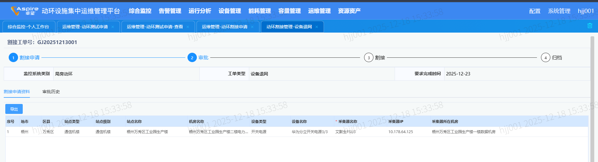

# 01业务说明

```
割接申请：
    新增入网：
        把测试割接完成后的设备接入进来（测试的设备机房和站点必须存在综资）
    调整入网：
    	
    站点退网：
    	
    设备退网：
    	把已经入网的设备进退网，设备类型必须为6？（这里需要确认） --> 根据我们要过滤的设备类型来看

    因此需要先建立 -- 站点机房设备的综资与动环关联
    

涉及服务：
	knowledgemanager
```


```
涉及相关表和日志
	入网：
		t_alert_network_accept_devic
		JOIN t_alert_network_accept_flow
		t_zz_space_resources room
		JOIN t_zz_space_resources
		JOIN zz_admin_area
		t_zz_power_specialty
	设备退网：
        t_zz_space_resources
        t_zz_power_device
        zz_admin_area
        t_cfg_ip
```



# 02查看关联数据

```
查看站点-（仅匹配precinct和resource表）
SELECT 
	resource_site.zh_label AS site_label,
	resource_site.int_id AS site_int_id,
	resource_room.zh_label AS room_label,
	resource_room.int_id AS room_int_id,
	site.precinct_id AS site_id,
	site.precinct_name AS site_name,
	room.precinct_id AS room_id,
	room.precinct_name AS room_name
FROM 
	t_zz_space_resources resource_site
LEFT JOIN 
	t_zz_space_resources resource_room ON resource_site.int_id = resource_room.related_site
LEFT JOIN 
	t_cfg_precinct site ON site.precinct_id = resource_site.precinct_id
LEFT JOIN 
	t_cfg_precinct room ON room.precinct_id = resource_room.precinct_id
WHERE 
	resource_room.zh_label IS NOT NULL 
	AND site.precinct_id IS NOT NULL 
	AND room.precinct_id IS NOT NULL 
	AND resource_site.space_type = '101'
	AND resource_room.space_type = '102'


查看站点-机房（综资关联情况 --> resource和special都匹配上）

SELECT 
	resource_site.zh_label AS site_label,
	resource_site.int_id AS site_int_id,
	resource_room.zh_label AS room_label,
	resource_room.int_id AS room_int_id,
	site.precinct_id AS site_id,
	site.precinct_name AS site_name,
	room.precinct_id AS room_id,
	room.precinct_name AS room_name,
	specialty_site.zh_label AS specialty_site_label,
	specialty_room.zh_label AS specialty_room_label
FROM 
	t_zz_space_resources resource_site
LEFT JOIN 
	t_zz_space_resources resource_room ON resource_site.int_id = resource_room.related_site
LEFT JOIN 
	t_cfg_precinct site ON site.precinct_id = resource_site.precinct_id
LEFT JOIN 
	t_cfg_precinct room ON room.precinct_id = resource_room.precinct_id
LEFT JOIN 
	t_zz_power_specialty specialty_site ON specialty_site.res_code = resource_site.int_id
LEFT JOIN 
	t_zz_power_specialty specialty_room ON specialty_room.res_code = resource_room.int_id
WHERE 
	resource_room.zh_label IS NOT NULL 
	AND site.precinct_id IS NOT NULL 
	AND room.precinct_id IS NOT NULL 
	AND resource_site.space_type = '101'
	AND resource_room.space_type = '102'
	AND specialty_site.zh_label IS NOT null
	AND specialty_room.zh_label IS NOT null
	
	
查看站点-机房-设备-ip（综资关联情况 -- 用于动环割接、动环测试等地方的资源设备）

SELECT 
	resource_site.zh_label AS site_label,
	resource_site.int_id AS site_int_id,
	resource_room.zh_label AS room_label,
	resource_room.int_id AS room_int_id,
	site.precinct_id AS site_id,
	site.precinct_name AS site_name,
	room.precinct_id AS room_id,
	room.precinct_name AS room_name,
	zz_device.zh_label,
	zz_device.res_code,
	zz_device.device_type,
	zz_device.lifecycle_status,
	zz_ip.city_name,
	zz_ip.device_name
FROM 
	t_zz_space_resources resource_site
LEFT JOIN 
	t_zz_space_resources resource_room ON resource_site.int_id = resource_room.related_site
LEFT JOIN 
	t_cfg_precinct site ON site.precinct_id = resource_site.precinct_id
LEFT JOIN 
	t_cfg_precinct room ON room.precinct_id = resource_room.precinct_id
LEFT JOIN 
	t_zz_power_device zz_device ON zz_device.related_site = resource_site.int_id	AND zz_device.related_room = resource_room.int_id
LEFT JOIN
	t_cfg_ip zz_ip ON zz_ip.site_id = resource_site.int_id	AND zz_ip.room_id = resource_room.int_id
WHERE 
	resource_room.zh_label IS NOT NULL 
	AND site.precinct_id IS NOT NULL 
	AND room.precinct_id IS NOT NULL 
	AND resource_site.space_type = '101'
	AND resource_room.space_type = '102'
	AND device_name IS NOT null

```


# 03设备退网举例说明

```
难点：资源设备的来源

将：梧州市 万秀区 万秀区梧州测试数据区工业园生产楼  梧州测试数据区工业园生产楼二楼电力机房 开关电源 --为例SELECT * FROM t_zz_power_device where 

	（将动环站点id-机房-id 与综资匹配起来，同时综资站点机房也是要关联起来-related_site关联）
	SELECT * FROM t_cfg_precinct WHERE precinct_name = '梧州测试数据区工业园生产楼';
	SELECT * FROM t_zz_space_resources where precinct_id = '01-07-16-05-04';
	SELECT * FROM t_zz_space_resources where related_site = 'SITE-ff80808155de01c501560093ff3e0030';
	
	SELECT * FROM t_zz_power_specialty（这个这里没有用到）

	（device_id与动环所属机房下匹配起来，站点和机房也是）
    SELECT * FROM t_zz_power_device 
        where related_site = 'SITE-0dbb8708ec7846e8963ce985ac0d915a' 
        and related_room = 'ROOM-c980d2e80a76463f823b4884816aabb6' 
        AND device_id = '00771006000003055429' LIMIT 10; 

	（将综资设备类型入到IP库里面  -- site_id,site_type,room_id,device_type,city_name,sity_name,room_name要与综资的一致--sql插入新增）
	SELECT * from t_cfg_ip 
        where 1=1 and device_name is not null 
        and device_type = 6 
        and site_id IN ('SITE-ff80808155de01c501560093ff3e0030')
   

这样在申请时，选择对应机房下（已经关联的设备），然后下拉采集器，则会回显IP库内已经申请的fsu设备
```

