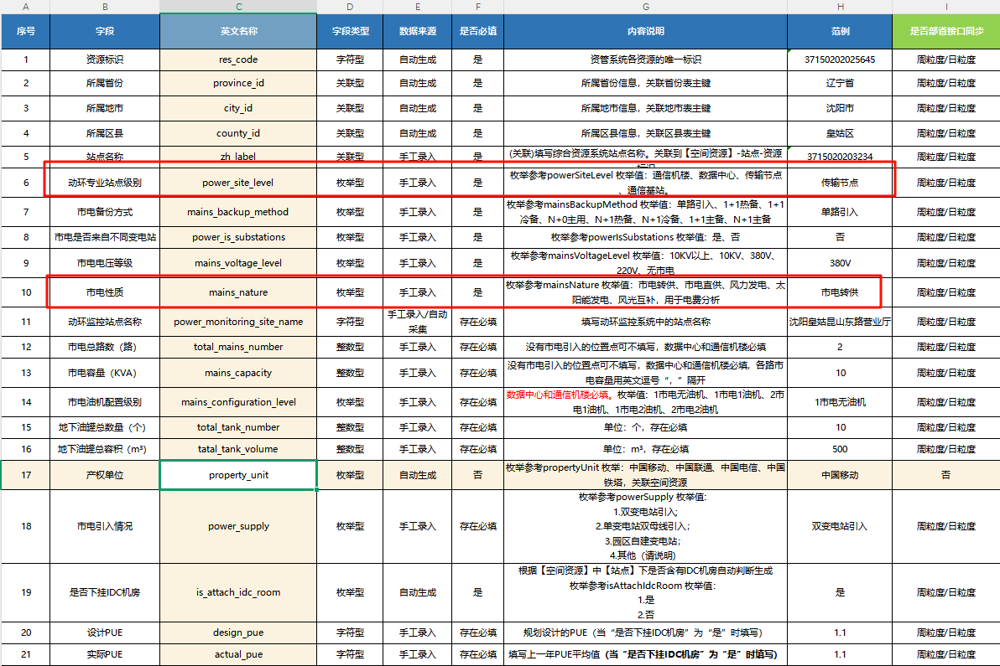

# 01功能说明

```
统计-综资（站点属性表中动环站点属性为传输节点的站点信息）
	汇聚局站：只要在站点属性表中，动环站点属性为传输节点就统计进去
	汇聚机房入网>=20250101
		这部分都是取（站点属性表中动环站点属性为传输节点，且该站点在综资-空间站点中对应的入网日期也范围内才会统计进去）
		存在疑问：是否是站点下的机房还是啥？
	
	涉及字段如下
```



# 02数据来源

```
1、数据均来自于es（通过 zz_data_sync_info配置的批次号，到es中匹配对应月份下对应批次然后回显）
2、主要涉及空间站点和站点属性两个索引，以及zz_to_rm_agg_convergence_site表
3、映射表、zz_data_sync_info（需要先修正好批次号）


涉及表：
    站点和站点属性索引
    zz_to_rm_agg_convergence_site表


业务逻辑：
	1、动环站点类型（取值站点属性索引），入网日期（取值空间站点索引）
	2、通过站点属性表为主 -> 然后再匹配空间站点内的数据 -> 组成一条数据（站点属性-zh_label -> 站点空间-int_id）
		过滤站点属性表（动环站点属性为传输节点的）- 入库到zz_to_rm_agg_convergence_site表


涉及服务：
	1、report、composite
	

涉及curl：
	curl --location --request POST 'http://localhost:30311/v1/report/zzData/site/curlAggConvergenceSiteTask' \
--header 'User-Agent: Apifox/1.0.0 (https://apifox.com)' \
--header 'Content-Type: application/json' \
--data-raw '{}'


测试点：
	1、站点属性未与空间的匹配（站点有空间没有，站点无空间有）
	2、站点属性（动环属性不为传输节点）
	3、空间站点（入网日期=20250101，小于20250101，大于202050101）
	4、站点属性（供电类型全部类型录入）
	5、站点属性（省市与空间站点中不一致 - 但int_id与zh_label关联正确）
	6、站点属性（映射多个空间int_id -> 只取一个）
	7、空间属性（映射多个站点属性zh_label -> 只取一个）

存在问题：
	1、目前是通过站点属性表 - > 直接去匹配空间表（即只要站点属性表是传输节点的就会去空间）
	2、导致现在有个问题，站点属性表中不为该省份，但是空间中是该省份的，也算进去了（即int_id和zh_label匹配，但省市不匹配）
	
	
造数：
	直接用工具中JT->zz下的脚本即可
```
