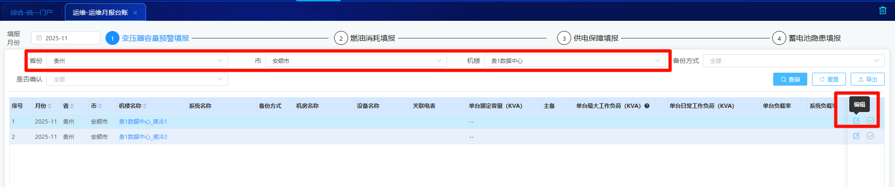
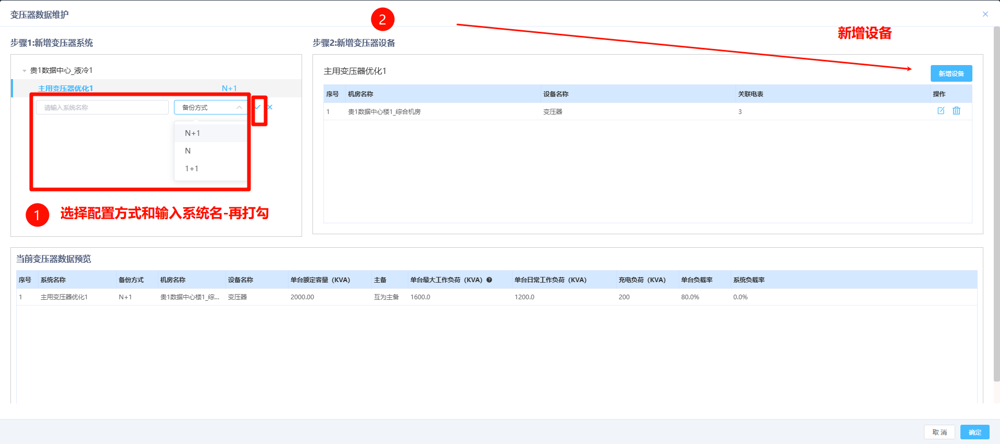
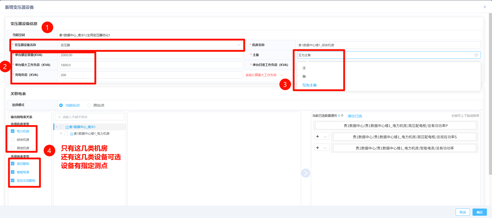
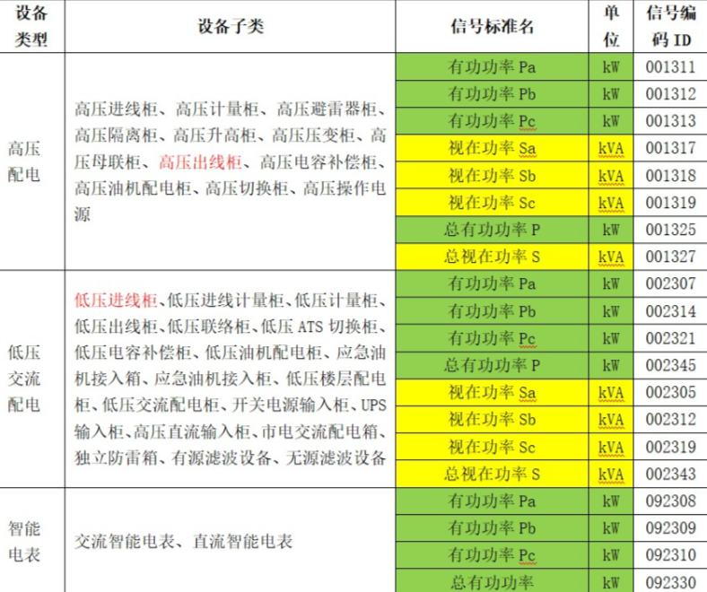
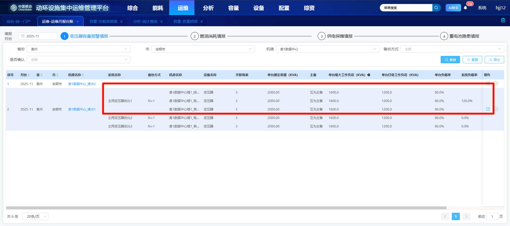
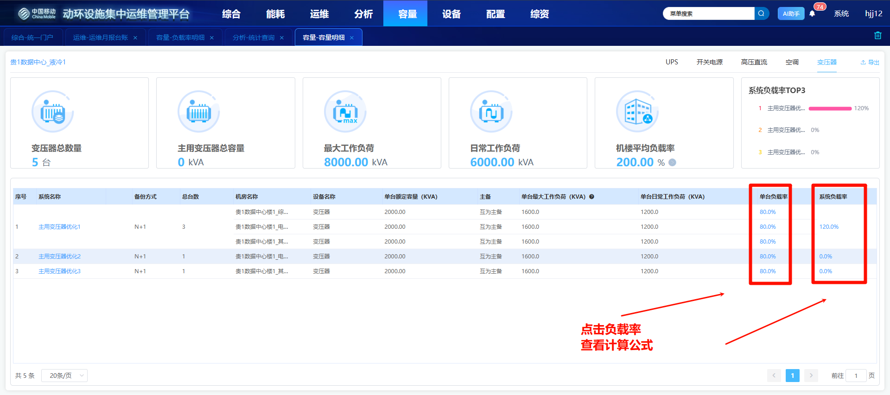
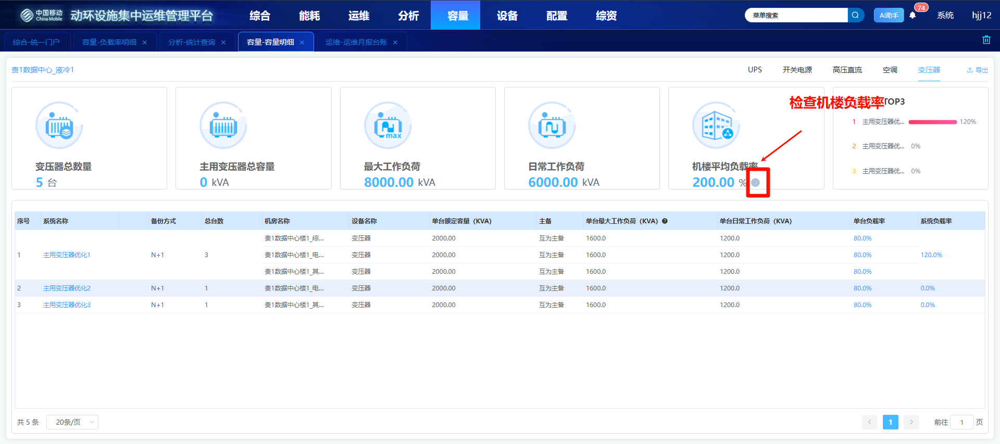

# 变压器

```
涉及模块或操作：
	容量-负载率明细（筛选变压器系统类型 - 操作-容量详情跳转）
	容量-容量明细（筛选变压器）
	容量-负载率汇总（看汇总率）
	分析-统计查询（查看遥测量历史数据报表-对应系统下设备测点是否有数据）
	运维-运维月报台账（配置变压器系统和关联设备）
	capacity服务
```

```
造数技巧：
	1、先进入运维-运维月报台账（过滤已经接入的楼栋/机楼） -- 进行系统配置
	2、配置要求：
		单个系统配置多个设备：
			即一个系统下面配置2-3个变压器
		可配置3种设备类型：
			高压配电、低压交流配电、智能电表；
		
		变压器设备名称：
			每个变压器都是对应对应机房的
        
        各类型测点取数有优先级：
        	【视在功率总功率S】＞【视在功率Sa/Sb/Sc】＞【总有功功率P】＞【有功功率Pa/Pb/Pc】
		
		顺序都没有找到（即测点均为找到），不计算负载比
	
	3、插入对应测点历史数据（走MPP数据库 --> 即使用性能造数脚本，或者直接写入mpp）
	
	4、触发接口计算
		curl --location --request GET 'http://10.12.12.184:32728/v1/capacity/transformer/audit/startTask?date=2025-12-18&precinctId=01-08-08-01-11-01'
	
	5、接着就是查看对应数据
        容量-负载率明细（筛选变压器系统类型 - 操作-容量详情跳转）
        容量-容量明细（筛选变压器）
        容量-负载率汇总（看汇总率）
        分析-统计查询（查看遥测量历史数据报表-对应系统下设备测点是否有数据）
```















```
取数问题[重点-本次修改]：
	
	主用变压器总容量 - 因该与系统负载率中的逻辑一致
		即sum(sum(单台最大容量)-max(单台额定容量))
	
	列表中的取数：
		应该只取变压器数量(而非变压器绑定的设备数量)
		其次就是无论测点是否有数据 - 主用变压器总容量 
			- 这块都是取手工填报的（有数据的是单台最大负荷才会变）
```


```
备份方式对应计算：
	N
		主用总容量：sum（系统内单台额定容量）
    N+1
    	主用总容量：sum（系统内单台额定容量）-max（系统内单台额定容量）
    1+1
    	关联设备测点无值计算
    	主用总容量：min（系统内单台额定容量）
    		注意：关联设备测点无值计算-使用填报值计算
    1+1
    	关联设备测点值计算
    		注意：关联设备测点值计算-使用填报值计算
```

