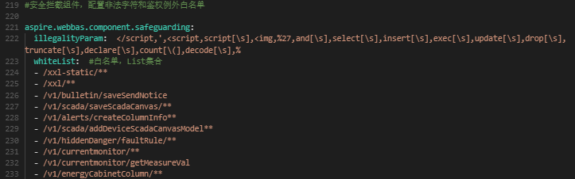
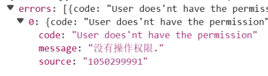
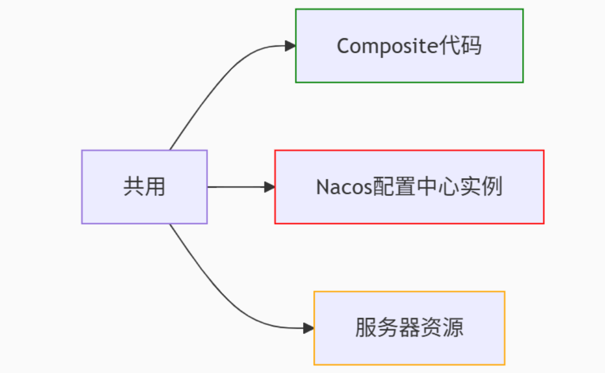
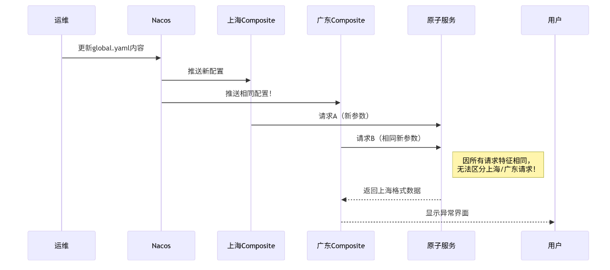
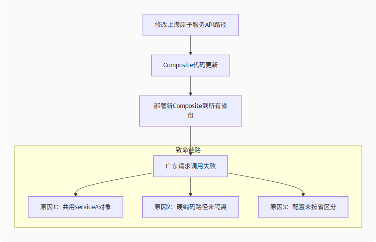
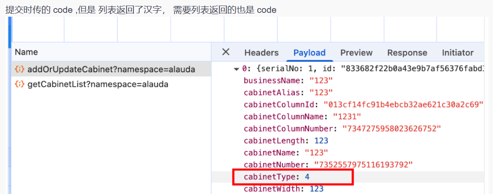
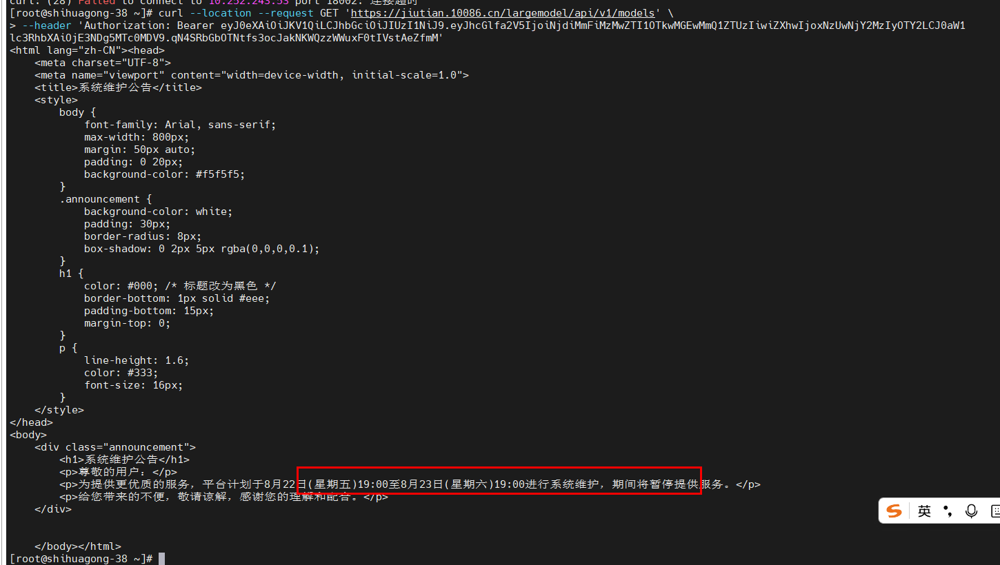
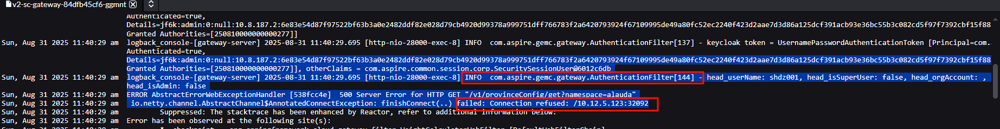
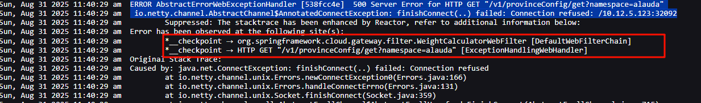
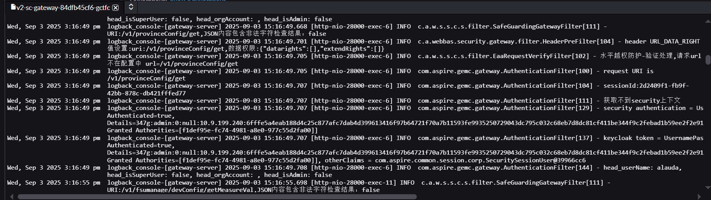

# 00_所有定位都必须经过【重点】

```
每个接口的参数都需要了解清楚，以及返回参数怎么对应【找开发拿接口】:有助于后续测试排查

1、记得多来回切换测试下
2、第一轮测完后，每个地方都点一点
3、验证完后，相关的点也再点一点
4、注意每次下载这些都不要忘了测
5、多切换才知道有没有反应慢之类的问题

6、所有时候都需要考虑到服务是否启动
	都要在nacos里面看一下
	
7、服务启动的日志信息
	服务启动成功、会有相关的es等相关的ip和端口【即其他服务的信息等】
	
8、es
	在nacos也有es的相关配置信息
	插入代码也需要结合这个es配置文件
	
9、所有配置均可以在nacos查看
	mysql、kafka、redis、es、rbac、webbas、b接口、c接口、fsu、omc等等
	
10、所有已服务均可在nacos查看
	mysql、kafka、redis、es、rbac、webbas、b接口、c接口、fsu、omc等等
	
11、每次修改都需要看流水线是否构建好，新开发环境是否成功

12、验的时候【重点】																							
	一个点验了，其他的都要点一下
	比如验证一个页面查询，那么就顺便看他的字段，导出等等情况，即页面有的所有的东西
```


# 01_403输入字符错误

- 请求是特殊字段校验出错 - 即403字符错误类【配置特殊字符白名单, 在 gateway中配置连接】
- 根据环境情况，到nacos进去对应环境【哪个省份或是集团】
  - 搜索 -- > application-gateway.yaml 【网关配置】
  - 在aspire下whiteList下配置请求失败的接口 -> 即可解决这个问题
    - 书写格式/v1....接口【上海目前时改application-gateway.yaml】
    - 
  - 注意加入完成之后，需要在nacos里面看这个服务在哪里，然后到cicd中找pod ip一致的，进行重新部署
  - 是否加字符串就根据已有的来判断


# 02_403无权限问题

- 以上海需求
  - 原先是由后端控制的，但是现在是由前端控制
    - 控制是通过url与xml做绑定
      - 即系统管理-机构角色管理，里面来做判断

    - 如果是没有权限的话，就是找前端，然后把对应的url给到前端，让前端做绑定

  - 注意：
    - 上海这一块，后面问了前端，说是接口权限问题 ，需要前端跟后端进行沟通。

- 以集团ai助手为例
  - 当时删除403，无权限问题
  - 原因：后台的操作权限加的时候，黏贴的时候，多了几个字符，导致操作的权限对不上
  - 具体看 -- 服务器不知道能不能找出来，是开发找到的
  - 


# 03_v版本问题

- 由于各个省份用的都是v版本
  - 有些服务可能是多个v版本公用的，因此开发每次改动的时候，可能会影响到其他v版本的使用，需要提前考虑好
  - 而集团基本什么服务都有，即v版本的都有，v版本其实就是广西和集团里面迁移出来的、除非是特别省份做定制的除外


# 04_登录出现内部错误

- 这种情况根据以下方式解决
  - 查看接口，看有没有完整提示，如果没有需要到对应服务器
  - 根据环境，在cicd里面查找对应环境的webbas/rbac服务，看对应日志
  - 一般的话都是因为输入连续数字造成的


# 05_composite共用校验

- **疑惑点**

  - 很重点、需要解决这个问题

  - 是否只是测试环境才是共用环境，而线上环境的话是区分的

  - 因此测试的时候才会影响到，因为一方打了分支，另一方验的就是其他的了

- **前提**

  - 要该省份用到这个同样的功能时，才会受影响，如果不上，那就不会有影响
  - 原因：**Nacos配置未按省隔离 + 请求无身份标识**
    导致Composite在调用原子服务时，**上海请求和广东请求完全无法区分**

- **首先理解composite【就是共用一个封装层 -- 业务逻辑、处理流程一致】**

  - 前端【广东、上海】都是接入这个composite封装层

  - 主要是业务逻辑或数据处理流程都是相同的【即对原子服务调用提供接口】

  -  如果某个省份的后端系统需要升级或替换，只要它提供的接口契约（输入输出）不变，`Composite` 层内部的适配逻辑修改即可，不会影响上游调用方和其他省份【所以接口如果变动是会影响到的】 -- 例如上海的机柜管理，就影响到了广东和内蒙的

  -  

    
    
    

- **共用方式【重点】**

  - **同一套代码库：** 省份的 `Composite` 服务都从同一个代码仓库构建【更新也是会更新到同个代码仓库、这也就导致接口不同时会有冲突】

- **目前有些省点是共用某个服务的【因此一个改动可能会影响到其他省点】**

  - 目前上海、广东sc、重庆【共用一个composite -- 即所有业务请求都会从这里开始】

# 06_集团的字符错误


# 07_404报错

- 以移动ai助手来说
  - 到服务器看了日志【对应assistance原子服务里面】
  - 看到是前端传值缺失了id造成的
  - 并且f12中可以看到响应为无效请求、参数值有问题
- 以webai助手来说
  - 到服务器看日志【发现请求没有走到日志】
  - 因此判断是接口路径缺失关键字导致的

# 08_204错误

- 以集团web来说【目前不知道什么问题】
  - 登录的时候，返回204错误，属于后端逻辑错误【正常是拿到token响应】
  - 

# 09_集团空间树加载错误

- 以集团moa来说
  - 首页进去就是空间树【顶部全国、站点类型、站点】
  - 首页进来就加载不出【就是能耗树服务挂了或是configmanagement服务挂了】
  - 一般重启之后再检测一下就没问题了
  - 当时排查的服务
    - spider_kernel_energy-service，composite、configmanagement

# 10_composite统一校验

- 目前所有的请求，都会先通过composite封装层，进行请求校验
- 因此一些特殊字符会在这里被过滤提示
- 以集团moa来说
  - 手工添加知识库信息，输入带%的字符
    - 接口到composite就会先过滤，识别到有特殊字符就会返回，不会再到原子服务

# 11_500错误

- 以集团web和moa的ai助手来说
  - 当时是因为服务器卡住了【但是nacos看到服务列表里服务是启动的】，导致请求失败
  - 重启一下即可
- 新问题
  - 有可能是暂时性，刷新重试即可

# 12_503错误

- 待补充


# 13_200但是是错误的

- 以上海为例
  - 当时机柜列编辑时、前端传入机柜类型参数与后端返回的不一致
    - 但是时cabinettype字段，前端传的枚举数据，但是后端返回过来枚举是中文，倒是校验失败
    - 同时后端需要通过中文字符来写入，因此增加了cabinettypename
    - 当时是在cabinet服务器里面发现的 --- cabinet_type字段出错了
    - 

- 以集团为例
  - 当时ai助手这一块
    - 发送消息前端发送成功，但是后台响应却出现了500，后面通过接口去判断，结果显示是在升级，导致的服务有问题
    - 

# 14_树结构搜索问题【接口参数】

- 以内蒙古为例
  - 运行分析——市电停电分析，模糊搜索无跳转【是接口传参问提】
    - 当时树结构接口（市电停电配置、市电停电分析等都是调的同个接口）
      - 然后市电停电配置是可以的搜索到的
      - 因此模拟输入模糊，点击搜索后，看接口信息，判断是否是传参问题
    - 最后检查出来时接口传参问题
      - 需要传的时showbuilding，但是市电停电的传成了showstation
      - 导致模糊搜索只有站点的【在输入的时候就会发起请求、给到后端返回对应楼栋】

# 15_csv类文件数据数字校验-ftp

- 以集团为例
  - ftp需求中，导出的csv文件，小数点最后位为0都会被省略问题
    - 可以用note++看是不是真的缺失，如果没有，那就是csv打开后默认修改了
    - 可以看手机等信息，默认打开都会变成科学计数法，因此导致的问题

# 16_文件导入对应服务检测

- 【这一块不是很清楚，可能需要询问清楚点】
- 以上海，广东为例
  - 机柜里面的导入导出好像都是同个服务啥的
  - 目前导入和导出都是文件都是一致的，只是处理逻辑不同

# 17_页面内容空白问题

- 以集团为例
  - 当时用自己账号进去运维-通知，页面没有报错，但是确实空白的
    - 后面切换了最高权限aluada账号后，就有显示内容
    - 【应该是权限设置的有问题，具体需要怎么设置还不清，需要问下】、

# 18_新增测点配置无法显示

- 先在对应环境的动环数据库下，t_cfg_mete表里面加上这个测点记录
- 然后还需要在环境对应的中间库下，t_cfg_mete表里面加上这个测点记录【与动环里面加的是一样的】
  - 然后到nacos看config的服务列表配置在哪个服务器【一般只有一个的，有两个先下线一个】
  - 然后根据那个ip，到虚拟机里面，查看对应config的容器服务，进行重启【直接重新部署可以吗】
    - 进入管理员sudo -i，才能执行docker start 对应容器id 
  - 然后到fsu模拟器，重新上报
  - 上报完成，在t_cfg_metemodel_detail看是否加载进来，进来就可以了

# 19_页面登录后空白响应500/503错误

- 以上海为例【需要补充完善 】
  - 当时登录进来后，页面是空白的，f12看了，显示服务器问题
    - 从以下几个方面进行追溯问题
      - 1、首先是看了rabg服务、是正常登录
      - 2、看了gateway服务、定位出了是在网关认证的时候，连接不到网关认证服务【不知道是不是没开白名单、即没有在配置文件中打开权限】
        - 
        - 
        - 
    - 再看了其他服务
      - 1、开发说是composite、sh-service有问题，无法构建
    - 503时解决问题：
      - 方法1：通过重启对应config服务，有效

# 20_前端页面与后端的服务问题

- 注意：理解这个很重要
- 以所有系统为例
  - 页面展示的是前端的服务【ip与后端是不一致的 -- 他们是分开来设置的   -- 好像是还没联调好】
    - 因此登录或是请求这些【因为被ng反向了，看不到真正的请求ip】 -- 那些才是真正的后端ip和端口 -- 即接口
    - 因此前端页面能访问，不一定就说后端服务也是好的


# 21_插入es数据页面不显示

- 以上海为例
  - 机柜断电分析实时数据，这一块是会每五分钟，对es中设备三路测点最近一次的采集和阈值比较，但是插入es数据后没有获取
    - 当时与开发分析出的问题
      - 1、是因为es的索引判断有问题，开发把索引写成了fsu_日期__01_19，导致我广东的站点不能匹配到【直接被写死了】
      - 2、后面修改了es的判断结构，就修复了，能够正确获取到es对应的数据

# 22_条件查询展示问题

- 以上海为例
  - 当时机柜断电分析、实时和历史进行多条件且多选传参、后端那边说给请求他看【主要看前端传的参数是否正确】
    - 目前是因为传参为空：导致数据没出来，查询条件内容没展示
    - 后端让前端改了，好像还有就是添加对应的参数值即可了

# 23_503/500/404/400错误

- 以广西为例
  - 目前出现503、500错误大多是服务器在部署，等待部署完成后再访问就没问题了
  - 400,404一般也是服务之类有问题，或是偶发性，多是几次就没事【如果还有就是bug了】
  - 还有种情况就是服务挂了，config服务或是composite等服务有问题


# 24_服务定位

```
目前所有的接口都是走composite
如果在对应服务里面找不到日志，可以看composite的
```


# 25_接口服务的定位【重点】

```
一般接口里面会描述到
比如v1/xxx/xxx，这时里面就可能会提及到对应服务
```

