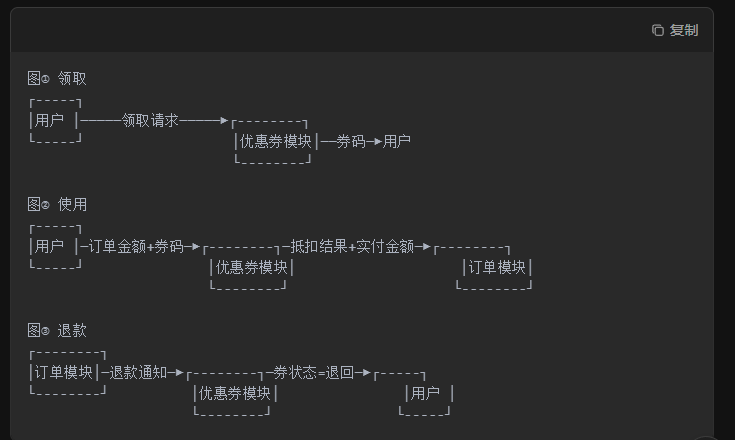
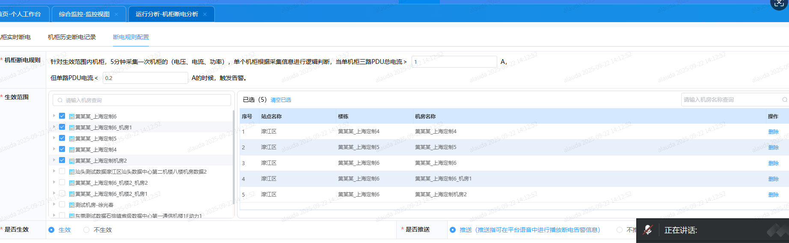
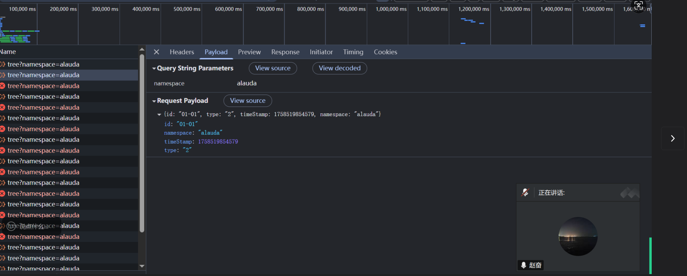
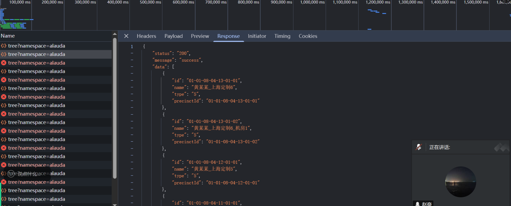
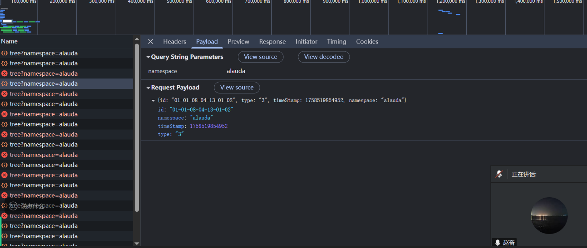
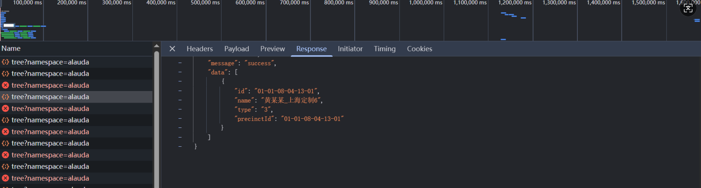
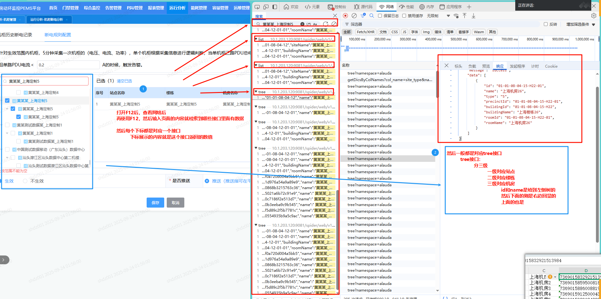

# 00_测试排查方法结合

| ①追问 | 把一句话需求拆成 5W2H | 5W2H + 场景追问清单         | 需求澄清表（表格化） | 5 min  |
| ----- | --------------------- | --------------------------- | -------------------- | ------ |
| ②拆模 | 把功能拆成“黑盒模型”  | 快速上下文图+IPO+状态机草图 | 草图/便利贴          | 5 min  |
| ③补边 | 补全隐形质量属性      | 8 维质量对照表              | 质量风险表           | 5 min  |
| ④盖全 | 一键生成最小覆盖      | 组合+边界+错误猜测          | 测试矩阵/思维导图    | 10 min |
| ⑤回放 | 用 1 分钟讲给产品经理 | 口头走查                    | 确认/微调            | 5 min  |

1. **追问（5W2H 清单，可直接打印贴显示器）**

| 维度     | 追问句型         | 示例（需求：支持优惠券）         |
| :------- | :--------------- | :------------------------------- |
| Who      | 谁来用？权限？   | 新注册/老用户/内部运营？         |
| When     | 什么时间可用？   | 下单前/后？退款时是否退回？      |
| Where    | 入口在哪？       | 商品详情页、购物车、结算页？     |
| What     | 输入、输出？     | 券码格式、面额、门槛、叠加规则？ |
| Why      | 业务目的？       | 拉新还是清库存？                 |
| How      | 如何领、如何用？ | 自动发放还是手动领取？           |
| How much | 量/性能？        | 并发 1k/s，券总量 10w？          |

1. **拆模（IPO+状态机草图）**

```
画 1 张上下文图：矩形=系统，箭头=外部角色+数据。

再画 IPO 表：Input | Process | Output，每列写 3 行就够。

若带生命周期，拉 1 条状态机：初始→待使用→已使用→已过期，先画主线 4 状态，再补异常箭头（退款、作废）。
```

| 节点 input | 谁/什么系统   Process | 必问句型  Output                 |
| ---------- | --------------------- | -------------------------------- |
| 触发端     | 用户、运营、第三方    | “他输入/传进来到底是什么？”      |
| 被测模块   | 优惠券、登录、审批流… | “输出去的是什么？失败怎么通知？” |
| 接收端     | 订单、支付、消息中心  | “接收后还会再吐出别的数据吗？”   |



```


1. 图里出现的每个箭头，就是未来至少一条测试用例。
2. 如果某个节点只有“进”没有“出”，或只有“出”没有“进”，99% 有逻辑缺口——立刻追问产品。
```


1. **补边（8 维质量表）**

```
把 ISO25010 缩成 8 词：功、可、安、性、易、兼、可、移。

逐词问 1 句：
	优惠券功能在这维有没有要求？没有就标“无”，有就写 1 条最高风险。

例：
- 性能：秒杀发券 1w/s，会不会超卖？
- 安全：券码被 brute-force 遍历怎么办？
```

| 维度     | 逼问句型                       | 现场回答举例                     | 立刻转成可测项                                   |
| -------- | ------------------------------ | -------------------------------- | ------------------------------------------------ |
| **功能** | 除了“能用”，还有“不能怎样”？   | 不能重复用、不能叠加、退款要退回 | 用例：重复提交同一张券 → 系统拒绝                |
| **可靠** | 突然断电、网断了会怎样？       | 券已扣库存但没写订单             | 用例：下单接口超时重试，券不能重复扣             |
| 安全     | 坏人能刷券吗？                 | 遍历券码、SQL 注入               | 用例：1000 次错误券码输入 → 触发验证码/锁定      |
| 性能     | 秒杀 1 万人同时领券？          | 库存超卖                         | 用例：JMeter 并发 1k，券库存=100，最后 DB 库存=0 |
| **易用** | 奶奶能不能看懂？               | 券已过期还显示“可用”             | 用例：过期券在结算页灰掉并写“已过期”             |
| 兼容     | 微信小程序、App、H5 都要支持？ | 入口不一致                       | 用例：同一券在 3 端各走一遍下单流程              |
| 可维护   | 以后券规则天天改，好改吗？     | 硬编码门槛 100-10                | 用例：配置中心改门槛 200-20，无需发版立即生效    |
| 可移植   | 以后换阿里云/腾讯云？          | 券码生成规则依赖自增 ID          | 用例：导出新环境，券码不能重复                   |

1. **盖全（测试矩阵 3 刀）**

```
刀1：组合

- 把“入口×用户类型×券类型”做 Pairwise，3 因子各 2 水平→4 条用例即可覆盖 8 组合。
  刀2：边界
- 金额门槛 100 元：写 99.99、100、100.01 三条。
  刀3：错误猜测
- 券码多输 1 位、少输 1 位、含 O/0 混淆。

把结果扔进 1 张 Excel 矩阵：行=用例编号，列=因子，值=水平，10 min 可拉 30 条。
```

1. **回放（1 分钟讲故事）**

```
拿着矩阵，用“Given-When-Then”口头讲 1 条主路径+1 条异常路径，产品经理 30 秒就能听懂，当场拍板或补需求。
```

养成习惯：把“测试方法”内化成提问肌肉

```
- 每次需求评审，带 1 张“追问清单”空表，现场填，比事后写用例快 3 倍。
- 用思维导图工具（XMind/幕布）保存“因子-水平”库，下次同业务直接拖。
- 每周复盘：把【漏测缺陷】反标到矩阵里，下次同类型需求自动多 1 列“历史坑位”。
```

矩阵说明

```
因子，其实就是前置条件，操作步骤

用例ID	因子A	因子B	因子C	预期	优先级
TC-001	温湿度	35℃	<40℃	正常	P0
TC-002	烟感	0	>40℃	告警	P0
TC-003	门磁	1	<40℃	告警	P1


列 = 因子（输入/触发条件）
行 = 用例（因子水平的组合）
预期 & 优先级 = 一行就能跑
```


# 00_前后端定位技巧【重点】

```
技巧一：
	前端交互都问题，看控制台
	后端交互有问题，看接口

技巧后
	后端：看日志
	前端：看请求参数
```


# 01_查询条件类验证

```
注意点
    - 验证查询之类的需要看他的返回情况【很重要】
          - 其次要看他的传参是否正确，是否缺失参数之类的，导致查询失败的
          - 还需要看下响应是否是正确的
          - 是否有待参数 -- 即参数是否有，没有要说
    - 查询时，为空也需要验证一下他们的提示情况
    - 切换前条件，后面的需要自动清空
    - 如果条件有联动关系的，还需要检测联动性是否一致
          - 如果切换前置是否会重置后续内容
          - 如果切换前置后，后置是否能跟新的前置条件一致等情况
          
注意点2：
	需要给后端看请求
	目前是因为传参为空：导致数据没出来，查询条件内容没展示
	是否有待参数 -- 即参数是否有，没有要说
```


# 02_前端页面触发无效

```
问题分析：
	以广西的为例，目前使用页面的查询啥按钮的，但是没有反应的情况
		这种情况目前是前端问题，但是后端排查不到问题
		因此需要通过接口，直接绕过前端，去检测后端是否有问题，这样就可以节省时间
		无需等到前端修复完成才能测后端
		
问题排查
	前端触发无效【先看下控制台】，确定后跟前端说明情况
	其次，需要直接获取接口，到postman【去学apifox】进行接口触发，看接口有无问题，【如果不知道接口需要问下】
```


# 03_接口展示数据不对应  - 枚举

```
问题分析：
	以广西为例，机楼视图的高温图标，页面虽然只需要展示满足的机房数和比例，但是接口返回的其他值也需要检查
		首先，接口的传参需要检查，看是否传的对【目前是日期类型有两个1和2，但是默认请求发的是0】
		因此这个是由问题的，然后高温和低温用的也是同一个，接口返回的温度值一直没变，与触发值不同
		

问题排查：
	1、首先是前端在传递参数的时候，参数不对【日期枚举应该只有1和2，不该为0吧】
	2、通过接口工具，直接进行指定参数去调用，看与实际页面去调用的区别是什么
	
	检查接口的传参是否根据规定的来传递
	如果接口传参不是根据规定的来传递，那么应该就是前端传参问题，导致的数据有问题
```


# 04_显示错误问题

```
问题分析：
	以上海机柜断电分析为例，页面展示的树结构有问题
		首先，把机房显示在了站点的位置，导致数量重复了
		默认树结构展示：站点 - 楼栋 - 机房
			然后主要调用的tree接口：
				前端根据创type，来控制后端返回的结构
				2 - 2 - 站点；
				3 - 3 - 楼栋；
				5 - 5 - 机房
		
		
问题排查：
	1、刚开始以为是前端提取数据有问题【跟前端对了，是后端的问题，同时也是自己没观察仔细】
	2、主要是没有去看接口，没有去观察传参与返回的关系【太马虎】
	3、树接口 - 一般都是对应tree接口
```












# 05_数据展示不一致接口检索[重点]

```
问题分析：
	以上海机柜断电为例
		树结构层级展示错误，还有就是左侧回显问题
			树结构：
				当时是接口传值和返回有问题，使用技巧F12后，到网络，按住CRTL+F，通过页面值直接查询
				好处可以直接看到是哪些接口返回的，然后定位到接口，看接口对应的传参问题
			左侧回显：
				页面回显，站点名称不是站点，而是机房名称
				数据来源，是通过tree接口，请求type为5的返回参数
				
问题分析：
	通过快捷键：先f12进到网络，然后ctrl+F
	通过把页面错误的数据复制，然后放到搜索框搜索
	会返回所有相关的接口 - 【即返回结果为我们所输入的内容】，然后检查返回类型和输入类型是否有问题
	
	目前这个的话，断电配置里面，所有数据都是通过tree来的
		tree是通用接口，但是前端是调用多次来实现树结构【前端不是一次性拿取的，是通过每个接口层级拿的】
			首先进来调用tree，传的是2 - > 返回站点
			其次是tree，传的是3 -> 返回楼栋
			最后是tree，传的是5 -> 返回机房 【这个还带有全部信息 - 用于右侧的来回显】
```




# 06_分页校验

```
注意点：
	需要校验每个层别的分页，展示，跳转数 -- 有问题就看接口返回
	记住检查时要看接口切记
	除了数据逻辑注意的就是看接口，日志，控制台了
```

