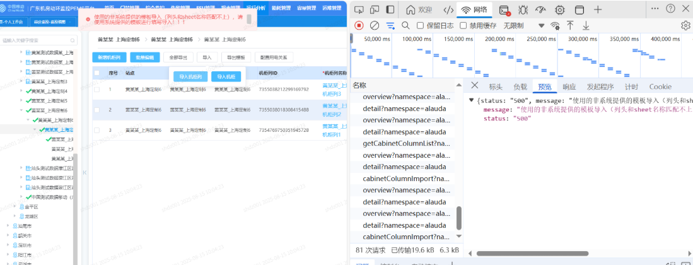
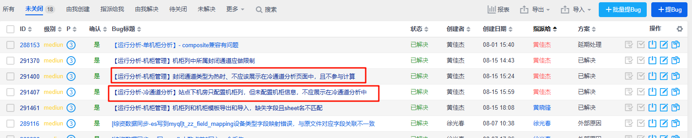

# 01_冷通道分析 展示修改

- 目前修改为，机柜列类型为热时，不展示在页面
  - 根据数据库表energy_cabinet_column的channel_type来控制
  - 1为冷，2为热
  - 但是目前还有问题，就是控制了不展示，但是计算还未控制【需要确认】

- 需求中要求的是创建了机柜的才会展示在冷通道
  - 但是目前是只要有机柜列，机柜列是冷通道就展示了
  - 需要确认一下

# 02_机柜管理

- 导入目前还有问题
- 

