# 机柜断电分析

补充内容 -- 这块不是很清楚 -- 好像是其他需求的

```
从es里面取（5分钟内不一定能取得出来，0分和45分会进行一次保存，确保对方时效性有5分钟，现在是没有的，中间库是否真的取到5分钟）
	c接口有个东西：c接口取接，啥啥啥，然后再到了中间库【希望是5分钟，但是对方做不到5分钟给，但是取的是伪数据，那么他的】
	c接口配置：signalsynccron  -- 这里就是定时任务【如果能去到5分钟，就可以调频繁一点】，现网可能是45分钟这样
	业务上【量还是可以--每次只取时间最大的--即一个小时内，取最后一条，就是最大的一条，如果业务允许就可以放长时间】-这样就有预留时间
	【会有定时任务采集，但是当时5分钟采集是没有回来的，导致数据踩不到，因此可能要把时间放长 -- 这里就是做个配置项，目前是一个小时，到时候再根据需求调，每次支取最大一条】
	实时的会放到历史表里面


实时维度，数据也要更新
	告警生成是自增id还是什么，目前采用的uid
历史维度
	id是自增id
	
```

## 需求逻辑

```
机柜实时断电 -- 消除规则
​		1、根据系统采集比对（系统消除）
​			消除后，实时删除，然后会到历史里面
​		2、手动
​		3、规则消除


实时数据
	每5分钟内轮巡es中最新的一条数据用于定时任务对比
	每整点5分钟执行定时任务 - 开始时间展示为整点
```


## 数据准备

```
注意：
	1、数据取的是历史数据，因此插入的数据时间不能大于当前时间，不然调接口也看不到
	2、


01-01-08-04-11-01
01-01-08-04-12-01
01-01-08-04-13-01

步骤1：
	1、先接入fsu（目前在三个站点的机房下接入了fsu -- 黄某某_上海定制4-6）
	
步骤2：
	1、进入运行分析-机柜管理-树结构进到机房层级
	2、创建机柜列
	3、机柜列下创建机柜
	4、对机柜进行用电关系配置（配置三路的电流 -- 同一设备）
	5、目前配置情况（待补充、有脚本）
        上海5
            机柜列5
                机柜51
                    UPS配电
                        00001006000000154117、meteid：6410900009301000001，metecode：009301，分路XX相电流Ia
                        00001006000000154117、6410900009302000001，009302
                        00001006000000154117、6410900009303000001，009303
步骤3：
	1、通过python脚本、对三个站点下机房下的对应设备的测点进行es历史数据插入
	2、插入原则：
		1、站点4仅插入两个测点值 -- 验证不满足3路数，不进行断电判断和展示
		2、站点5插入三个同一时刻数据 -- 验证3路取到，是否进行断电和展示
		3、站点6插入不同时刻的数据 -- 验证3路是否能渠道，是否进行断电和展示
		4、每次执行完后，再次插入新数据，看数据是否能更新
```

```
目前取数逻辑
	1、取的是es的数据【然后会取该时间点，前24小时内最新的数据，因此需要造前24小时内的数据   -- 就是每个机柜用关系配置的三个测点的最新值】
	2、目前好像是一下两种情况都行【目前两种清空都是可以的】
		1、需要先启动配置、然后在es里面插入该时间点内前24小时内的数据【最好是30分钟内】
		2、可以现在es里面插入该时间点内前24小时内的数据【最好是30分钟内】、然后再启动【因为启动后正常是回去检索的、但目前好像没有】
			需要待确认
	
```


## 日志流程

```
composite：
	所有对原子服务请求的情况 -- （文件导出错误问题，会记录）
sh-service:
	针对规则配置、实时断电、历史断电 -- 查询，定时查询的功能即日志，以及导出的日志


日志检索判断
	实时断电
		每五分钟内都会轮巡查找设备值：
			检索语句：
		每整点5分钟会执行断电定时任务：
			检索语句：开始执行机柜断电分析定时任务
		每整点5分钟会执行断电定时任务进行数据判断与校验
			检索语句：会先输出对应设备总电流和各支路值（如果没有找到生效断电规则配置会跳过 -- 未找到生效的断电规则配置，跳过本次分析 ，从数据库已有的添加）
		查询时：
			检索语句：查询当前断电记录业务
		每整点5分钟执行断电定时任务完成
			检索语句：机柜断电分析定时任务执行完成
	断电规则配置
		新增或修改配置：
			检索语句：开始新增或更新机柜断电规则（断电规则阈值已变更，重新判断所有机柜的断电状态）
		断电推送：
			检索语句：断电告警推送功能已配置启用

	历史断电：
		查询
			检索语句：查询历史断电记录
	
	


2025-09-02 10:00:00.835  WARN 6 --- [   scheduling-1] .a.s.m.c.s.b.i.CabinetPowerOutageBizImpl : 黄某某_上海定制5/黄某某_上海定制5/黄某某_上海定制_机柜1机柜PDU断电报警
2025-09-02 10:00:00.835  WARN 6 --- [   scheduling-1] .a.s.m.c.s.b.i.CabinetPowerOutageBizImpl : 机柜黄某某_上海定制_机柜1触发断电告警，总电流：80.0A，支路1：30.0A，支路2：40.0A，支路3：10.0A
```

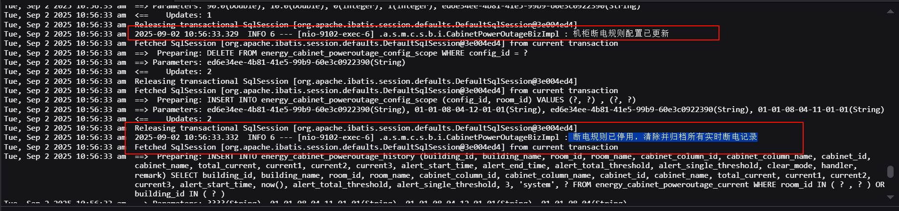


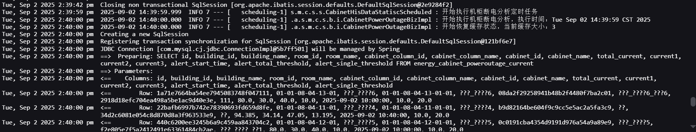


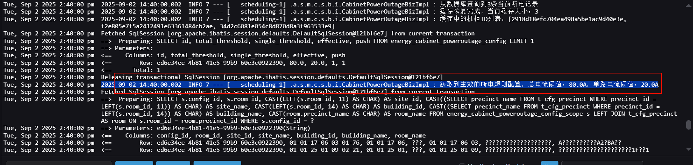


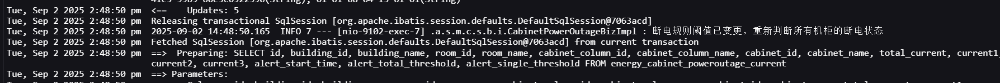


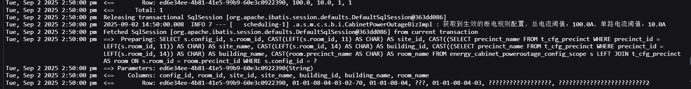


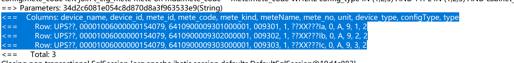


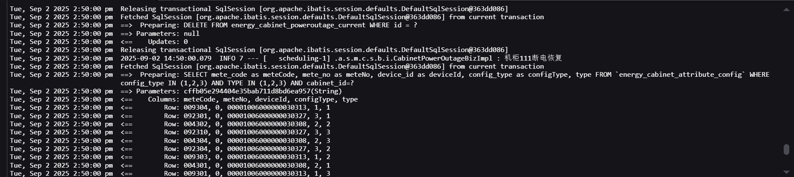


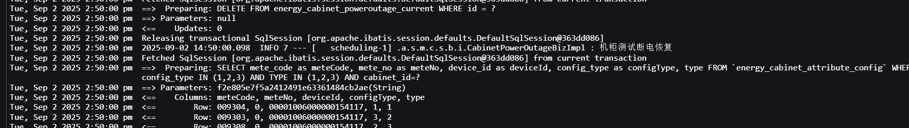


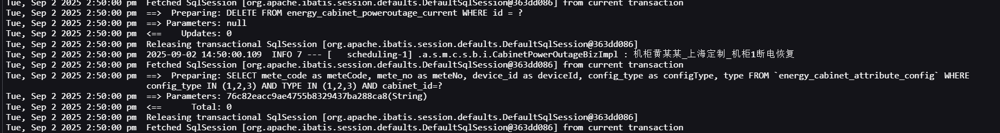


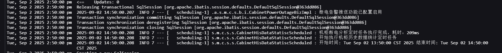


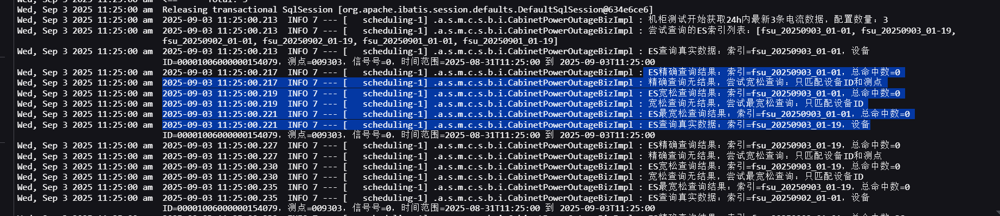


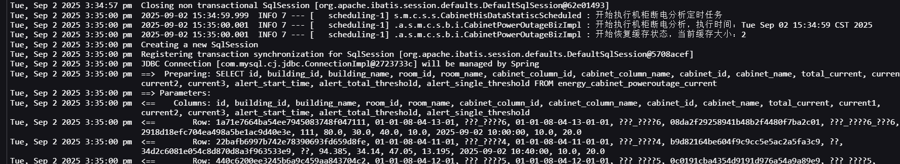


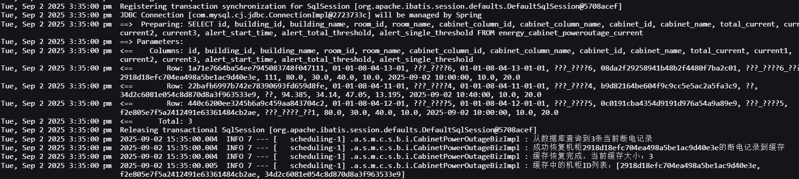


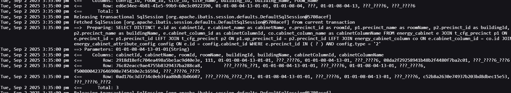


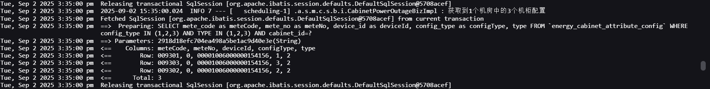


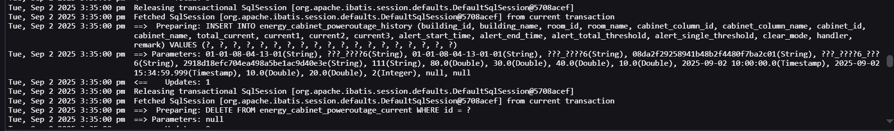


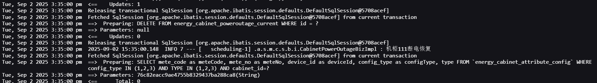


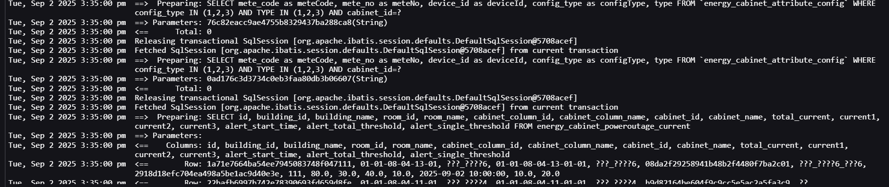


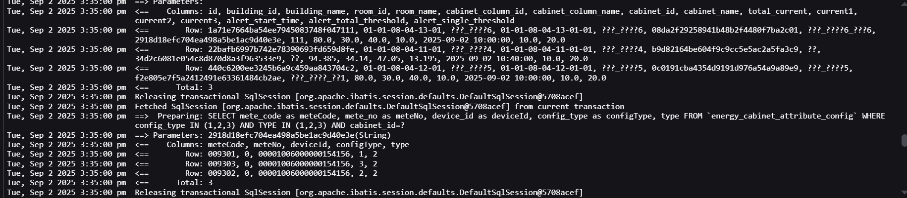


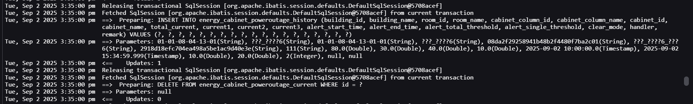


## 验证步骤

```
说明：
	目前配置规则：
		1、修改任意阈值保存后：系统所有实时告警全部消除
        2、修改为不生效：系统所有实时告警全部消除
        3、修改生效范围（删除的机房的机柜断电实时数据需要消除，新增的机房的机柜断电需要进行行5分支采集判断  -- 目前好像是修改就全部去除）
        


第一轮：验证告警生产
数据已造

第二轮：验证告警实时替换
数据已造

第三轮：验证告警消除（系统消除）
第一步：告警生产数据已造
第二步：告警消除数据已造


第四轮：验证告警消除（系统消除-修改阈值）
第一步：告警生产，数据已造
第二步：修改任意阈值配置配置，验证数据，全部实时应清除

第五轮：验证告警消除（系统消除-修改不生效）
第一步：告警生产，数据已造
第二步：修改为不生效，验证数据，全部实时应清除


第六轮-1：验证告警消除（系统消除-切换生效）
第一步：修改为生效
第二步：直接跑

第六轮-2：验证告警消除（系统消除-切换生效）
第一步：告警生产，数据已造
第二步：修改为生效，验证数据，告警能生产


第六轮：验证告警消除（系统消除-删除生效范围）
第一步：告警生产，数据已造
第二步：修改生效范围删除部分，验证数据，被提出机房下机柜实时数据均剔除到历史表中


第七轮：验证告警消除（系统消除-新增生效范围）
第一步：告警生产，数据已造
第二步：修改生效范围新增部分，验证数据，被新增机房下机柜实时数据应进行采集校验


第八轮-1：验证告警消除（手工消除）
第一步：直接跑数据
第二步：手工消除


第八轮-2：验证告警消除（手工消除）
第一步：告警生产，数据已造
第二步：点击消除，验证数据，实时数据删除，转移至历史表


第八轮：验证告警消除再次触发（手工消除）
第一步：告警生产，数据已造
第二步：点击消除，验证数据，实时数据删除，转移至历史表
第三步：再次触发告警
```

## 修改问题

```
规则恢复
	目前5分钟排查后，能够恢复，统计到历史表（这里是通过修改阈值 -- 应该展示未规则消除）

系统恢复
	目前无法实时更新数据
	
	
手工恢复
	目前无效
	
	
实时表和历史表
	排序依据是什么
	
	
消除警告
	每次入库都存在重复
	
	
数据实时更新
	目前还未更新
	
	
告警语音预报
	首次触发是会有的，只要不消警重新触发的话--后续仅跟新数据
	
	
时间展示有问题
	存在没有整点的清空，即01秒等情况
	
数据小数点保留
	目前不是保留两位

数据颜色展示
	总电流
	单机柜低于阈值

消除逻辑还有问题
	目前逻辑
		第一次：触发告警
		第二次：有新增值，并且新增值也是满足告警（然后第一次的直接被消除了，展示第二次测）
			不应该是只对第一次展示的数据进行更换吗，怎么直接消除了

	测点时间不同时，是否采集成功，是否消除成功，是否替换成功【5分钟内】  -- 重点
	
	
规则消除逻辑
	1、只要修改了规则里面的阈值或是不生效，那么全部实时数据都清空
	2、如果只是单独修改生效范围：那么删除对应范围，仅剔除那个范围
	
	
补充逻辑
	满足时触发（总电流阈值>100  且 单路阈值<10）
    数据1：总电流110，单电流20   不满足触发
    数据2：总电流99，单电流9       不满足触发
    数据3：总电流101，单电流9     触发

    恢复告警，所有单独都≥10时，就恢复，这个时候不用考虑总电流
    
    机柜列也支持多选
```


## 待补充

后端

```
1、闭环方式【前端加】
	规则消除时：闭环方式需要填写
	
2、确认人
	手工消除：需要展示为消除执行的用户名
	
3、手工消除
	消除后、页面缓存，需要刷新才能同步
	
4、删除现有fsu
	测试如果设备只有两个测点时，是否会进行判断

5、机柜配置
	需要增加机房信息
	
6、文件导出错误
	文件内容未显示
```

前端

```
1、断电规则配置 -- 左侧树站点/楼栋无法选中
	目前问题：
		1、需要依次展开到机房，再点站点或是楼栋才会选择对应机房，并同步到右侧已选框
	预期：
		1、无需展开，选中站点，那么站点下，所有楼栋下的所有机房都会被选中，并同步到已选
		2、展开站点，选中楼栋、那么会自动勾上上级站点，然后选中该楼栋下所有机房，并同步到已选
		3、依次展开站点、楼栋，选中机房，右侧已选同步
		
	跟进问题：
		1、点击取消后，右侧已选未同步取消
		2、全量展开后，机房层级出现加载标识，应除去
		
2、断电规则配置 -- 搜索框【模糊或精确搜索】无法跳转到楼栋 -- 机房目前没有我和后端说下       已改
	
3、机柜实时表/历史表 -- 条件搜索切换时，机房/机柜列会出现precinctid和cabinetid的显示
		1、后端未修复逻辑，待验证
		
4、实时告警页面 -- 告警触发语音播报												 已改
		1、后端未修复逻辑，待验证

5、机柜实时表/历史表 -- 满足阈值条件值标红										   已改
		1、后端未修复逻辑，待验证

6、机柜实时表消除按钮控制权限，即机柜历史表字段展示限制								 已改
		1、后端未导入xml，待验证
		
7、断电规则配置 -- 已有配置，进入后任意点击站点或楼栋等信息，不应该删除原有的


1、断电规则配置 -- 左侧树站点/楼栋无法选中
	目前问题：
		1、需要依次展开到机房，再点站点或是楼栋才会选择对应机房，并同步到右侧已选框
		2、再次点击选框，只能取消选框，但是右侧已选没有同步取消
	预期：
		1、无需展开，选中站点，那么站点下，所有楼栋下的所有机房都会被选中，并同步到已选
		2、展开站点，选中楼栋、那么会自动勾上上级站点，然后选中该楼栋下所有机房，并同步到已选
		3、依次展开站点、楼栋，选中机房，右侧已选同步
```

汇总问题

```
1、闭环方式【前端加】规则消除时：闭环方式需添加“规则变更消除”
2、手工消除：需要展示为消除执行的用户名【目前是默认system】
3、文件导出错误
4、断电规则配置 -- 左侧树站点/楼栋无法选中
5、机柜实时表/历史表 -- 条件搜索切换时，机房/机柜列会出现precinctid和cabinetid的显示
6、实时告警页面 -- 告警触发语音播报【已改，待验证】
7、机柜实时表/历史表 -- 满足阈值条件值标红【已改，待验证】
8、机柜实时表消除按钮控制权限，即机柜历史表字段展示限制【已改，待验证】
9、断电规则配置 -- 已有配置，进入后任意点击站点或楼栋等信息，不应该删除原有的
```

回退版本【遗漏 -- 未解决 -- 未优化】

```
1、原需求要求-机柜实时断电/历史断电楼栋/机房/机柜列支持多选【现是单选状态】		-- 还有问题
2、原需求要求-实时记录表消除按钮权限/历史记录表字段限制展示【xml有问题，未进行配置，权限控制未作】—— P1
3、原需求要求-手工消除确认人展示为消除告警用户的【现只能默认展示system】
4、原需求未提及但需要-手工消除告警后应实时刷新【现在手工消除后页面缓存，需要重新刷新】		-- 还有问题
5、原需求要求-文件导出数据与字段应与页面展示一致【现在导出文件内容解析存在问题】—— P1
6、原需求未提及但需要-规则配置左侧树取消选框右侧已选也应该同步【现在支持选择，但是不支持取消】
7、原需求未要求但需要-规则配置生效范围查询只需有站点/楼栋/机房层级即可【现是楼栋/机房/机柜列/机柜层级】
8、原需求未提及但需要-实时表和历史表电流值应保留小数点1位【目前插入小数点多位，未做保留】
9、原需求要求-机柜实时断电/历史断电总电流达到阈值和单路小于阈值的需要标红【目前单路的标红取反了】
10、原需求未提及但需要-实时与历史表条件切换机柜列缓存应该清空【目前是选择楼栋机房机柜列再且楼栋机柜列还在】


新增
11、原需求要求-实时手工消除后需要有提示框且可以输入备注【目前手工消除没有没有表单】
12、原需求要求-实时手工消除失败和成功都需要有提示【目前手工消除直接清除失败没有提示】
13、原需求没有但需要-实时历史表总电流列明应该有标题 -- A单位【目前没有】			-- 还有问题
14、原需求没有单需要-导出文件列是需要与前端一致
15、原需求没有但需要-导出应该默认就是全部，有筛选条件则条件导出【目前只导出当前页】
16、原需求要求-导出文件内容也需要受权限控制，控制历史的字段
17、原需求没有但需要-手工消除后页面应该更新【目前需要手工刷新才行】
18、原需求要求-目前备注缺少文字描述、并且提交未传参、后端无法接收，写入到数据库 -- remark字段
19、原需求要求-实时告警触发需要进行语音播报【目前是没有声音通报的】		-- 还有问题


二轮 -- 新增2
20、原需求没有但要求-实时更新后，数据没有立即展示，需要手工刷新再次请求才有【】
21、原需求没有但需要-手工消除后页面应该更新【解决】
22、原需求要求-实时告警触发需要进行语音播报【目前是没有声音通报的】		-- 还有问题
23、原需求未要求但需要-规则配置生效范围查询只需有站点/楼栋/机房层级即可【解决】
24、原需求未提及但需要-实时表和历史表电流值应保留小数点1位【目前插入小数点多位，未做保留】
```

问题记录

```
1、前端条件修改，查询请求后，导致后端接收逻辑有问题，因此搜索失败
2、条件展示问题，也是因为前端条件变更导致
3、结束时间还需要待确认，目前结束时间也去整了，是否是不需要取整的
```

前端配合事项说明

```
消除 -- 需要加上remark参数


实时历史条件查询
楼栋ID当成机房ID传过去了
precinctId 楼栋ID
roomId 机房 ID
cabinetColumnId 机柜列ID


实时列表接口传参  -- 导出也是
{
    "page": 1,
    "rows": 15,
    "data": {
        "precinctId": "01-01-08-04-12-01,01-01-08-04-11-01",
        "roomId": "01-01-08-04-12-01-01,01-01-08-04-11-01-01",
        "cabinetColumnId": [
            "0c0191cba4354d9191d976a54a9a89e9",
            "b9d82164be604f9c9cc5e5ac2a5fa3c9"
          
        ]
       
    },
    "namespace": "alauda"
}   


历史列表接口传参  -- 导出也是
{
    "page": 1,
    "rows": 15,
    "data": {
        "precinctId": "01-01-08-04-12-01,01-01-08-04-11-01",
        "roomId": "01-01-08-04-12-01-01,01-01-08-04-11-01-01",
        "cabinetColumnId": [
            "0c0191cba4354d9191d976a54a9a89e9"
           
        ]
    },
    "namespace": "alauda"
}
```


# 机柜断电分析【补充】

```
机柜实时断电 -- 消除规则
​		1、根据系统采集比对（系统消除）
​			消除后，实时删除，然后会到历史里面
​		2、手动
​		3、规则消除


实时数据
	每5分钟内轮巡es中最新的一条数据用于定时任务对比
	每整点5分钟执行定时任务 - 开始时间展示为整点


注意：
	1、数据取的是历史数据，因此插入的数据时间不能大于当前时间，不然调接口也看不到
	2、

说明：
	目前配置规则：
		1、修改任意阈值保存后：系统所有实时告警全部消除
        2、修改为不生效：系统所有实时告警全部消除
        3、修改生效范围（删除的机房的机柜断电实时数据需要消除，新增的机房的机柜断电需要进行行5分支采集判断  -- 目前好像是修改就全部去除）
        

composite：
	所有对原子服务请求的情况 -- （文件导出错误问题，会记录）
sh-service:
	针对规则配置、实时断电、历史断电 -- 查询，定时查询的功能即日志，以及导出的日志


补充逻辑
	满足时触发（总电流阈值>100  且 单路阈值<10）
    数据1：总电流110，单电流20   不满足触发
    数据2：总电流99，单电流9       不满足触发
    数据3：总电流101，单电流9     触发

    恢复告警，所有单独都≥10时，就恢复，这个时候不用考虑总电流
    

涉及的表【重点】：
	fsu_point_data_20250924   --> 日期每天都会变
	注意插入的数据要是当天前24小时内的数据，否则会读取不到


【设备需要插入 - 有脚本，这样同个机房下才能配对应的多个机柜，才不会导致测点被配置了无法配】 -- 重点
一个楼栋
	多个机房
		机房多个机柜列
			机柜列多个机柜
			
			
数据来源即展示
	主要是通过es采集上来，后端处理后存到mysql
	前端调用接口返回mysql数据给到前端
	
	主要还是校验数据库展示的 - 手工插数据的时候还需要注意字段值是否正确
```


# 告警语音播报【补充】

```
数据来源即展示
	主要是通过接口，拿到后端存储在mysql的数据，然后进行比较时间，展示
	[直接在mysql插入数据就能验证功能了，es主要是后端那一块]
	只是最终集成在一起，就需要结合页面这些，不然直接在数据库对比，就能知道es是否正常更新上来


注意：目前知识大概逻辑，具体还需要问清楚

机柜断电分析 - 实时表
	目前动环系统中，已有现场的告警组件、但是需要对应的告警编码配置才能触发告警语音播放
	
	具体涉及业务：
		1、告警视图 - 告警配置：这里需要先对涉及的站点进行告警等级类的设计
		2、告警视图 - 语音设置：这里主要配置语音相关内容
```

```
现在通知和弹出逻辑
	目前把登录时间永久存储到了本地，然后拿这个时间和触发的告警时间进行比较
		如果时间>=本地存储时间，就会显示提示 -->  目前是在个人工作平台里面才能看到
		然后就会把触发告警的时间替换到本地里面
			接着进行比较，比较时间>=上一次接口请求时间的数据
			如此重复循环
			
		告警播报
			每10s进行一次播报
		弹窗
			拿本地存储时间【首次就是登录时间，非首次就是上次触发时间】跟最新告警比较
			显示的数量为最新告警【时间超过或等于本地时间的告警】
				后续就每1分钟后作为最新时间，然后再对比
			
	目前浏览器兼容问题
		导致语音播报切换的时候，语音告警没有提示
		导致有时候进去听不到告警
		
		谷歌，edge均有兼容问题，火狐会好一点
	
	目前告警内容
		只要接口请求了，前端console就会每个列表都会读完
		
	告警提示：1分钟
	语音播报：10s
		
```


```
注意点：
	1、语音播报目前谷歌和edge之类的兼容有问题，火狐可以正常播报（切换后也可以正常恢复播报）
	2、语音播报是每10s触发一次
	3、告警提示是每1分钟提示一次（需要在角色权限里面配置 机柜断电全局告警），拿本地存储时间【首次就是登录时间，非首次就是上次触发时间】跟最新告警比较，显示的数量为最新告警【时间超过或等于本地时间的告警】
	4、机柜实时断电数据展示问题，测试排查时，因为起了重复的	v2-sc-m-sh-service服务，导致数据检索不到判断不了
	
	
	
	告警播报
	每10s进行一次播报
	弹窗
	拿本地存储时间【首次就是登录时间，非首次就是上次触发时间】跟最新告警比较
	显示的数量为最新告警【时间超过或等于本地时间的告警】

待解决：
	机柜实时和历史，切换楼栋或机房，机柜列需要清空，或是或是展示全量？
	历史和实时数据导出，需要加上加载空间，防止导出时间过长，无反应
```


# 补充

```
谷歌
	个人工作台可以正常展示异常告警
	可以正常播放语音
	问题：
		所有浏览器进入首页就会开始播报告警了【刷新就会消除，来回切换后可继续进行播报】
		告警时长10s太短，导致无法拿到最新的告警
```


# 本次功能总结

```
机柜断电分析功能汇总：

1、机柜实时断电：条件筛选关联正常、查询重置条件正常、导出文件正常（数据一致），批量手工消除正常（权限限制正常），规则消除正常，系统消除正常，设备采集数据正常（最近一次历史记录），开始时间和结束时间已对齐，设备跳转正常

2、机柜历史断电记录：条件筛选关联正常、查询重置条件正常、导出文件正常（数据一致），导出文件正常（消除权限控制展示字段与导出字段正常），数据与实时落库数据一致，开始时间和结束时间已对齐，闭环方式与实际消除一致，手工消除确认人一致，规则消除备注提示一致

3、断电规则配置：机柜断电规则阈值配置（能正常触发，条件为三路之和大于总电流阈值且任意单路小于单路阈值触发告警），消除告警逻辑正常（系统消除：三个单路均大于单路阈值即恢复，手工正常消除，配置规则自动消除实时告警），生效范围树结构层级正确（站点-楼栋-机房）能正确选中取消，生效状态正确（不生效，不进行告警判断；生效触发告警正常展示），推送状态正确（不推送时触发告警，不进行语音播报；推送时触发告警，进行语音播报），语音播报可正常播报（来回切换后可再次恢复播报）

新增点（告警弹窗逻辑）：
1、告警提示展示正常（个人工作台等地方，每1分钟进行展示 - 首次登录，则以首次登录时间与触发告警事件进行对比，大于等于登录时间的就统计起来；如果时非首次就是拿上次触发接口的时间去跟最新告警比较）
2、要有全局告警权限
	轮询current接口 - 拿告警start时间
		涉及表：
			SELECT *
FROM energy_cabinet_poweroutage_current c
LEFT JOIN energy_cabinet_column col ON c.cabinet_column_id = col.id
LEFT JOIN energy_cabinet_attribute_config c1 ON c.cabinet_id = c1.cabinet_id AND c1.config_type = 1 AND c1.type = 2
LEFT JOIN energy_cabinet_attribute_config c2 ON c.cabinet_id = c2.cabinet_id AND c2.config_type = 2 AND c2.type = 2
LEFT JOIN energy_cabinet_attribute_config c3 ON c.cabinet_id = c3.cabinet_id AND c3.config_type = 3 AND c3.type = 2
WHERE 1 = 1
		根据energy_cabinet_poweroutage_current 的 alert_start_time来判断的
		目前表的时间没有更新，只记录了第一次告警的日期
		需要确认下

遗留问题：
1、所有浏览器进入首页就会开始播报告警了
2、告警时长10s太短，导致无法拿到最新的告警
```


# 未解决问题

```
前端
1、断电分析-edge点击设备测跳转，弹窗会在下方固定显示
2、统一表格字段
3、语音播报浏览器的兼容性
4、实时列表刷新不生效


后端
数据未采集
```


# 脚本说明补充

```
mysql

UPDATE  fsu_point_data_20250924 SET collectTime = '2025-09-24 14:01:03';
UPDATE  fsu_point_data_20250924 SET create_time = '2025-09-24 14:03:03';
SELECT * FROM t_cfg_precinct WHERE precinct_id = '01-01-08-04-15-G97'

SELECT * FROM energy_cabinet_attribute_config WHERE up_mete_id = '分路XX相电流Ic' AND NAME LIKE "黄某某_上海断电测试站点/上海楼栋1/%"  and update_user = 'alauda' GROUP BY cabinet_id 
SELECT * FROM energy_cabinet_attribute_config WHERE cabinet_id = '108522ca1ba1426083ba67b5565b68e1'


然后天表里面只能对应表天得时间才行，不然数据出不来

现在逻辑
     生效？，然后会通过生效机房，去查机房下设备的测点配置？
     都配置了，再去看新家的那张表是否有数据？
     拿到数据后进行比较？，满足就下去实时表？
     
     
目前脚本配置测点
	数据为啥会都是ups配电，不应该有后缀吗？
	要去页面验证下
```


消除方式导出数据显示应该为中文


筛选文件


