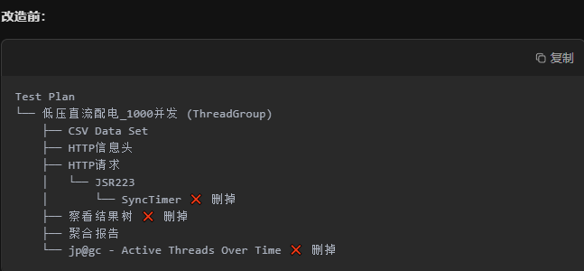
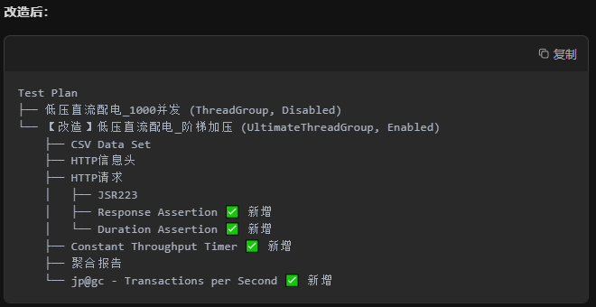
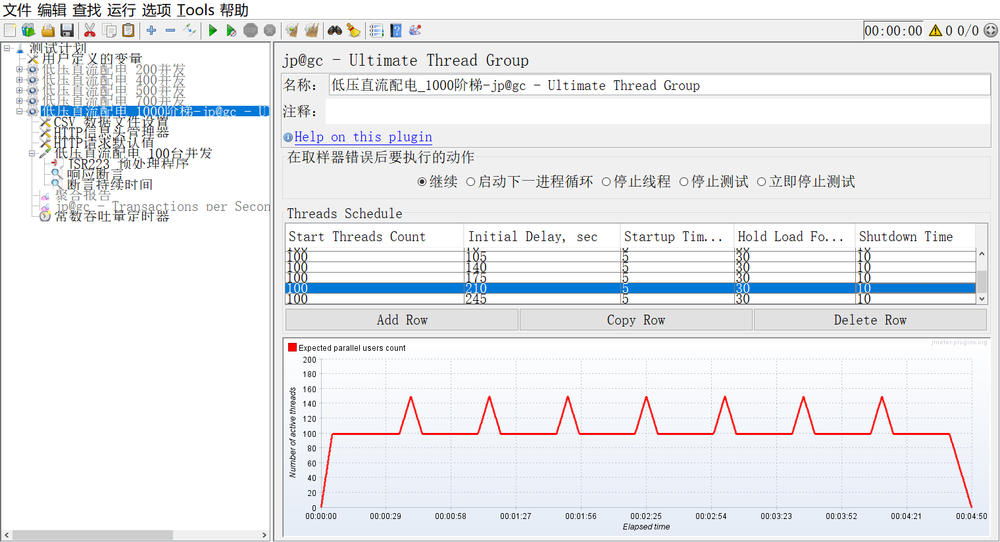

# 01分析当前脚本

```
<ThreadGroup ... ramp_time="1">  <!-- 1秒内1000线程全启动 -->
<SyncTimer groupSize="1000"/>    <!-- 等着凑齐1000人一起冲 -->
```

```
这对新系统简直是灾难：
    瞬间洪峰：1000个线程在1秒内砸过去，队列直接>700，触发降级策略，大量请求被丢弃
    无法验证降级逻辑：要么全成功要么全失败，看不到"快设备过、慢设备挡"的效果
    压力不真实：生产环境是"细水长流"的定时任务+零散的实时查询，不是"整齐划一"的冲锋
```


# 02根据需求调优

```
还需补充：
	大量请求同一时刻并发情况
```

| 测试类型       | 目的                          | 关键指标                        |
| -------------- | ----------------------------- | ------------------------------- |
| **基准测试**   | 验证"快设备"能否在150ms内返回 | 单机200设备RT<150ms，成功率100% |
| **负载测试**   | 验证队列500/700/1000阈值行为  | 慢/差设备在阈值外被丢弃         |
| **压力测试**   | 队列满时的重试+丢弃策略       | 重试5次后成功/失败日志          |
| **稳定性测试** | 长时间运行不降速              | 持续1小时TPS稳定                |

场景配置

| 场景       | 线程数 | Ramp-Up | TPS目标 | 设备CSV            | 断言      | 预期结果               |
| ---------- | ------ | ------- | ------- | ------------------ | --------- | ---------------------- |
| **基准**   | 200    | 60s     | 30      | fast\_devices.csv  | RT<150ms  | 100%成功               |
| **降级**   | 400    | 60s     | 60      | mixed\_devices.csv | RT<450ms  | 差设备失败>50%         |
| **压力**   | 1000   | 120s    | 120     | slow\_devices.csv  | RT<5000ms | 触发重试，队列满后丢弃 |
| **稳定性** | 500    | 60s     | 60      | fast\_devices.csv  | RT<200ms  | 持续1小时TPS波动<10%   |

```
备份：把现在的HTTP请求.jmx另存为HTTP请求_改造前.jmx
删除：所有SyncTimer、View Results Tree、Active Threads Over Time
添加：
    Test Plan右键 → Threads → jp@gc - Ultimate Thread Group
    Thread Group右键 → Timer → Constant Throughput Timer
    HTTP请求右键 → Assertion → Response Assertion + Duration Assertion
    修改：HTTP请求 → Advanced → Connect=3000, Response=15000
```


| **保留（核心骨架）**  | **删除（3个累赘）**                 |
| --------------------- | ----------------------------------- |
| ✅ CSV Data Set Config | ❌ `SyncTimer`（同步定时器）         |
| ✅ HTTP信息头管理器    | ❌ `察看结果树`（View Results Tree） |
| ✅ HTTP请求默认值      | ❌ `Active Threads Over Time`        |
| ✅ HTTP请求（Sampler） |                                     |
| ✅ JSR223 预处理程序   |                                     |
| ✅ 聚合报告            |                                     |

```
记住：
	你的Sampler（发请求的组件）一根汗毛都不能动，只是换个"发动机"（Thread Group）和"油门"（Timer）
	是你只告诉它"爬1层楼"，它当然不继续往上爬。改成"爬4层楼"，它就会一级一级上

二、手把手操作步骤（带截图感）
    第1步：备份
        打开现在的 HTTP请求.jmx
        菜单栏 → File → Save As → 输入 HTTP请求_改造前.jmx
        从现在开始，所有修改都在这个新文件上操作
    
    第2步：删除3个累赘（按图索骥）
        删除目标1：SyncTimer（长得像沙漏）
        展开 低压直流配电_1000并发 → 找到 JSR223 预处理程序
        它下面有个叫 同步定时器 的东西 → 右键 → Cut
        删除目标2：察看结果树（长得像树）
        还在 低压直流配电_1000并发 下 → 找到 察看结果树 → 右键 → Cut
        删除目标3：Active Threads Over Time
        找到 jp@gc - Active Threads Over Time → 右键 → Cut
    
    第3步：废掉旧的Thread Group（但先别删）
        选中 低压直流配电_1000并发 线程组本身（最顶层的那个）
        在右侧属性面板 → enabled="true" 改成 false（或者直接右键 → Disable）
        效果：它还在，但运行时被跳过，相当于"注释掉"
    
    第4步：添加新发动机（Ultimate Thread Group）
        Test Plan（最顶层）右键 → Add → Threads → jp@gc - Ultimate Thread Group
        在新组件上右键 → Rename → 改成 【改造】低压直流配电_阶梯加压
        配置参数（双击打开）：
            Start Threads Count: 100
            Initial Delay: 0
            Startup Time: 60  ← 60秒内从0加到100
            Hold Load For: 180 ← 跑3分钟
            Shutdown Time: 10
        然后点 Add Row 再加一行：
            Start Threads Count: 100
            Initial Delay: 240
            Startup Time: 60   ← 再花60秒从100加到200
            Hold Load For: 300
            Shutdown Time: 10
            
            继续加到1000，每2分钟加100线程
            
    第5步：把旧的心脏（Sampler）移植到新发动机
        展开 旧的 低压直流配电_1000并发
        按住 Shift，选中下面的所有子组件（CSV、Header、HTTP请求、JSR223等，除了刚才删掉的3个）
        Ctrl+C 复制
        选中 新的 【改造】低压直流配电_阶梯加压
        Ctrl+V 粘贴
    
    第6步：给新发动机装油门（Constant Throughput Timer）
        选中 新的 Thread Group
        右键 → Add → Timer → Constant Throughput Timer
        配置：
        	Target Throughput：120.0 （每分钟120次请求）
        	Calculate Throughput based on：选择 All active threads
    
    第7步：给Sampler加保险（断言）
        展开新的Thread Group → 找到 低压直流配电_100台并发（Sampler）
        Sampler上右键 → Add → Assertions → Response Assertion
        配置：Field to Test → Response Code
        Patterns to Test → 添加 200
        Sampler上右键 → Add → Assertions → Duration Assertion
        配置：Duration in milliseconds → 15000（15秒超时）
    
    第8步：修改Sampler的高级设置
        双击 低压直流配电_100台并发
        切到 Advanced 标签页
        Connect：填 3000
        Response：填 15000
        勾选 Use KeepAlive
    
    第9步：添加监听器（只看关键指标）
        在新的Thread Group下：
        右键 → Add → Listener → Summary Report（只看汇总）
        右键 → Add → Listener → jp@gc - Transactions per Second（看TPS曲线）
        第10步：保存
        菜单 → File → Save As → HTTP请求_改造后.jmx
```





```
四、验证改造成功没
    跑一下：运行 HTTP请求_改造后.jmx
    看JMeter右上角：Active线程数应该慢慢涨（1分钟从0→100，再1分钟100→200...）
    看Summary Report：Error % 应该不是突然65%，而是随着线程增加慢慢上升
    看TPS图：应该是一条平稳的横线（约2 TPS），而不是尖峰后暴跌
如果符合，说明改造成功！现在你可以：
    验证100线程时200设备是否都能150ms返回
    验证800线程时慢设备是否开始被降级
    验证1000线程时队列丢弃逻辑
```



# 03_补充知识

```
Constant Throughput Timer（常数吞吐量） 的"隐藏技能
    防止系统雪崩	避免瞬间洪峰把队列打满，让我们能观察渐进式压力下的表现
    验证降级策略	只有匀速加压，才能精确验证"队列500/700/1000"这三个魔法数字
    模拟真实场景	生产环境不是"1000人同时点鼠标"，而是"2分钟内陆续进来1000个请求"
    让重试有机会执行	如果1秒打完1000个，重试机制根本没机会5次尝试，系统就死了
    
    
   120.0 是怎么算出来的？
        新系统的设计目标
        定时任务：5分钟（300秒）采集200台设备
        采集频率：每5秒采集一次
        数学公式：200台 ÷ 5秒 = 40台/秒 → 再×3倍余量 = 120/分钟
        换句话说：系统正常工作时，天然就是2个请求/秒，不是1000/秒。
   
   
   不同测试场景的TPS设置
       测试类型	TPS目标	计算公式	目的
       基准测试	20/分钟	0.33×120	验证"快设备"<150ms
       压力测试	60/分钟	0.5×120	观察队列到500/700的过程
       峰值测试	120/分钟	1×120	验证降级策略生效
       破坏测试	不设	-	测系统崩溃点（最后才做）
   
```


```
待理解：


一、先看纯理论值的漏洞
按你的需求：5分钟（300秒）采集200台设备
理论TPS = 200台 ÷ 300秒 = 0.67台/秒 = 40台/分钟
但这数字有4个致命假设：
    假设所有设备都是"快设备"（150ms返回）
    实际情况：总有"慢设备"（450ms）和"差设备"（>450ms）
    慢设备占1个线程3倍时间，拖累整体吞吐量
    假设网络永远不抖
    实际情况：TCP重传、网关超时、数据库锁等待
    这些因素会让RT从150ms暴涨到3秒
    假设0%失败率
    实际情况：改造前你的测试结果就有35%失败
    失败重试5次，等于同1个设备占5倍资源
    假设系统只干这一件事
    实际情况：B接口还有实时监控视图在并发查询
    你的TPS=40，别人一查，你的队列就满了
二、3倍余量到底是防什么？

    余量防护的对象	具体场景	不防护的后果
    慢设备拖后腿	20%设备是慢设备（450ms）	理论40，实际只能到25，任务完不成
    网络抖动	某10秒网络延迟>1秒	这10秒吞吐量降为1/7，整体延误
    失败重试	10%设备需要重试5次	40×10%×5=20额外请求，系统过载
    并行业务	监控视图同时查50台设备	40+50=90，队列>700，触发降级
    未来扩容	3个月后设备从200变400台	系统直接崩溃，需要重构
    数学推导：	
        实际所需TPS = 理论TPS × (1 + 慢设备比例×3 + 重试开销 + 业务并行度)
                    = 40 × (1 + 0.2×3 + 0.5 + 0.5) 
                    = 40 × 3.1 ≈ 120
三、生产环境真实案例
场景：凌晨0点定时任务
时间轴：
00:00:00  200台设备开始采集（理论40/分钟）
00:00:15  网络抖动，50台设备RT>1秒，队列堆积到300
00:00:30  有10台差设备失败，触发重试，队列冲到550
00:00:45  早班运维登录系统查监控视图+30台，队列>700
          → 触发降级：50台慢设备被丢弃
00:01:00  重试的10台回来再请求，队列>1000
          → 触发保护：定时任务暂停，优先实时查询
00:01:30  网络恢复，队列降到800，定时任务重启
如果没有3倍余量：
队列在00:00:30就>1000
定时任务直接失败，数据断档
监控视图也卡死，运维骂娘
四、性能测试的金科玉律
做任何性能测试，永远要乘系数
表格
复制
系数	适用场景
×1.5	内部工具，失败无所谓
×2	非核心系统，有降级方案
×3	核心业务，你的场景
×5	金融/医疗，失败要赔钱
你的B接口是生产监控，挂了=客户投诉+运维背锅，所以×3是底线。
五、验证余量是否足够
测试方法1：扰动注入
xml
复制
<!-- 在JSR223里故意给20%请求加延迟 -->
if (Math.random() < 0.2) {
    Thread.sleep(1500)  // 模拟慢设备
}
跑测试看：成功率是否还能>95%
测试方法2：并行业务模拟
xml
复制
<!-- 再加一个线程组，持续50线程查监控视图 -->
<ThreadGroup name="监控视图干扰" num_threads="50" ...>
跑测试看：定时任务是否还能在5分钟内完成
如果都通过，×3就合适；如果有失败，×4。
```

