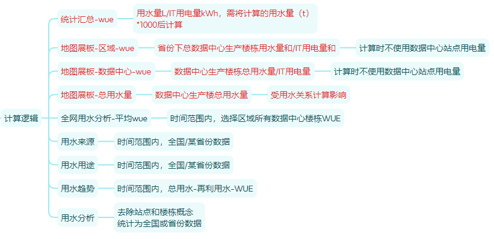

# 01总结

```
需求概述
	仅测试水资源看板、用水分析


涉及库表
	用水的
		1、water_mete
		2、water_formula_config
		3、water_formula_config_his
		4、water_formula_config_total
	机房这些的【记得有生产机楼、修改后会导致统计发生变化  -- 会导致看板地图里面的颜色变化、还会导致用水分析等it用量的统计wue这些】
		t_cfg_precinct
		t_cfg_site
		t_cfg_dict
	


测试方法
	1、水资源看板和用水分析 -- 数据都是从水资源报表过来的	
		1.1、水资源报表则是通过用水关系配置  -- 主要是机房还是站点，还需要看下需求，通过插入测点的历史数据
		1.2、然后通过触发条件【即用水关系页面里面有日和月的刷新、点击就能触发，进行报表统计  -- 删除也会自动删除对应数据】
		1.3、触发分为两种【如果是页面点击那种，是只能最近天的好像，还有月的就是上个月；如果是接口触发的话可以指定相关时间段】
		1.4、目前线上的话，只能通过页面形式触发
	2、水资源看板还涉及到数据中心下机房问题
		1.1、根据机房【生产楼才算】配置了用水关系才会展示
	3、it用电量
		3.1、这一块主要跟能耗月报 -- 里面对应机房还是站点啥的、里面有对应it【然后目前逻辑是：机房下用水关系存在，并且有值的时间点、才会记录对应的it用电量】
		3.2、看板这一块，除了地球，其他都是固定近一年平均，不会变动
	4、wue的计算方式
		总用水/总it用电
	5、水资源看板
		需要配齐所有的用水关系才行（每一个生产楼 -- 可以直接改掉站点下其他楼栋的，这样就只需要配一个）
		


测试数据准备
	1、通过es插入相关设备测点里面
	2、有触发接口

	curl —location —request GET ‘http://10.12.12.164:30191/v1/waterConfig/executeMonthBetweenTime?stationIdStr=01-19-10-01-01-0&startTime=2025-06&endTime=2025-06‘
```


# 02前置关系

```
先配置测点（用水关系） - 生成水资源报表
	水资源看板和水资源分析基于报表而来的


补充点：
	wue计算--楼栋下，用水量和用电量都是对应月份的（如果用水量没有数据，那么电量就不计入）
	
造数手段：
	看板和用水分析数据均来源于水资源报表  ——  通过水资源报表造数
	用电量  ——  可在能耗-用电关系中查看
```




