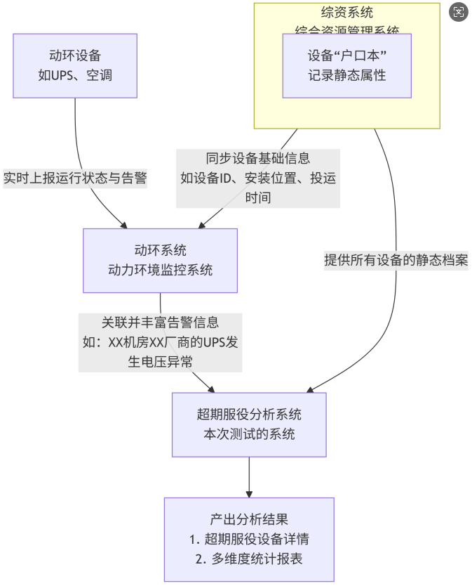

# 前提了解

```
综资系统（综合资源管理系统）
	综资系统负责标识（告诉你感知到的是谁）
	是一个记录所有通信网络基础设施（如基站、机房、设备、线路、端口等）静态信息的庞大数据库
	数据相对**静态**，不会频繁变动
	存放：
		设备名称、设备ID（`res_code`）、型号、厂家
		安装在哪个省、哪个市、哪个机房、哪个机架
		什么时候出产（生产日期）、什么时候使用（开始使用时间 `start_time`）、什么时候报销
		这个设备连接了谁，属于哪个系统
		
		
		
动环系统（动力环境监控系统）
	动环系统负责感知（实时监控设备状态）
	设备的“实时健康手环”或“ICU监控仪，7x24小时实时监控机房内设备和环境动态运行状态的系统
	数据是**动态**、**实时**、**海量**的
	存放：
		UPS的电压、电流，空调的温度、湿度，电池的充放电状态【即实时数值】
		某项参数异常（如温度过高、电压中断），立即生成一条**告警记录**【设备告警情况】
		

超期服役分析分析功能
	负责分析决策（综合静态档案和动态表现，给出健康评估和预警）
```


# 需求提取

```
动环设备超期服役分析系统
	用于监控和管理通信机房中各类动力环境设备
	（如UPS、空调、蓄电池等）的使用寿命情况
	

系统从综资系统（资源库）获取设备信息
	自动判断设备是否超出设计使用寿命（即“超期服役”），并关联这些设备近期告警
	并统计各类设备的运行状态和告警情况
	
	
核心功能（页面）
	超期服役设备详情表：列出所有设备及其服役状态
	统计分析报表：从多维度（地市、设备类型、厂家）统计超期服役情况
		告警频次统计：关联动环系统，统计设备在一定时间内的告警次数
    	灵活配置：支持告警类型、统计时间、超期比例等参数可配置
    
    
业务逻辑
	超期判断逻辑
		每种设备类型有预设的更新周期（即设计寿命）
		系统计算：
			`已使用时长 = 当前时间 - 开始使用时间`
		判断逻辑：
			`已使用时长 > 更新周期` 		 → 超期服役
			`已使用时长 / 更新周期 > 70%` → >70%在超期内
			`已使用时长 / 更新周期 < 70%` → <70%
	告警统计逻辑
		默认统计近一个自然月的告警次数
		支持自定义时间范围（如2023年1月~2023年3月）
		告警类型可配置（当前有默认列表，后续可扩展）
	统计分析维度（统计分析报表）
		总表：按地市 + 设备类型 + 厂家分组统计
		设备类型分析表：按设备类型分组
		厂家分析表：按厂家分组，计算故障率
		地市分析表：按地市分组，统计设备总量和超期占比
```




# 基础框架

```
测试范围
    超期服役设备详情（列表页 + 弹窗）
    设备生命周期统计（四个统计分析报表）
    数据来源：综资设备表 + 动环平台设备
    功能包括：树形筛选、查询、导出、分页、权限、数据计算逻辑等
    

测试重点
    数据准确性：服役状态分类、告警频次计算、更新周期匹配
    树形结构联动：左树右表联动筛选、层级穿透
    权限与安全：越权访问、数据隔离
    导出功能：字段完整性、文件名、Sheet页命名
    性能与兼容性：大数据量导出、分页响应
    
    
数据准备方向
    数据类型	说明
    设备数据	模拟不同设备类型、子类、开始时间、厂家、地市等
    告警数据	模拟不同设备在不同时间段的告警次数
    树形结构数据	模拟省-市-区县-站点层级结构
    权限数据	模拟不同角色用户访问权限
    
    
功能测试
	服役状态分类（<70%、70%~100%、>100%、>1.5倍）必须准确
	告警频次统计需匹配时间范围（默认近1个月）
    逐字段:验证数据来源与计算逻辑（如：在网时长、服役状态、告警频次）
    树形结构:逐级展开测试（省-市-区县-站点）,站点类型下拉框与检索框的联动过滤
    导出功能：字段、文件名、Sheet页、数据一致性,大数据量导出（≥1万条）时的性能和文件完整性
    权限控制:垂直越权（普通用户不能访问管理员功能）,水平越权（用户A不能访问用户B的数据）
    
    
数据一致性测试
	与综资数据对比，确保设备信息同步准确
	告警数据来源动环平台，需验证时间范围统计正确性
```


# 测试要点

```
数据准确性（同步数据的校验）
    - 设备信息是否正确从综资系统获取？
    - 开始使用时间、设备类型、子类等关键字段是否正确？
    - 更新周期是否按设备类型+子类正确匹配？
    - 服役状态判断逻辑是否正确？
    - 告警统计是否准确（时间范围、告警类型）？
    


关联键是核心测试点
	- 两个系统通过 `power_device_id`（或 `res_code`）进行关联。
    - 一个设备在综资里有，但在动环里没有告警记录，它的“故障告警频次”是否显示为0？
    - 动环里有一条告警，但它在综资里找不到对应的 `power_device_id`，这条告警是否会被错误地统计？
    - 动环里有一条告警，但它在综资里找不到对应的 `power_device_id`，系统是否能正确处理这种“脏数据”？
    - “超期服役” 的判断依赖于综资数据（`start_time`和`device_type`）
	- “故障告警频次” 的统计依赖于动环数据
	
    

功能完整性（查询功能和左侧树联动功能）
	- 查询条件是否生效（日期、地市、设备类型、站点）？
    - 导出功能是否正常（Excel/CSV，含多个Sheet）？
    - 配置项是否可灵活修改（告警类型、时间范围、超期比例）？
  
 
边界性
    - 时间范围边界处理（如跨年、跨月）
    - 空值、异常值处理
    

总结：
	- 最终的报表，是综合了静态属性（来自综资）和动态表现（来自动环）的分析结果
```

# 数据准备

```
设备数据（从综资系统中提取）
	设备基础表 (`ce_device_base`) - 来自综资系统
    device_type：12种类型都要覆盖
    city_id, 
    related_site, res_code, related_room, 
    device_subclass：蓄电池和空调的类型要细分
    zh_label：设备中文名
    vendor_id：厂家
    product_name, 
    start_time：核心字段：用于计算寿命，构造各种用例
    power_device_id：用于关联动环告警系统
    


更新周期数据（根据更新周期表，反向推算出 `start_time`）
	假设当前时间是 `2024-05-27`
	超期服役设备：
		`start_time` = 当前时间 - (更新周期 + 1年)
		一个`变压器`（周期15年），设置 `start_time` 为 `2008-05-27`
	>70%在超期内设备：
		`start_time` = 当前时间 - (更新周期 * 0.8) //取80%，确认>70%
		一个`开关电源`（周期12年），12*0.8=9.6年，约9年7个月
		设置 `start_time` 为 `2014-10-27`
	<70%设备：
		`start_time` = 当前时间 - (更新周期 * 0.5) //取50%，确保小于70%
		一个`动环监控-FSU`（周期5年），5*0.5=2.5年
		设置 `start_time` 为 `2021-11-27`


告警数据
	设备告警表 (`device_alarm_history`) - 来自动环系统
	device_id, alarm_time, 
	alarm_type, alarm_level
	
	同一个设备在不同时间点制造多条告警记录，用来测试“告警频次”统计是否正确
		为 `power_device_id = 'DEVID_0001'` 的设备
		在 `2024-04-01` 到 `2024-04-30` 之间插入10条告警记录
	再在 `2024-03月` 插入5条。当你设置统计时间为 `2024-04` 时，预期频次应为10
	
	
	
关键测试场景数据
    | 设备类型 | 开始使用时间 | 预期状态 |
    | 变压器   | 2010-01-01   | 超期服役 |
    | UPS      | 2022-01-01   | <70%     |
    | 蓄电池   | 2018-01-01   | >70%     |
```

# 用例设计

```
核心功能测试用例
    | 用例ID      | 测试场景                  | 输入/操作                                                  | 预期结果                                                     |
    | **FUN-001** | **超期状态计算**          | 查询一个`start_time`为2008-01-01的`变压器`                 | 该设备状态必须为“**超期服役**”                               |
    | **FUN-002** | **告警频次统计-时间范围** | 设置告警统计时间为`2024-04`，查询一个在4月有10条告警的设备 | 该设备“故障告警频次”必须为**10**                             |
    | **FUN-003** | **多条件查询**            | 地市=`西安市`，设备类型=`空调`                             | 只显示西安的所有空调设备，且数据正确                         |
    | **FUN-004** | **边界值测试-时间**       | 设置告警统计时间为当前月`2024-05`                          | 系统应给出友好提示“当前月数据不完整，统计可能不准确”或不统计 |
    
 
 
数据准确性测试用例

    | 用例ID       | 测试场景           | 预期结果                                                     |
    | **DATA-001** | **蓄电池子类匹配** | 一个`device_subclass`为‘开关电源铅酸电池’的设备，其更新周期必须是**8年** |
    | **DATA-002** | **在网时长计算**   | 一个`start_time`为`2019-05-27`的设备，在网时长应计算为`5年0个月`（截至2024-05-27） |
    | **DATA-003** | **告警设备关联**   | 一个在告警表中有记录的设备，其告警频次必须>0；一个没有告警记录的设备，频次应为0 |
 


报表与导出测试用例
    | 用例ID     | 测试场景                  | 预期结果                                                     |
    | **UI-001** | **导出功能**              | 点击导出，生成一个包含 **4个Sheet** 的Excel文件，命名正确    |
    | **UI-002** | **统计分析总表-数据聚合** | 在总表中，某个地市某种型号的`超期服役`设备数量，应与详情表中筛选出的数量**完全一致** |
    | **UI-003** | **厂家报表-故障率计算**   | 故障率 = 故障设备数 / 设备总量，计算结果必须准确，精度保留两位小数 |

 

超期状态判断正确性
    | 测试步骤                         | 预期结果               |
    | 输入一个变压器，开始时间为2010年 | 状态应为“超期服役”     |
    | 输入一个UPS，开始时间为2022年    | 状态应为“<70%”         |
    | 输入一个蓄电池，开始时间为2018年 | 状态应为“>70%在超期内” |
    

告警统计时间范围可配置
    | 测试步骤                           | 预期结果                |
    | 设置告警统计时间为2023-01至2023-03 | 只统计这3个月的告警次数 |
    | 设置时间为空                       | 使用默认近一个月        |
    
    
导出功能
    | 测试步骤     | 预期结果                                            |
    | 点击导出按钮 | 下载一个Excel文件，包含4个Sheet：总表、设备类型、厂家、地市 |


查询条件组合
    | 测试步骤                     | 预期结果             |	
    | 选择地市=西安，设备类型=空调 | 只显示西安的空调设备 |
    | 不选任何条件                 | 显示全部数据         |

```

# 测试顺序

```
- 第一步：
	验证单设备逻辑。
	先不看报表，在“详情表”里验证一两条设备的“服役状态”和“告警频次”计算绝对正确。这是基石。
- 第二步：
	验证多条件查询。
	确保你的查询条件能准确筛选出你预设的数据。
- 第三步：
	验证统计报表。
	对比详情表的数据，手动做一次聚合计算，看是否与报表中的“设备数量”、“告警频次总和”等数据匹配。
- 第四步：
	验证导出功能。
	导出的文件内容应与页面显示一致。
```

