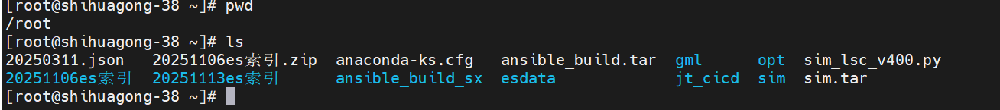

插入位置在/root,然后新建个索引




1、先到入对应索引的mapping（也就是索引结构）

2、接着再插入data（也就是索引的数据）


203.38上有个导入工具


elasticdump --input=202307mapping.json --output=http://10.1.203.38:9200/temperature_202407 --type=mapping
elasticdump --input=20240808.json --output=http://10.1.203.38:9200/temperature_202407 --type=data --limit 30000


先导入索引（如果已经存在是不是要先删了，以现网为准）再导入数据


elasticdump --input=ods_zz_device_air_202505m.json --output=http://10.1.203.38:9200/temperature_202407 --type=mapping


ods_zz_device_air_mapping.json                   ods_zz_device_switch_power_mapping.json
ods_zz_device_battery_mapping.json               ods_zz_device_transform_device_mapping.json
ods_zz_device_energy_save_mapping.json           ods_zz_device_transform_mapping.json
ods_zz_device_high_dc_distribution_mapping.json  ods_zz_device_ups_mapping.json
ods_zz_device_high_distribution_mapping.json     ods_zz_irms_dc_map_mapping.json
ods_zz_device_high_power_mapping.json            ods_zz_irms_rom_map_mapping.json
ods_zz_device_low_ac_distribution_mapping.json   ods_zz_link_pe_in_mapping.json
ods_zz_device_low_dc_distribution_mapping.json   ods_zz_room_mapping.json
ods_zz_device_other_mapping.json                 ods_zz_room_property_mapping.json
ods_zz_device_power_generation_mapping.json      ods_zz_site_mapping.json
ods_zz_device_power_monitor_mapping.json         ods_zz_site_property_mapping.json
ods_zz_device_smart_meter_mapping.json


```
ods_zz_device_smart_meter_mapping.json					智能电表
ods_zz_device_switch_power_mapping.json					开关电源
ods_zz_device_transform_device_mapping.json				变换设备
ods_zz_device_energy_save_mapping.json 					节能设备				
ods_zz_device_transform_mapping.json					变压器
ods_zz_device_high_dc_distribution_mapping.json			高压直流配电
ods_zz_device_ups_mapping.json							UPS设备
														蓄电池
														
														
ods_zz_device_high_distribution_mapping.json			高压配电
ods_zz_device_high_power_mapping.json					高压直流电源
ods_zz_device_low_ac_distribution_mapping.json			低压交流配电
ods_zz_device_low_dc_distribution_mapping.json			低压直流配电
ods_zz_device_other_mapping.json						其它设备
ods_zz_device_power_generation_mapping.json				发电机组


导入索引
elasticdump --input=ods_zz_device_power_monitor_mapping.json --output=http://10.1.203.38:9200/ods_zz_device_switch_power_202505m --type=mapping


导入数据-ods_zz_irms_site_map_data
elasticdump --input=ods_zz_device_low_dc_distribution_data.json --output=http://10.1.203.38:9200/ods_zz_device_low_dc_distribution_202507m --type=data --limit 30000
```


```
导出es数据

elasticdump --input=http://10.1.203.38:9200/ods_zz_device_high_distribution_2025y --output=ods_zz_device_high_distribution_2025y.json --type=data
```


elasticdump --input=ods_zz_device_transform_mapping.json --output=http://10.1.203.38:9200/ods_zz_device_transform_2025 --type=mapping

elasticdump --input=ods_zz_device_transform_data.json --output=http://10.1.203.38:9200/ods_zz_device_transform_2025y --type=data --limit 30000


elasticdump --input=ods_zz_irms_rom_map_data.json --output=http://10.1.203.38:9200/ods_zz_irms_rom_map_2025y --type=data --limit 30000
