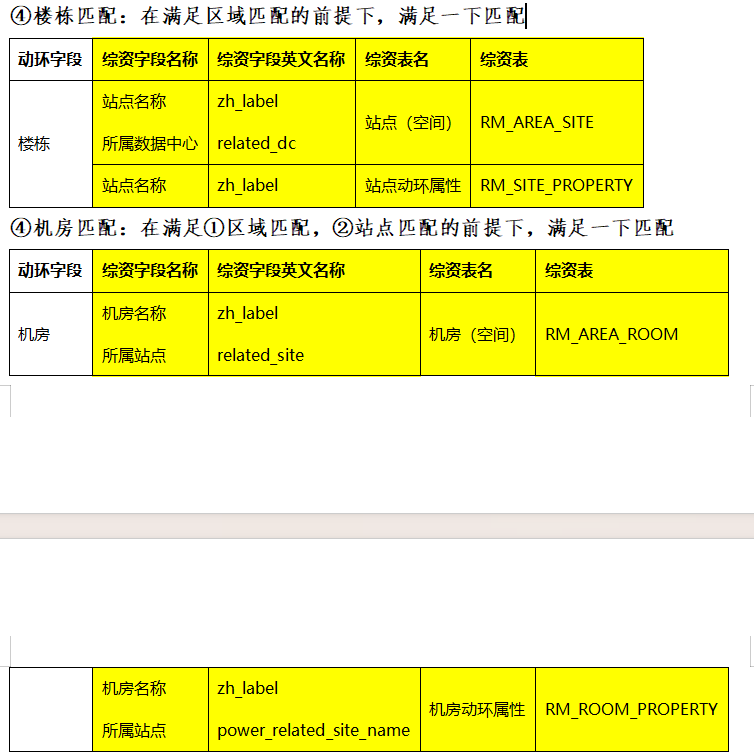

方式1

```
园区映射关系			ods_zz_irms_dc_map
站点映射关系			ods_zz_irms_site_map
机房映射关系			ods_zz_irms_rom_map
```

| 序号 | 字段中文名称     | 字段英文名称 | 字段类型 | 是否必填 | 说明   |
| ---- | ---------------- | ------------ | -------- | -------- | ------ |
| 1    | 记录id           | uuid         | 字符型   | 是       | 记录id |
| 1    | 部省数据中心ID   | zg_id        | 字符型   | 是       |        |
| 2    | 部省数据中心名称 | zg_name      | 字符型   | 是       |        |
| 3    | PMS系统园区ID    | pms_id       | 字符型   | 存在必填 |        |
| 4    | PMS系统园区名称  | pms_name     | 字符型   | 否       |        |
| 5    | 动环园区ID       | dh_id        | 字符型   | 存在必填 |        |
| 6    | 动环园区名称     | dh_name      | 字符型   | 存在必填 |        |
| 7    | 数据时间         | batch_num    | 字符型   | 是       |        |


站点

| 序号 | 字段英文名称    | 字段中文名称 | 字段类型 | 是否必填 | 说明   |
| ---- | --------------- | ------------ | -------- | -------- | ------ |
| 1    | 记录id          | uuid         | 字符型   | 是       | 记录id |
| 1    | 部省站点ID      | zg_id        | 字符型   | 是       |        |
| 2    | 部省站点名称    | zg_name      | 字符型   | 是       |        |
| 3    | PMS系统站点ID   | pms_id       | 字符型   | 存在必填 |        |
| 4    | PMS系统站点名称 | pms_name     | 字符型   | 否       |        |
| 5    | 动环站点ID      | dh_id        | 字符型   | 存在必填 |        |
| 6    | 动环站点名称    | dh_name      | 字符型   | 存在必填 |        |
| 7    | 数据时间        | batch_num    | 字符型   | 是       |        |


```
空间_数据中心			ods_zz_site
空间_机房			 ods_zz_room
空间_站点			 zz_to_rm_rm_area_dc
站点动环属性			ods_zz_site_property
机房动环属性 			ods_zz_room_property

```





动环 

综资  

​			批次一致

​			省市一致

​			空间 zh_label 与动环楼栋名一致

​			动环属性 zh_label 与 空间int_id 一致


数据中心不加的时候匹配不		

​			还有个所属数据中心


名称法

​	站点

​	precinct_name(动环)   -->  zh_label(空间)  --> int_id(空间) --> zh_label(属性表)  -->

​	数据中心

​	precinct_name(动环)   -->  zh_label(空间)  --> zh_label(属性表)  -->


id法

​	precinct_id(动环)  -->  dh_id(映射) -->  zg_id(映射) -->  zh_label(属性表)

​	dh_name 和zg_name是否要一致

​	id法修改

​	precinct_id(动环)  -->  dh_name(映射) -->  zg_id(映射) -->  zh_label(属性表)

​	

​	id方法，因为数据是错乱的所以，取得是dh_name为id，zg_name为映射		


设备的匹配


## 规整

id匹配需要再排查下