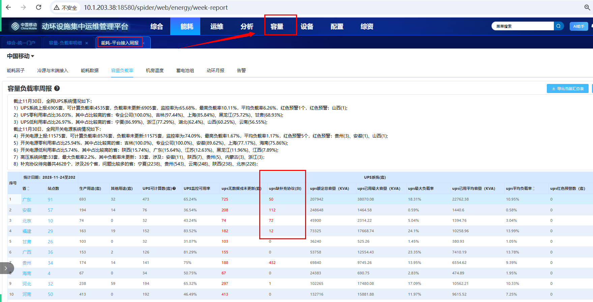
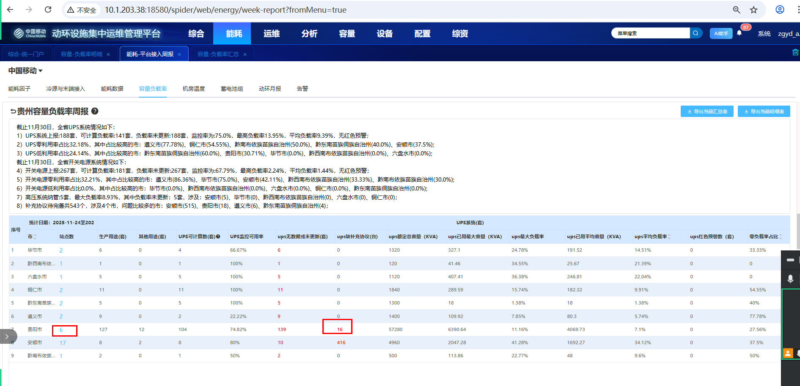
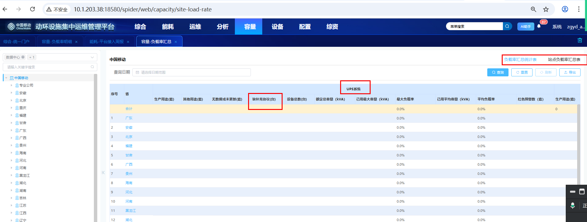
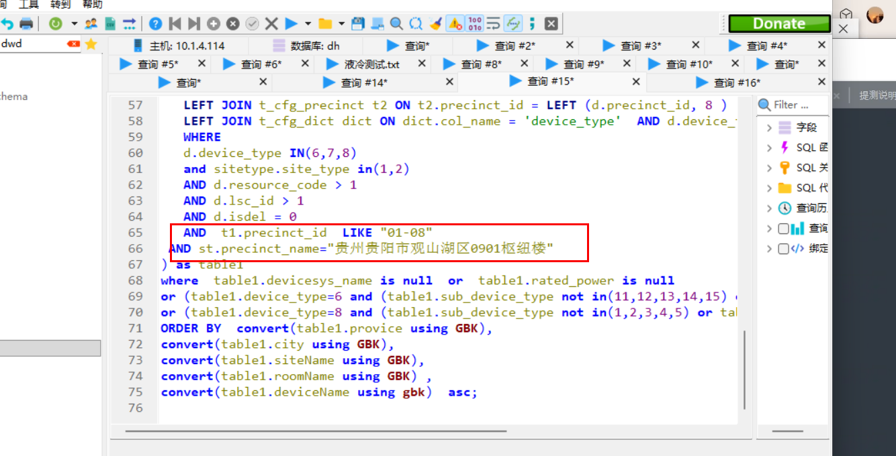
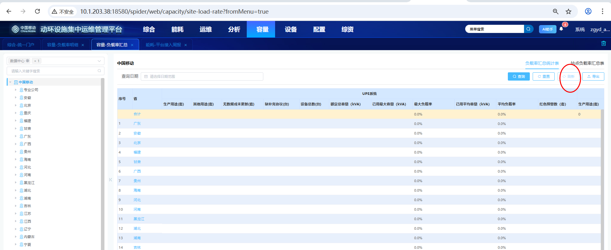

# 补充说明（重点，需要梳理下）

```
数据来源说明：
	1、配置-设备系统里面去查（然后点进去查看）   --- 然后直接打开编辑，就能看到 （可以看到配置的容量和设备子类信息 -- 然后还有设备名的信息）
	
	2、配置-批量设备（这里也可以看设备和系统）
	
	3、统计的是设备（好像是设备层级的）
	
	
异常数据：
	周报里面 -- 江苏 - 苏周（设备查询时69，但是显示70个 -- 因为设备子类分两种，）
```


```
看报表明细（周报）
	要现在容量负载明细里面下载出来（还是说拿sql的？）
	
	先搜索配置-设备系统（拿到对应系统下设备，）
	然后再到配置-批量维护里面看设备？？
	
		
	是要在批量维护里面看（他要看的是设备的系统，而不是容量的设备）
```


# 测试逻辑

目前数据库与周报里面的是一致的

```
通过sql -- 现在下载对应的数据，复制到excel（只看开关电源和ups设备）
	关注下载出来的数据（只需要关注08-250526 容量负载率问题文件中，站点负载率 -- 补充协议待完善下面字段）
		里面的额定，子设备，系统名称，都是有对应公式的，待完善则是三者相加
			额定：也就是下载出来sql中，该字段值缺失的，缺失就会+1
			子设备：也就是下载出来sql中，设备子类类型，不在规定范围内，缺失就会+1
			设备名称：也就是下载出来sql中，该字段值缺失的，缺失就会+1
	
然后就是跟能耗-接入周报-容量负载路率进行对比
	需要触发接口（现网是每周一次  --health服务）
	1、汇总：就是ups和开关电源（额定，子设备，设备名称全部统计起来的情况）
	2、明细：就是ups和开关电源（额定，子设备，设备名称明细情况）
	
	
然后就是跟容量-负载率汇总-（负载率汇总统计表、站点负载率汇总表）
	需要先触发接口，然后查看天数才有（现网是每天都会更新一次  -- capacity服务）
	1、汇总：就是ups和开关电源（额定，子设备，设备名称全部统计起来的情况）
	2、站点汇总：就是ups和开关电源（额定，子设备，设备名称全部统计起来的情况）


重点：三者数据要连起来一致(然后还要确保站点数一致)
	周报的站点会全部统计进去，就是把没有数据的也统计进去，所以无需关注

```


# 存在异常说明

```
补充说明
	1、测试环境中，接入周报负载率与容量里面负载率开关电源存在不一致：
		是因为很多数据中心没有楼栋，直接建立机房的脏数据
	2、都是按站点层级统计，所以到楼栋为空的都是不管了
```


# 相关wiki和说明

http://10.1.203.38:8087/document/index?document_id=428


```


开关、UPS-检查补充协议-周报页面显示、补充协议-缺失SQL   和容量汇总是否一致

开关、UPS缺补充协议检查要写2条用例


如果修改了容量系统需要重新计算-周报中的容量负载率

（缺失数据 -- 可以直接加系统）平台接入周报-容量负载率- CICD heath服务-执行
curl --location 'http://localhost:28017/v1/healthmanage/analysisReport/testCapacityLoadRate'  --header 'Content-Type: application/json'  --data '{}'                  
```


```
补充说明（容量-负载率汇总  -- 需要打包capacity）：
curl --location --request GET 'http://http://10.12.7.177:32728/v1/capacity/startSummaryTask?precinctId=01-01&time=2025-12-03' \
--header 'User-Agent: Apifox/1.0.0 (https://apifox.com)'
```


```
对的时候，根据给的表格里面，看站点负载率，然后额定容量、子设备，系统名称来判断即可

然后待完善就是汇总的，就是前面三列的汇总

然后周报展示的就是上面积累的汇总

容量统计，就是全部类型的汇总
```












需要下钻或是选择日期才行

