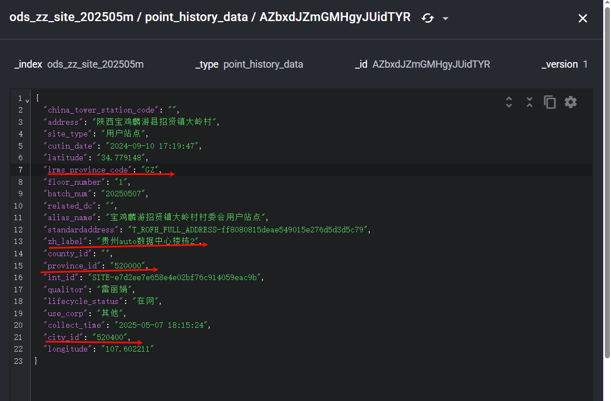
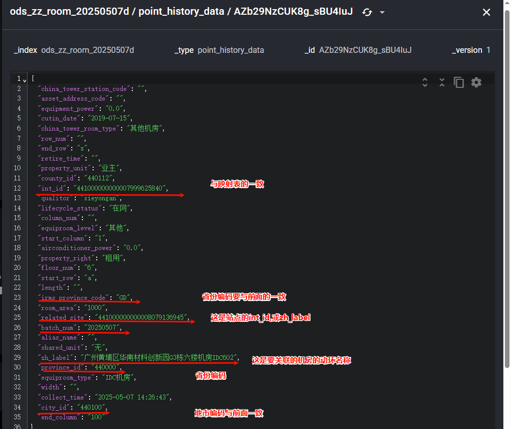
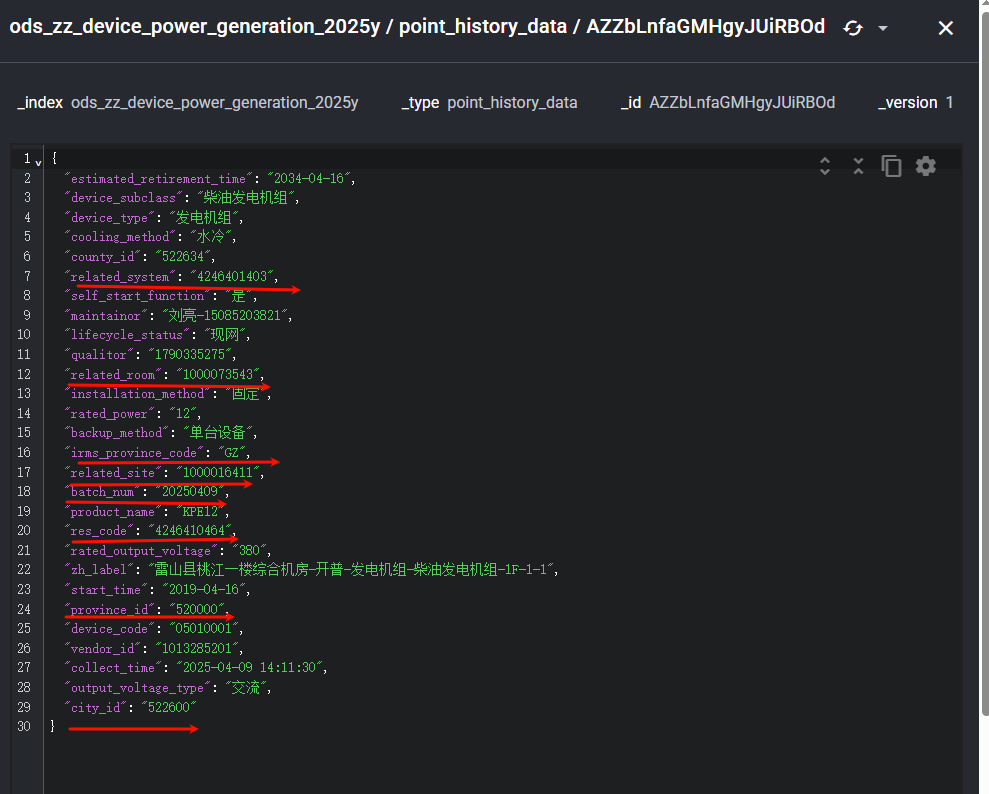

```
好像有同步接口

梳理：
	可以现在link（动环链路中）找到对应的设备类型出来
		这里面的设备需要选有power_device_id的？
		
	涉及表：
		t_cfg_topology_v2_configuration（里面的res_code 要对的上zz_device即同步的综资设备）
		topu_mete_display_config 
		
	
梳理同步逻辑:
	首先会根据站点、机房映射，拿到es机房匹配，然后关联起来（然后去匹配链路） 连接上下游（上下有的时候会有设备 -- 这里每个设备又需要关联动环才会有数据）
	建立好链路之后（就是吧链路中的设备匹配上） -- 
		1、
			这里批次成功链路正常就会落库到t_cfg_topology_v2_configuration（从这个表里面取展示）
		2、
			页面展示时（会根据t_cfg_topology_v2_configuration里对应设备的up_device_rescode
			到zz_to_rm_rm_device里面找到匹配的res_code，拿到device_id，取拿到动环的实时数据）
		
		up_device_rescode和down_device_rescode
		
	注意：
		链路里面，上下级设备，一定要跟设备索引里面设备的res_code对应上，这样才会建立关系
		否则同步综资设备后，会因为对不上导致出不来实时数据


目前是
	1对1
```


```
快速生成法：
	直接把zz_to_rm_rm_device的rescode
		配置到t_cfg_topology_v2_configuration的上级里面即可
		
		
跟综资稽核的都要关联起来的
	xxx
```


```
匹配语法：
{
  "query": {
    "bool": {
      "should": [
        {
          "term": {
            "zg_name": "3900844"
          }
        },
        {
          "match": {
            "zg_name": "3900844"
          }
        }
      ],
      "minimum_should_match": 1
    }
  },
  "size": 10,
  "from": 0
}
```


# 01关联站点

```
名称

precint_name  --->  zh_label  (province_id,city_id)

区域编码：building_area
```




```

```


# 02机房关联

```
待确认
pms_id -- 为综资机房名，会展示在专业内输出分路中
	zh_label(用于匹配作用)
	
注意:
	room的related_site与站点int_id的一致
	room_property的related_site与站点zh_label中文名一致
```





# 03动环链路关联

```
需要补充其他字段说明
	res_code好像是唯一标识 
		-- related_device才是这条记录的关联设备（对应设备表里的res_code）  -- 需要确认
			注意设备里面有关联系统：具体对应啥，还不知道
		-- down_device_name这个是下游设备（这里对应下游设备，对应映射表中的res_code）
		
		
related_device:4252579254
down_device_name:4246410464
down_device_name:4246296313


关联设备
	related - related_device 就是当前关联设备的res_code
下游设备：
	down - down_device_name 就是下游设备的res_code
记录的res_code  - 只是这条记录的唯一标识
```


## 03-1关联设备




# 04更新拓扑

```
配置完成后需要点击左上角刷新，才会有数据
```


# 05上下游关系梳理

```
上下游有没有具体要求
	比如上游只能是什么？？这种情况
```


# 06设备匹配

```
power_device_id进行匹配
```

