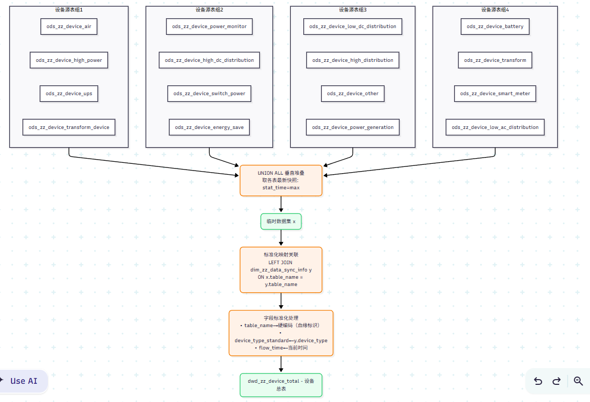
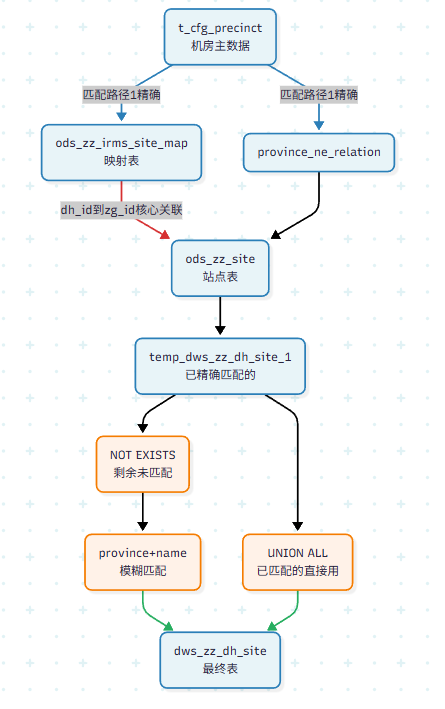
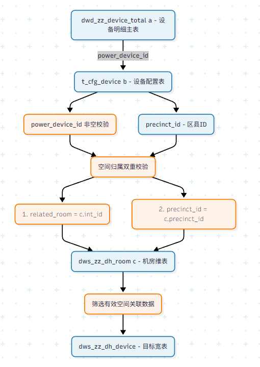

# 01总结

```
前置准备：	
	mpp数据源中：
		由对应综资表的stat_time的时间来决定同步的数据（同步时只会取对应各个表中stat_time最近的数据进行匹配）
业务说明：
	通过动环站点 - 机房 - 设备 与综资数据进行关联（必须一一满足才算，从而计算超期服役时长,以及动环告警的状态）
```


```
设备前置前置：
	需要先将综资对用最新写入批次的设备汇总到total表，用于后面稽核
	进入纵横：http://10.1.5.111:12345/wizdata/ui/projects/15930069689600/workflow/definitions/19582780279424
	admin  YWLYN&tswcbyy@22
	在工作流-工作流定义：执行-综资设备总表-机房设备类型任务
```




```
站点匹配：
	特别注意：数据只取综资表中stat_time最新的那批数据
	
	方式1：精确匹配（通过映射表）
	匹配键：precinct_id → dh_id → zg_id ↔ int_id
	
	方式2：模糊匹配（通过名称拼接）
	匹配键：综资-concat(省份代码, 站点名称zh_label ) = 动环-concat(省份ID, 站点名称)  - t_cfg_site表
```



```
机房匹配：
	特别注意：数据只取综资表中stat_time最新的那批数据，且机房所属站点已经匹配，否则会被过滤掉
	
	方式1：精确匹配（通过映射表）
	匹配键：precinct_id → dh_id → zg_id ↔ int_id
	
	方式2：模糊匹配（通过名称拼接）
	匹配键：concat(省份代码, 机房名称) = concat(省份ID, 机房名称)
```


```
设备匹配：
	特别注意：所属机房和站点均已经匹配的（即与动环匹配）
	
	匹配方式1
	综资设备 - power_device_id = 动环设备 - power_device_id
```




```
满足以上要求后执行纵横任务
	进入纵横：http://10.1.5.111:12345/wizdata/ui/projects/15930069689600/workflow/definitions/19582780279424
	admin  YWLYN&tswcbyy@22
	在工作流-工作流定义分别执行
		近一个月的告警数据
		超期服役分析告警统计（生成月度告警 -- 需要写入告警到mpp的fact_dwd_alarm_value表中）
		综资匹配-稽核-超期服役（生成基础表数据 -- 即超期服役业务数据）
		
	涉及告警：
		'008020','008021','008030','008034','008040','008044',
		'008045','008046','008047','008052','008053'
		,'008054','003002','003006','001034','001038','001040',
		'087002','087012','087031','087040','087043','088003','002022'
		,'002023','002034','002035','002013','004003','005001',
		'005015','005022','005049','006001','006011','006015','006023'
		,'006035','006040','007005','007012','015012','015016',
		'011087','011088','011093','011094','012001','012003','012030'
		,'012031','012033','076010','076040','076041','076042'
	
	fact_dwd_alarm_value
		device_id 对应动环设备表中的dim_device_id
		chief_spatial_id 对应动环precinct表区县级别的dim_spatial_id
		device_spatial_id 对应动环precinct表机房级别的dim_spatial_id
```


```
满足以上要求后执行纵横任务
	进入纵横：http://10.1.5.111:12345/wizdata/ui/projects/15930069689600/workflow/definitions/19582780279424
	注意：详情表拿到的是上个月的告警数据

基础表：
	dws_zz_dh_room
	dws_zz_dh_device
	dwd_zz_device_total
	
	dws_zz_audit_site
	dws_zz_audit_room_type
	dws_zz_audit_device_type
	dws_zz_audit_site_summary
	dws_overdue_device_alert_monthly  -- 月度告警
	dim_overdue_type
	overdue_device_type_dict  -- 动环的（设备类型对应生命周期）
业务表（通过基础表得来）：
	超期服役明细表：
		dws_overdue_device_detail  --> 只取最新一天的（即stat_time,最新的数据）
	统计分析总表（设备类型统计-厂家统计）：
		dws_overdue_count_total    --> 根据明细表的统计起来的（因此数据要跟明细表一致）
	地市统计表
		dws_overdue_device_type_sum_day  --> 根据明细表的统计起来的（因此数据要跟明细表一致）
	
```


```
业务注意：
	先下载设备生命周期统计，然后直接跟超期服役设备详情对比即可
	
	统计分析总表（设备类型统计-厂家统计） 
		-- 如果详情中缺失use_time、start_time则不计入统计，无法计算超期类型
		检测统计的超期服役类型是否一致
	超期服役明细表
		-- 需要过滤出已有的四个类型（未被纳入的不参与后面统计分析表的计算）
		-- 缺失站点类型的也不纳入计算
		-- 缺失站点名称和站点类型不纳入计算
		-- 还有情景未考虑进来
		检测超期服役计算是否正确匹配到类型
```

