```
注意：
	目前接入有问题，需要接在已有的市下面
	为空时下载

注意点2：
	所有涉及审批啥的，都是在系统管理 -- 流程角色配置【重点】
	
注意点3：
	所有导出字段校验都需要校验清楚
	
	修改表头名，要检查筛选条件、页面数据、导出功能、查询结果一致性、排序、导入导出模板等是否同步更新且正常
	
注意：
	所有字段标准化：
		地市，区县，站点类型，站点名称，机房名称，设备类型，设备名称 
```


# 综合监控

## 个人工作台

```
1、最近使用功能、点击收藏后，再次点击取消功能无法正常取消

```

## 中屏首页

```
1、鼠标悬浮到地图【百色，南宁】点位上，右下角没有展示相关数据
2、数据中心下的均无法进行地图下钻
```

## 监控视图

```

```


## 运维管理

```
机房门常开分析
	排序未生效
```


# 运行分析


## 市电停电分析

```
1、导出文件中多出了字段【目前数据不知道从哪里来】  -- 按钮已经没有问题了
2、点即列表排序，数据会消除【500错误，连续两次点击后恢复正常】
```


## 不平衡度分析【待登记】

```
1、列表中页面为机房名称、导出为机房、需要一致
2、小数点保留是多少位


3、详情页面的数据也需要保留两位小数
4、图标里展示的也需要保留两位小数

数据为空导出失败
```


## 温度分析

温度明细

```
1、欠数据上的校验
2、导出的字段不太一致【气候类型】
3、测点类型没有显示

```


## 机房温度分析

```
1、字段顺序不一致、字段名有偏差
```


## 温度测点

```
1、机房条件，只有一个所有复选框，没有展示机房信息
```


## 温度数据稽核

```
    1、选择市、点击重置后，点击搜索、请求后依旧是上一次选择的市、默认应该是展示全部【不选不存在的就没事】
2、选择没有机房类型进行查询，后续再切换条件均不起作用
3、机房条件，只有一个所有复选框，没有展示机房信息
4、导出文件 -- 温度类测点汇总，最后均多了（汇总数量）
```


## 机房高温备注

```
1、导出文件字段与页面字段有偏差
```


## 机房低温备注

```
1、导出文件字段与页面字段有偏差
```


## 稽核规则设置

```

```


## 设备完整性

```

```


## 信号稽核详情

```
与页面顺序不一致
```


## 地市统计表

```
1、不太清楚数据的来源
```


## 动环设备与综资关联报表

```
1、数据不知道怎么对应起来的【查询、导出这些是没问题的】
```


## 字典表维护

```
1、条件设备子类没有展示对应设备
2、信号标准名没有下拉吗，需要手动输入

没问题了
```


告警字典表【新增、编辑没有修改】


信号字典表【新增、编辑没有修改】


## 告警报表

未消除告警记录报表

```
定时输出没有接收到
```


设备告警记录报表

```
1、无数据进行校验
2、按钮却定时输出
3、另存为
4、查询
```


设备告警操作记录报表

```

```


设备频繁告警记录报表

```

```


# 设备管理

## 蓄电池分析

组历史数据

```
1、按钮已经测试
2、数据方面没有测试到
```

落后单体数据

```
1、按钮已经测试
2、查询返回有null【排名】
3、数据目前不知道从哪里来
```

{
  "precinctId": "01-07-07-01-01,01-07-21-01-01-04",
  "mark": 3,
  "namespace": "alauda"
}


内阻数据

```
1、按钮没有问题
2、没数据-校验不了
3、重置后有点小问题【有些没有重置到、请求时还是之前的】
```

放电数据

```

```


参数巡检

```

```

{
  "precinctId": "01-07",
  "mark": 2,
  "namespace": "alauda"
}


## fsu分析【不止提bug没】

性能指标分析

```

```

/web/v1/testplan/alarm/getManufacturerList

/web/v1/indexAnalysis/offLineRate

均报400错误


{
  "precinctId": "",
  "siteType": "",
  "manufacturer": "",
  "namespace": "alauda"
}


## 隐患配置

```
1、发电机主未修改对应内容
2、所有类型，复制出来的，切换生效状态有问题
```


## 隐患统计【待解决】

```
目前实时消除隐患后，历史里面没有同步显示 -- 需要询问下
```


## 故障配置

```
1、新增故障预测规则 -- 告警规则遥测遥调信号获取失败
```

{
  "deviceType": [
    "7"
  ],
  "meteKind": [
    1,
    3
  ],
  "keyword": "",
  "namespace": "alauda"
}

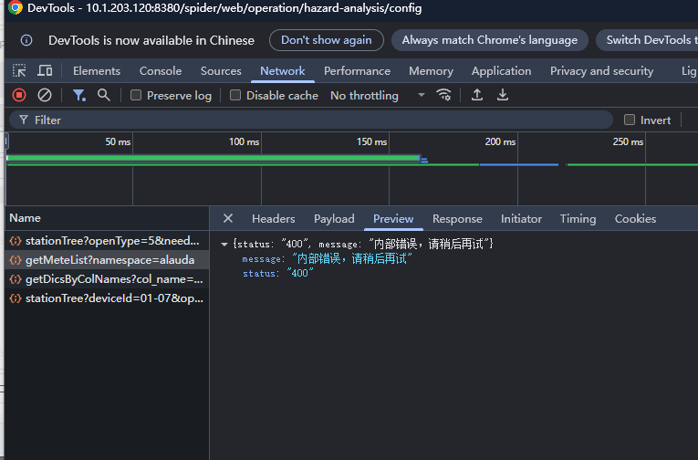

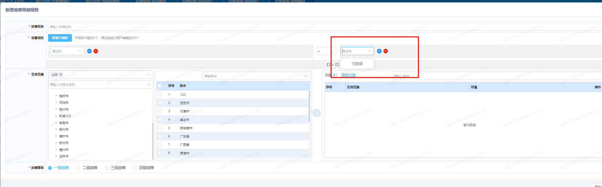


## 故障统计

```
1、实时隐患和历史隐患导出的是同一份文件
2、区县字段【页面没有，导出显示了】
3、页面未消除方式，导出显示为闭环方式【原因必须选择当年的隐患开始时间、查的是隐患开始时间】

4、未添加故障名称查询条件
```

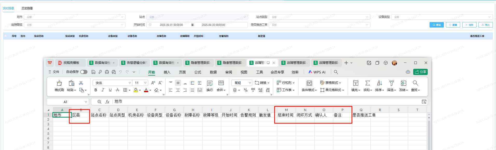

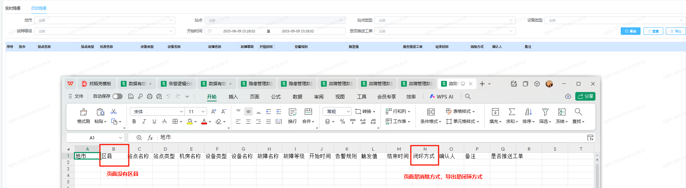


## 巡检配置

```
1、按钮基本没问题

2、状态改变是有问题的


---------------------------------------------------------------------------
怎么样才算开启巡检呢

2、增加编辑按钮后的方案生效逻辑同步修改。

已完成目前还没有编辑按钮
状态没转化【是因为没开启，所以没有转化】

resourcemanage-service
composite-service
```


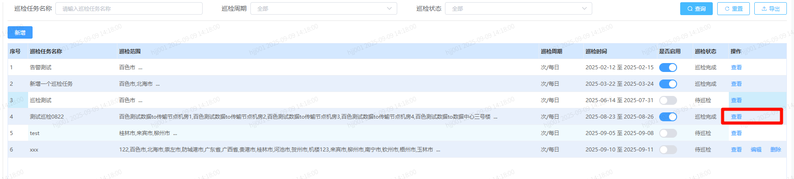

## 巡检统计

```
1、按钮没有问题

2、但是数据不清楚

------------------------------------

告警巡检的规则，
	针对有XX指代的，需要特殊处理。
不能简单的比对标准信号和实际信号是否一致来进行判定。


1、巡检结果详情页面，增加“巡检结果”筛选条件和结果字段

没有数据无法校验结果，但是字段已经增加
```

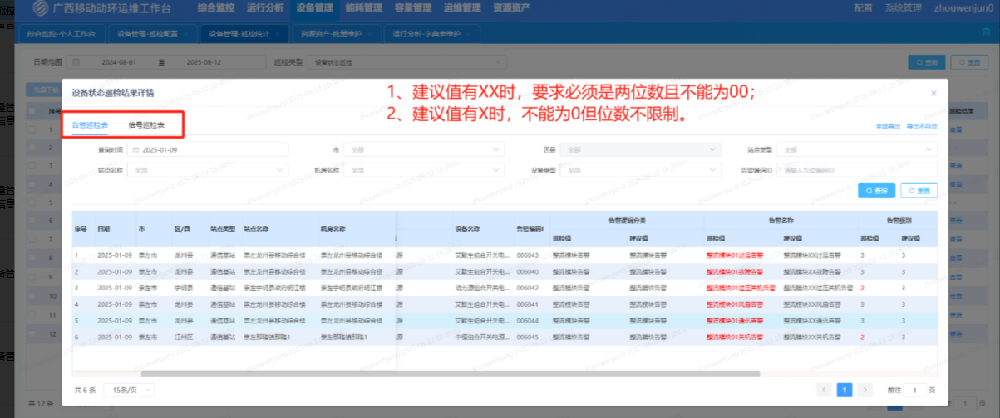


# 能耗管理

## 能耗看板

```

```


## 机楼视图

```
1、站点能耗分析、日条件查询报错
```

{
  "timeType": "d",
  "time": "2024-09-01",
  "precinctId": "01-07-19-05-01",
  "namespace": "alauda"
}


## 用电关系配置

```
1、站点和楼栋都可以配置
2、站点配置完需要刷新数据  触发触发器
3、需要选择对应关系图【站点配置时候需要指定点位】
```


## 能耗自查验收

自查验收明细

```
1、按钮基本没有问题
2、数据来源不知道怎么来的、业务是什么样的


配置完之后，好像需要到能耗数据稽核去刷新
同时要往es进去插数
具体逻辑是怎么样的还不清楚
```


自查验收统计

```
1、统计维度为按市，按区下，市条件仅展示一个所有复选框，没有展示对应的数据
2、统计维度为按区下，区条件复选框无法选择，没有展示对应的数据
```

能耗配置变更记录

```
1、按钮是没问题
2、能耗配置变更是那里变更   --- 在自查验收明细进行站点确认后就可以
```

## 站点能耗报表

```
1、按钮没问题

2、没数据，数据层面校验不到
```

## 机房能耗报表

```

```

## 月度统计报表【提交】

```
1、查询按钮无效
2、导出失败


0911：测试不通过（前端修改的应该没更新上来，查询还是有问题；后端导出失败）
```


## 电表能耗报表

```
1、按钮都正常叻
2、数据不知道是不是插入的es，因为表底值都一直【而且一些设备没有取值】0909
```


## 能耗稽核估算

UPS能耗估算原始数据

```
1、按钮均没有问题

2、数据不知道如何来/业务逻辑不是很清楚
```

开关电源能耗估算原始数据

```
1、按钮均没有问题

2、数据不知道如何来/业务逻辑不是很清楚
```

高压直流能耗估算原始数据

```
1、按钮均没有问题

2、数据不知道如何来/业务逻辑不是很清楚
```

市电直供能耗估算原始数据

```
1、按钮均没问题

2、数据可能来源
	1、当时配置了传输站点、且下的机房的用电关系
	2、配置了设备管理-系统和设备维护
	3、插入了指定时间的es数据
```

## 能耗数据稽核

```
1、按钮没问题


2、数据从能耗稽核估算中涉及到
	1、可能跟插入es有关
	2、还涉及到能耗自查验收
```

## 能耗稽核报表

```
1、按钮没问题

2、数据的逻辑业务是啥，不清楚【跟能耗数据稽核相关好像】
```


# 容量管理

注意：

​	需要了解清除下面这些设备是在哪里配置的

## 容量方案配置

```
1、按钮没有问题【可以正常编辑】

2、不知道有什么作用，控制容量预警的吗，容量的数据又是怎么来的
```


## 容量概括【不清楚】

```
1、


1、加载错误
2、数据中心好像没有点位显示	【主要这个】，其他的好像又没问题了
```


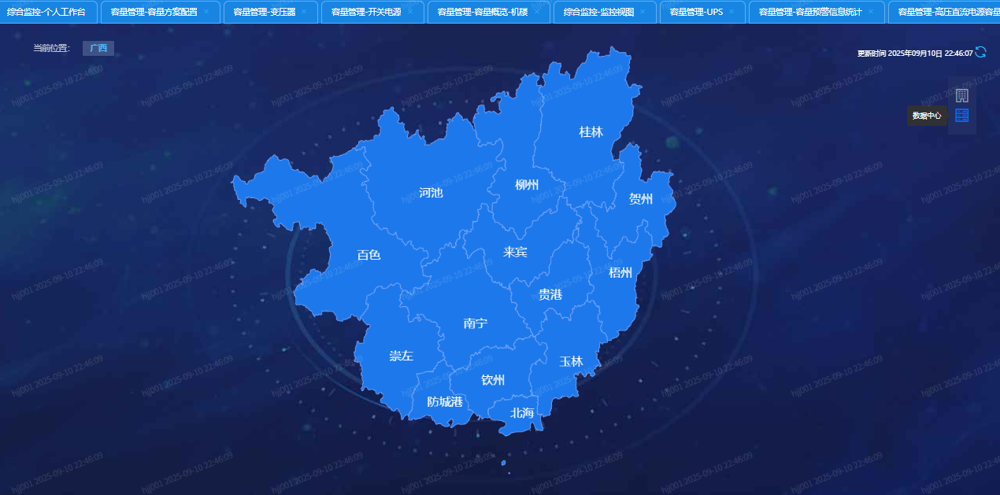


## 变压器

```
1、按钮均可用
2、子按钮 -- 操作 -- 容量详情【导出】、容量历史【均可用】
3、汇总和条数、汇总均一致

---------------------------------------------
但是数据不知道从哪里来的
```

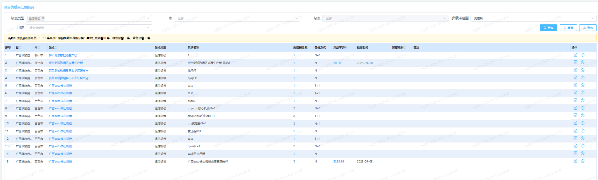

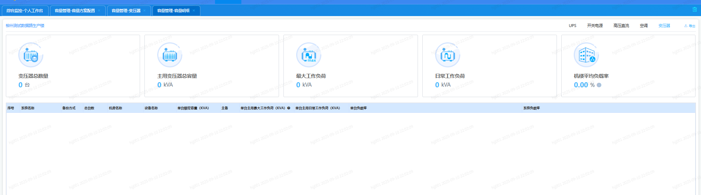

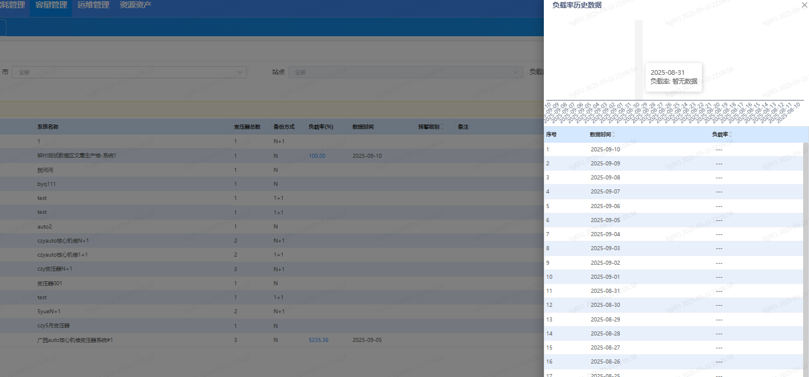

## 开关电源【待解决】

负载率详情报表

```
1、按钮均可用
2、站点能正常跳转【对应容量管理-容量概览-机楼】

-------------------------------------------------
3、导出字段与页面不同步【楼栋、备注】
```

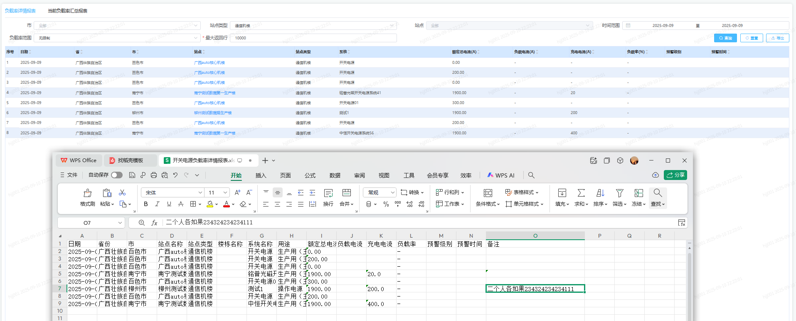

当前负载率汇总报表

```
1、按钮均可用
2、站点能正常跳转【对应容量管理-容量概览-机楼】
3、子按钮 -- 操作 -- 容量详情【导出】、容量历史【均可用】、备注也可用
4、设备能正常跳转到监控视图
5、统计与页面数据一致

---------------------------------
数据具体来源不知道怎么来的，有什么业务管理，预警又怎么区分的
```

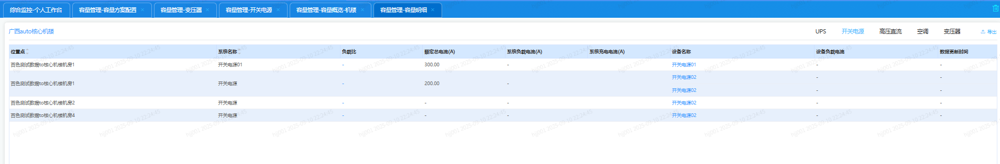

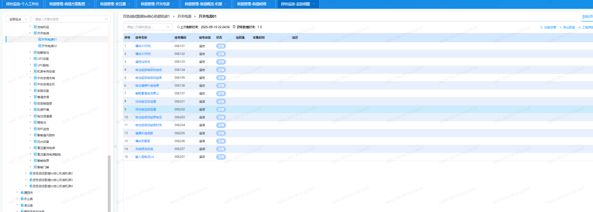

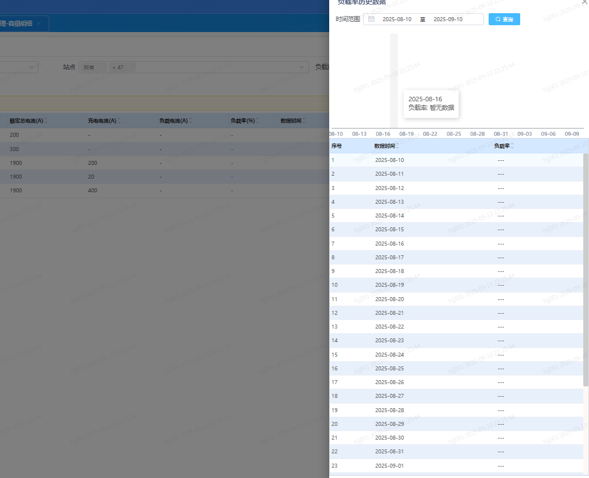

## ups

负载率详情报表

```
1、按钮均可用
2、站点能正常跳转【对应容量管理-容量概览-机楼】
3、负载率能正确跳转 -容量管理-容量明细

-------------------------------------------------
3、导出字段与页面不同步【楼栋、备注】
```

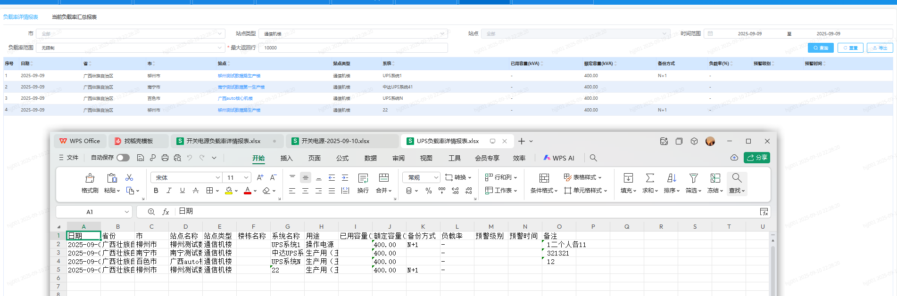

当前负载率汇总报表

```
1、按钮均可用
2、站点能正常跳转【对应容量管理-容量概览-机楼】
3、子按钮 -- 操作 -- 容量详情【导出】、容量历史【均可用】、备注也可用
4、设备能正常跳转到监控视图
5、统计与页面数据一致

---------------------------------
数据具体来源不知道怎么来的，有什么业务管理，预警又怎么区分的
```

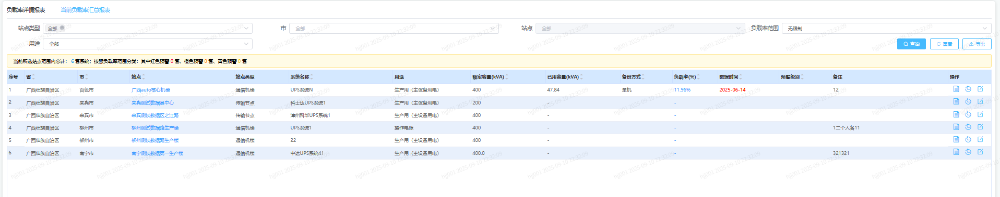

## 容量预警信息统计

容量预警信息统计

```
1、按钮均可用【按日按月也正常】

----------------------------------
数据具体怎么创建不太清除
```

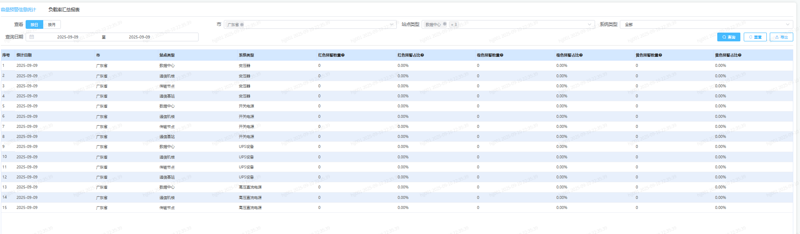

负载率汇总报表

```
1、按钮全部没有问题
2、负载率能正确跳转
3、站点能正确跳转
4、容量明细能正确跳转
5、历史数据能正确展示

---------------------------
业务好像跟上面还是下面某个设置功能相关【动环月报填报 变压器容量预警填报的配置有关系】
```

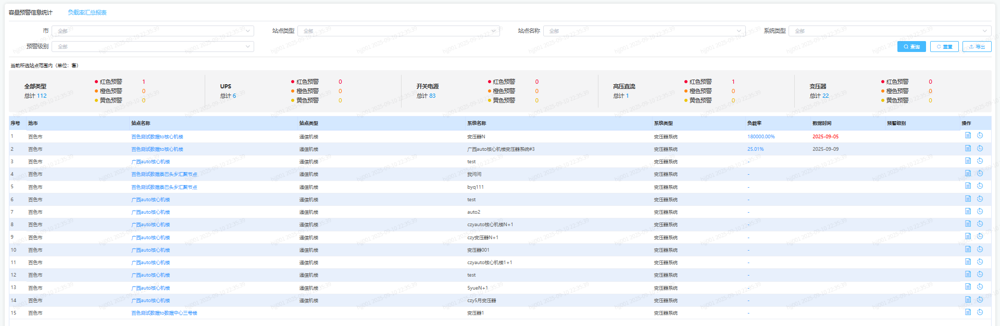

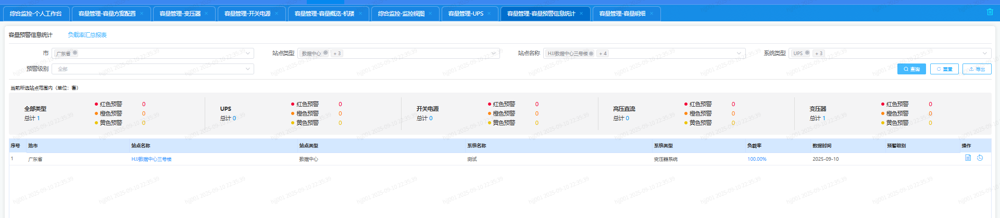

## 高压直流电源容量分析

负载率详情报表

```
1、按钮均可用
2、站点能正常跳转【对应容量管理-容量概览-机楼】
3、负载率能正确跳转 -容量管理-容量明细

-------------------------------------------------
3、导出字段与页面不同步【楼栋、备注】
```

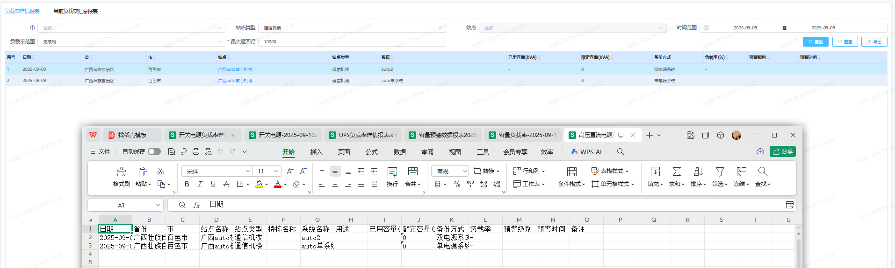

当前负载率汇总报表

```
1、按钮均可用
2、站点能正常跳转【对应容量管理-容量概览-机楼】
3、子按钮 -- 操作 -- 容量详情【导出】、容量历史【均可用】、备注也可用
4、设备能正常跳转到监控视图
5、统计与页面数据一致

---------------------------------
数据具体来源不知道怎么来的，有什么业务管理，预警又怎么区分的
```

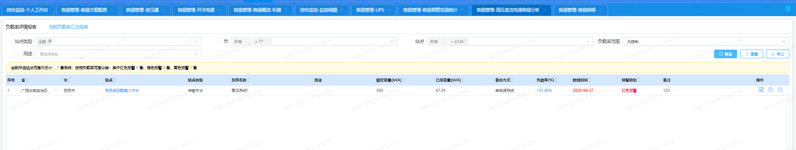

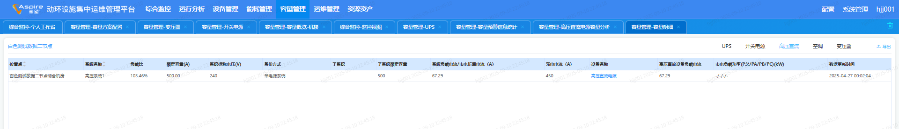


# 运维管理

## 流程概览

```
1、目前不知道是否是需要先创建数据

需要创建验收等申请后才会显示
```


## 动环月报填报

```
1、功能目前都没问题


-------------------------------------
逻辑整理【填报的是本月之前的月份】
	变压器容量预警填报【目前配置的设备是c接口接入的】
	
	燃油消耗报表【目前是需要导出，填写，导入，来完成数值填写】 - 首次编辑有问题
		数据中心/通信机房
		汇聚机房
	
	供电保障填报【目前需要导出，然后全部填写，导入后，才会显示，才能进行编辑】 - 首次编辑有问题
	
	蓄电池隐患填报
		
```


## 动环月报核查

```
1、功能没问题

数据中心/通信机楼


汇聚机房


----------------------
业务逻辑、就是看动环月报填报的数据还有那些没填报
```

## ip申请【未提交】

```
1、发起ip申请出错
```

{
  "deviceStatus": "1",
  "drMonitorSysType": "2",
  "cityId": "01-07-10",
  "siteId": "SITE-99889e5188184275b4d98b2217c606a6",
  "siteType": "2",
  "roomId": "ROOM-164903c6ff064334a8a4638a1466d3ae",
  "deviceType": "1",
  "deviceName": "123",
  "deviceVender": "123",
  "sitePtnProt": "",
  "roomPtnPort": "",
  "approver": "hjj001",
  "namespace": "alauda"
}


## ip库管理

```
1、功能都正常
导入前提：必须是综资表有的才行


---------------------------------
跟综资有关【模板导入内的市和站点等信息，必须是综资里面有的才行】
```

## 动环验收申请【未提交】

```
--------------突然可以申请了、可能是服务在部署导致的问题

1、新增申请失败
2、目前已经走完整个流程，按钮都没问题


-------------------------------------
好像就是机房、站点这些的验收、然后会归档 -- 具体是关联哪个功能不太清楚了
```

{
  "precinctId": "01-07-21-01-01-01",
  "areaId": "01-07-21-01",
  "cityId": "01-07-21",
  "cityCompanyUser": "hjj001",
  "constructionUser": "hjj001",
  "buildUser": "hjj001",
  "cityCompanyUserName": "黄佳杰",
  "constructionUserName": "黄佳杰",
  "buildUserName": "黄佳杰",
  "deviceList1": [],
  "deviceList2": [
    {
      "index": 1,
      "precinctName": "",
      "deviceTypeName": "消防系统",
      "deviceName": "111",
      "isEdit": true,
      "roomId": "01-07-21-01-01-01-01",
      "room": "HJJ数据中心三号号楼电力机房1",
      "resourceDeviceType": "2"
    }
  ]
}


## 验收模板管理【已提交】

```
1、按钮都没有问题


1、目前下载模板字段错误【应该是验收规范】，导致导入失败
```


## 测试模板管理

```
1、按钮均无问题


---------------------------------------------

1、目前出现了503、500错误，可能是服务器部署导致问题
2、需要注意新增里面模板，测点要跟综资里面的对应，设备也要对应
```


## 动环测试申请【待处理】

```
1、按钮


-----------------------------------
【目前建立不了】  --- 好像需要先在动环割接管理里面新增【入网，退网等情况】
1、好像就是fsu的巡检信息
```


## 动环割接管理【待处理】

```


验证不了，割接设备不知道在哪里弄得
```

## 协议入库申请

```
1、功能均没问题


-----------------------
业务
申请和审批不能是同一个人
协议入库管理里面可以对已经审核进行变更【由申请人提起】
```


## 协议库管理

```
1、功能都正常

---------------------------
对已经审批的进行变更
```


# 资源资产

## 超期服役统计

```
1、按钮均无问题


但是数据不知道从哪里来/不知道与什么关联
```

## 设备风险分析

```
1、按钮均无问题【导出字段名需要修改】

但是数据不知道从哪里来/不知道与什么关联
```


## 风险策略配置【待处理】

```
告警风险等级
维修风险等级
超期服役风险等级

-0--------------------------------------

按钮均没有问题


-0--------------------------------------

但是超期服役风险等级、设备子类没有显示【不知道是否是问题】
	需要看对应zz等表信息【与当时子设备列表那个需求有关联】
	
	
--------------------------------------------
但是数据不知道从哪里来/不知道与什么关联
```


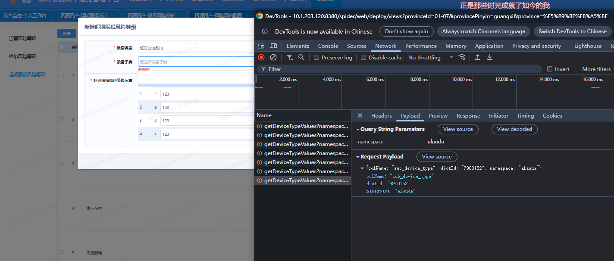

## 系统维护

```
到站点/机房层级都可设置

1、按钮均没问题

2、但是数据不知道从哪里来/不知道与什么关联/不知道有啥作用
```

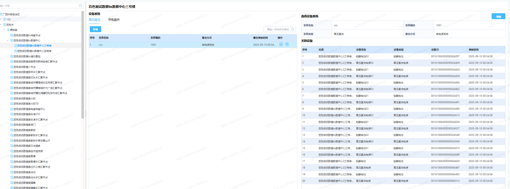

## 设备维护

```
到机房下的设备层级才行

1、按钮均没问题 -- 编辑没问题

2、但是数据不知道从哪里来/不知道与什么关联/不知道有啥作用
```

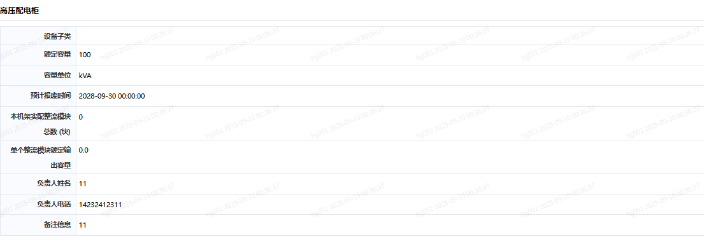

## 批量维护

```
用于与设备/系统/空调 -- 批量维护的操作

1、按钮基本没有问题
2、导出是三个类型的sheet页 【导入也是】正常的
3、没有设备子类型【这个不知道从哪里来的，怎么设置的】
```

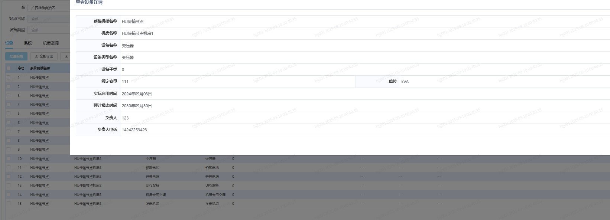

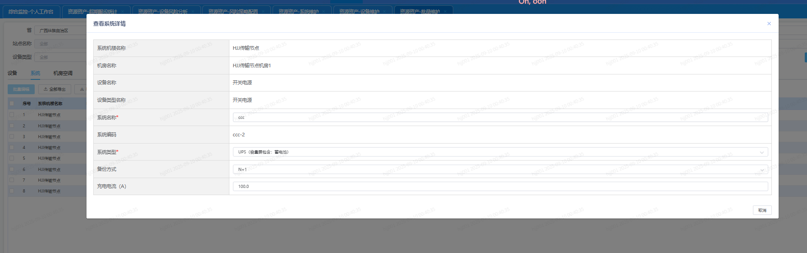

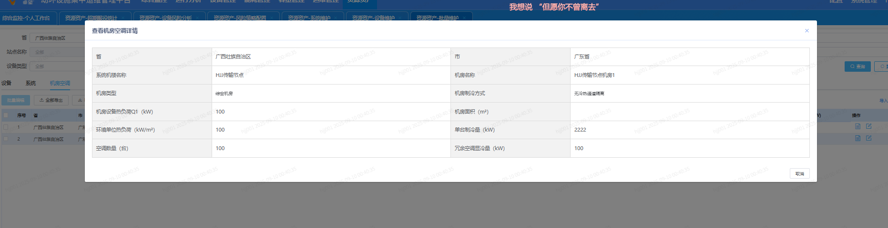


# 配置

## 视图【未登记】

```
设备top10展示有问题
```

{
  "precinctId": "01",
  "time": 1757434133243,
  "namespace": "alauda"
}


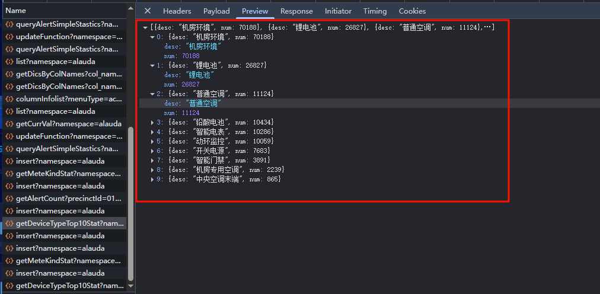

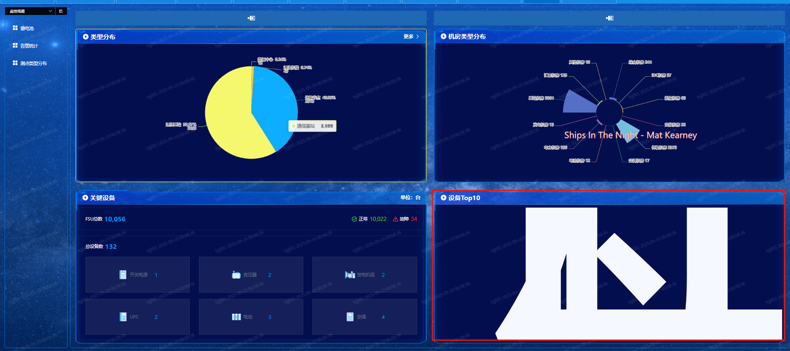


# 操作手册【未登记】

```
下载出来非文件格式
```

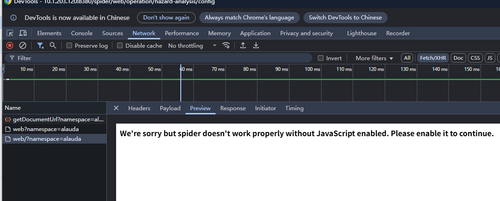


# 补充上海的

有视图配置  -- 作用于语音配置


