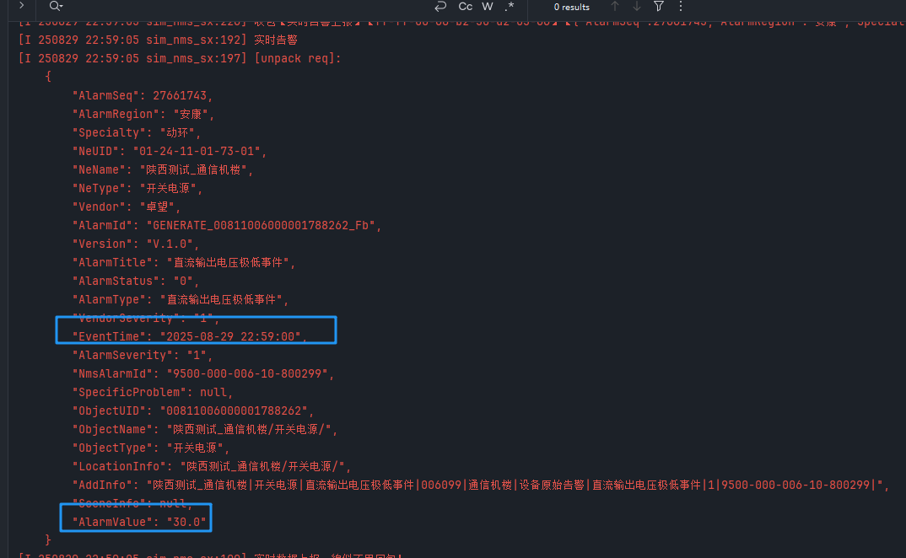
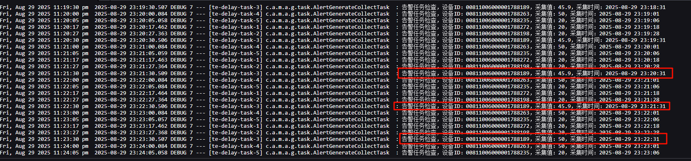
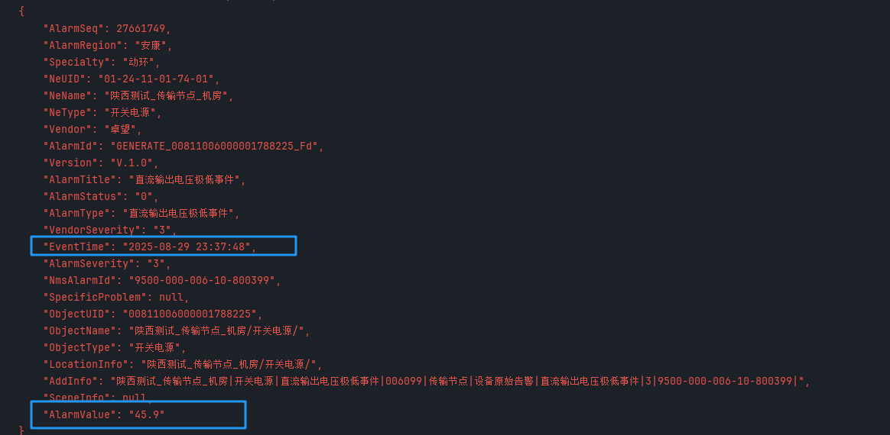

# 超高温度告警

```
涉及表
	


遇到问题：
	1、测点上报时上报了两个相同测点   [需要把中间库中的signal多出的删除、把动环库中t_cfg_metemodel_detail多余的也删除]
		动环库——需要结合
			日志：会显示对应设备id
			generate生成表：会有对应设备id和测点id
			根据这个id——到t_cfg_metemodel_detail中查看
		中间库
        	通过fsu、设备id找到对应signal
	2、已经触发的报警如何完全删除	    [把alert_alerts表中的告警删除、把generate_alarms的告警也删除、删除之后需要重启服务才生效]
	3、多个告警					 [现网下设备已经申报了，因此不会出现这类问题]
		每次消除，需要满足条件的都取消了才可以
		前面我是有两个301测点、因此导致其中一个消警、但是另一个还没有，就会导致超高一直下不去
	4、改配置
		如generate表，告警清除，如配置表，时间等阈值的限制
		都需要重启alerts服务


业务逻辑：
	1、触发告警后、才采点大于阈值时告警
	触发时
		task表中
			relate_device_id ：机房环境
			采集的也是机房环境设备	[改设备id可以在综合视图对应站点机房设备下获取、也可以直接在日志看、或表里看]
	2、采集逻辑
	触发时：
		每1分钟都会轮巡前1-2分钟、离采集时间点最近的一个值
		比如20分
			日志会显示采集值、采集时间为2025-08-28 09:19:07
			它所采集的就是离09:19:07最新的那个值


数据获取：
	1、检测的是机房环境的测点	[需要根据站点下——机房下——对应设备的deviceid]
		获取方式：
			在综合视图——实时监控	[进行对应站点机房下——选择对应设备——f12看返回报文] -- 本次是机房环境，看的就是机房环境的deviceid
```

# 电压

```
最最主要的校验步骤
	看监控视图设备id【因此选择好设备后、要记录好设备id】
		其次看告警是否出来【是否是该机房下设备id】
		服务器日志是否有该设备的同步信息
		数据库是否有该设备的采集任务【task表】
	不同站点互补影响
		同一站点的话，还需要是同一机房才会影响【检测的是机房下所有设备】
		


涉及表
    SELECT * FROM alert_generate_conf;
    SELECT * FROM alert_generate_threshold;
    SELECT * FROM alert_generate_collect_task;
    SELECT * FROM alert_alerts LIMIT 10;

    SELECT * FROM sn_zz_ce_device_pe_switch_power;
    SELECT * FROM sn_zz_ce_device_pe_battery;


前提：数据准备
	1、需要先找到对应机房的对应设备、并拿到对应设备id	[先拿开关电源设备id、并把它写入到开关电源综资表里  -- 一个开关可以挂多个铅酸或锂电池，需同个机房]
        sn_zz_ce_device_pe_switch_power   开关电源表
            res_code：唯一标识，但是可以自己设置
            power_device_id：动环对应的开关设备id
    2、需要找到对应机房的对应设备、并拿到对应设备id	[这里拿的是锂电池还有铅酸电池、并把它写入到蓄电池综资表里，需要关联电源开关设备id]
        sn_zz_ce_device_pe_battery		  蓄电池表
            res_code：唯一标识，但是可以自己设置
            related_power_device：开关电源表的res_code		必须要写，且要与上面一致，否则会出错
            power_device_id：动环对应的电池设备id
    3、需要机房下使用到的对应设备的设备id表里，添加对应的res_code	[通过设备id查询、然后把综资表里面涉及到的测点的res_code，写到t_cfg_device的zz_]
        必须要在t_cfg_device对应res_Code，否则触发告警也不会触发采集【重点】
        	不加的话，只能触发普通告警，但是采集不了也无法挂载
        t_cfg_device
            device_id：设备id
            device_model:对应fsu下设备的设备模板
            zz_res_code：【对应开关电源、蓄电池等表里面的res_code】


遇到问题
	1、电压告警逻辑错误、变成反向了
	2、一个站点下的机房下的设备[同时有电池、开关等多个超过阈值的]，需要全部消除，对应告警才会消除
		即一个站点下，设备告警满足的情况，并且是多个的情况、需要都消除
		所有情况对应一个告警——即一个机房就对应一个这类告警


业务逻辑
	1、触发告警后、才采点小于阈值时告警		[大于等于就消警]
	触发时
		generate_task表中
			蓄电池的relate_device_id ：是开关（因为是挂在在着这里的）
			但是采集还是采的蓄电池
	2、每个开关下面是挂了多个蓄电池的
	触发条件后
		蓄电池会通过related_power_device、找到开关的、开关会通过power_id，找到动环设备表里面对应设备
	3、采集逻辑
		采集逻辑是拿最新的
		运行拿1-2分钟的
		日志中的时间就是该点时刻的数据
		
		每1分钟都会轮巡前1-2分钟、离采集时间点最近的一个值
		比如20分
			日志会显示采集值、采集时间为2025-08-28 09:19:07
			它所采集的就是离09:19:07最新的那个值
	4、重启服务之后
		会重新初始化 --> 读取生成任务表里的任务、继续进行采集


数据获取：
	1、检测的是开关电源、（锂电池、铅酸电池）——蓄电池设备、因此需要获取对应的设备id
		获取方式：
			在综合视图——实时监控	[进行对应站点机房下——选择对应设备——f12看返回报文] -- 到对应机房、点对应设备、下拉列表下的设备
			获取到deviceid后	[还需要t_cfg_device表]
				与数据库本次关联表generate对比采集的设备id是否一致
				日志中采集的设备id是否一致
				通过设备id查看动环库中、t_cfg_metemodel_detail、看设备对应的测点id是否一致
				然后再进行数据的比对、是否采集成功

```

服务器时间与采集时间差太多

测试环境fsu没那么快，会被卡住


# 补充测试点

```
1、条件时间范围
	看是否时间到了之后会停止
	控制表和逻辑如下
	
2、告警后、如果告警不被消除【后续又检测到、那么触发告警值不会更新吗】


3、重复zh时怎么处理

4、中途修改zh方向是否会同步修改


5、不同基站挂载呢
	不同站点下机房设备
		我用A站点下机房设备 -- 挂载到B站点下机房设备，这种合理吗
		
6、时间点取值是否正确
	告警任务检查，设备ID：00811006000001788149，采集值：47，采集时间：2025-08-29 13:55:36
	要取58.36的
	
	20，50，60，70，80
	
	等日志检查出2025-08-29 13:58:36
	
	
```


# omc补充

```
omc
	服务器目前是这边启动着
		cicd里面看moc服务：目前已经启动了
		
	需要改socker：未omc服务的端口
	
	
	
	select * from alarm_record_log order by index_seq desc 
	这个是中间表，我们告警/消警会写入这张表，然后等待omc处理
	
	
	告警时间后
	
	
	模拟器会收到数据
		模拟器里面会一直有心跳
		
	主要内容
		【还要注意：】
		比对返回内容与文件里面的一致
		
		检测：NmsAlarmId			网关编号一定要一致
		设备类型：ObjectType			一定要一致
		告警级别：AlarmSeverity		一定要一致
		
```


消警后，数据不一致











补充验证：验证之前的消警是否也是这样子


```
问题
	1、
		第一层告警触发，采集时间段内均为采集相关设备低于阈值情况，无二级告警触发，正常落库采集结束时间
		
		第一层告警未消除、相关设备采集点出现低于阈值情况，不再新增任务进行采集，无法进行二级告警判断
		
		第一层告警是持续的，因为是fsu现有的就是这样
		
	2、
		第一层告警触发，采集时间段内出现采集相关设备低于阈值情况，产生二级告警、到结束时间都为消除
		数据库结束时间无法正确落库【二次验证，没问题】
		
	3、
		
```


