```
注意：
	所有字段标准化：
		地市，区县，站点类型，站点名称，机房名称，设备类型，设备名称
```


# 	3、资源资产-风险策略配置

# 6、资源资产-风险策略配置-1

```
设备类型以综资为准

告警、维修、超期服役的设备类型均以综资为准。取综资设备类型，若存在与动环不一致的，提供映射关系
```

设备类型与综资表不一致


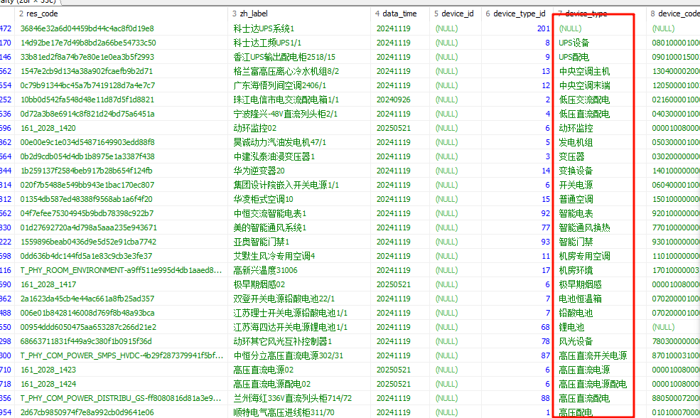


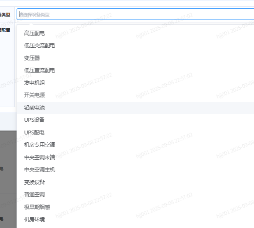

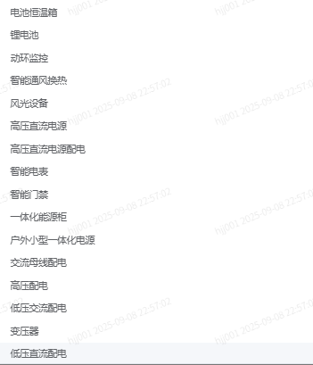


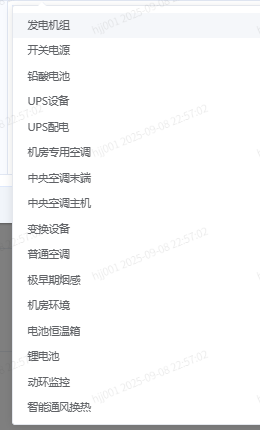

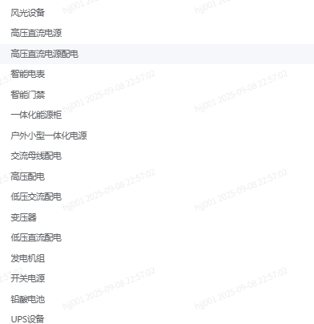


# 7、运维管理-协议入库申请

403无权限

# 8、设备管理-隐患配置

```
改成油机输出负载率过高
```


# 17、容量管理-用电评估

站点下无对应设备类型


用电评估校验逻辑位置抽取到最前面，待上线：capacity-service

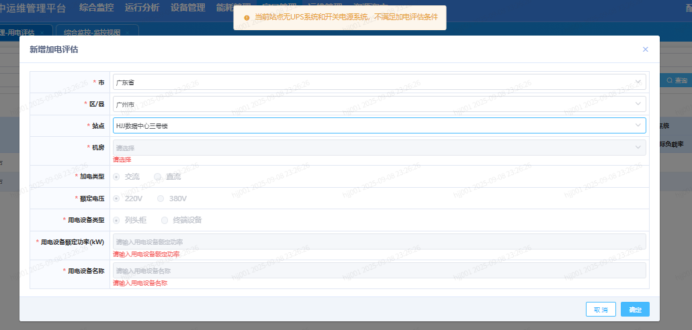

# 19、运维管理-IP申请

有数据，但是不知道对应哪个表

# 21、运维管理-验收模板管理

```
1、除了第一条，其余全都没有改

2、新增模板
	设备子类为空
		{
          "deviceType": "UPS配电",
          "namespace": "alauda"
        }
	
	下载模板 - 模板显示还是为检测规范
		导致上次时出现问题
```


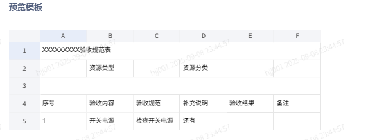


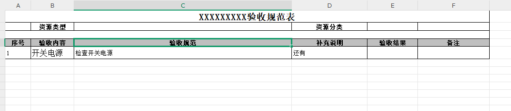


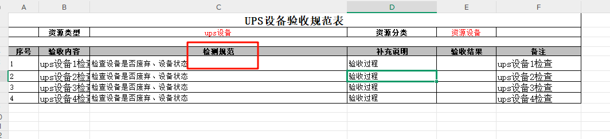


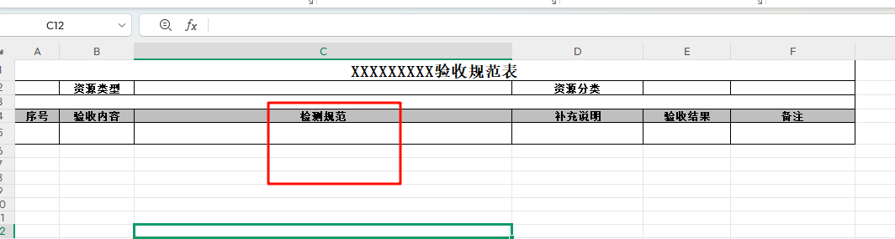

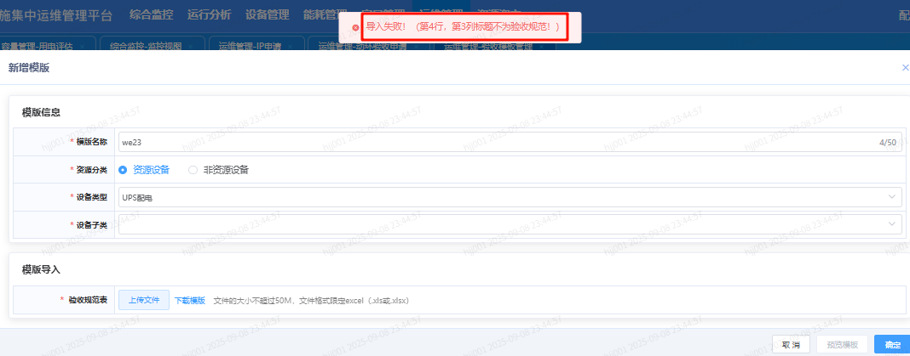

# 23、运维管理-动环验收申请

1、403

2、数据不知道怎么来

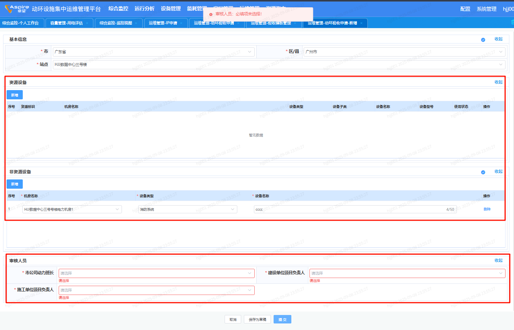


# 24、运维管理-动环验收申请

```
1、审批历史中的处理环节的角色，保持与工单发起处的角色名称一致
2、数据不知道怎么造
```

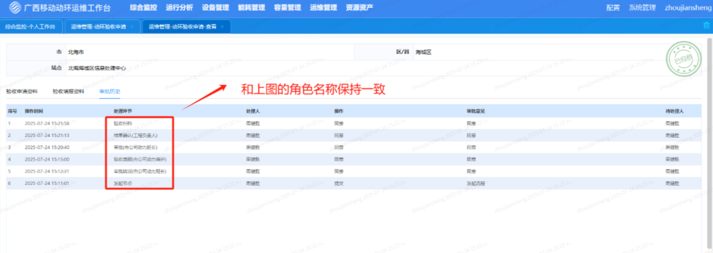

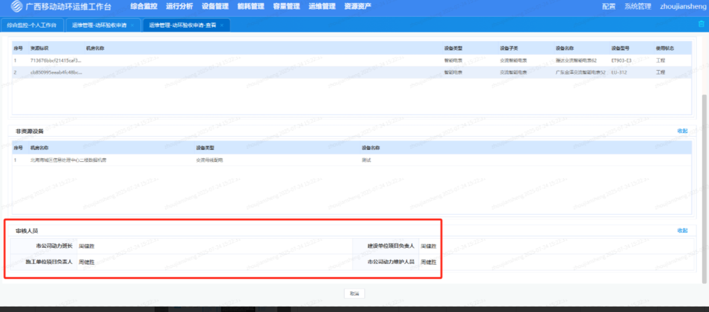


# 29、运维管理-测试模板管理-1

```
1、测试模板管理删除非资源设备；		【完成】
2、设备类型合并为一个选项，以综资设备类型为准【好像是与综资表的类型一致   -- 需要确认是看哪张表】
```

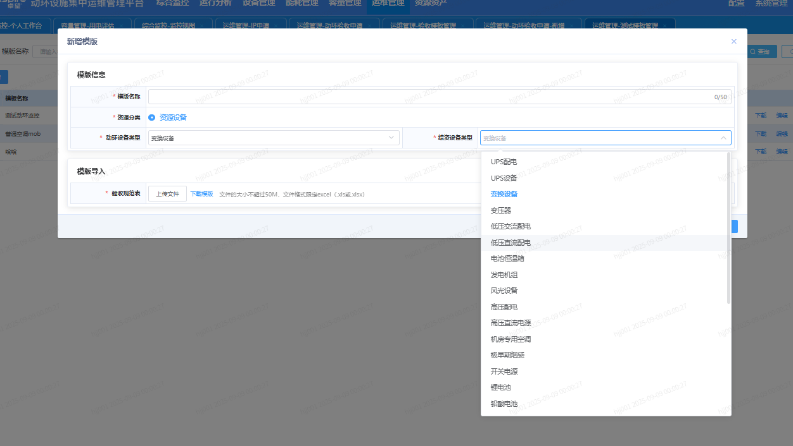

# 36、

# 52、综合监控-供电拓扑

```
1、专业内输出分类tab页，增加导出功能【未增加】
```


# 55、综合监控-网络拓扑

```
1、好像有接入的是由相关信息可以查看的，为什么我接入的没有显示【重新接入一个试试看】
```


# 59、综合监控-拓扑评估

```【】
1、其余设备改为其他设备【完成】
```

# 62、综合监控-拓扑评估

```
稽核UPS配电资源数据不符合条件的有90条，但这里的稽核结果一条没有 【好像有数据了，但是数据怎么来的不知道】 
```

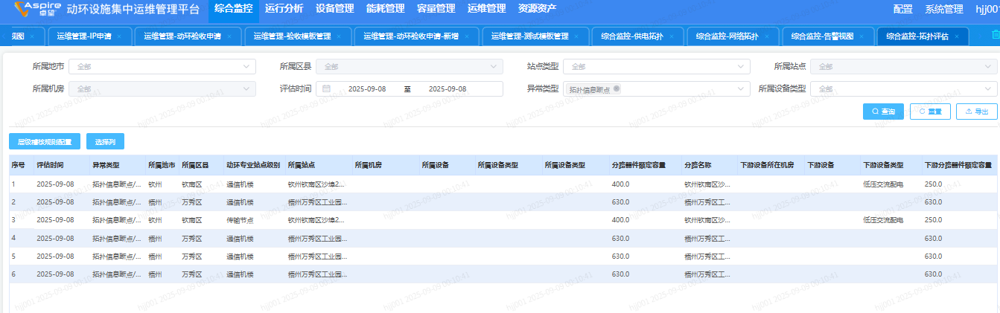

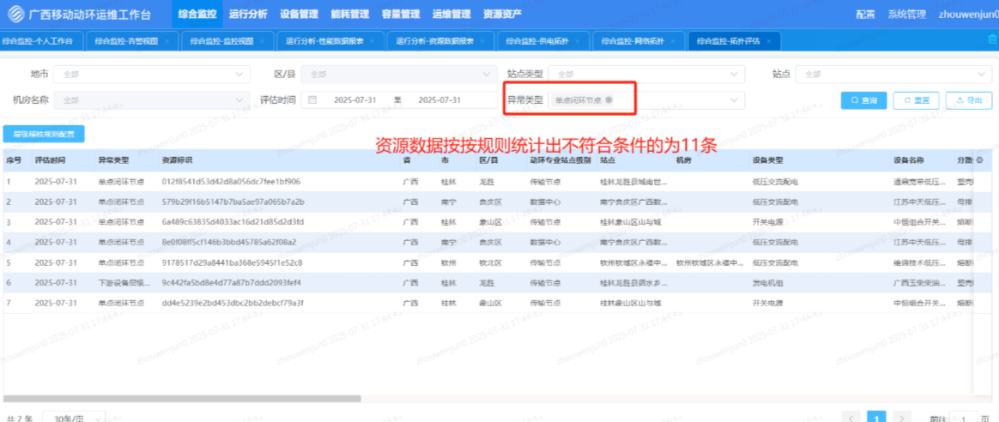


# 63、

# 82、运行分析-字典表维护 - 1

```
1、模板内容要和标准字典表同步更新


-------------------------------------------

1、这个是验证导出模板里面的信号编码跟标准字典表excle里面的是否一致
2、同时验证字典表维护里面的模板导入是否能正常导入【测点用的信号编码的，导入能否正常导入，编辑等】
3、确保表格内容都要正确
```

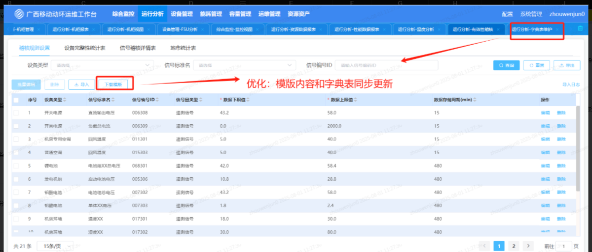

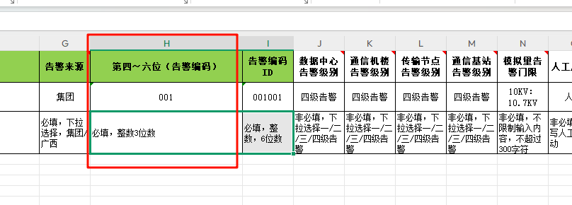

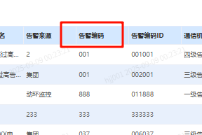


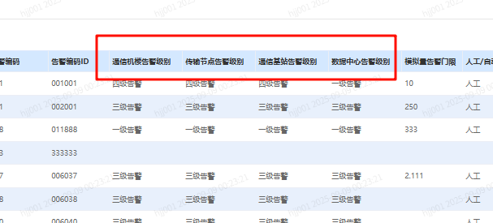


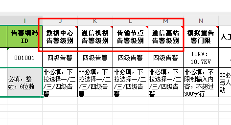

第二个表【多了个信号来源】

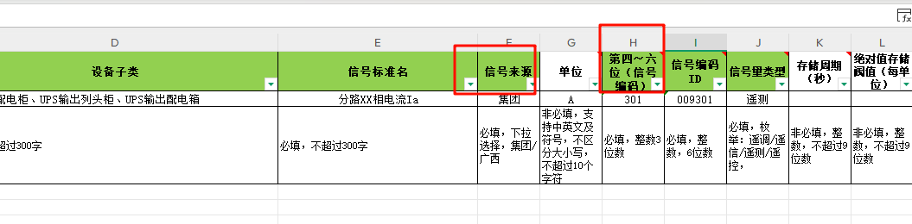

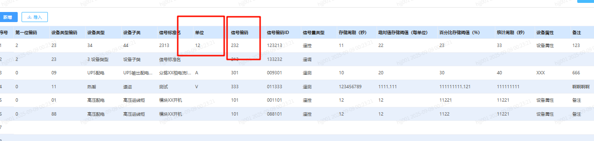


# 83、运行分析-有效性稽核-1

```
【已经处理的，但是不知道数据在哪里来的】
1、模板里面导出的信号测点数据从哪里来
2、电视墙在系统中已经不存在


这里主要验证
```

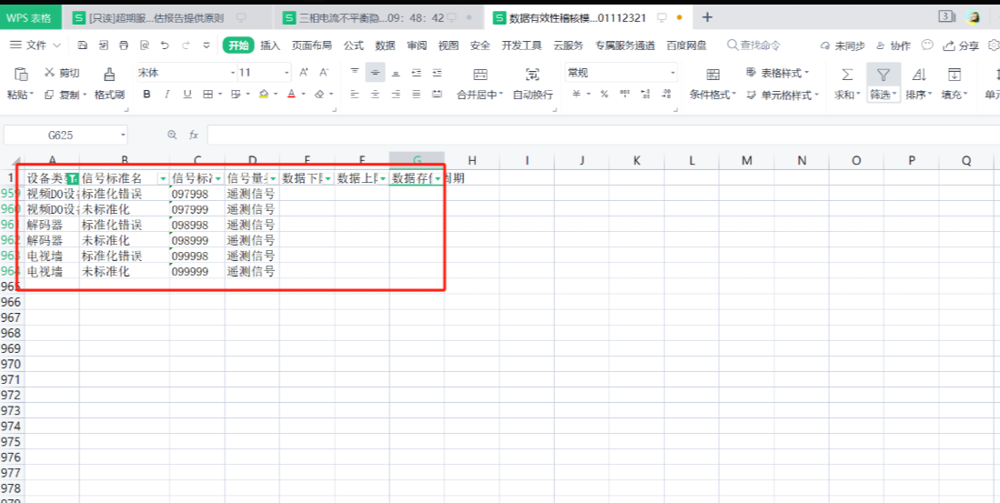

# 84、运行分析-有效性稽核

```
1、增加设备子类字段【】
没问题、只要第二和三的tab页面
```


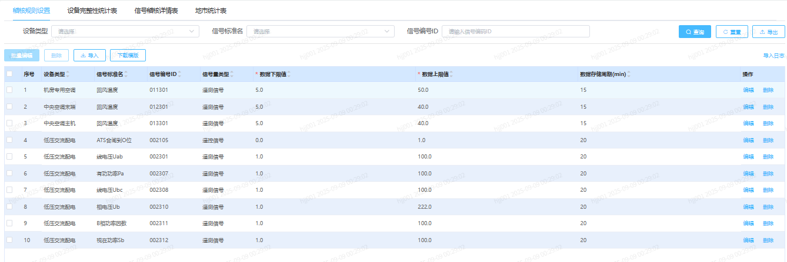

# 89、运行分析-字典表维护

```
1、修改模板【导入成功】
```

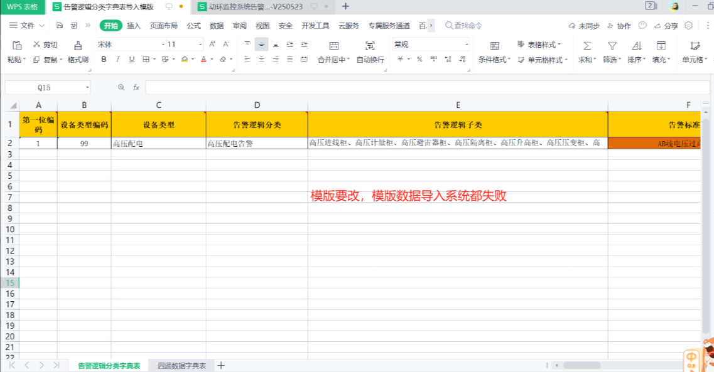

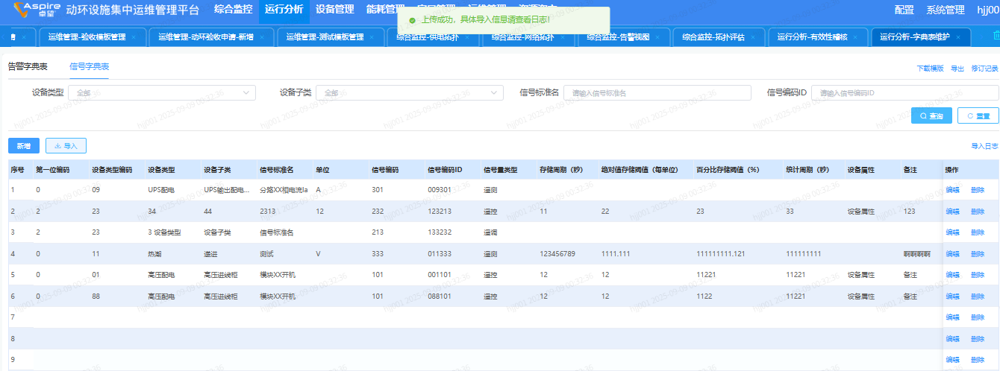

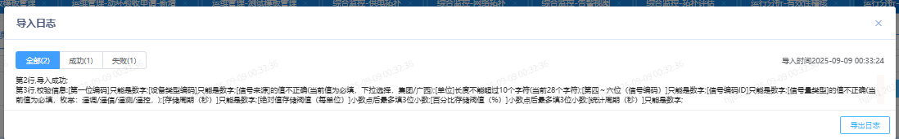

# 93、运行分析-字典表维护-1

```
很多bug

字典表功能优化内容汇总


广西字典表维护，优化内容：

1、新增或编辑，第一位编码默认为0，
	设备类型改成下拉选择【没有】
	设备类型放设备类型编码前面，
	如果已经导入的字典表已经配置过设备类型，设备编码自动带出。

2、告警逻辑分类和告警逻辑子类，都改为必填。

3、告警来源必填，改成下拉选择，枚举：集团/省内。

4、告警编码字段改成“第四～六位（告警编码）”字段。

5、告警编码ID，根据第一位编码+设备类型编码+第四～六位（告警编码）。

6、数据中心告警级别位置调到通信机楼告警级别前面。

7、模拟量告警门限改成文本输入，这个字段后面不会用来做阈值判定，只是字典表里面要收录对应信息。

8、该事件对设备的影响/该设备对业务的影响，都改成枚举下拉，枚举值参考广西字典表。

9、维护作业测试周期，改成下拉枚举：月/季/半年/年/无。


四遥的标准字典表，参考上述告警信号的改动今天灵活调整。

1、信号编码字段改成“第四～六位（信号编码）”字段。


3、增加一个信号来源字段，必填，改成下拉选择，枚举：集团/省内。

4、信号量类型改成必填。


------------------------------------------------------


1、页面应该也对应改上信号编码字段改成“第四～六位（信号编码）”字段
2、还需要增加信号来源字段
```

告警字典表

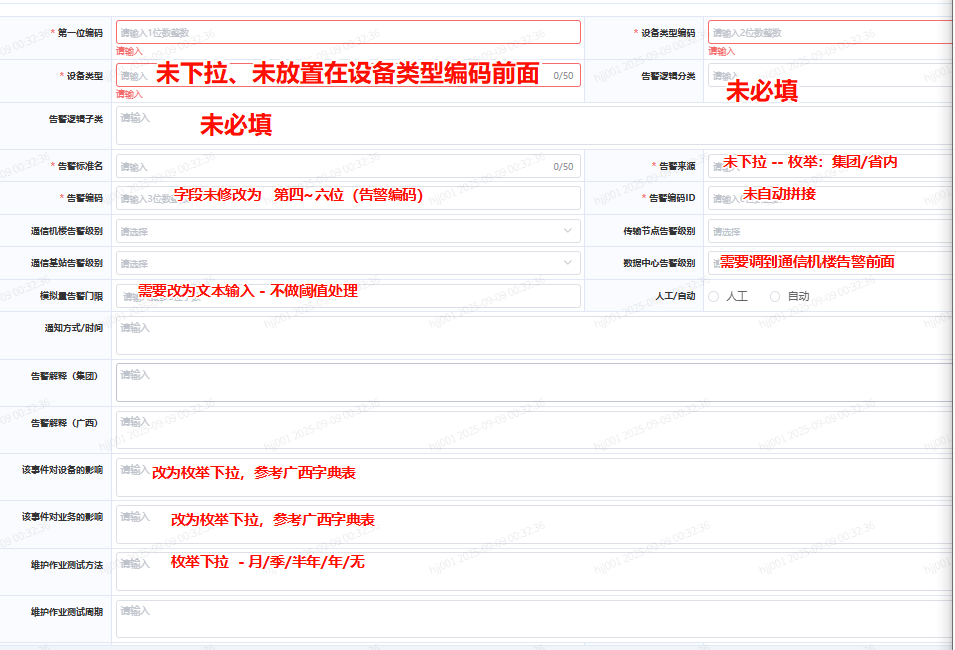

信号字典表

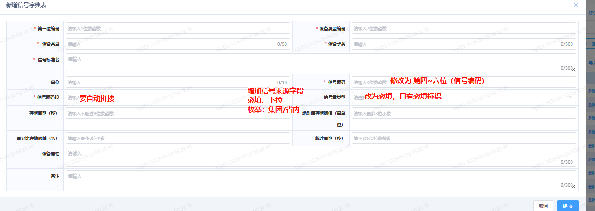

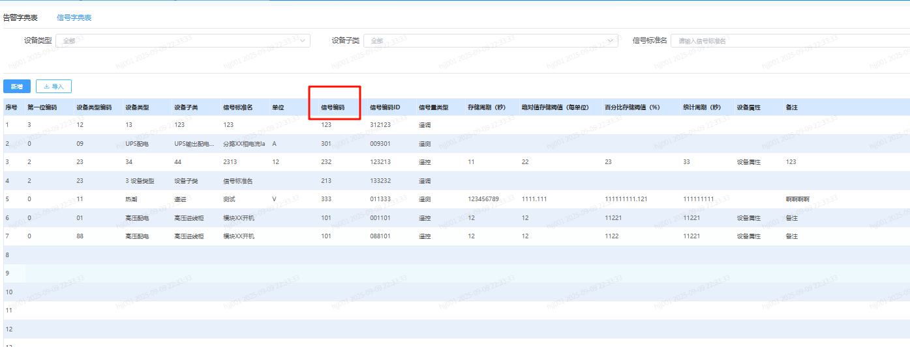

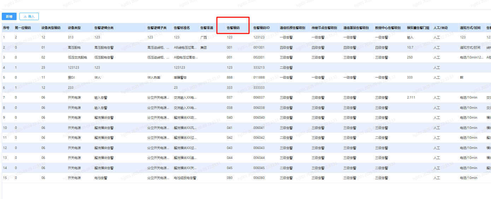

# 115、设备管理-巡检统计

```
信号巡检结果，整体字段错乱
```


# 116、设备管理-隐患统计

```
1、实时隐患去掉结束时间【完成】
```

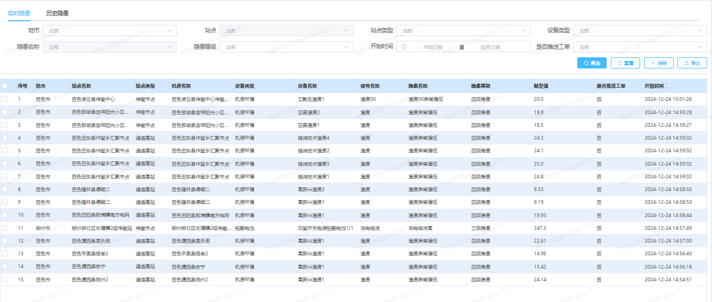

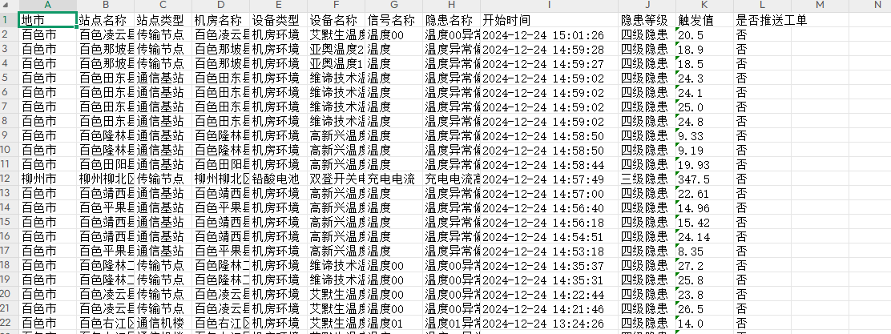


# 120、设备管理-隐患统计

```
隐患统计和故障统计的时间筛选条件，进行调整。
结果中有多个时间，指向不明。
将筛选条件时间，改为开始时间
```


# 123、设备管理-故障统计

```
统一报表时间字段名称
```


# 124、设备管理-隐患统计

```
隐患统计和故障统计的结果表，都增加是否推送工单字段以及筛选条件【完成】
```


# 125、设备管理-隐患统计

```
1、隐患统计和故障统计的结果表，都增加是否推送工单字段以及筛选条件
```

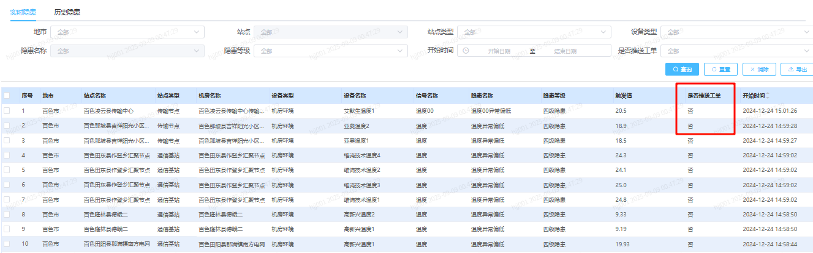

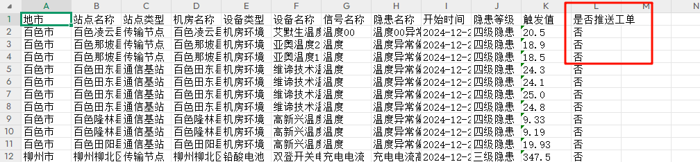

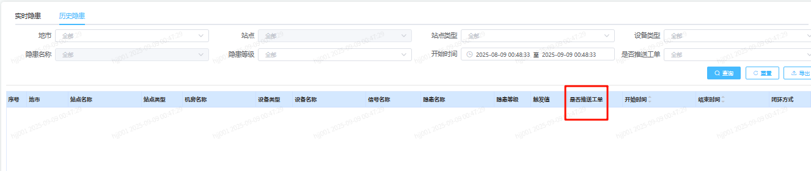

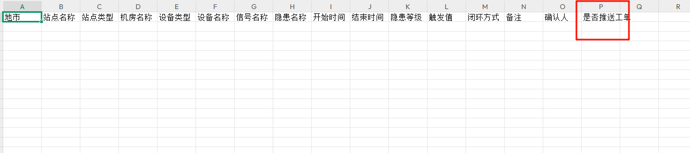

故障统计

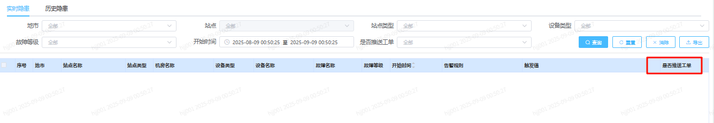

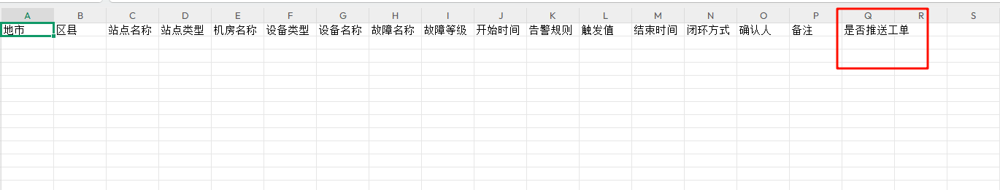

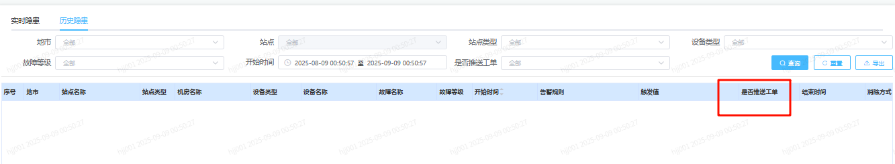

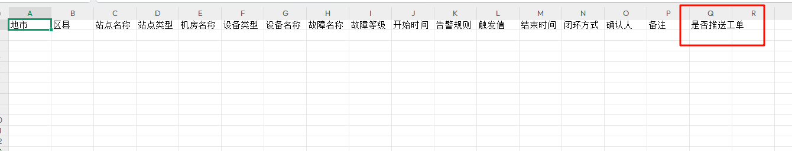


# 130、容量管理-容量预警信息统计

```
指标卡数据与详情数据数量不一致【测试环境已经一致】
```


# 131、设备管理-巡检统计-1

```
1、巡检结果详情页面，增加“巡检结果”筛选条件和结果字段

没有数据无法校验结果，但是字段已经增加
```

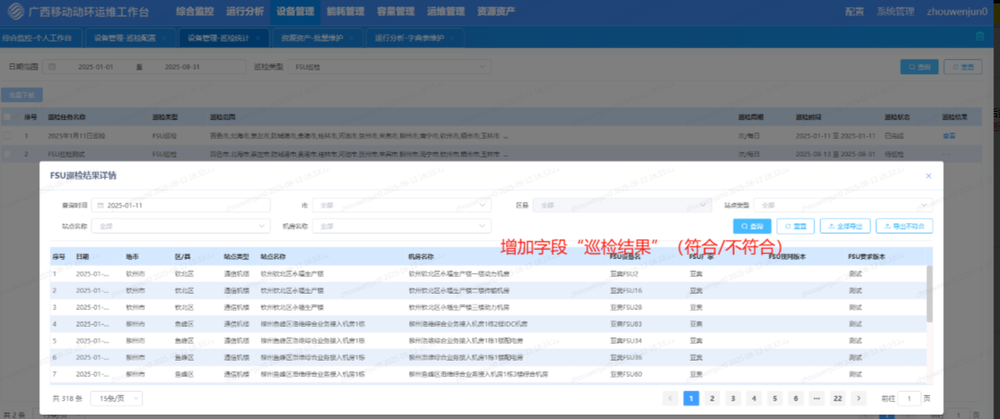

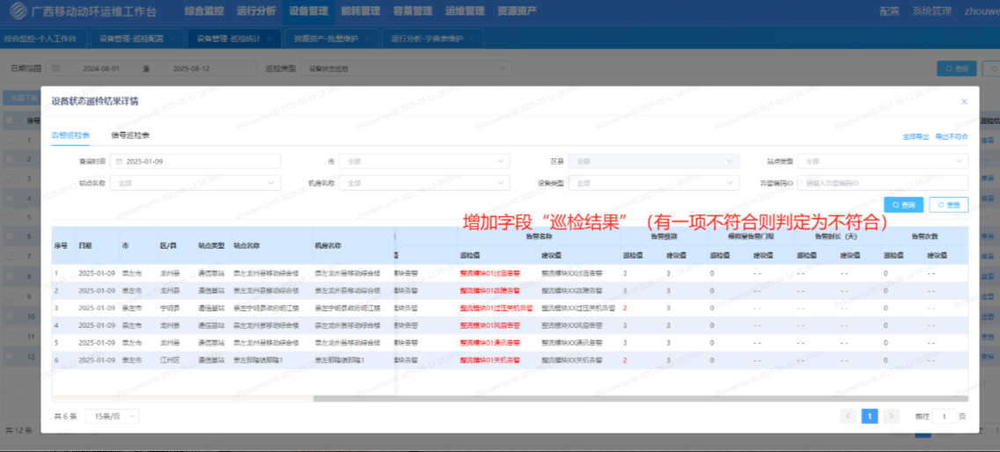

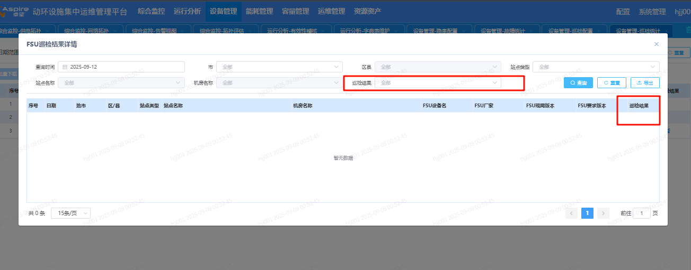


# 132、设备管理-巡检统计-1

```
告警巡检的规则，
	针对有XX指代的，需要特殊处理。
不能简单的比对标准信号和实际信号是否一致来进行判定。
```


# 133、设备管理-巡检配置

```
1、巡检方案增加编辑按钮
2、增加编辑按钮后的方案生效逻辑同步修改。


已完成目前还没有编辑按钮
状态没转化【是因为没开启，所以没有转化】


resourcemanage-service
composite-service
```


# 137、能耗管理-电表能耗报表

```
部分输出查询结果为空
```


0815：建议宏盛排查用电关系从集团迁移时，是否因为当时存在机楼与基站重名，导致用电关系同步失败
2025-08-24:  经排查，能耗配置对应站点设备发生过变动，导致能耗配置那边并未找到，目前手动改动完数据了，然后排查了所有能耗用电配置，只有这个站点有相应的问题
0828：前端已改
0908：接口传参siteTypeId改为siteType


# 140、能耗管理-机楼视图

```
1、机楼视图板块中的机房门常开风险，已经下线了该功能板块。此处调整为机房高温风险；
2、机房高低温风险数据无法正常统计


待上线：composite-service、energy-service
```


# 141、能耗管理-机楼视图-1

```
站点基本信息同步综资数据
```


# 144、能耗管理-能耗统计报表

```
对当前功能板块进行内容的删除及重构，删除不适合省动环工作台的板块及字段  -- 功能下线


0904产品：细致查看功能后，该功能已不适用当前动环工作台运维分析需要，且其他功能可覆盖该功能数据。决定对功能屏蔽，待后面V版本确定后，针对性下线处理。
```


# 146、能耗管理-月度统计报表

```
1、删除表头多年份的平均PUE；只保留两个
2、目标PUE在哪里设定，提供配置的入口指引，在表格字段处增加配置提示；

待后端字段部署
0901产品：2024目标PUE改为设计PUE。不再调整为“今年目标PUE”

已提bug
```


# 149、能耗管理-电表能耗报表

```
1、删除关键字筛选条件。或者标注其筛选逻辑。不要整这种莫名其妙的筛选条件，不明所以
2、用电量筛选条件改成当天总能耗

没问题了
```


	


# 补充内容

## 表格字段未标准化

```
注意：
	所有字段标准化：
		地市，区县，站点类型，站点名称，机房名称，设备类型，设备名称
```

### 综合视图-告警视图

活动告警、确认告警、消除告警【全都是 - 仅后端】


### 运行分析-市电停电配置

页面和导出


### 运行分析-市电停电配置

高压系统停电分析tab页/线路停电分析【活动和历史】

列表 - 操作列【告警详情】展开后的两个tab，区都改成区县


### 运行分析-不平衡度分析

页面和导出字段未标准化


### 设备管理-巡检统计

fsu巡检导出


设备状态巡检-告警巡检表


信号巡检表


### 运行分析-温度分析

温度测点


温度数据稽核


### 运行分析-动环设备与综资关联报表

改成区县


### 运行分析-告警报表

四个表格都是


### 运行分析-性能数据报表

页面和导出、遥测量曲线表


遥测量历史数据报表


### 运行分析-资源数据报表

局站信息报表


局站统计报表

页面和导出均是


设备信息报表


设备统计报表

按机房维度


系统数据统计报表


机房明细报表


### 设备管理-UPS效率


### 能耗管理-能耗自查验收

自查验收明细


自查验收统计

按区域条件筛选后


能耗配置


### 能耗管理-站点能耗报表


### 能耗管理-机房能耗报表


### 能耗管理-能耗数据稽核


### 容量管理-变压器

容量管理-容量分析下的所有导出均是


负载率详情报表


### 容量管理-用电评估


### 资源资产-批量维护


## 其他错误

### 设备状态巡检-告警巡检表

巡检值问题


隐患配置触发


### 运行分析-告警分析

提示展示有问题【四个表都会】


### 设备管理-FSU分析

查询报错、导出报错


# 补充

能耗管理

站点能耗报表

按日、周、月条件导出文件均为删除气候类型

