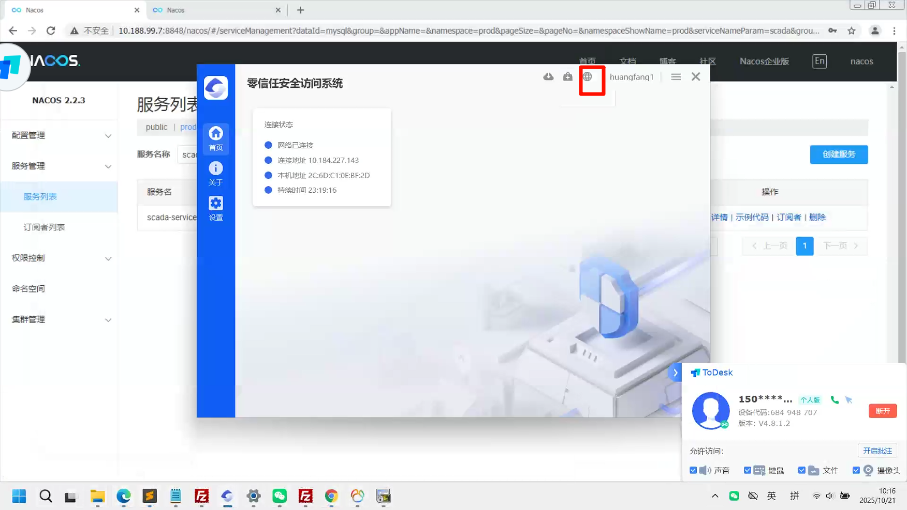
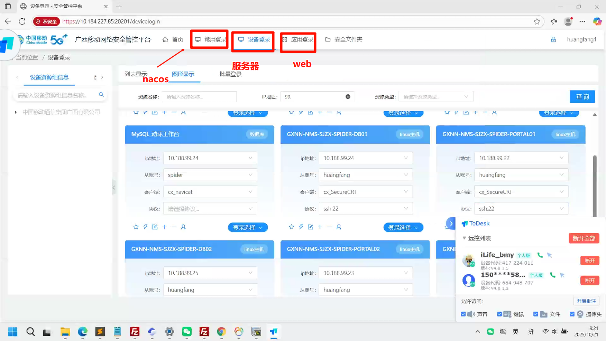
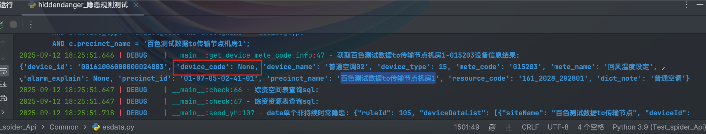
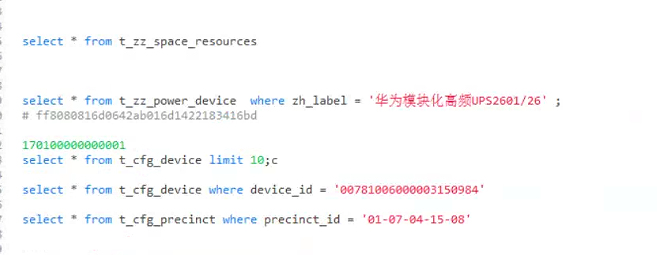
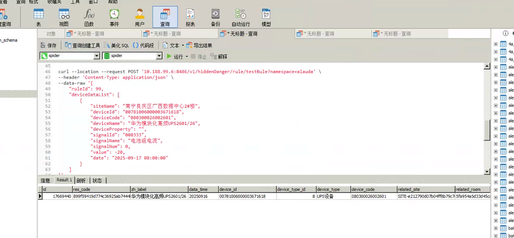
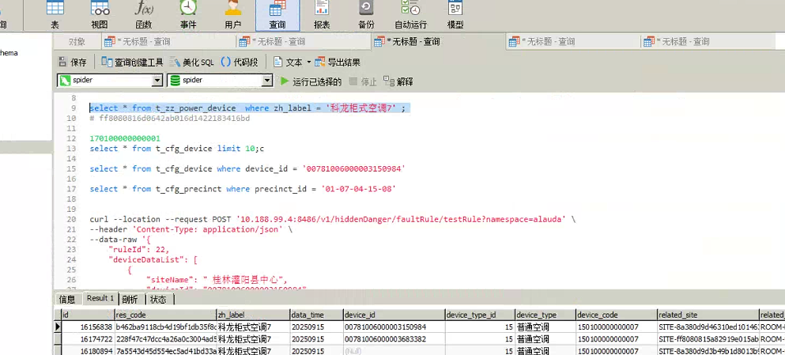

```
资产风险设备，来自综资设备要有，超期服务也要又
left join

资源标识：res_code   -- 综资表能找不【要自己造】

超期服务数据怎么来 --- 从综治来 -- 现有综治表res_code


161_2028_202801_1757389432
	testRoomdata.py文件
	综治表里的
	
	
综治设备类型
	在t_cfg_dict
	SELECT * FROM t_cfg_dict WHERE col_name = 'zz_device_type';
```

# 现网访问操作

```
登入安全网络好像才能进：服务器等信息里面 -- 我记得是chrome里面的 
	远程连接
```


先点这个小地球进去





# 监控视图

## 基本信息（站点综资映射）

```
1、综合监控-动环（综资）站点类型
	动环
	SELECT tc.precinct_id,tc.precinct_name,tcs.site_type,tcd.dict_note FROM t_cfg_precinct tc
		JOIN t_cfg_site tcs ON tc.precinct_id = tcs.site_id
		JOIN t_cfg_dict tcd ON tcd.dict_code = tcs.site_type
		WHERE 
			tcd.col_name = 'site_type' and
			tc.precinct_name = '百色测试数据to传输节点'
	
	综资（power_site_level 或 gx_power_site_level）
	
	SELECT * from t_zz_space_resources WHERE zh_label = '百色测试数据to传输节点'; 
```


## 供电拓扑

```
导出机房 - 上下级别
t_cfg_topology_v2_configuration
t_zz_space_resources


SELECT * FROM t_zz_site_property LIMIT 10;

SELECT * FROM t_zz_site_property WHERE res LIMIT 10;


SELECT * FROM t_zz_space_resources WHERE int_id = 'SITE-77003048'
SELECT * FROM t_zz_power_device where zh_label = '苏州苏驼-48V直流列头柜108/3' LIMIT 10;

SELECT * FROM t_cfg_topology_v2_configuration LIMIT 10;
SELECT * FROM t_cfg_topology_v2_configuration where down_device_resCode = '2ce056ba3cac425497b1499cd20823d7' LIMIT 10;
SELECT * FROM t_cfg_topology_v2_configuration where up_device_resCode = '2ce056ba3cac425497b1499cd20823d7' LIMIT 10;
SELECT * FROM t_cfg_topology_v2_configuration where id = '2ce056ba3cac425497b1499cd20823d7' LIMIT 10;
SELECT * FROM t_cfg_topology_v2_configuration WHERE  up_precinct_id = '01-07-05-02-36' LIMIT 10;
t_zz_space_resources
```


# 设备管理

## 隐患统计造数

```
前提说明：
	1、隐患统计数据来源是根据接口触发的【目前是有脚本可以触发】
		有对应测点进行触发，且达到隐患配置里面对应设备的规则阈值后，才会显示
	2、脚本内接口参数要求：
		rule_id:根据设备管理-隐患规则【对应设备下的规则 - 通过接口取获取对应id即rule_id】
		date1：第一条数据的时间
		value1：第一条数据的值
		date：第二条数据的时间【最新的】
		value：第二条数据的值【最新的】
		注意：date必须是大于date1，两者之间就是持续的时间
	3、特别情况：
		注意铅酸电池类的需要做关联【挂在到电源开关下 -- 跟陕西自定义告警有点像】
		#铅酸电池关联开关电源（即 -- 铅酸电池是开关电源下的设备）
			t_zz_lead_acid_battery
				res_code填铅酸设备的res_code
				ralated_power_device填开关电源设备的res_code
			SELECT * FROM t_zz_lead_acid_battery 
				WHERE ralated_power_device = '161_2028_1432';
		
		铅酸设备的res_code：来自表 - SELECT * FROM t_zz_power_device;
		开关电源设备的res_code：来自表 - SELECT * FROM t_zz_switch_power;
		
		注意点：
            #注意同一个设备下不能同时挂有铅酸电池和锂电池两种同时存在，否则隐患无法计算触发
            #负载总电流增加 隐患规则，设备需要在t_zz_switch_power有数据
            #查询锂电池关联开关电源
            
      4、涉及脚本：
      	 spider_api中common目录下的隐患xxx的py脚本
		


【理清楚重点】
实际工作模块数量
	模块数量不足
		需要造es数据【两个都要】	
		006309 -- 插入的是触发值	- 9月13号 且是触发值
		006310 -- 插入的是历史   - 9月12号
		
		回去验证下，一致是1，不知道为啥【因为取得是实际模块值】
		
		
		在看看综治表啥配置
		
		
		
		
现网验证【重点，故障的也差不多】：
	1、需要先找站点、设备名、设备id、设备编码、signalnum
	2、需要看隐患规则返回是否开了【即选择的站点是否已经包含在规则范围内】，推送要取消，不然会现网会播放
	
	数据准备步骤：
		前提须知：
			数据中心和核心机房才有ups这些对应的设备
		1、先到监控视图，找一个站点
		2、进到站点后，进到任意机房下，获取机房下规则对应的设备类型，拿到设备id和设备名和测点编码
		3、通过device id到t_zz_power_device,找到设备对应的device code
		
	接口ip和端口替换
		1、需要进入到nacos，再服务列表里面，找到hidden服务，如果有多个分节点，随意选一个
		2、然后进行替换即可
		3、在edge里面有个连接，选择对应节点，选择远程登录，在服务里面执行即可【curl不需要管理员】
		但是查看日志需要切换管理员【不知道咋切】
```

这个机房设备数据有问题没有device_code

如果测试隐患规则t_zz_power_device、和t_cfg_device要加一下【这一点不太理解】



现网





```
推掉原始的，重新梳理
	第二步，初始化隐患对象
		初始化对应设备相关信息和站点等信息
	
	
	第一步，根据precinct_id和mete_code
		获取机房下，对应测点的设备id和设备code和设备name

	SELECT b.device_id,b.device_code,b.device_name,a.device_type,a.mete_code,a.mete_name,
        a.alarm_explain,b.precinct_id,c.precinct_name,c.resource_code,d.dict_note
        FROM t_cfg_mete a,t_cfg_device b,t_cfg_precinct c,t_cfg_dict d
        WHERE a.device_type = b.device_type AND b.precinct_id = c.precinct_id AND a.mete_code = {mete_code} 
        AND b.device_type = d.dict_code AND d.col_name = 'device_type'
        AND c.precinct_name = '{precinct_name}'
        
   	第二步，根据获取的precinct_id和device_id到综资表中匹配
   	SELECT * FROM `t_zz_space_resources` WHERE precinct_id = '{cls.precinct_id[:-3]}'
    SELECT * FROM `t_zz_power_specialty` WHERE device_id = '{cls.device_id}'
    


满足的条件
	1、动环设备下的设备存在
	2、存在的设备的device_id，在综资里面有对应映射
	3、同时动环设备下的设备所在站点也要存在综资映射表中
	
	【判断是否在综资设备里面有对应的，保证devcie_id对应的同时，还要确保device_code也对应】
	SELECT * FROM `t_zz_power_specialty` WHERE device_id IN 
	(SELECT b.device_id
        FROM t_cfg_mete a,t_cfg_device b,t_cfg_precinct c,t_cfg_dict d
        WHERE a.device_type = b.device_type AND b.precinct_id = c.precinct_id AND a.mete_code = '017012'
        AND b.device_type = d.dict_code AND d.col_name = 'device_type')
	
	【确保上面查询出来的设备所对应的动环站点，也在综资存在】
	SELECT * FROM `t_zz_space_resources` WHERE precinct_id = '01-07-05-02-39-02';
	
	【修改device_code】
	SELECT * FROM t_cfg_device WHERE device_id = '00541006000000106478';
	
	【拿站点名】
	SELECT * FROM t_cfg_precinct where precinct_id = '01-07-21-01-01-03' ;
	
	【最后取动环的参数进行请求】
	SELECT b.device_id,b.device_code,b.device_name,a.device_type,a.mete_code,a.mete_name,
        a.alarm_explain,b.precinct_id,c.precinct_name,c.resource_code,d.dict_note
        FROM t_cfg_mete a,t_cfg_device b,t_cfg_precinct c,t_cfg_dict d
        WHERE a.device_type = b.device_type AND b.precinct_id = c.precinct_id AND a.mete_code = '017012'
        AND b.device_type = d.dict_code AND d.col_name = 'device_type'
		  
		  AND b.device_id = '00781006000003663228'
		  LIMIT 10;

	
	
	所以？
		我只要通过最后一个sql，查出对应设备后，把设备的id拿到综资，把综资的code拿到id？
		然后再把precinct_id随意放？
		只要建立起关联，就可以了？
```


## 有效性稽核造数【待完善】

```
有效性稽核
	好像根据稽核规则配置
		然后对应测点达到阈值之后就会触发告警
			然后就会到信息稽核详情表里面
				至于设备完整性和地市统计不太清楚
```

## 故障统计造数

```
gx - hidden服务
铅酸电池的话：00771006000002945668

curl --location --request POST '127.0.0.1:8486/v1/hiddenDanger/faultRule/testRule?namespace=alauda' \
--header 'Content-Type: application/json' \
--data-raw '{
    "ruleId": 228,
    "deviceDataList": [
        {
            "siteName": "百色测试数据县古障2",
            "deviceId": "00771006000002944984",
            "deviceCode": "150100000000001",
            "deviceName": "科龙柜式空调1",
            "deviceProperty": "",
            "signalId": "015203",
            "signalName": "回风温度设定",
            "signalNum": 0,
            "value": 19.169,
            "date": "2025-09-12 00:00:00"
        }
    ]
}'


现网问题说明：
	后面用了有device_id对应的【即在综资表中有deviceid对应的】
	执行之后就成功了
```



## 故障和隐患历史

```
进入页面时默认最近一个月，需求也是这样
```

## 巡检配置

```
132	设备管理-巡检配置  巡检方案增加编辑按钮。增加编辑按钮后的方案生效逻辑同步修改。
	测试环境中需要alauda权限才可以看到功能
	生成也是，估计是要配置
	
	新增加的带巡检才会有 -- 已经过时间的带巡检是没有的
```

## 巡检统计

```
告警巡检的规则，针对有XX指代的，需要特殊处理。不能简单的比对标准信号和实际信号是否一致来进行判定。
	除了中文外，两位，如果不是那么就是不符合的  -- 就会爆红
	


```


# 能耗管理

## 机楼视图

高温告警

```
涉及服务：
	knowledge-service


注意：
	需要写入历史数据 -- 对应温度测点【条件：>50度才是高温，<20度是低温，可到机房温湿度查看取值】
	
	案例：
		station_name：01-07-05-02-41-02
		device id：00161006000000024874
		mete_code：017301
		mete_name：温度XX
		


	执行下面curl出发温度分析定时任务 precicntId 区域id  startDay 开始日期 endDay 结束日期 type 周报类型 1：月 2：周
	
	
	curl -X GET "http://localhost:6161/v1/temperature/roomTemperatureReportTask?precinctId=01-07-05-02-41&startDay=2025-08-01&endDay=2025-08-31&type=1" -H "accept: application/json"


	curl -X GET "http://localhost:6161/v1/temperature/roomTemperatureReportTask?precinctId=01-07-05-02-41&startDay=2025-08-01&endDay=2025-08-31&type=1" -H "accept: application/json"


	查询状态
	select * from temperature_root_monthly where report_type = 3 and t1>=30 and t1 <50 and air_type_id!=4 and statistics_time = '2025-08-01';

```

里面的pue不是所有站点都有，好像要去看什么玩意来着 

## 其余信息

```
市电信息
	关联综资里面的数据

相关数据 - 
	能耗管理：用电关系配置里面
	能耗配置方案，即配置页面内流程图的展示

```


# 容量管理

## 容量预警信息统计

```
容量预警信息统计tab
	目前检测告警数量，点开后内部数据与点开前是否一致
	造数【好像有脚本】
```

```
负载率汇总报表
	目前检测类型数量，与左下角统计数量是否一致
	造数【好像也有？】
```

## 变压器

```
配置来源
	1、运维管理-动环月报填报
	2、选择站点 - 操作 - 编辑
	3、步骤1，新增变压器系统（新增完后左侧才会有新增设备按钮出来）
	4、新增设备后提交即可
变压器
	历史详情即可看到对应设备信息
```


# 设备管理

## 巡检统计造数

```
首先分fsu和设备的
	fsu来源：
		xxx
	设备来源：
		设计到字典表：运行分析 - 字典表里面获取【这个表来数据库的标准字典表 - t_cfg_mete】
		然后需要进行巡检配置
		
```


# 资源资产

## 设备风险分析

```
超期服役年限=（当前时间-开始使用时间）-设备更新周期年限
```


hidden

fault 

dict  -- ip wark
