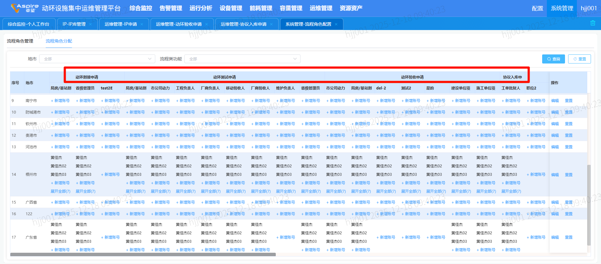
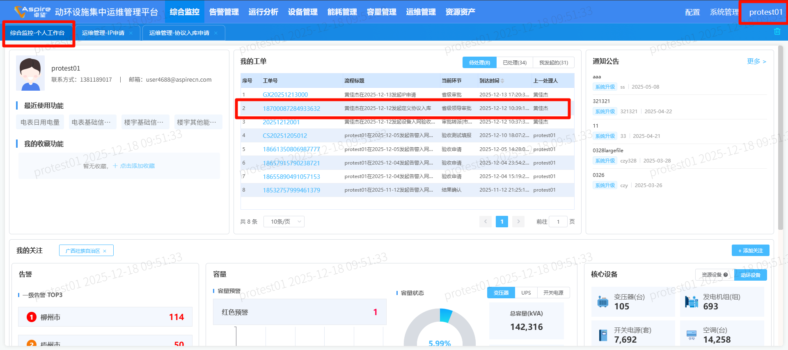
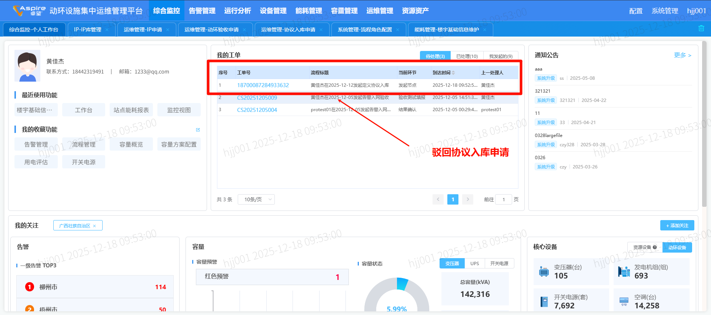
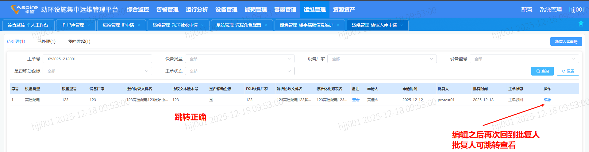
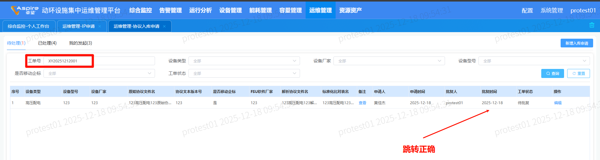
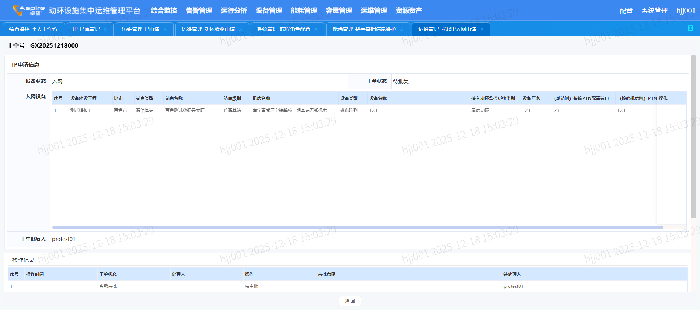
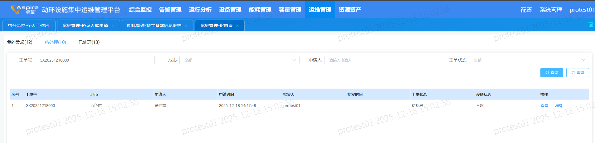

# 前置工作

```
先创建多个账号（至少4个）
接着在系统管理 - 流程角色管理里给账号分配权限
```



# 验证点

```
接口：
	主要进入个人后，个人哪里就会返回接口
		bpm/getTodoList?
			isBpm: "0"  -- 不走bpm，走页面
			pageType: "detail"  -- 看走详情还是列表
			procDefKey: "gjrwys"  -- 看走哪个页面
			requestParam  就是参数来着
		目前只有5个页面需要走页面，其余都是bpm的

目前：
	跳转点击后，都是只能关闭，取消按钮隐藏
```

# 公共查看

```
查看站点-（仅匹配precinct和resource表）
SELECT 
	resource_site.zh_label AS site_label,
	resource_site.int_id AS site_int_id,
	resource_room.zh_label AS room_label,
	resource_room.int_id AS room_int_id,
	site.precinct_id AS site_id,
	site.precinct_name AS site_name,
	room.precinct_id AS room_id,
	room.precinct_name AS room_name
FROM 
	t_zz_space_resources resource_site
LEFT JOIN 
	t_zz_space_resources resource_room ON resource_site.int_id = resource_room.related_site
LEFT JOIN 
	t_cfg_precinct site ON site.precinct_id = resource_site.precinct_id
LEFT JOIN 
	t_cfg_precinct room ON room.precinct_id = resource_room.precinct_id
WHERE 
	resource_room.zh_label IS NOT NULL 
	AND site.precinct_id IS NOT NULL 
	AND room.precinct_id IS NOT NULL 
	AND resource_site.space_type = '101'
	AND resource_room.space_type = '102'


查看站点-机房（综资关联情况 --> resource和special都匹配上）
SELECT 
	resource_site.zh_label AS site_label,
	resource_site.int_id AS site_int_id,
	resource_room.zh_label AS room_label,
	resource_room.int_id AS room_int_id,
	site.precinct_id AS site_id,
	site.precinct_name AS site_name,
	room.precinct_id AS room_id,
	room.precinct_name AS room_name,
	specialty_site.zh_label AS specialty_site_label,
	specialty_room.zh_label AS specialty_room_label,
	specialty_site.gx_power_site_level,
	specialty_site.power_site_level
FROM 
	t_zz_space_resources resource_site
LEFT JOIN 
	t_zz_space_resources resource_room ON resource_site.int_id = resource_room.related_site
LEFT JOIN 
	t_cfg_precinct site ON site.precinct_id = resource_site.precinct_id
LEFT JOIN 
	t_cfg_precinct room ON room.precinct_id = resource_room.precinct_id
LEFT JOIN 
	t_zz_power_specialty specialty_site ON specialty_site.res_code = resource_site.int_id
LEFT JOIN 
	t_zz_power_specialty specialty_room ON specialty_room.res_code = resource_room.int_id
WHERE 
	resource_room.zh_label IS NOT NULL 
	AND site.precinct_id IS NOT NULL 
	AND room.precinct_id IS NOT NULL 
	AND resource_site.space_type = '101'
	AND resource_room.space_type = '102'
	AND specialty_site.zh_label IS NOT null
	AND specialty_room.zh_label IS NOT null
	

```

```
查看站点-机房-设备-ip（综资关联情况 -- 用于动环割接、动环测试等地方的资源设备）

SELECT 
	resource_site.zh_label AS site_label,
	resource_site.int_id AS site_int_id,
	resource_room.zh_label AS room_label,
	resource_room.int_id AS room_int_id,
	site.precinct_id AS site_id,
	site.precinct_name AS site_name,
	room.precinct_id AS room_id,
	room.precinct_name AS room_name,
	zz_device.zh_label,
	zz_device.res_code,
	zz_device.device_type,
	zz_device.lifecycle_status,
	zz_ip.city_name,
	zz_ip.device_name
FROM 
	t_zz_space_resources resource_site
LEFT JOIN 
	t_zz_space_resources resource_room ON resource_site.int_id = resource_room.related_site
LEFT JOIN 
	t_cfg_precinct site ON site.precinct_id = resource_site.precinct_id
LEFT JOIN 
	t_cfg_precinct room ON room.precinct_id = resource_room.precinct_id
LEFT JOIN 
	t_zz_power_device zz_device ON zz_device.related_site = resource_site.int_id	AND zz_device.related_room = resource_room.int_id
LEFT JOIN
	t_cfg_ip zz_ip ON zz_ip.site_id = resource_site.int_id	AND zz_ip.room_id = resource_room.int_id
WHERE 
	resource_room.zh_label IS NOT NULL 
	AND site.precinct_id IS NOT NULL 
	AND room.precinct_id IS NOT NULL 
	AND resource_site.space_type = '101'
	AND resource_room.space_type = '102'
	AND device_name IS NOT null

```


# 01_协议入库申请跳转验证

```
涉及表：
	
数据如何清除：
	
```











# 02_IP申请跳转验证

```
涉及表：
	
```


```
造数（现网不需要）
SELECT * FROM t_cfg_precinct WHERE precinct_id = '01-07-05-02';
SELECT * FROM t_cfg_precinct WHERE precinct_id = '01-07-05-02-17';
SELECT * FROM t_zz_space_resources where space_type = '101';
SELECT * FROM t_zz_space_resources where int_id = 'SITE-13779' LIMIT 10; 
SELECT * FROM t_zz_power_specialty where res_code = 'SITE-13779'  LIMIT 1000;
SELECT * FROM t_cfg_precinct WHERE precinct_id = '01-07-05-02-17-01';
SELECT * FROM t_zz_space_resources where space_type = '102';
SELECT * FROM t_zz_space_resources where int_id = 'ROOM-8a380d9d42c2f44b014365a827954205' LIMIT 1000; 
SELECT * FROM t_zz_power_specialty where res_code = 'SITE-13779'  LIMIT 1000;
SELECT MAX(id) FROM t_zz_power_specialty;


查数（）
SELECT 
	special.zh_label,
	resource.zh_label,
	resource.precinct_id,
	resource.related_site,
	site.precinct_id site,
	room.precinct_id room
FROM t_zz_power_specialty special
	JOIN t_zz_space_resources resource ON special.res_code = resource.int_id AND resource.precinct_id IS NOT NULL 
	left JOIN t_cfg_precinct site ON site.precinct_id = resource.precinct_id AND resource.space_type = 101
	LEFT JOIN t_cfg_precinct room ON room.precinct_id = resource.precinct_id AND resource.space_type = 102
	
	

涉及表
t_ip_apply_flow_manage 
```






# 03_待割接

```
目前跳转后，点击工单，取消后空白了
```


```
涉及表：
	

SELECT 
	special.zh_label,
	resource.zh_label,
	resource.precinct_id,
	resource.related_site,
	site.precinct_id site,
	room.precinct_id room
FROM t_zz_power_specialty special
	JOIN t_zz_space_resources resource ON special.res_code = resource.int_id AND resource.precinct_id IS NOT NULL 
	left JOIN t_cfg_precinct site ON site.precinct_id = resource.precinct_id AND resource.space_type = 101
	LEFT JOIN t_cfg_precinct room ON room.precinct_id = resource.precinct_id AND resource.space_type = 102

    t_cfg_ip
```

