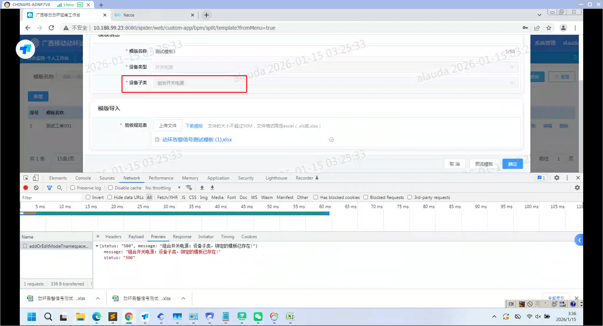
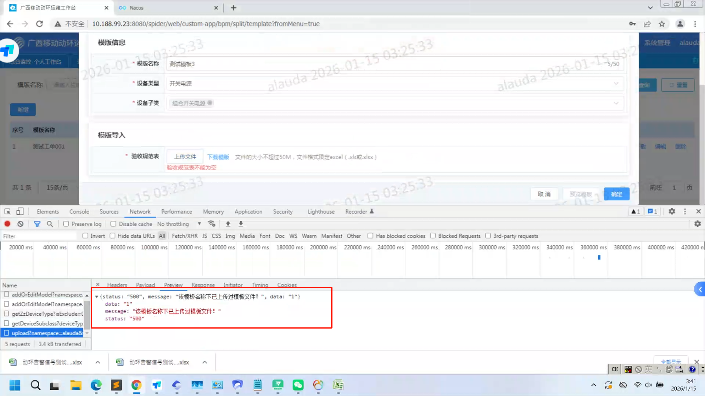
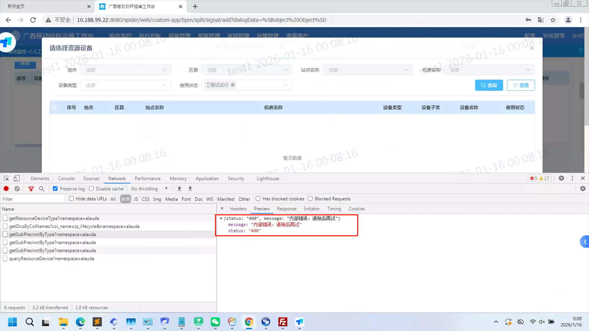
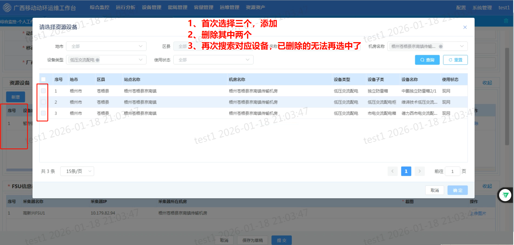

# 01测试模板管理

```
问题：已经存在模板子类，再次创建模板子类重复导入会有问题
复现步骤：
	1、先新建一个开关电源类型，组合开关电源子类设备，同时导入验收规范表（模板名用默认的即可），保存提交
	2、再次新建一个开关电源类型，组合开关电源子类设备，同时导入验收规范表（模板名用默认的即可），点击保存
	3、取消后，再次新建一个开关电源类型，组合开关电源子类设备，模板名称用2里面相同的名称，然后导入2里面相同模板，会出现改模板名称下的表格已经导入
```






# 02动环测试申请

```
验收测试资料导出时
导出时，选择最后一个没有过滤导出对应的，而是导出全部的数据
```


```
新增申请
	新增资源设备 - 加载不出树结构
	test1   密码：s(23&828231.S3aAIJ
```




```
新增资源设备时
	选择一次后，删除，再次选择无法再选中
```




```
手机号敏感信息未剔除
```


