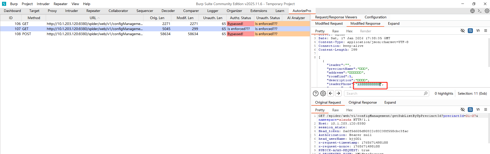
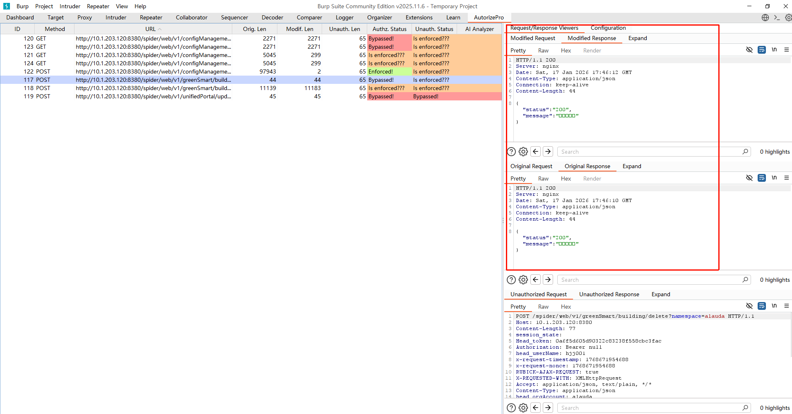
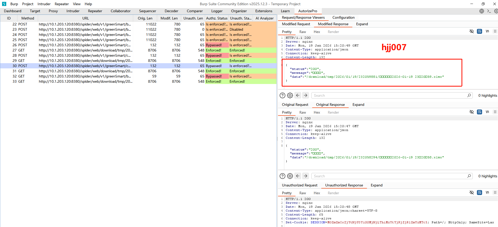

# 1、能耗管理-楼宇基础信息维护

```
编辑时/新增
v1/configManagement/getSubListByUpPrecinctId
```




```
未配置删除/编辑权限（但是接口删除通过了，数据也删减了；编辑数据能修改）

未配置：hjj003 	s(23&828231.S3aAIJ
已配置：hjj004 	s(23&828231.S3aAIJ
```




```
未授权导出用户，通过接口也能调用（4个页面功能都是）
	高权限hjj004  		s(23&828231.S3aAIJ
	未授权导出hjj003    s(23&828231.S3aAIJ
	

文件可以直接通过连接下载
	http://10.1.203.120:8380/spider/web/download/tmp/2026/01/19/232826687/电表基础信息2026-01-19 23：28：26.xlsx
下载模板也可以被导出
```

