# 服务和客户

```
问题1：
	服务端：entrance   -- 相对于业务是服务端
	客户端：模拟器？    -- 相对于门禁是服务端（目前模拟器就是服务端 - entran为客户端 传报文给模拟器）
	sokit-模拟客户端
		传16进制？，间隔开？
```


# sokit使用

```
必须按以下格式输入
[7e 31 30 30 31 38 30 45 35 30 30 30 30 46 44 39 43 0d]
```


# 抓包

```
协议抓包
		
			tcpdump -i any -n -w <fileName>.pcap "host <ip> and udp"
			例：
			tcpdump -i any -n -w lw.pcap “host 129.240.160.4 and udp”
			抓取大约5min后通过ctrl+c中断抓取，可以直接通过tcpdump -r <fileName>.pcap直接预览抓取的包的概览
			正常情况下sc与智能门锁的通信应当是1个请求对应1个响应，额外有fsu透传的udp心跳包
			需要用wireshark工具解析：len=38的是fsu-udp心跳包而已，其他的都有应答
			
			tcpdump -i any -n -w test.pcap "host 10.12.5.142 and udp"
	
	模拟器是服务端还是客户端
```

# 页面抓请求

```

```

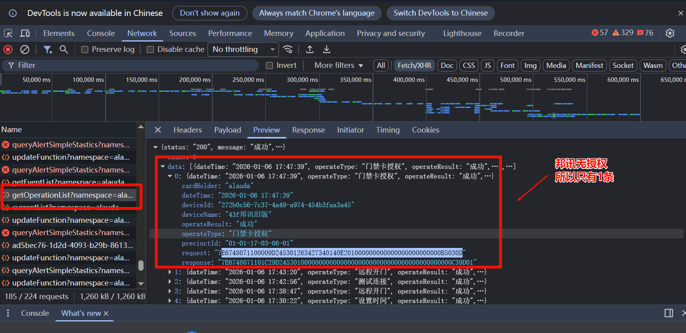

# 收报回报

```
模拟器 10.12.5.142 1012端口================================================================================= 

--------------------------------------------------

发送心跳包到 1 个客户端...
  心跳包已发送到 10.12.5.142:28086

收到来自 10.12.5.142:28086 的请求
接收到的数据 (原始): b'\xff124123131241\x00\x00\x00\x00\x00\x00\x00\x00\x00\x00\x00\x00\x00\x00\x00\x00\x01(%\x00\xee\x01\x00 \x00~10048048200EF0E00000000000FAC5\r\xb7\xfe'
接收到的数据 (16进制): FF3132343132333133313234310000000000000000000000000000000001282500EE010020007E3130303438303438323030454630453030303030303030303030464143350DB7FE

提取到 1 个报文 (7e起始0d结尾):
  报文 1:
    原始数据: b'~10048048200EF0E00000000000FAC5\r'
    16进制: 7E3130303438303438323030454630453030303030303030303030464143350D
    长度: 32 字节
当前已连接客户端数量: 1
可用响应消息类型: default_message, user_code_message, device_event_message, door_status_message
提取到的命令码: 46304530
消息校验通过
选择的响应消息类型: ff000000000000000030333230323530333032303031370000...
已发送响应: 配置响应消息 (16进制: FF000000000000000030333230323530333032303031370000...)
响应16进制码流: FF000000000000000030333230323530333032303031370000000000000102170000010012007E313030313830453530303030464439430D75FE
--------------------------------------------------

收到来自 10.12.5.142:28086 的请求
接收到的数据 (原始): b'\xff124123131241\x00\x00\x00\x00\x00\x00\x00\x00\x00\x00\x00\x00\x00\x00\x00\x00\x01(\x1d\x00\xee\x01\x00\x18\x00~10048049A006F1ED01FC2E\r\xc1\xfe'
接收到的数据 (16进制): FF3132343132333133313234310000000000000000000000000000000001281D00EE010018007E313030343830343941303036463145443031464332450DC1FE

提取到 1 个报文 (7e起始0d结尾):
  报文 1:
    原始数据: b'~10048049A006F1ED01FC2E\r'
    16进制: 7E313030343830343941303036463145443031464332450D
    长度: 24 字节
当前已连接客户端数量: 1
可用响应消息类型: default_message, user_code_message, device_event_message, door_status_message
提取到的命令码: 46314544
消息校验通过
选择的响应消息类型: ff000000000000000030333230323530333032303031370000...
已发送响应: 配置响应消息 (16进制: FF000000000000000030333230323530333032303031370000...)
响应16进制码流: FF000000000000000030333230323530333032303031370000000000000102170000010012007E313030313830453530303030464439430D75FE
--------------------------------------------------
```

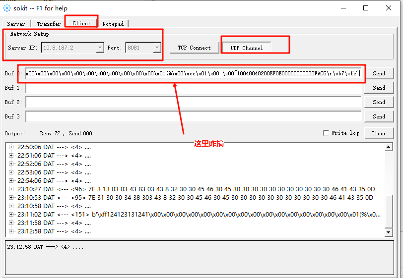


# 00协议解析（重点）

```
su向sm发包 --> 必须含（login和command）

login（确认权限）:

拿到16进制
ff3132343132333133313234310000000000000000000000000000000001142500ee010020007e3130303138303438323030454630453030303030303030303030464143380d83fe

拆分数据包对应位数（或是先转ascll - 然后直接根据协议文件进行区分，注意sum的组合要根据需求进制之和+1取模）
7e3130303138303438323030454630453030303030303030303030464143380d
~ 10 01 80 48 200E F0 E0 0000000000 FAC8 


command（命令）:
ff3132343132333133313234310000000000000000000000000000000001141d00ee010018007e313030313830344141303036463245303030464333440df6fe

7e313030313830344141303036463245303030464333440d


协议分析
	分两种
		一种是数据包放到B接口包里面（ff开头   fe结尾）
		一种是纯数据包（7e开头  0d结尾）
	
	拿到包之后
		拆包根据协议组装command还有rnt
```


# 00补充

```
问题：
	目前这台设备，我可以接入多次吗，就是不同站点下
	改com，然后在符合条件里面的都可以，还是只能1对1
	因为有一个场景：批量授权（单卡同站的多机房），显示成功，但是还刷不开门
	答案：
		目前只能一对一
		com必须对应

如果存在【重点】
	fsu - port 一致的，新建时，上级会不新建
	所以一般先删除已有的设备，再重新新建进去
		SELECT * FROM access_control_device

验证门禁是否通：
	门禁概览
		到对应门设备
			测试连接
				看操作 - 操作如果成功，说明连接成功


真实卡号获取（必须要开启日志才能看到 - 即定时任务轮询 - nacos中查看）
	在门禁通的情况下，刷fsu门禁设备
	到门禁概览 - 门设备里面查看


	
对接：
	需要询问清除协议是什么（配置是什么，ip可以不一样但是其他的要一样）
	刷卡，卡号是什么
	多机房，是多少个机房
	根据问的问题详细化
```


# 01问题记录

```
我让提问题的人在这个表格里面填写
https://www.kdocs.cn/l/crX7fTXBNSLx
如果有不清晰的部分你找叶春祥补充描述 最好做到我们测试环境也能复现一样的问题，然后我们再闭环
```

```
问题记录：
    1、批量授权不行，单个授权可以。
    2、授权过期之后，直接添加续期授权不行，必须撤销授权，再授权才可以，
    3、批量授权卡，还是有显示授权中的队列任务。。
    4、多个页面的授权记录不同步。。
    
    5、【授权任务表】、【门禁概览】、【门禁权限】三个页面数据不一致、
    6、列表信息不全，缺少持卡人信息。
    
    1、批量授权（单卡同站的多机房），显示成功，但是还刷不开门。。报的事件是无效的卡记录。
	3、批量授权，存在有队列任务（授权中），未修复好。
```

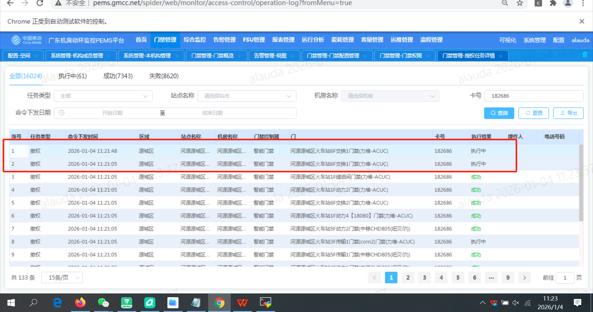

```
修复测试：
	需要确保授权成功，然后进行撤权的验证


使用配置如下
```

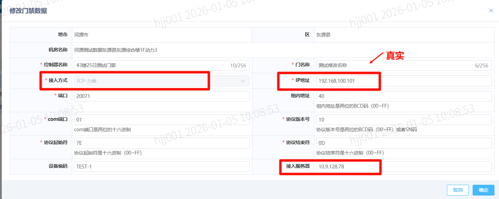

# 02前置工作

```
协议：
	https://docs.qq.com/sheet/DU1hoQnVCalFjV0tI?tab=mnrynb


node（也就是cicd上的 - 好像不在测试环境上的）
	78在黑色这台，连的力维192.168.100.101；
	76在银色这台，连的维谛192.168.100.100
```

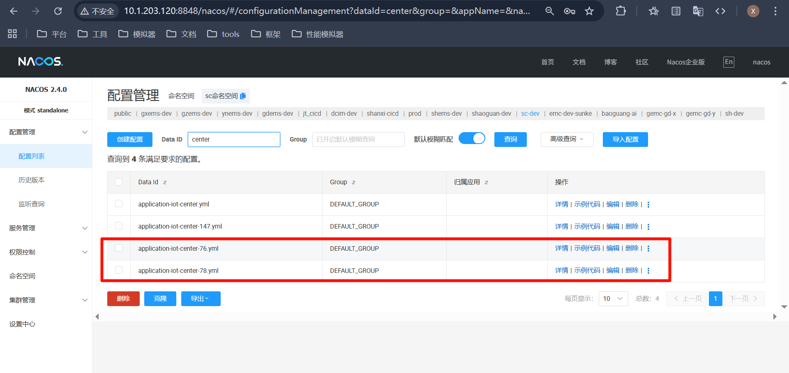

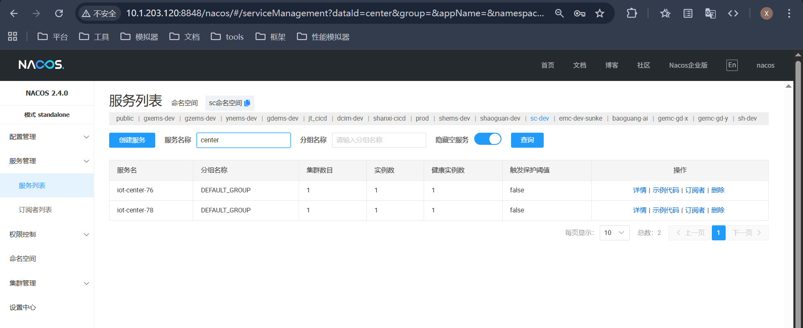

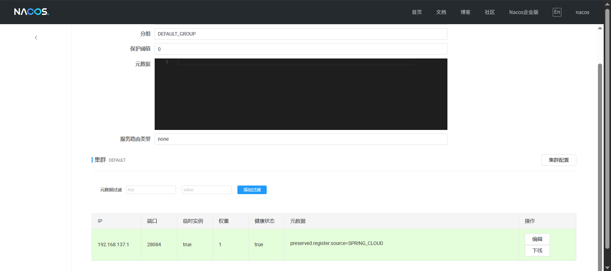


# 03问题描述

```
问题记录：
    1、批量授权不行，单个授权可以。
    	授权了，页面显示成功了
    	但是开不了门
    
    2、授权过期之后，直接添加续期授权不行，必须撤销授权，再授权才可以，
    	重新授权后
    		是不能续期还是没有重新授权
    
    3、批量授权卡，还是有显示授权中的队列任务。。
    	批量授权
    	批量撤权
    
    4、多个页面的授权记录不同步。。
    5、【授权任务表】、【门禁概览】、【门禁权限】三个页面数据不一致、
    	就是操作记录不一致（行不一致）
    
    
    6、列表信息不全，缺少持卡人信息，信息不全
    	哪个页面来着
    	加一个持卡人信息
    	加持卡人就行叻
    	卡号
    
    
    7、【门禁-人员管理】，有账号看不到数据。
    	权限设置了，资源设置了，但是看不到
    		门禁权限具体跟人员管理中，部门配置有关（需要确保配置了部门是对应的）
    		同时也要确保资源权限是有的
    
    1、批量授权（单卡同站的多机房），显示成功，但是还刷不开门。。报的事件是无效的卡记录。
	3、批量授权，存在有队列任务（授权中），未修复好。
```

```
批量授权
	批量多少个
	每个的配置都是那些设备（具体协议是什么）
		186200
```

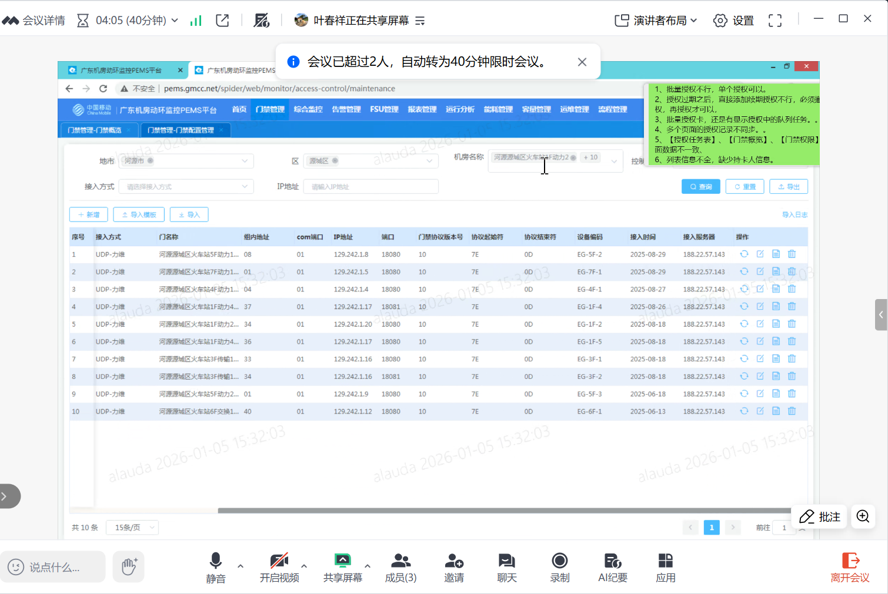


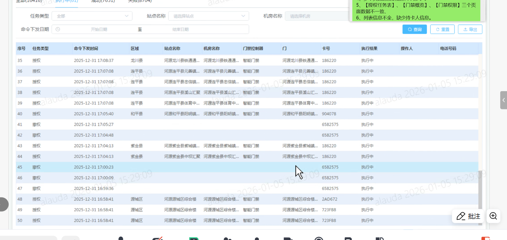


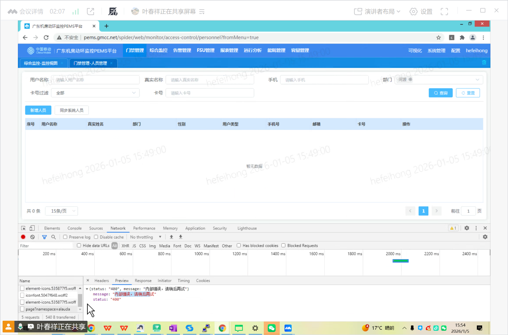


```
模拟器
	
同时还要考虑现网问题
	断电等情况（设备的状态）
		设备什么反应等情况
		网线断的情况 - 设备怎么样
	重启之后是否可以重新使用？
	关闭后，页面反应是可以的？  系统是正常的？
```


```
力维
维谛
邦讯


判断下发是否为正规fsuid
```


# 04新任务验证流程

```
授权开卡成功
	会有滴滴的声音，靠近听（然后还有个开门声）
	
页面的功能都要成功


生产告警
	会在告警视图里面回显
	

初始化目前是不用管


授权之后再取消


取消之后再授权


授权过期
	再次授权
	

批量授权


批量测全


单卡对多门


多卡对多门


概览-任务详情-等地方要对应上
```

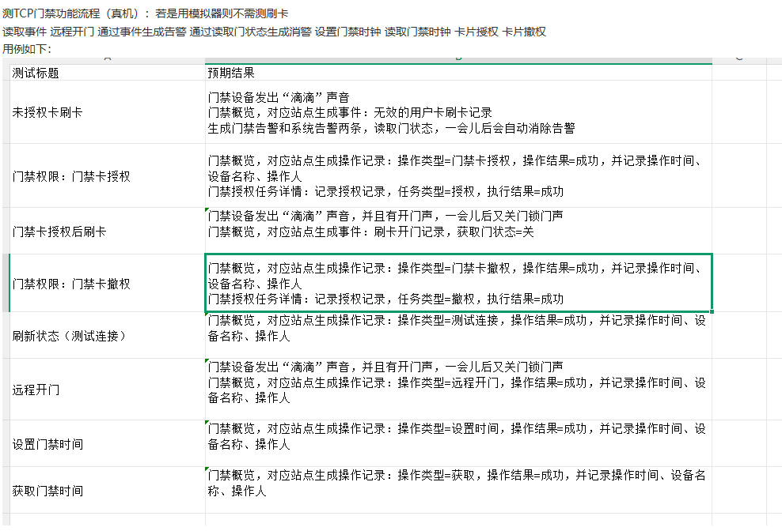


# 新问题记录

```
打开门禁概览--粘贴机房名（可以搜索）
再次粘贴另一机房名（可能就不能搜索了）
	就是在门禁概览搜索，然后切换其他页面复制设备，再回来搜索（只要切换页面，就不会回显了）
	
	还会有，切换多次（框内已有，然后切换多次，再输入相同内容）

修复后
	点击清除键，然后再输入也没有弹出下拉框
```

