# 01总结

```
门禁卡使用
```


# 02补充

```

```


# 03测试内容

```
使用卡号
	9D245306（只取前六个  9D2453）


设备如下
```

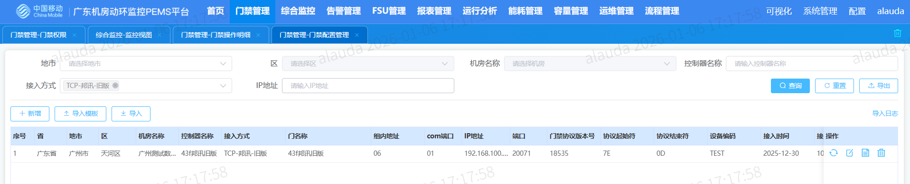

```
用例
	1、刷新状态
```

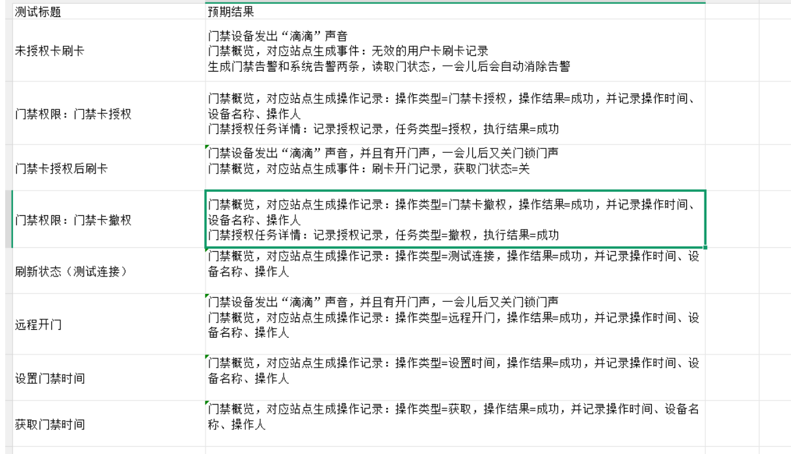


```
刷新状态
	入口-验证点
```

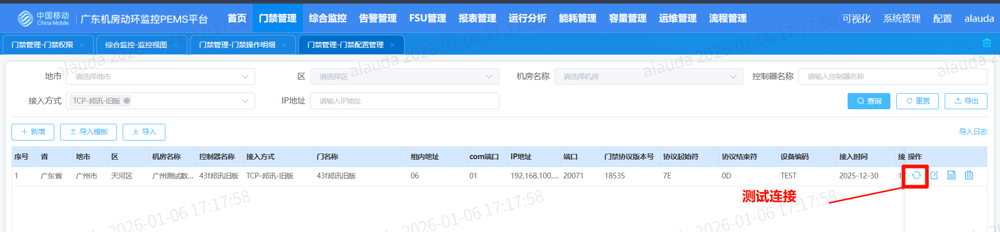

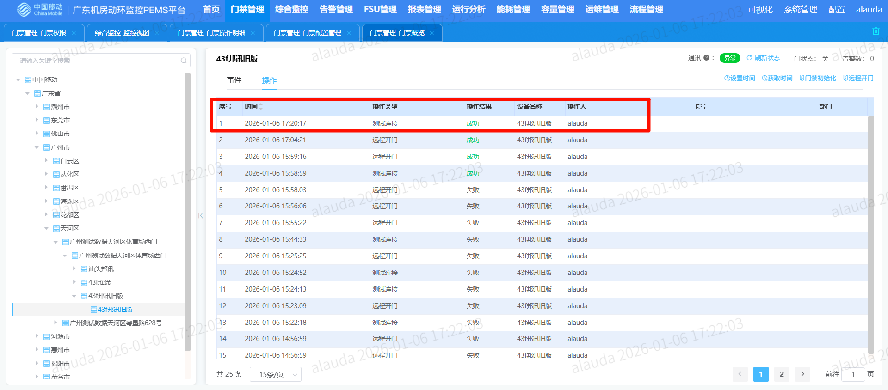

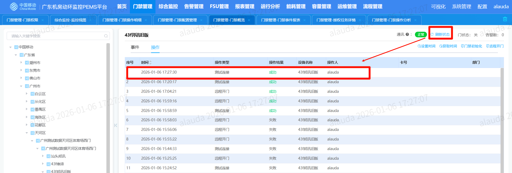

```
获取时间
```

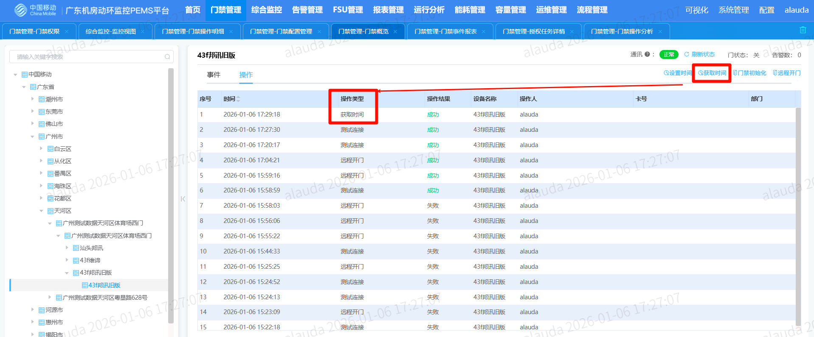

```
设置时间
```

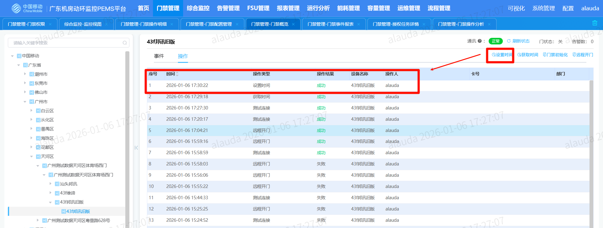

```
远程操作
	走进机器看 - 有蹬一声（然后后面又有一个蹬，关门声）
```

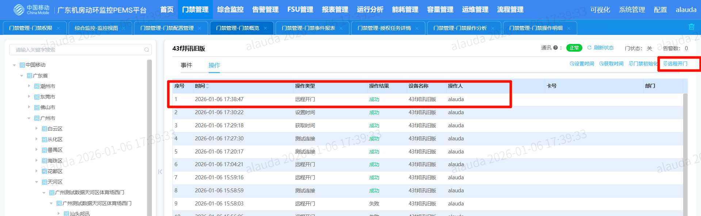

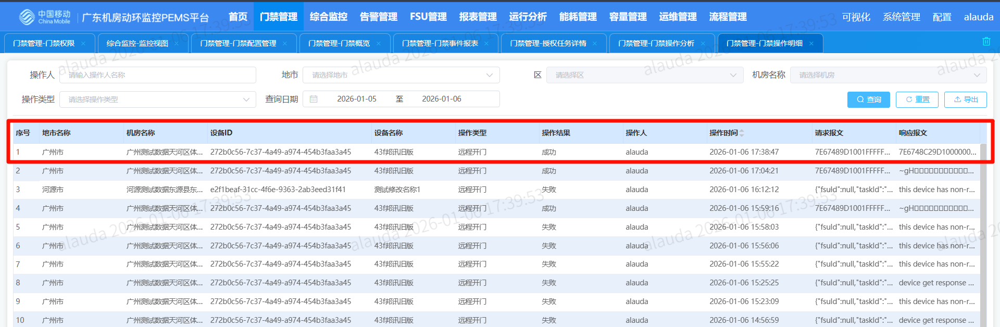

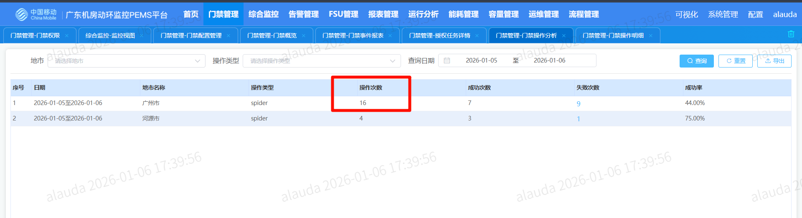

```
授权卡权限
```

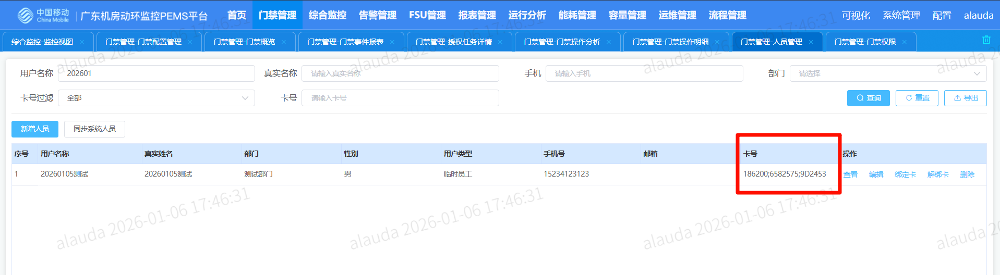

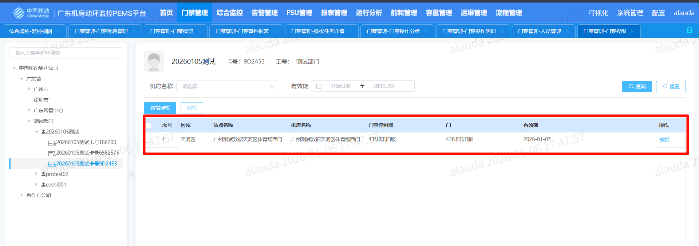

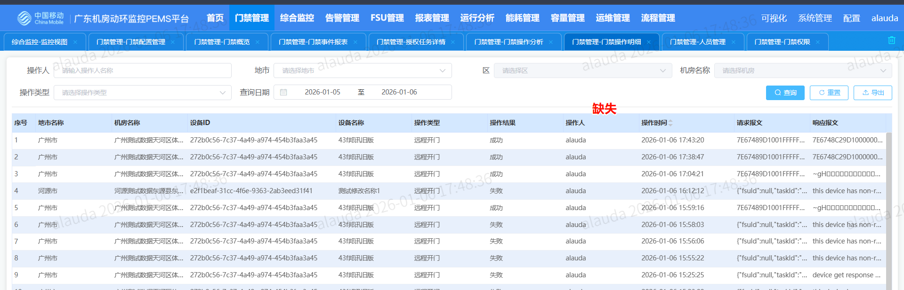

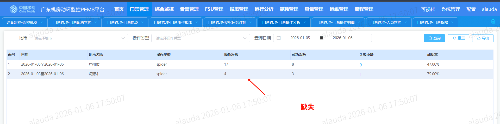

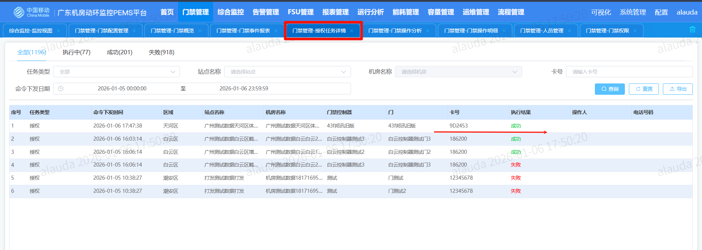

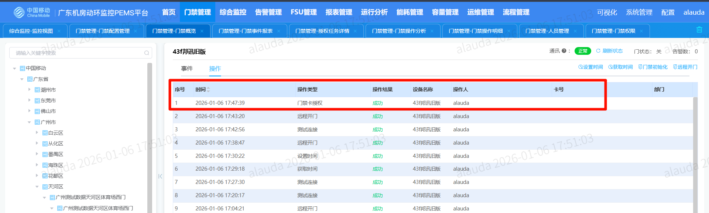

```
门禁授权刷卡-开门（记录目前还有问题）
	走进机器看 - 有蹬一声（然后后面又有一个蹬，关门声）
```

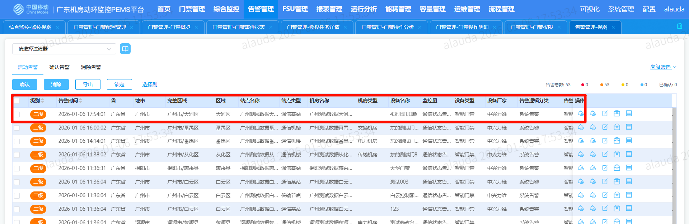

```
门禁卡撤权
	同类问题【门禁管理-门禁操作明细未更新、门禁管理-门禁操作分析跟上面的一样】
	撤权 - 失败
		门禁管理-门禁权限未消除、门禁管理-授权任务详情显示失败、门禁管理-门禁概览显示失败
		刷卡尝试
		
```


# 04问题

```
1、基础操作（设置时间、获取时间、测试连接，还有其他的，目前只有远程的有）没有同步到
	门禁操作明细
2、基础操作（设置时间、获取时间、测试连接）没有同步到门禁操作明细导致
	门禁管理-门禁操作分析 -- 分析少了
3、门禁管理-门禁操作分析
	操作类型统计，没有过滤，直接查不到（需要过滤操作类型，且统计的类型数量要准确）
4、多张卡同时授权一个设备
5、多张卡授权同个设备
6、单卡授权多个设备 - 不同站点，不同机房等情况
```

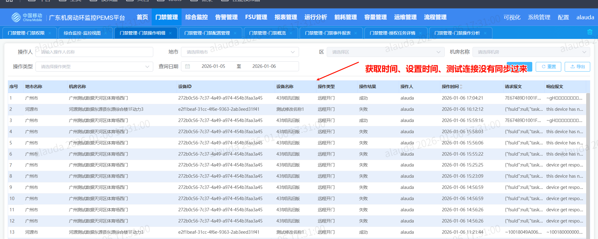

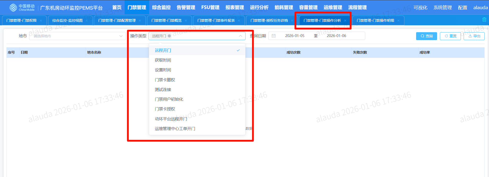


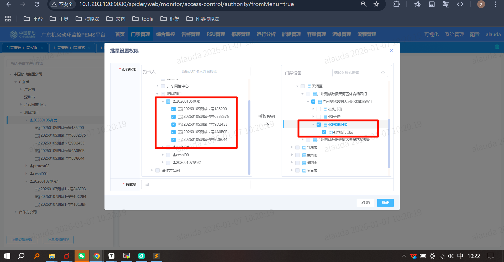


```
时间目前上不来
	影响功能
		授权卡刷卡
		未授权刷卡--非法卡--
		
		门禁事件报表
		门禁管理-门禁概览 -- 事件
		告警视图


需要再过一边
	授权和刷卡以及事件
		单卡授权单设备 -- 检测概览操作、其他地方
		多卡授权单设备 -- 检测概览操作、其他地方
		批次授权（存在已授权和未授权，时间设置为已授权的时间范围，都符合的卡） -- 检测概览操作、其他地方
		批次授权（存在已授权和未授权，时间设置为已授权的时间范围，存在不合格卡） -- 检测概览操作、其他
		
		单卡多设备
		多卡多设备
		单卡多设备批次授权
		多卡多设备批次授权
		
		
		授权后撤销 -- 检测概览操作、其他地方
		撤销后再授权 -- 检测概览操作、其他地方
		
		授权后刷卡  --  检测概览事件、其他地方，以及告警
		授权后刷卡（刷多次）  --  检测概览事件、其他地方，以及告警
		撤权后刷卡  --  检测概览事件、其他地方，以及告警
		撤权后刷卡（刷多次）  --  检测概览事件、其他地方，以及告警
		
		
		撤权后重新授权相同时间相同人   -- 检测概览操作、其他地方
		撤权后重新授权相同时间相同人刷卡  --  检测概览事件、其他地方，以及告警
		
		
		
	撤权
		授权后单卡撤权
		授权后多卡撤权
		
```


# 05扩展问题

```
匹配
	1对1
	1对多
	多卡对多设备
	
设备关机
	是否会重复匹配
	是否能检测
	
	
网线拔掉？？
	干啥来着
	拔了重连能不通？
```


# 06还未测

```
1、撤权
	刷卡，撤权

2、事件全部（即刷卡事件等）
```

