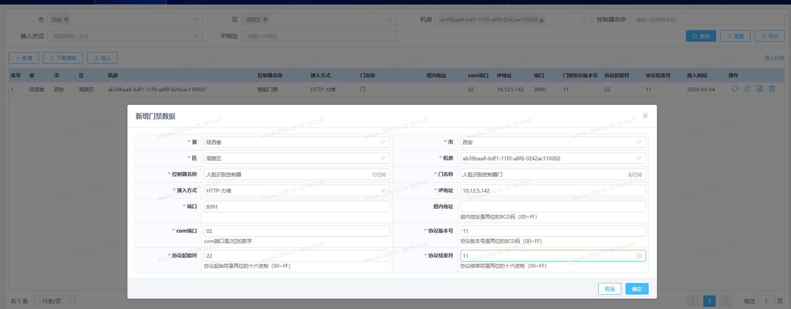

# 01总结

```
涉及服务：external,entrance

配置：
	external - > 
		开启鉴权，则是为true，就需要加上token（关闭就不需要）
		enableTokenAuth: true
	entrance - >
		[与广东的定时任务差不多]
    	# 暂时屏蔽事件采集定时任务 现网不需该配置项
        entrance.event.taskCron: 0 0 0 30 2 *
        device.sync.cron: 0 0 0 30 2 *
        #0 0/2 * * * ?  门禁设备状态（获取时间或者刷新状态）
        entrance.status.taskCron: 0 0 0 30 2 *
        entrance.config.failQueueCron: 0 0 0 30 2 *
        #默认0 0/2 * * * ?
        entrance.doorStatus.taskCron:  0 0 0 30 2 *
        entranceDevice.sync.cron: 0 0 0 30 2 *
        entrance.bxStatus.taskCron: 0 0 0 30 2 *
        entrance.dhEvent.taskCron: 0 0 0 30 2 *
        # 0 */2 * * * ?  #海康威视-门禁事件获取
        entrance.hcEvent.taskCron: 0 0 0 30 2 *
        
涉及接口：
	推送工单即人脸照片接口
	接收门禁开启信息接口
	底层人脸操作结果同步接口

涉及表：
	总数据落库到：entrance_face_work_ord 
	写入成功记录落库到：entrance_face_success_device
	appkey表（运维管理中心）：t_cfg_appkey
	设备表：access_control_device
```


```
业务流程：
	1、首先关闭定时任务
	2、开启鉴权（external：enableTokenAuth: true,也可以不开）
		需要制作token
		token说明：
            注意点：
            1、在 APIfox 的「请求体」→ 「raw」编辑框中，确保picture字段的 Base64 字符串是原样粘贴（不被工具转义特殊字符）；
            2、基于脚本生成的「合法、无空格、无缩进」JSON，修正后的 Curl 如下（确保和脚本发送的请求体完全一致） -- 跟编辑中的例子一致
            3、合法 JSON 必须有完整的根对象（脚本中是{"data": { ... }}），缺少外层{}会导致平台无法解析请求体，进而Content-MD5计算错误，鉴权失败
	
	[真正业务]
	3、推送工单即人脸照片接口（http://{serverRoot}/v1/external/ywgl/addFace）  --> 为external服务ip和port
		external会调用下游服务（entrance）
		entrance会获取运维管理发起的数据（即apifox调用实现）
	4、到entrance时，entrance会把数据写入到模拟器 --> 只要进到这就会写入到entrance_face_work_ord表
		根据传入的设备id（也就是门禁管理配置的人脸门禁设备 -- 目前接入方式是http-力维协议接口,然后使用http人脸模拟器的ip和port即可）
		就会写入成功 -> （成功后就会入entrance_face_success_device表）
		
		如果设备id不存在或是未启动会导致写入失败
	
```



```
与模拟器字段映射：
	模拟器
	{'pass': 'Chd#159357rlmj', 'person': {'idcardNum': None, 'iDNumber': '', 'facePermission': '2', 'name': '1234', 'idCardPermission': '2', 'id': '1234', 'faceAndCardPermission': '1'}}
	{'personId': '1234', 'imgBase64': '123', 'isEasyWay': 'false', 'pass': 'Chd#159357rlmj'}
	
	
	动环转发
	{
     "data":{
        "workOrdNum": "123",
        "name": "test001",
        "account": "1234",
        "phone": "142523",
        "city": "咸阳市",
        "site": ["安康白河庆华化工厂站点"],
        "room": ["咸阳秦都应急楼一楼综合机房"],
        "deviceIdList": ["ad8c7a55-362e-4b58-8644-b6e9169e1439"],
        "picture": "123",
        "startDate": "2026-01-26"
    }
    }
```


```
接口说明：
	推送工单即人脸照片接口（http://{serverRoot}/v1/external/ywgl/addFace）  --> 为external服务ip和port
		参数说明：
			deviceId 在实际传参中为 deviceIdList
	
	[以下两个是模拟运维管理的]
	接收门禁开启信息接口
	底层人脸操作结果同步接口
```


```
测试方法[待修正]：
	推送工单即人脸照片接口
		总数据落库到：entrance_face_work_ord 
		写入成功记录落库到：entrance_face_success_device
		写入失败推送给运维中心（5分钟后重试）
	接收门禁开启信息接口
		未实现
	底层人脸操作结果同步接口（目前存在120 - /home/sudoroot/jyl.face*.py）
		接口说明：推送最终人脸门禁写入成功/失败应答的结果信息。
		第一种底层能返回失败，失败信息动环通过该接口同步给运维中心，5分钟后运维中心再触发2.1接口推送信息
		第二种底层无返回失败/成功，动环无法返回给运维中心结果或者返回结果为成功实际不生效，10分钟后运维中心尝试再次通过2.1接口推送信息
	
		失败后5分钟后再次请求是否会处理
		失败后10分钟后再次请求是否会处理
	
	
        推送工单即人脸照片接口模式写入失败：
            工单号：结构错误或是为空
            name：超出最大限制，异常符号等
            phone：超出最大限制，非手机格式，超出限制等
            account：超出最大限制，异常符号等
            city：不存在城市，超出最大限制，异常符号等
            site：不存在站点，超出最大限制，异常符号，站点与城市不匹配，站点已经删除等
            room：不存在机房，超出最大限制，异常符号，机房与站点或省市区不匹配，或机房已经删除等
            deviceid：不存在动环，，超出最大限制，异常符号，与机房或站点或省市区不匹配，或设备已经删除等
            picture：错误格式，超出50kb，缺失部分数据
            startData：格式错误，超出最大日期等                                                                                       
            
验证：
	模拟运维中心，调用推送工单即人脸照片接口，模拟写入多个
	确保总单号会流入entrance_face_work_ord
	确保动环手动工单号，会对门脸进行识别入库 -> 
		成功的会到entrance_face_success_device
		失败的会调用底层人脸操作结果同步接口，返回（因此需要开着这个模拟接口，检测是否有搜到）
```

