```
1、es
	需要连集团的
	10.1.203.38

2、综资表
	有关联表
	ansy啥的
	
3、超期服役表
	over都是

4、告警创建
	主要是通过综资的power_device_id  -- >  然后动环的power_device_id字段，关联上综资里面的
	
5、nacos配置文件
	hidden

6、有触发条件
	1、总的要依次进行的【依次跑完才行】
	2、可以使用单独的，单独的使用陕西的也一样，然后改下ip和端口即可
	3、每天的定时器，同步的是详情表的内容

7、对应文件需要对比下
	发的12个文件

8、测试用例需要执行和补充
	pass
	
9、数据展示【重点】
	左侧树结构，目前都是动环的
	查询条件展示的也是东环的
	
	右侧内容
		更新周期：每天或是触发器，让拿到es数据，然后把数据与mysql的周期字典匹配，然后统计后到详情表
		在网时长：是通过综资时间和当前时间的差进行的
		超期服役：通过计算出来的在网时长/周期
		
		其余的都是取纵资表
			然后主要逻辑：
				1、首先取es对应设备索引，然后设备里面有对应站点、机房等信息【需要匹配对应索引表】
					目前的话：主要是拿dh_id或是dh_name,然后跟gz_name啥的组合
				2、然后把对应的站点机房名称即可显示出来【页面展示】
				3、又通过映射表，把es的综资数据与动环的站点机房啥的关联上【内部数据库关系】
				4、再通过对应的power_device_id,把综资和动环的设备关联起来
				5、这样子触发动环告警,就会进行统计,统计为动环设备【即目前关联的综资】后的告警
					其实就相当于动环的是动态的告警统计,综资的是静态的设备信息,两者结合
						就即知道动态情况,和原始设备情况
					统计好像是dwd还是啥来着【alert告警索引？】
		
10、目前已有数据
	宁夏
		固原市
			源周区
				ups
					20250514的


11、如果从现网捞es数据
	需要本地导入测试环境里面


12、只对蓄电池和空调设备类型的修正
```

# 定时器

```
curl --location --request GET 'http://localhost:28028/v1/hiddenDanger/startOverdueAll'


详情表
curl --location --request GET  "http://localhost:28028/v1/hiddenDanger/startOverdue1"


【下面分析汇总表，都是会有每天的日期的，具体存多少天的就不清楚了】

详情表 - 需要前面的同步完，执行后才有数据，不然执行后，当天的数据就是0
		例如：
			今天是28号，但是详情表是昨天数据，那么执行后，分析总表就没有对应数据
curl --location --request GET  "http://localhost:28028/v1/hiddenDanger/startOverdue2"


curl --location --request GET  "http://localhost:28028/v1/hiddenDanger/startOverdue3"


curl --location --request GET  "http://localhost:28028/v1/hiddenDanger/startOverdue4"


curl --location --request GET  "http://localhost:28028/v1/hiddenDanger/startOverdue5"


curl --location --request GET 'http://localhost:28028/v1/hiddenDanger/startOverdueAll'
```


# 问题和验证

```
1、目前看宁夏区
	但是数量与页面展示的好像不一致，确认怎么判断
	GET /ods_zz_device_ups_2025y/_search
{
  "size": 0,
  "aggs": {
    "related_room_unique_count": {
      "cardinality": {
        "field": "related_room.keyword"
      }
    }
  }
}

宁夏
	市
        640400
        640200
        640300
        640100
        640500
       			区
       				640104
       				640121
       				640181
       				640105			63条
       				640122
       				640106			49条
        
```

## **市级验证**


## **区级验证**

```
说明：
	验证通过，主要是因为其中有一个，在ods_zz_irms_rom_map_2025y
	即机房映射表里面没有对应动环的id
```

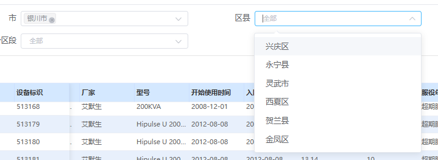

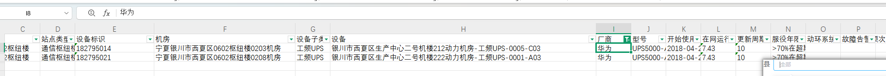

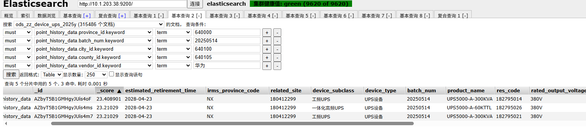

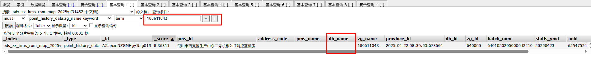


## **在网计算**

```
1、语法[多个参数，需要外部套must，然后内部每个term对应一个字段]

目前有一条：
	overdue详情表
	device_code:-1008291934
	room_id:01-26-02-02-01-12


[2018-04-23]
curl -X POST "http://10.1.203.38:9200/ods_zz_device_ups_2025y*/_update_by_query" \
-H "Content-Type: application/json" \
-d '
{
  "query": {
    "bool": {
      "must": [
        { "term": { "province_id.keyword": "640000" } },
        { "term": { "batch_num.keyword": "20250514" } },
        { "term": { "city_id.keyword": "640100" } },
        { "term": { "county_id.keyword": "640105" } },
        { "terms": { "vendor_id.keyword": ["华为"] } },
        { "terms": { "related_room.keyword": ["180607609"] } }
      ]
    }
  },
  "script": {
    "source": "ctx._source.start_time = params.newTime",
    "lang": "painless",
    "params": {
      "newTime": "2025-11-23"
    }
  }
}


[2018-04-23]
{
  "query": {
    "term": {
      "province_id.keyword": "640000",
      "batch_num.keyword": "20250514",
      "city_id.keyword": "640100",
      "county_id.keyword": "640105",
      "vendor_id.keyword": "华为",
      "vendor_id.keyword": "180608497"
    }
  },
  "script": {
    "source": "ctx._source.start_time = '2025-09-27'", 
    "lang": "painless"
  }
}
```


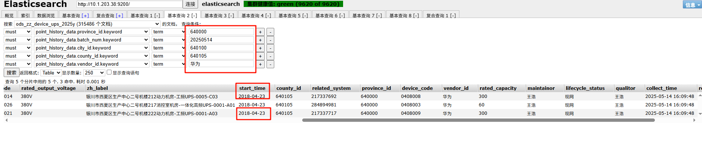


## **告警**

```
故障告警未统计【好像跟隐患统计差不多？ -- nacos有对应配置 -- 是否需要修改省份？】
	修改nacos配置？
		修改完需要重启服务
	目前还没统计
		目前看日志，拿的是历史的数据【用脚本插入】
	

方法1：
	使用动环机房
		贵州
			安顺市
				关岭布依族苗族自治县
					贵州11044数据中心
						贵州贵阳市贵安新区1104数据中心0438楼栋机房1
							precinct_id：01-08-08-01-02-01-01
							device_id：00751006000005629510
							测点：088003
	对应综资
		广东 - 广州- 广东广州市黄埔区0603数据中心 - 广东广州市黄埔区0603数据中心0301楼栋0113机房
		高压直流配电[设备] - 240V直流列头柜[子类]
		power_device_id:
			00000898390656
			
			


curl --location --request GET  "http://localhost:28028/v1/hiddenDanger/startOverdue1"


# 告警，默认统计上个月
curl --location --request GET 'http://localhost:28028/v1/hiddenDanger/startOverdueAlert?202508'


表里有，但是另一边没有？？

	目前是自己拿动环的，插入到overdue详情表里面
	然后插入alert告警，然后触发告警接口，月度表里面有了，但是详情表里面没有？
	
	
	
	
问题1
	1、因为触发后，不是实时的，所以需要再次进行详情表的统计
	2、统计之后，动环的power_id和综治的sys_Id对不上
	3、但是月度统计表是已经有的了，那么直接把月度里面的id，拿过去绑在动环sys上即可
	
	
	
	
	
	
【需要整理】	
逻辑清理：
	最终版：
		首先要进行第一次详情表同步：确保拿到最新的sys_device_id，同步后自己加是无效的
		然后绑定
			必须是使用同步过来的sys_device_id,与动环的设备进行关联【把sys写到动环power中】
				1、不需要同样的位置信息
				2、这里动环的设备只要对应类型即可【好像也可以不用？】
				3、进行alert历史告警造数【需要根据指定设备类型，指定告警，nacos有】 - 在month表
				4、然后需要再次同步详情表【因为不是实时的】
				5、同步后【目前存在问题，就是再次同步详情表后，sys绑定的id不见了，需要手动到month把id拿出来放进去，放进去后重新跑一次即可】
				
		然后好像
			可以根据修改已有站点下的设备的precinct_id来变成想要站点下的设备
			


本次遇到的问题
	绑定后，month表有记录了，但是需要
	


month有的
	我直接帮到sys里面，再出发也有？【设备类型一致是否就有数据？】
	
	
确认了的
	必须是综资的sys，自己写的关联是没用的，每次同步都会没有
	
	
	
步骤
	1、同步综资数据到数据库（overdue详情表）
	2、over里面sys_id，放到device的power_id里面【类型要一直，区域位置要一致，如果没有设备，那么直接到已有的站点里面，拿设备改下precinct_id】
	3、写入对应设备的alert历史告警【根据nacos里面来】
	4、再次触发同步【因为告警统计不是实时的，而且会在下一次统计时候巡检月度告警表然后进行统计，但是每次触发会实时统计到月度告警表，用于下次详情表的检索】
	5、再次同步后，如果对应区域下【即前面绑定的那个的sys不见了】，那么就去month里面拿对应的device_id，放进去，再次执行即可
	以上的内容都要一一对应，sys_id必须是由综资同步过来的，自己手动创建的是不行的，因为关联到综资设备是否能匹配到
```

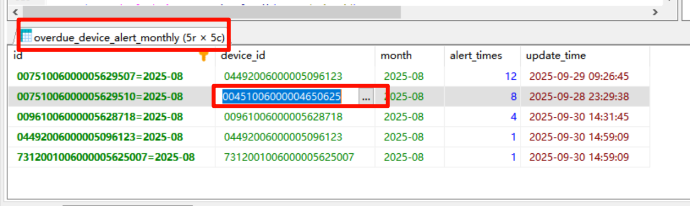

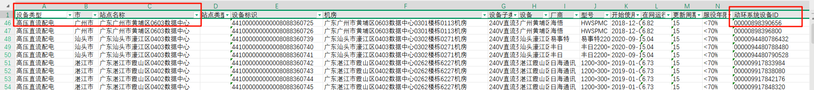


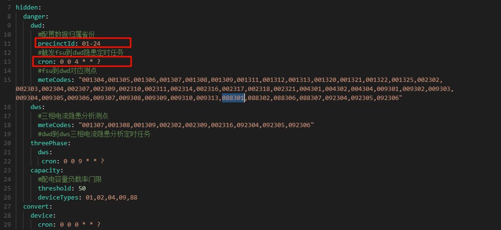

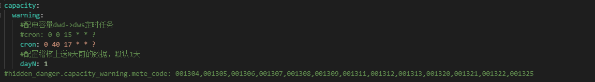

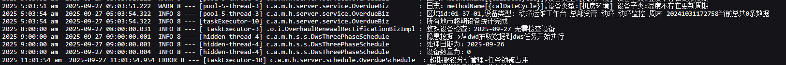


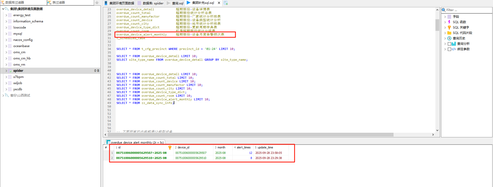

```
手动修改对应内容【想法】
	宁夏的【但是es里面没有这个字段】


目前用集团-贵州的lsc进行测试
	用sc的设备去关联  -- 综资广东的power_device_id
```


## **触发器**

```
触发器触发后有报错
	1、根据动环差对应id的省份是哪里
	2、到excel里面找到对应的区域编码
	3、到索引里面区找是否存在
```

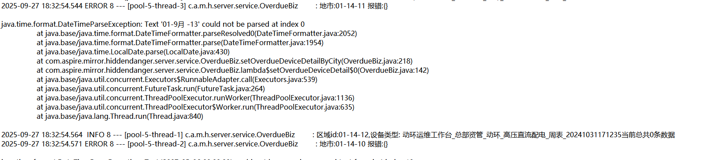


## 统计分析总表

```
数据均不一致【不太确定，可能还没统计好】
    中国移动统计数量：
        树节点为中国移动，点击下载，统计数量
        然后sql语法统计，12类型的
    省份统计数量：
        树节点为中国移动，看对应省份
    地市统计数量：
        树节点为省份，看对应地市
    区域统计数量：
        树节点为地市，看对应区域
    
```

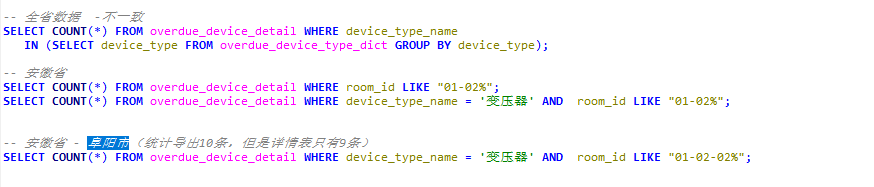


# 映射关系

| ***\*设备类型\**** | ***\*设备子类\****                                           | ***\*更新周期\**** |
| ------------------ | ------------------------------------------------------------ | ------------------ |
| 变压器             | 全部                                                         | 15年               |
| 高压配电           | 全部                                                         | 15年               |
| 高压直流电源       | 全部                                                         | 10年               |
| 高压直流配电       | 全部                                                         | 15年               |
| 低压交流配电       | 全部                                                         | 15年               |
| 发电机组           | 全部                                                         | 15年               |
| 开关电源           | 全部                                                         | 12年               |
| 低压直流配电       | 全部                                                         | 15年               |
| UPS设备            | 全部                                                         | 10年               |
| 蓄电池             | 1.UPS铅酸电池                                                | 6年                |
|                    | 2.操作电源铅酸电池                                           | 8年                |
|                    | 3.发电机组铅酸电池                                           | 6年                |
|                    | 4.高压直流铅酸电池                                           | 8年                |
|                    | 5.开关电源锂电池                                             | 10年               |
|                    | 6.开关电源铅酸电池                                           | 8年                |
|                    | 7.直流屏铅酸电池                                             | 8年                |
| 空调               | 1.设备类型为普通空调时更新周期6年；                          | 6年                |
|                    | 2.设备类型为其他（机房专用空调、中央空调末端），设备子类为恒湿机、柜式空调 | 6年                |
|                    | 3.设备子类为风冷专用空调                                     | 8年                |
|                    | 4.设备类型为其他（机房专用空调、中央空调末端），设备子类为列间空调、嵌入式空调、热管背板、双冷源专用空调、水冷专用空调 | 10年               |
| 动环监控           | 1.设备子类为FSU、CSC、LSC                                    | 5年                |
|                    | 2.设备子类为蓄电池采集设备                                   | 8年                |


| 设备类型     | device_type     |      |      |
| ------------ | --------------- | ---- | ---- |
| 地市         | city_id         |      |      |
| 站点         | related_site    |      |      |
| 设备标识     | res_code        |      |      |
| 机房         | related_room    |      |      |
| 设备子类     | device_subclass |      |      |
| 设备名称     | zh_label        |      |      |
| 厂家         | vendor_id       |      |      |
| 型号         | product_name    |      |      |
| 开始使用时间 | start_time      |      |      |
| 入网时间     | start_time      |      |      |
|              |                 |      |      |

***\*超期服役设备详情表\****

| 字段           | 字段说明                                                     |      |      |
| -------------- | ------------------------------------------------------------ | ---- | ---- |
| 日期           | 根据综资表的日期                                             |      |      |
| 设备类型       | 综资device_type                                              |      |      |
| 地市           | 综资city_id                                                  |      |      |
| 站点           | 综资related_site                                             |      |      |
| 设备标识       | 综资res_code                                                 |      |      |
| 机房           | 综资related_room                                             |      |      |
| 设备子类       | 综资device_subclass                                          |      |      |
| 设备名称       | 综资zh_label                                                 |      |      |
| 厂家           | 综资vendor_id                                                |      |      |
| 型号           | 综资product_name                                             |      |      |
| 开始使用时间   | 综资start_time                                               |      |      |
| 入网时间       | start_time                                                   |      |      |
| 在网运行时长   | 计算，现在时间（默认前一天的时间）-start_time                |      |      |
| 更新周期       | 根据设备类型按以下表的更新周期填对应年                       |      |      |
| 服役年限分区段 | 更新周期的百分比可配，比如80%，现默认70%，比例可配，根据配置的计算（现在时间-start_time）/更新周期，本字段枚举，若更新周期<（现在时间-start_time），则为“超期服役”；若更新周期>（现在时间-start_time），且（现在时间-start_time）/更新周期<70%的更新周期，则为“<70%”；若更新周期>（现在时间-start_time），且（现在时间-start_time）/更新周期>70%的更新周期，则为“>70%在超期内”； |      |      |
| 动环系统设备ID | 综资power_device_id                                          |      |      |
| 故障告警频次   | 关联动环系统的device_id，默认计算该设备近一个自然月的告警次数，进行累加，如果没有一月的告警数据以从开始有的告警开始进行累加；其中告警统计周期可以进行设置，设置从几月到几月，比如2023年-1到2023年-3；最早只能选到当前时间（查询条件日期）的上月，因为当前月份数据不完整不能统计； |      |      |
|                |                                                              |      |      |
|                |                                                              |      |      |

***\***

****统计分析总表\****


# 数据方向

```
以宁夏为主
	
```


这个怎么看是前端的，而不是后端的？


