# 补充

```
涉及日期：
	周期一般是发版日期到前一个月
	即开始为1个月前，结束为版本发布编写当天
	
基线对齐：
	测试报告、开发提交的发布说明文档、卓效的基线[三者要一致-以卓效中的基线为主]
	因此需要检查开发是否上传发布说明文档至SVN时，还要检查基线是否正确

正常情况下
	研发云 - 需求 - 评审下
	一个版本发版后，必须要有测试案例、测试计划、产品需求、版本发布说明 - 这四个评审类型
	并且影响版本必须是一致的[下面这个只是演示而已]
	
	
gemc发版说明（重点）：
	跟省版本一样的，只是所属模块不同，一般在发版省端的时候一起发布
	特别说明：
		只需要选择后端即可
		发布流程是否提交：
			1、发布说明文档使用新的 - gemc里面对应的
			2、基线 - 是gemc-scan的 - 也要注意
			3、web漏扫报告- 用关联的省端扫描的即可
			4、其他和高危、测试总结 - 也直接用对应gemc模块下的
			

```

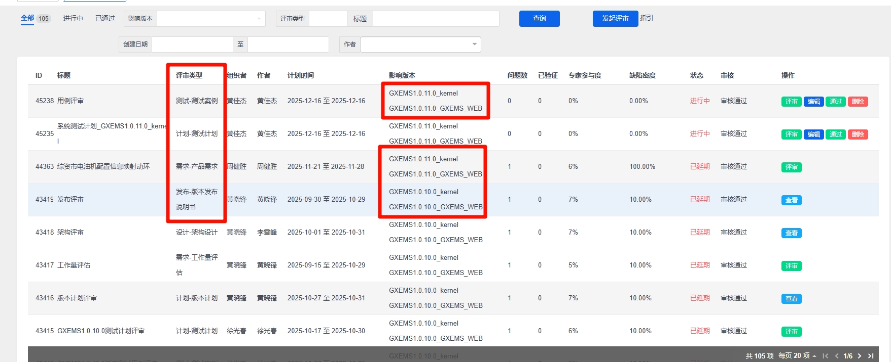

# 01新增项目流程过程检查

```
https://docs.qq.com/sheet/DUFBDVHdGeXhma2VF?tab=BB08J2

月份：改为版本提测时的月份
项目：更改对应环境（eg：广西 - 省级动环平台-广西）
版本：为本次提交的版本号 -- 格式：GXEMS1.0.11.0_GXEMS_WEB,GXEMS1.0.11.0_kernel
	 版本内的版本号要与本次提测的一致，以及web、kernel都要有，平台要对应

是否一周内：默认为否

其余选项：
	先清除，然后一项一项检查后，通过再选为是
```

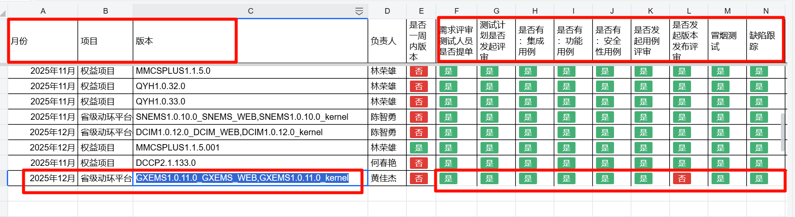

# 02需求评审测试人员是否提单

```
即检查版本下需求是否有提问
	每个版本提测之前，必须对改版本下的需求提至少1个问题
```

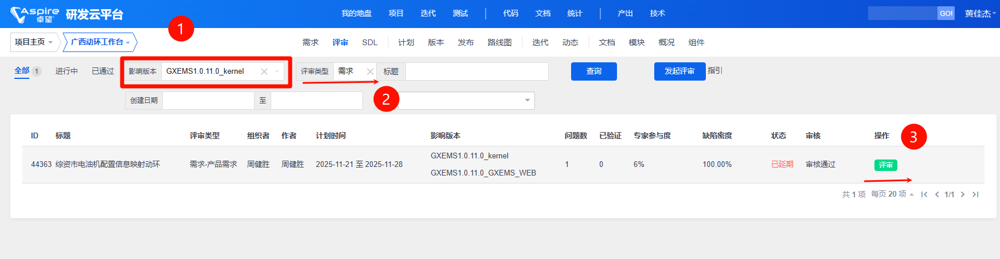

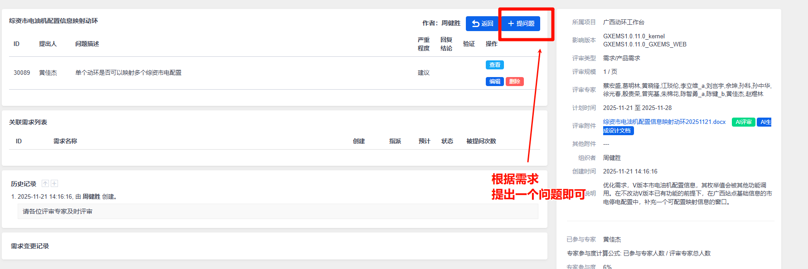


# 03测试计划是否发起评审

```
下载下来的文件主要修改点：
	文件名--版本号改成本次提交的版本号
		ctrl+H --> 
			全局修改版本号
			日期
			编写人
	文件修改其余注意点看下面截图

修改完成之后，删除旧的 - 提交SVN

接着到研发云进行测试计划发起
```


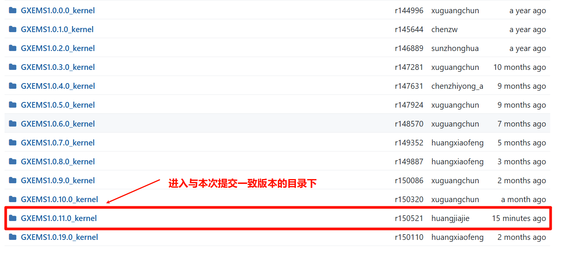


```
文件修改
```


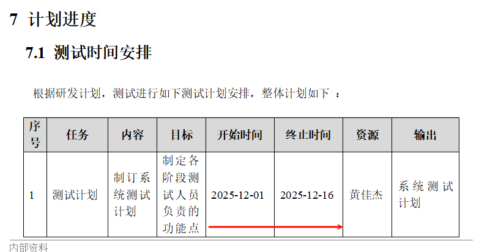

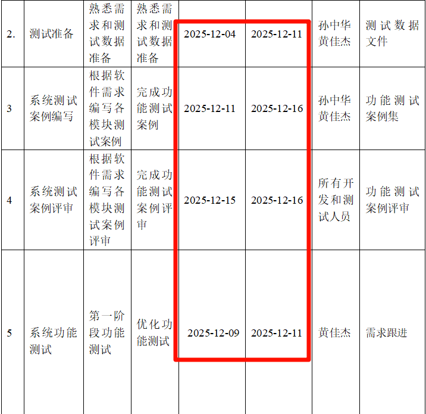

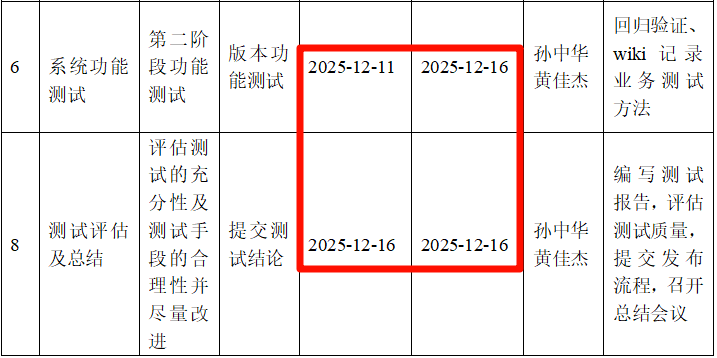


```
计划发起评审
```

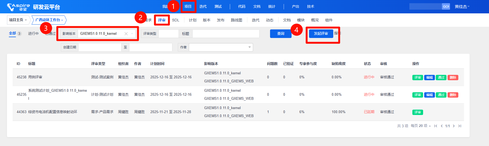


# 04是否有集成用例

```
注意：
	web和kernel都要有对应的集成用例（每个至少对应3条）--阶段集成测试阶段、集成测试、P1
	如果有缺失需要补充（直接在原有测试上随意修改即可）
```

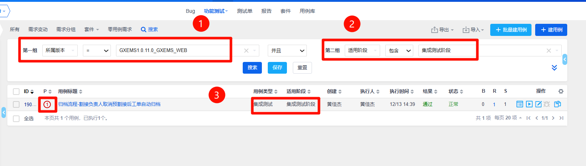

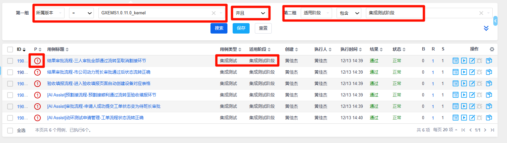

# 05是否有功能用例

```
注意：
	web和kernel都要有对应的集成用例（每个至少对应3条）--阶段系统测试阶段、功能测试、P3
	如果有缺失需要补充（直接在原有测试上随意修改即可）
```

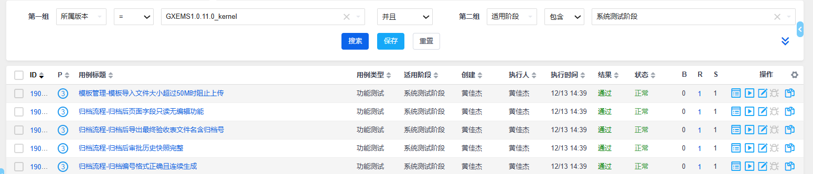


# 06是否有安全性用例

```
注意：
	web和kernel都要有对应的集成用例（每个至少对应3条）--阶段系统测试阶段、安全测试、P3
	如果有缺失需要补充（直接在原有测试上随意修改即可）
```

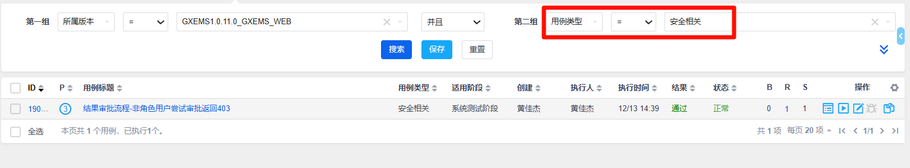

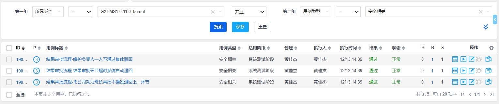

# 07是否有冒烟测试用例

```
注意：
	web和kernel都要有对应的集成用例（每个至少对应3条）--阶段系统测试阶段、安全测试、P3
	如果有缺失需要补充（直接在原有测试上随意修改即可）
```


# 08是否发起用例评审

```
在研发云上下载对应版本所有案例 
	- 修改文件名（文件名为测试计划时文件的名字，计划更改为用例即可）

提交至对应SVN目录下（把旧的删除）
	eg：广西
		spider-guangxi-docs / GXEMS1.0.11.0_kernel / 08_系统测试 / 02_测试用例及评审记录
```


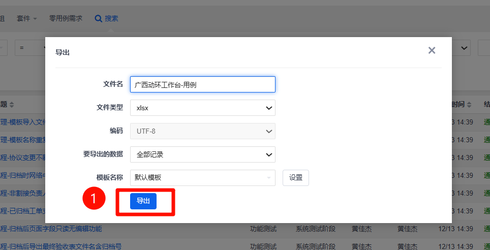


```
用例发起评审（记得版本要选对）
```

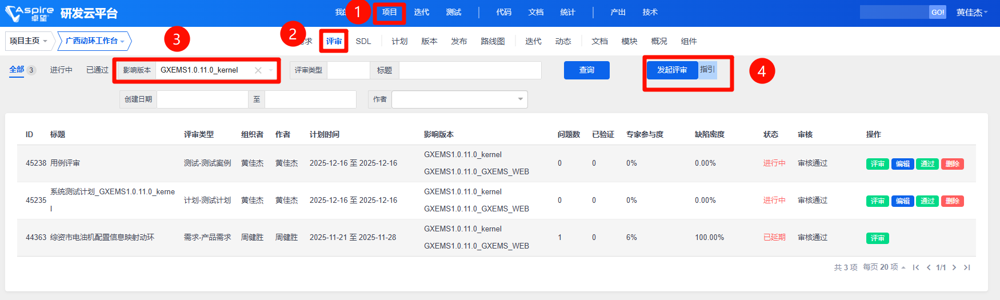


# 09缺陷跟踪

```
在研发云上下载对应版本所有BUG 
	- 修改文件名（文件名为测试计划时文件的名字，计划更改为用例即可）
	注意：bug必须全部解决并关闭（除了延期处理的）
	
	放到以下路径：
		guangxi-spider-doc\GXEMS1.0.11.0_kernel\08_系统测试\06_测试报告
```

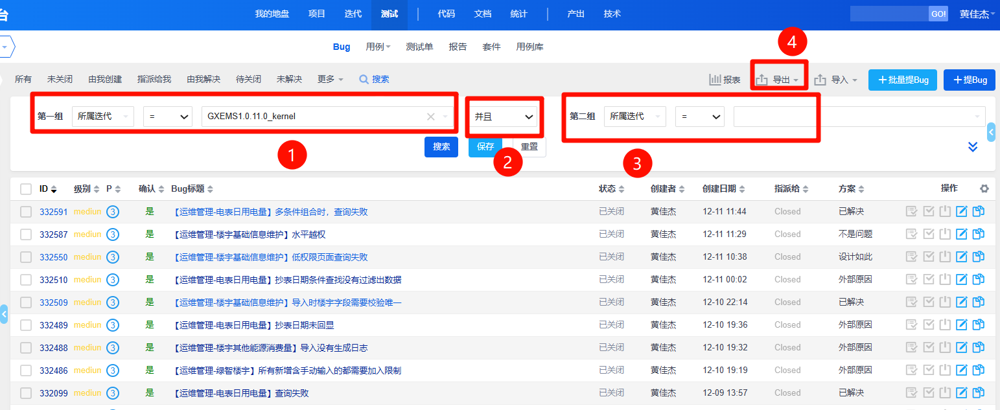


# 10发布流程是否提交

```
卓效-版本/PATCH管理-版本/PATCH发布
	发布说明文档：由开发提供
	web漏扫报告：对应下载出来的文件
	其他：修改文件命名后的文件
	测试总结报告：对应下载后的报告
	高位组件版本发布评审单：压缩后的文件夹
	
注意点：
	基础信息：基线一定要对应
```


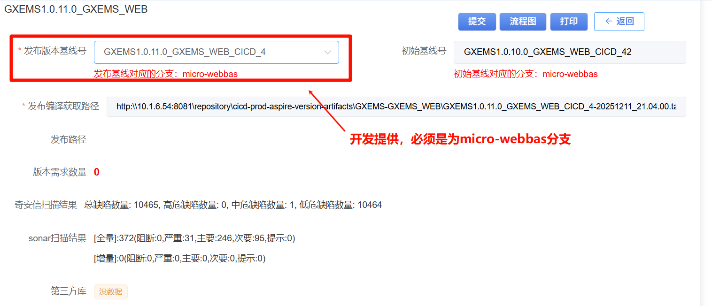

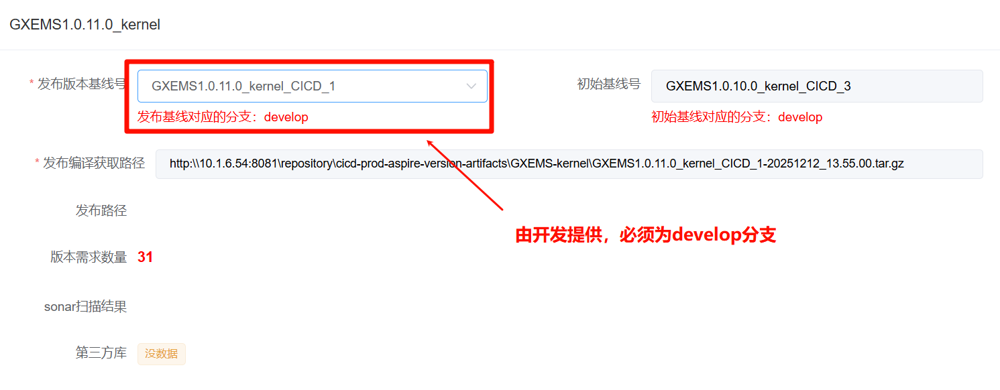


## 基础信息-基线检查

```
总共有两个基线
	GXEMS1.0.11.0_GXEMS_WEB
	GXEMS1.0.11.0_kernel
检查标准：
	GXEMS1.0.11.0_GXEMS_WEB：
		发布基线版本号-分支必须为micro-webbas
		sonar扫描结果：[增量]-如果阻断、严重、主要不为0，不能发布版本
	GXEMS1.0.11.0_kernel
		发布基线版本号-分支必须为develop
		sonar扫描结果：[增量]-如果阻断、严重、主要不为0，不能发布版本
注意点：
	如果缺失sonar，那么这个基线是不合格的，不可提交（可能由以下原有造成）
		开发在cicd中打包未选择对应卓效版本号
	如果开发未提供新的
		只要选择的基线版本对应上，然后分支一致，有sonar结果，且阻断、严重、均为0
		那么也可以直接用
```


## 发布说明文档

```
由开发提交：
	存放位置：对应项目下
		GXEMS1.0.11.0_kernel\10_发布配置
	
	检查：
		开发提交上来的文件名版本号是否一致
		内部的基线是否与研发云一致
```


## web漏扫报告

```
使用公司统一的web安全扫描工具 绿盟
	URL：https://10.1.5.101/accounts/login/
	账号：yanmaojun/HHua06tt09@126com$$
	web安全扫描报告，不能存在高、中级别的安全风险
	然后将文件上传到对应版本 安全 目录下
		GXEMS1.0.11.0_kernel\08_系统测试\06_测试报告\安全

注意：
	如果达不到出口条件，测试人员可以提缺陷跟踪
	如果开发说工具误报，请开发人员在卓效->项目组件管理->安全例外报告提交流程申请；
	或者提供公司质量部安全组回复的误报说明确认邮件（后续作为附件上传版本发布电子流）
```


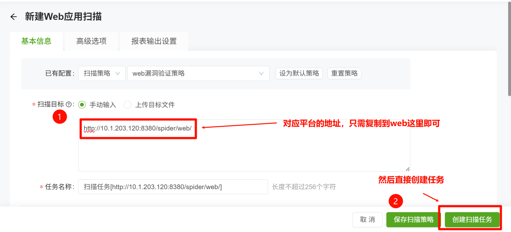

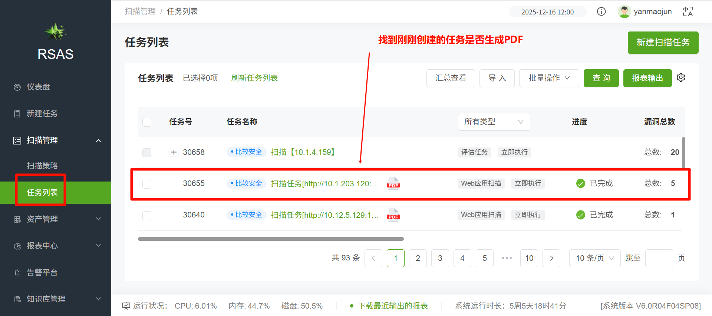


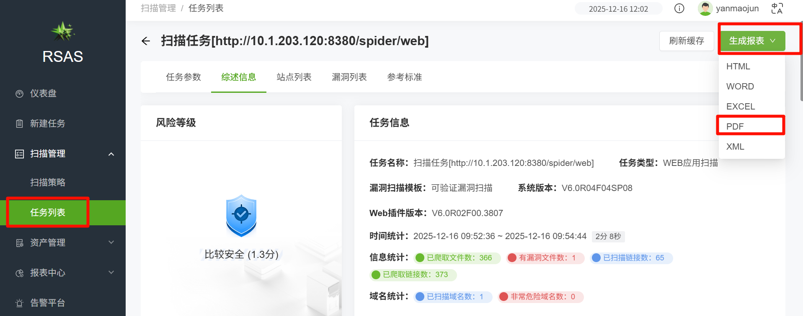

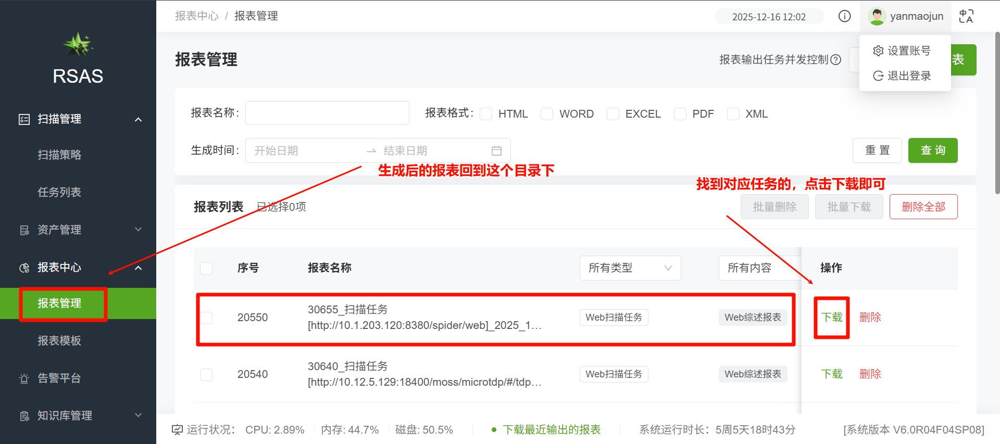


## 其他

```
直接修改文件名上传到对应版本 信息安全开发检查报告 目录下
		GXEMS1.0.11.0_kernel\08_系统测试\06_测试报告\安全\02-信息安全开发检查报告
```


## 高危组件版本发布评审单

```
到SVN项目目录（指定版本下）04-高危组件申请审批单路径：
	GXEMS1.0.11.0_kernel\08_系统测试\06_测试报告\安全\01-版本发布申请单\04-高危组件申请审批单
	修改文件夹命名 - 为本次版本号，接着压缩为zip格式
```

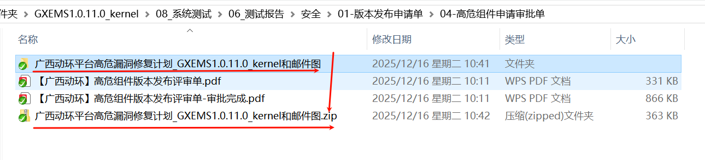

## 测试总结报告

```
到SVN项目目录（指定版本下）06_测试报告-路径：
	GXEMS1.0.11.0_kernel\08_系统测试\06_测试报告
	修改文件夹命名 - 为本次版本号
	内容修改：
		ctrl+H --> 
			全局修改版本号
			日期
			编写人
		文件修改其余注意点看下面截图
			业务、性能、端到端场景这个有空可以修改下（不强制）
	
	需要转换成pdf
```


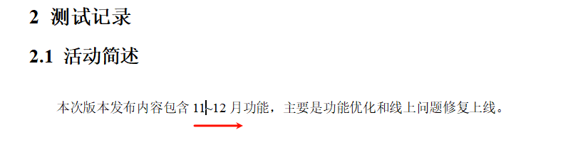


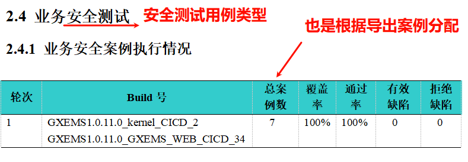


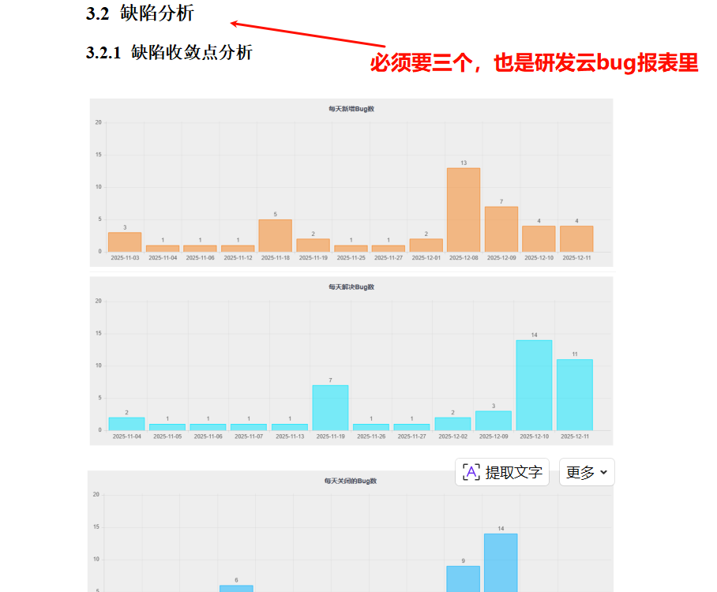

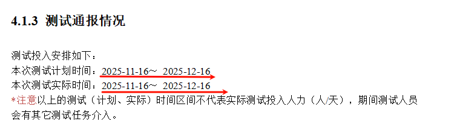


### 缺陷分析补充查看方式

```
先过滤当前版本所有bug - 点击报表
	全选后，生成报表
		缺陷分析截图：取[每天新增Bug数、每天解决Bug数，每天关闭的Bug数] - 这三个截图
		发现bug数目：取迭代Bug数量
		拒绝的缺陷数目：取按Bug解决方案统计
```


